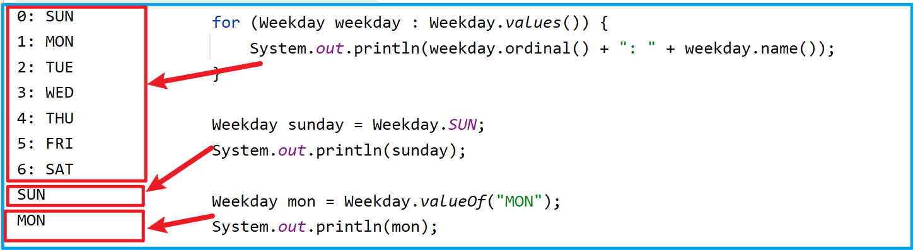

---

order: 1

---

# Enum枚举

Java 枚举(enum) 是一个特殊的类，一般表示一组常量、enum 定义的枚举类默认继承了 java.lang.Enum 类 。

官方文档地址：https://docs.oracle.com/javase/tutorial/java/javaOO/enum.html

## 1. 基本应用

Java 枚举类使用 enum 关键字来定义，各个常量使用逗号 ` , ` 来分割

```java
public enum Weekday {
    // 枚举 Weekday 是一个特殊的类
    // 每个枚举常量（如：SUN）都是一个Weekday的实例对象，并且都默认具备 public static final 修饰符
    SUN, MON, TUE, WED, THU, FRI, SAT
}
```

枚举常用方法：

- `values()` 以数组形式返回枚举类型的所有成员 
- `ordinal()` 方法可以找到每个枚举常量的索引，就像数组索引一样 
- `valueOf()`  方法返回指定字符串值的枚举常量、不存在的会报错 `IllegalArgumentException`  

```java
public class WeekdayEnumTest {
    public static void main(String[] args) {
        // 迭代枚举
        for (Weekday weekday : Weekday.values()) {
            System.out.println(weekday.ordinal() + ": " + weekday.name());
        }

        // 当使用枚举类型成员时，直接使用枚举名称调用成员即可
        Weekday sunday = Weekday.SUN;
        System.out.println(sunday);

        Weekday mon = Weekday.valueOf("MON");
        System.out.println(mon);
    }
}
```



## 2. Enum类

enum 关键字定义的枚举类都默认继承了Enum 类（抽象类）、该类位于 java.lang下、该类具有两个 final 常量：

- name ：枚举常量，如上例中的 ` SUN MON ` 等
- ordinal ：类似数组索引，即位置（position）的意思，默认值从0开始

下为Enum类的部分源码：

```java
public abstract class Enum<E extends Enum<E>> implements Comparable<E>, Serializable {

    // The name of this enum constant, as declared in the enum declaration.
    private final String name;

    public final String name() {
        return name;
    }

    public String toString() {
        return name;
    }

    /**
     * The ordinal of this enumeration constant (its position in the enum declaration, 
     * where the initial constant is assigned an ordinal of zero).
     */
    private final int ordinal;

    public final int ordinal() {
        return ordinal;
    }

    // Sole constructor.  Programmers cannot invoke this constructor.
    protected Enum(String name, int ordinal) {
        this.name = name;
        this.ordinal = ordinal;
    }

    public static <T extends Enum<T>> T valueOf(Class<T> enumType, String name) {
        T result = enumType.enumConstantDirectory().get(name);
        if (result != null)
            return result;
        if (name == null)
            throw new NullPointerException("Name is null");
        throw new IllegalArgumentException(
            "No enum constant " + enumType.getCanonicalName() + "." + name);
    }
}
```

## 3. 构造方法

实现带有构造方法的枚举（项目中常使用的方式），示例：

```java
public enum Sex {
    MALE(1, "男"),
    FEMALE(2, "女");

    public final Integer type;
    public final  String value;

    private Sex(Integer type, String value){
        this.type = type;
        this.value = value;
    }
}
```

```java
public class SexEnumTest {
    public static void main(String[] args) {
        Sex man = Sex.MALE;

        System.out.println(man);            // MALE  调用默认的toString()
        System.out.println(man.name());     // MALE
        System.out.println(man.ordinal());  // 0

        System.out.println(man.type);       // 1
        System.out.println(man.value);      // 男
    }
}
```

## 4. 抽象方法

带有抽象方法的枚举、在上例的基础上添加一个抽象方法，如下：

```java
public enum Sex {
    MALE(1, "男"){
        @Override
        public void haircut() {
            System.out.println("剃个光头吧~");
        }
    },
    FEMALE(2, "女"){
        @Override
        public void haircut() {
            System.out.println("还是留长发吧~");
        }
    };

    public final Integer type;
    public final  String value;

    private Sex(Integer type, String value){
        this.type = type;
        this.value = value;
    }

    public abstract void haircut();
}
```

```java
public class SexEnumTest {
    public static void main(String[] args) {
        Sex man = Sex.MALE;

        System.out.println(man);            // MALE  调用默认的toString()
        System.out.println(man.name());     // MALE
        System.out.println(man.ordinal());  // 0

        System.out.println(man.type);       // 1
        System.out.println(man.value);      // 男

        man.haircut();                      // 剃个光头吧~
        Sex.FEMALE.haircut();               // 还是留长发吧~
    }
}
```
