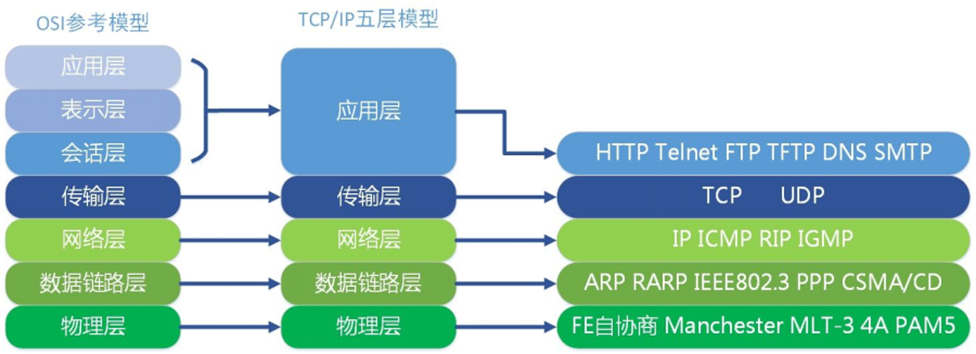
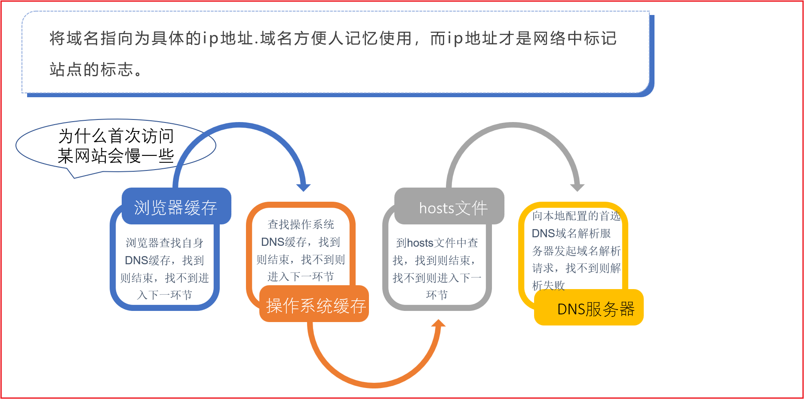
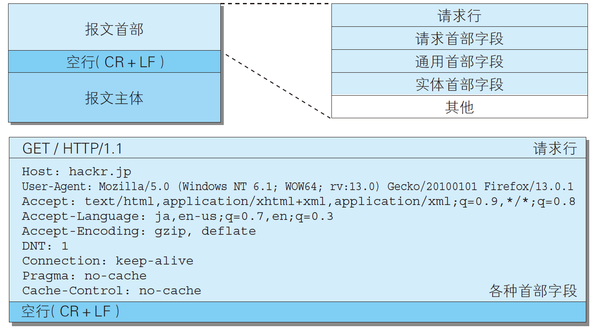

---

order: 5
title: HTTP协议基础

---


## 一 Web及网络基础

### 网络模型(分层)



- OSI(Open System Interaction)七层模型：将网络分为7层；

- TCP/IP 模型 ： 将网络分为5层（4层）

**分层是逻辑上面的概念**，并不是指的是物理网络中被拆分了若干层。


::: info 为什么要分层？

目的主要是为了解耦。比如传输层有TCP、UDP两种传输方式。

分层最大的好处就是今后如果希望将传输方式从TCP转换成UDP，只需要变更传输层即可，其他层不需要变化
:::


### HTTP的诞生

**如果希望客户端和服务器之间能够进行正常的通讯，双方在传递数据时只需要遵守固定的格式即可** 这个格式其实就是**协议**。

HTTP协议：客户端和服务器在进行通讯时，发送的HTTP请求和响应应当具有的特定的格式。


::: info HTTP和HTML
HTTP:Hyper Text Transfer Protocol.

HTML:Hyper Text Markup Language.

html、http均是由同一个人发明的。tim berners lee。科研人员。做实验、写论文、做分享、听分享

论文如何排版？html

论文如何传输给其他人？http

http诞生之初主要就是为了传递html的。
:::


<br>


### HTTP工作流程

**域名解析**（把字符变成ip地址）



其中有一个常识性知识：`127.0.0.1` ,  `localhost` 永远指向的是本机

<br/>


**TCP三次握手**：

进行三次握手，建立一个可靠的TCP连接。访问网站时，**一般都是使用TCP**，游戏中一般使用UDP。

TCP连接建立之后，其实就是形成了一个socket。


::: info 整个访问流程

1.用户在浏览器地址栏输入对应的网络地址，首先进行域名解析（浏览器缓存、操作系统缓存、hosts文件、DNS服务器）

2.进行TCP三次握手，建立TCP连接

3.浏览器会帮助用户生成HTTP请求，首先向下经过TCP（拆包、加上tcp头部），经过ip层，加上ip头部标签

4.再次向下经过链路层，网卡从客户端机器出去，在网络中中转传输，到达服务器主机机器

5.到达服务器网络层，将数据包的ip头部去掉，经过tcp层，将tcp头部去掉，并且同时将数据包进行合并，到达应用层之后，取出里面的请求报文，加以解析（能够正常进行解析的前提是通讯双方遵守同样的格式、准则），识别出客户端需要请求的资源，对其做出响应，主要是生成HTTP响应，将文件的内容写入到响应中。

6.HTTP响应经过tcp，进行拆包，加上tcp头部标签，经过ip，加上ip头部标签，经由链路层出去，在网络中中转传输，到达客户端机器

7.客户端机器接收到数据之后，经由链路层进入主机，经过ip，脱去ip标签、经过网络层、脱去tcp标签，同时进行合并数据包，合并之后，得到完整的HTTP响应

8.浏览器拿到HTTP响应之后，对其进行解析（双方同样遵守着一个原则），浏览器取出HTML部分进行解析，如果此时遇到了css标签、js标签、img标签等，此时会自行再次往对应的地址去发起新的HTTP请求，整个过程和上述完全一致........

9.当浏览器拿到了当前页面所需要的全部资源时，将页面进行渲染，将完整的页面呈现在用户的面前。
:::


<br/>


## 二 HTTP协议




### HTTP协议介绍

超文本传输协议（英文：HyperText Transfer Protocol，缩写：HTTP）是⼀种⽤于分布式、协作式和 超媒体信息系统的**应用层协议** 

（TCP/UDP为运输层协议）

HTTP 请求/响应的步骤：

1. 客户端（浏览器）连接到Web服务器：与Web服务器的HTTP端⼝（默认为80）建立⼀个TCP Socket连接

2. 发送HTTP请求：客户端通过socket向Web服务器发送⼀个请求报文（由请求行、请求头部、 空⾏和请求数据4部分组成）

3. 服务器接受请求并返回HTTP响应：Web服务器解析请求、同样通过socket响应数据到客户端

4. 释放TCP连接：

   在HTTP/1.0中默认使⽤短连接（每次HTTP操作均建立一次连接、任务结束就中断连接）

   从HTTP/1.1起，默认使用长连接，用以保持一段时间的连接

   HTTP协议的长连接和短连接，实质上是TCP协议的长连接和短连接 

5. 客户端浏览器解析HTML内容：客户端浏览器读取响应数据HTML，根据HTML的语法 对其进行格式化，并在浏览器窗口中显示

   客户端浏览器⾸先解析状态行，查看表明请求是否成功的状态代码

   然后解析每⼀个响应头，响应头告 知以下为若干字节的HTML文档和文档的字符集

   

| HTTP请求方法 | 描述                                                         |
| ------------ | ------------------------------------------------------------ |
| GET          | 向指定的资源发出“显示”请求、使用GET方法应该只用在读取数据    |
| HEAD         | 同上、但只获取其中“关于该资源的信息”（元信息或称元数据）     |
| POST         | 向指定资源提交数据，请求服务器进行处理（例如提交表单或者上传⽂件） |
| PUT          | 向指定资源位置上传其最新内容                                 |
| DELETE       | 请求服务器删除 Request-URI 所标识的资源                      |
| TRACE        | 回显服务器收到的请求，主要⽤于测试或诊断                     |
| OPTIONS      | 使服务器传回该资源所⽀持的所有HTTP请求⽅法                   |


### HTTP请求报文

一般情况下，客户端发送的HTTP请求，以及服务器返回的HTTP响应，一般情况下，我们也称之为HTTP请求报文、HTTP响应报文

HTTP协议对于HTTP请求报文的格式要求是：

**请求行：请求方法 请求资源 版本协议**

**请求头**

**空行**

**请求体**

#### 请求行

##### 请求方法

发送当前HTTP请求时，使用的是何种请求方法。常用的请求方法有GET、POST

**1.GET和POST之间何种区别呢？**

主要是语义的区别。**千万不要去谈请求参数的位置。**

GET的语义是获取数据。查询某个商品、加载某个页面

POST的语义是提交数据。登录、注册。这些场景需要将本地的数据提交到服务器，所以必须使用POST方法。

注意：get和post的区别不是请求参数的位置不同。get请求参数会在地址栏，post方法时，请求参数不在地址栏。

上述的差异只是浏览器的行为，不是get和post的区别。这两者的区别永远只是语义的区别。

**2.如何发送GET、POST请求？**

表单。在浏览器地址栏输入一个网址，默认情况下就是GET请求。

可以使用表单，设置method=post来发送post请求。

```html
<form action="http://www.cskaoyan.com" method="post">
        <input type="text" name="username"><br>
        <input type="submit">
    </form>
```

点击submit按钮，表示的是将表单进行提交到指定的action地址，通俗的说就是往action地址发起一个HTTP请求，使用的请求方法就是method设置的方法，同时会将input里面的请求参数给携带过去

可以使用fiddler来进行抓包。

注意事项：

1.默认情况下，fiddler不可以抓取https，所以主流的网站不要使用fiddler去抓取

2.如果fiddler抓取不到浏览器的报文，那么确认一下浏览器是否开启了代理

```
POST http://www.cskaoyan.com/ HTTP/1.1
Host: www.cskaoyan.com
Connection: keep-alive
Content-Length: 13
Cache-Control: max-age=0
Upgrade-Insecure-Requests: 1
Origin: http://localhost:63342
Content-Type: application/x-www-form-urlencoded
User-Agent: Mozilla/5.0 (Windows NT 10.0; Win64; x64) AppleWebKit/537.36 (KHTML, like Gecko) Chrome/100.0.4896.75 Safari/537.36
Accept: text/html,application/xhtml+xml,application/xml;q=0.9,image/avif,image/webp,image/apng,*/*;q=0.8,application/signed-exchange;v=b3;q=0.9
Referer: http://localhost:63342/
Accept-Encoding: gzip, deflate
Accept-Language: zh-CN,zh;q=0.9
Cookie: __yjs_duid=1_60a5e1f39f75d56f1f84eb254e87926c1649216598688; cZBD_2132_sid=GQEGCM; cZBD_2132_lastact=1649216599%09forum.php%09; Hm_lpvt_5f3c4e32676aacc710ede84276010d9b=1649216603

username=lisi
```

get:

```
GET http://www.cskaoyan.com/?username=lisi&password=admin&gender=female&hobby=java&hobby=c%2B%2B&hobby=python HTTP/1.1
Host: www.cskaoyan.com
Connection: keep-alive
Upgrade-Insecure-Requests: 1
User-Agent: Mozilla/5.0 (Windows NT 10.0; Win64; x64) AppleWebKit/537.36 (KHTML, like Gecko) Chrome/100.0.4896.75 Safari/537.36
Accept: text/html,application/xhtml+xml,application/xml;q=0.9,image/avif,image/webp,image/apng,*/*;q=0.8,application/signed-exchange;v=b3;q=0.9
Referer: http://localhost:63342/
Accept-Encoding: gzip, deflate
Accept-Language: zh-CN,zh;q=0.9
Cookie: cZBD_2132_saltkey=M4A45q43; cZBD_2132_lastvisit=1649206943; Hm_lvt_5f3c4e32676aacc710ede84276010d9b=1649210547; __yjs_duid=1_60a5e1f39f75d56f1f84eb254e87926c1649216598688; cZBD_2132_sid=I5Rhmw; cZBD_2132_lastact=1649216843%09forum.php%09; Hm_lpvt_5f3c4e32676aacc710ede84276010d9b=1649216847


```

##### 请求资源

​	服务器会利用该字段来判断客户端希望访问哪个资源文件

​	访问两个不同的页面，观察请求报文

```
GET http://www.cskaoyan.com/forum-280-1.html HTTP/1.1
Host: www.cskaoyan.com
Connection: keep-alive
Upgrade-Insecure-Requests: 1
User-Agent: Mozilla/5.0 (Windows NT 10.0; Win64; x64) AppleWebKit/537.36 (KHTML, like Gecko) Chrome/100.0.4896.75 Safari/537.36
Accept: text/html,application/xhtml+xml,application/xml;q=0.9,image/avif,image/webp,image/apng,*/*;q=0.8,application/signed-exchange;v=b3;q=0.9
Referer: http://www.cskaoyan.com/forum.php
Accept-Encoding: gzip, deflate
Accept-Language: zh-CN,zh;q=0.9
Cookie: cZBD_2132_saltkey=M4A45q43; cZBD_2132_lastvisit=1649206943; Hm_lvt_5f3c4e32676aacc710ede84276010d9b=1649210547; __yjs_duid=1_60a5e1f39f75d56f1f84eb254e87926c1649216598688; cZBD_2132_sid=TRP03R; cZBD_2132_lastact=1649226920%09home.php%09misc; cZBD_2132_sendmail=1; Hm_lpvt_5f3c4e32676aacc710ede84276010d9b=1649226924


```

```
GET http://www.cskaoyan.com/forum-279-1.html HTTP/1.1
Host: www.cskaoyan.com
Connection: keep-alive
Upgrade-Insecure-Requests: 1
User-Agent: Mozilla/5.0 (Windows NT 10.0; Win64; x64) AppleWebKit/537.36 (KHTML, like Gecko) Chrome/100.0.4896.75 Safari/537.36
Accept: text/html,application/xhtml+xml,application/xml;q=0.9,image/avif,image/webp,image/apng,*/*;q=0.8,application/signed-exchange;v=b3;q=0.9
Referer: http://www.cskaoyan.com/forum.php
Accept-Encoding: gzip, deflate
Accept-Language: zh-CN,zh;q=0.9
Cookie: cZBD_2132_saltkey=M4A45q43; cZBD_2132_lastvisit=1649206943; Hm_lvt_5f3c4e32676aacc710ede84276010d9b=1649210547; __yjs_duid=1_60a5e1f39f75d56f1f84eb254e87926c1649216598688; cZBD_2132_sendmail=1; cZBD_2132_sid=O31TXH; cZBD_2132_lastact=1649227065%09forum.php%09forumdisplay; cZBD_2132_st_t=0%7C1649227065%7C7212ba724b8945d82339e779ffaa98c5; cZBD_2132_forum_lastvisit=D_280_1649227065; Hm_lpvt_5f3c4e32676aacc710ede84276010d9b=1649227096


```

##### 版本协议

HTTP/1.1

HTTP协议发展历程：0.9、1.0、1.1版本

**1.0和1.1版本之间最大的区别在于一个TCP连接内是否允许发送多个HTTP请求**

**在1.0版本，一个TCP连接内，只允许发送一个HTTP请求**

**在1.1版本，一个TCP连接内，可以发送多个HTTP请求，也就是我们所说的支持长连接。**

#### 请求头

Accept:浏览器可接受的    MIME类型 */*   (大类型)/(小类型)

​	MIME：指的是将互联网上面的资源进行分类。通过大类型/小类型的方式将所有的资源进行划分类别。

​					比如文本类型、音频类型、视频类型、图片类型

​					text/html、text/txt、audio/mp3、video/mp4、image/jpeg、image/png等

​					为什么需要这个东西呢？因为文本的渲染和图片的渲染肯定不是一个原理。


Accept-Charset: 浏览器通过这个头告诉服务器，它支持哪种字符集
Accept-Encoding:浏览器能够进行解码的数据编码方式，比如gzip.服务器返回响应数据时，如果需要用到数据的压缩，那么应当使用客户端可以支持的压缩格式。 
Accept-Language: 浏览器所希望的语言种类，当服务器能够提供一种以上的语言版本时要用到,
可以在浏览器中进行设置。
Host:初始URL中的主机和端口。每个HTTP请求报文中必有该字段。
Referer:包含一个URL，用户从该URL代表的页面出发访问当前请求的页面 （防盗链）

用户直接访问2.html，用户通过访问1.html，然后通过点击表单，跳转到2.html，这两种方式，在HTTP请求报文上面有没有区别

通过页面进行跳转：

```
GET http://www.cskaoyan.com/?username=lisi&password=asdas&gender=female&hobby=c%2B%2B HTTP/1.1
Host: www.cskaoyan.com
Connection: keep-alive
Upgrade-Insecure-Requests: 1
User-Agent: Mozilla/5.0 (Windows NT 10.0; Win64; x64) AppleWebKit/537.36 (KHTML, like Gecko) Chrome/100.0.4896.75 Safari/537.36
Accept: text/html,application/xhtml+xml,application/xml;q=0.9,image/avif,image/webp,image/apng,*/*;q=0.8,application/signed-exchange;v=b3;q=0.9
Referer: http://localhost:63342/
Accept-Encoding: gzip, deflate
Accept-Language: zh-CN,zh;q=0.9
Cookie: cZBD_2132_saltkey=M4A45q43; cZBD_2132_lastvisit=1649206943; Hm_lvt_5f3c4e32676aacc710ede84276010d9b=1649210547; __yjs_duid=1_60a5e1f39f75d56f1f84eb254e87926c1649216598688; cZBD_2132_sid=O31TXH; cZBD_2132_st_t=0%7C1649227100%7C9a8be8f402f61615d23b48c485b3f8f0; cZBD_2132_forum_lastvisit=D_280_1649227065D_279_1649227100; Hm_lpvt_5f3c4e32676aacc710ede84276010d9b=1649227183; cZBD_2132_lastact=1649228311%09forum.php%09ajax


```

直接访问页面：

```
GET http://www.cskaoyan.com/ HTTP/1.1
Host: www.cskaoyan.com
Connection: keep-alive
Upgrade-Insecure-Requests: 1
User-Agent: Mozilla/5.0 (Windows NT 10.0; Win64; x64) AppleWebKit/537.36 (KHTML, like Gecko) Chrome/100.0.4896.75 Safari/537.36
Accept: text/html,application/xhtml+xml,application/xml;q=0.9,image/avif,image/webp,image/apng,*/*;q=0.8,application/signed-exchange;v=b3;q=0.9
Accept-Encoding: gzip, deflate
Accept-Language: zh-CN,zh;q=0.9
Cookie: cZBD_2132_saltkey=M4A45q43; cZBD_2132_lastvisit=1649206943; Hm_lvt_5f3c4e32676aacc710ede84276010d9b=1649210547; __yjs_duid=1_60a5e1f39f75d56f1f84eb254e87926c1649216598688; cZBD_2132_sid=O31TXH; cZBD_2132_st_t=0%7C1649227100%7C9a8be8f402f61615d23b48c485b3f8f0; cZBD_2132_forum_lastvisit=D_280_1649227065D_279_1649227100; cZBD_2132_sendmail=1; Hm_lpvt_5f3c4e32676aacc710ede84276010d9b=1649228344; cZBD_2132_lastact=1649228342%09forum.php%09misc


```

有什么应用场景？

卖货。 投放广告。抖音、快手 qq空间防盗链。 搭建个人博客。引入谷歌的广告。

```txt
Content-Type:内容类型。更多的是用在**响应头中**。就会使用MIME类型来表示资源的类型。text/html;  image/jpeg

If-Modified-Since: Wed, 02 Feb 2011 12:04:56 GMT 服务器利用这个头与服务器的文件进行比对，如果一致，则告诉浏览器从缓存中直接读取文件。
User-Agent:浏览器类型.
Content-Length:表示请求消息正文的长度。**请求体的长度**。
Connection:表示是否需要持久连接。如果服务器看到这里的值为“Keep -Alive”，或者看到请求使用的是HTTP 1.1（HTTP 1.1默认进行持久连接 
Cookie:这是最重要的请求头信息之一 
Date: Mon, 22 Aug 2011 01:55:39 GMT请求时间GMT
```

#### 请求体

一般情况下，用来传输大量的数据。比如文件上传。


### HTTP响应报文

#### 响应行

##### 版本协议

##### 状态码

200  ok

301、302、307  重定向（当前的资源不可用，服务器给你一个指引，你去新的地址再去发起请求）

重定向状态码一定会搭配着一个Location响应头来一起使用。

http://www.bing.com

使用chrome抓包，看到的内容和fiddler略有不同，原因在于chrome显示的并不是原始的报文格式，重新组织了显示的形式。

响应体在Response标签栏


304 未修改

404  没有找到  注意和**failed**区别

500 服务器异常 服务器有bug

##### 原因短语

#### 响应头

```bash
Location: http://www.cskaoyan.com/指示新的资源的位置 。搭配着重定向状态码一起使用的。
Server: apache tomcat 指示服务器的类型
Content-Encoding: gzip 服务器发送的数据采用的编码类型
Content-Length: 80 告诉浏览器正文的长度。响应体的长度。
Content-Language: zh-cn服务发送的文本的语言
Content-Type: text/html;  服务器发送的内容的MIME类型
Last-Modified: Tue, 11 Jul 2000 18:23:51 GMT文件的最后修改时间
Refresh: 1;url=http://www.cskaoyan.com指示客户端刷新频率。单位是秒

Content-Disposition: attachment; filename=aaa.zip指示客户端保存文件
Set-Cookie: SS=Q0=5Lb_nQ; path=/search服务器端发送的Cookie
Expires: 0
Cache-Control: no-cache (1.1)  
Connection: close/Keep-Alive   
Date: Tue, 11 Jul 2000 18:23:51 GMT
```

#### 空行

#### 响应体

响应体里面一般情况下主要是返回了一个html文档。**该部分数据会显示在浏览器的正文中（主窗口）。**


## 三 HTTPS协议

主流的网站基本都是使用的是https，特征  锁

https = http + secure

http协议有什么问题？

1.通讯过程完全明文传输，不加密

2.不验证通讯另一方的身份

3.没有完整性的校验

https针对上述三点，分别去做了对应的解决方案

1.加密。对称加密（加密解密用的是同一把秘钥（字符串），安全性略低、**速度很快**）、非对称加密（公钥加密，只可以用私钥来进行解密、安全性很高，速度很慢）

​	https采用的是混合加密


1234

客户端  public  ------1234加密---------------------------------->  服务器，使用私钥来进行解密，得到1234，服务器使用1234作为秘钥来对接下来传输的内容进行加密，传输给客户端之后，客户端使用1234来进行解密


2.验证通讯另一方的身份，也就是验证服务器的真实身份。证书。一般情况下是由一些证书的权威机构颁发给某个域名网站的。


https://www.jd.com/

jd.com----归属于A

sub.jd.com----能不能归属于B？不能。


3.完整性校验

```
SHA1
C71D49A6144772F352806201EF564951BE55EDD5

下载完成后务必进行SHA1校验（推荐使用iHasher），与网站核对一致后再使用。
```


