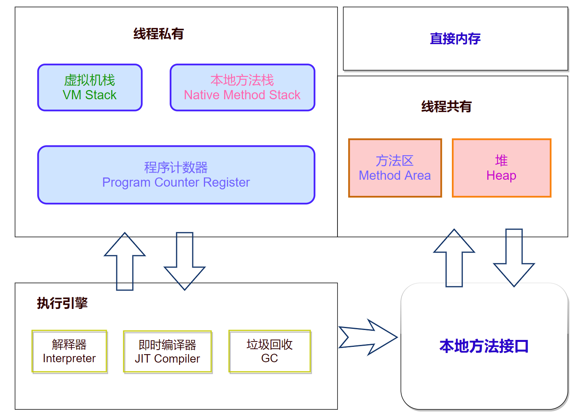
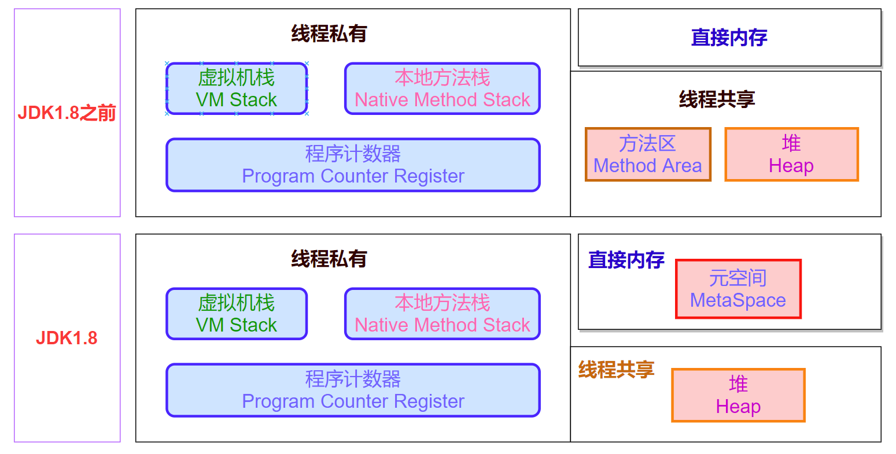
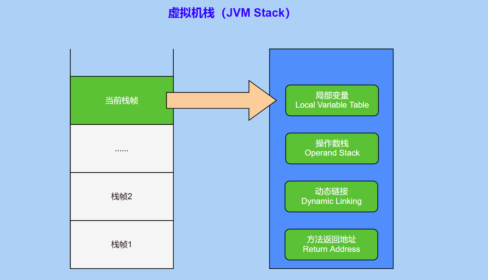
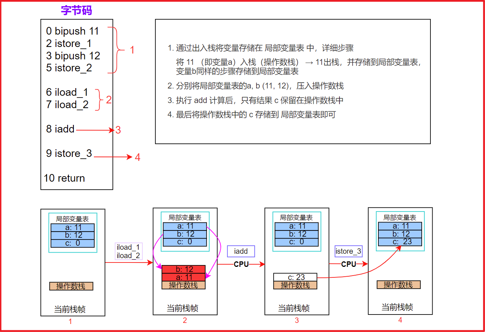
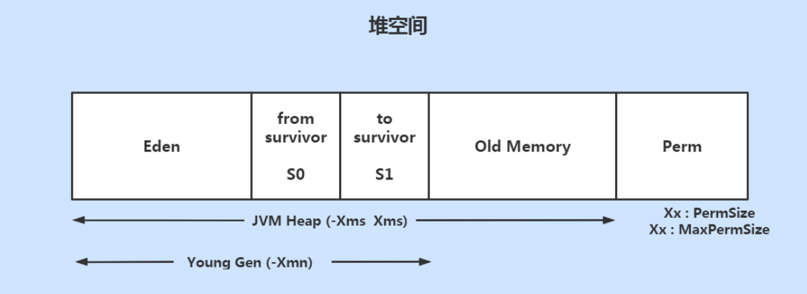
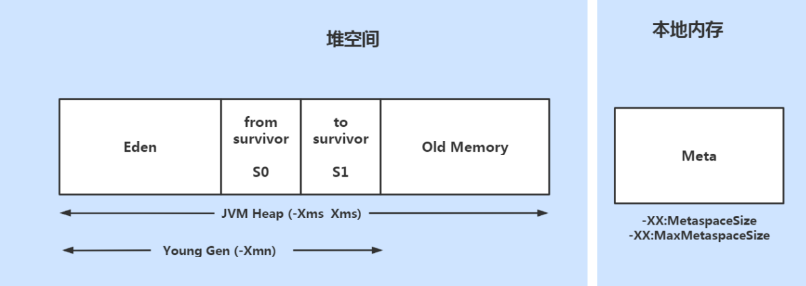
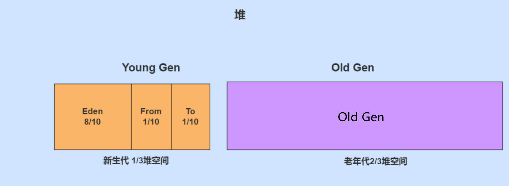
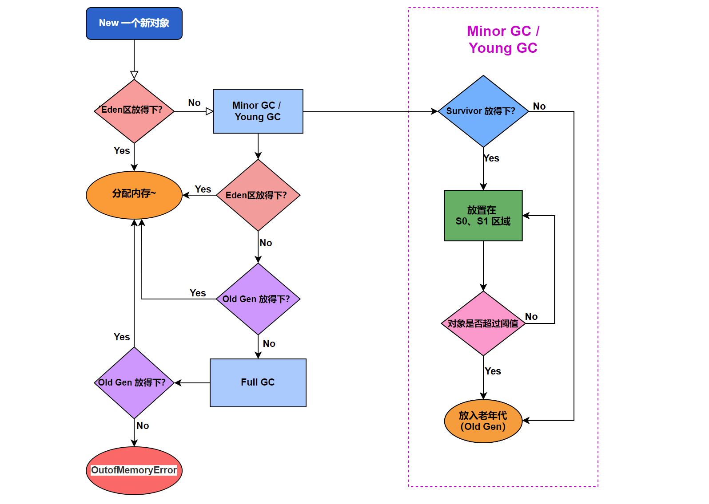
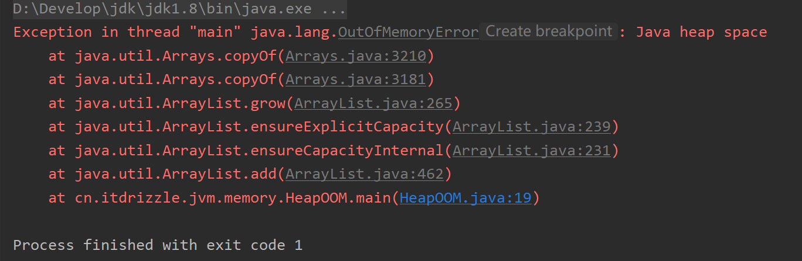

---

order: 15
title: 内存管理与垃圾回收

---


## 内存区域划分

运行时数据区（Runtime Data Area）是指Java虚拟机在执行Java程序时，为了保证程序的正确运行而动态分配和使用的内存区域。这部分内存区域随着线程的创建和销毁而动态改变，是JVM在执行Java代码时实际使用的内存部分。

::: info 运行时数据区

1. **程序计数器（Program Counter Register）**：线程私有，用于记录当前线程所执行的字节码指令的位置。

2. **Java虚拟机栈（Java Virtual Machine Stack）**：线程私有，用于存储局部变量、操作数栈、动态链接和方法出口等信息，每个方法被调用时都会创建一个新的栈帧。

3. **本地方法栈（Native Method Stack）**：线程私有，与Java虚拟机栈类似，但用于支持Native方法的调用。

4. **Java堆（Java Heap）**：线程共享，用于存储所有实例对象和数组。这是垃圾收集器管理的主要区域。

5. **方法区（Method Area）**：线程共享，存储已加载的类信息、常量、静态变量、即时编译后的代码等数据。
:::

这些区域构成了JVM运行时内存模型的基础，其中，程序计数器、虚拟机栈和本地方法栈都是线程私有的，而Java堆和方法区则是所有线程共享的。运行时数据区的管理对于确保Java程序的正确执行和性能优化至关重要。例如，垃圾收集机制主要针对Java堆进行，而方法区的管理则涉及到类的加载和卸载过程。


下面是一个经典的JVM内存区域划分图（JDK1.8以前）：



JDK 1.8 之前的版本（如 JDK 1.6 和 JDK 1.7）和 JDK 1.8 在内存区域划分上有显著的不同，尤其是涉及到方法区的实现。JDK8前后的运行时内存变化（Hotspot）：



方法区（在JDK 1.8中更改为元数据区/Metaspace）用于存储已被虚拟机加载的类信息、常量、静态变量、即时编译后的代码等数据。在JDK 1.7及以前的版本中，方法区被称为永久代（PermGen space），并位于堆中。从JDK 1.8开始，方法区被移动到本机内存中，称为Metaspace，它不在Java堆中，也不受垃圾回收的影响，而是受到系统本机内存限制。


### 程序计数器

**程序计数器（ Program Counter Register )** : 负责**跟踪当前线程所执行的字节码指令的地址**。尽管程序计数器在JVM的整体内存模型中占据的空间相对较小，但它在确保线程切换和恢复执行的准确性方面发挥着至关重要的作用。其主要功能与作用如下：

1. **指令跟踪**：
   ==程序计数器存储了下一条要执行的字节码指令的地址==。在多线程环境中，每个线程都有自己的程序计数器，确保了线程之间执行的独立性和顺序性。

2. **线程切换**：
   当线程被暂停或等待CPU时间片时，程序计数器的值会被保存，以便在线程恢复执行时能准确地从上次停止的地方继续运行。

3. **分支和循环控制与异常处理**：
   对于条件语句（如if-else）、循环语句（如for、while）和跳转指令，程序计数器会根据控制流逻辑更新其值，指向适当的指令地址。
   在遇到异常时，程序计数器可以帮助定位异常发生的指令位置，这对于异常处理和调试非常重要。

::: tip 特点与细节

- **线程私有**：
   每个线程在其生命周期内都拥有独立的程序计数器，这保证了线程之间的独立执行和隔离。

- **Native方法执行**：
   当线程执行Native方法时，程序计数器的值是未定义的（Undefined）。这是因为Native方法不在JVM内部执行，而是调用操作系统或其他原生库的函数。

- **异常处理**：
   如果在执行过程中抛出异常并且没有相应的异常处理器，那么程序计数器的值将被设置为指向异常处理器的入口点。
:::

程序计数器通过跟踪字节码指令的执行位置，确保了多线程环境下程序的正确执行流程。它的线程私有属性和对指令执行的精确控制，使得JVM能够高效地管理多个并发线程，同时保证每个线程的执行独立性和安全性。


### 虚拟机栈

Java虚拟机栈（Java Virtual Machine Stack，简称JVM栈）负责管理线程的局部变量和方法调用过程中的临时数据。每个线程在其生命周期中都会拥有一个独立的JVM栈。

==当一个方法被调用时，JVM栈会创建一个新的**栈帧（Stack Frame）**，用于存储该方法的局部变量、操作数栈、动态链接信息和返回地址==等。当方法执行完毕，其对应的栈帧会被弹出，释放占用的资源。
每一个方法从调用直到执行完成的过程就对应着一个栈帧在虚拟机栈中从入栈到出栈的过程。



栈帧是JVM栈的基本单元，通常包含以下部分：

- **局部变量表(Local Variable Table)**：存储方法参数和局部变量。
- **操作数栈(Operand Stack)**：用于暂存中间计算结果，以及执行算术运算、方法调用等操作。
- **动态链接信息**：支持方法调用过程中对常量池中符号引用的解析，即将符号引用转换为直接引用的过程。
- **返回地址**：指出方法返回后应继续执行的下一条指令的位置。
- **附加信息**：可能还包括一些辅助信息，如线程锁、异常处理器等。


::: tip 基于栈的设计模式与基于寄存器的设计模式
#### 基于栈的设计模式
在基于栈的设计模式中，操作数（如数值、引用等）被存储在栈中，而操作指令（如加法、减法、函数调用等）则从栈中弹出所需的操作数，执行操作后，将结果再压入栈中。这种方式使得JVM能够：

- **简化指令集**：大多数操作指令只需要指定操作类型，而不必显式指定源和目标寄存器，因为所有的操作数都隐式地从操作数栈中获取。
- **易于移植**：基于栈的架构减少了对底层硬件的依赖，使得JVM能够在各种不同架构的处理器上运行，而无需对指令集进行重大修改。
- **便于垃圾回收**：栈上的数据结构是局部的，当方法调用结束时，相关的栈帧（包括操作数栈）会被自动销毁，从而简化了内存管理。

#### 基于寄存器的设计模式
在基于寄存器的设计模式中(大多数现代处理器采用基于寄存器的指令集)，操作数通常存储在一组专用的寄存器中，而指令集中的指令通常需要显式指定源寄存器和目标寄存器。这种方法提供了几个优势：

- **高速访问**：寄存器通常比内存快得多，因为它们是处理器的一部分，直接连接到CPU。
- **减少内存访问**：由于操作数可以直接在寄存器间传递，因此减少了从内存读取和写入操作数的需要。
- **复杂的指令集**：基于寄存器的架构允许更复杂和高效的指令，因为指令可以直接操作寄存器，而无需间接访问栈。

基于栈的设计模式和基于寄存器的设计模式各有优缺点，基于寄存器的设计也有其局限性，比如寄存器数量有限，这可能限制了编译器优化的能力，同时也可能增加指令集的复杂性。相比之下，基于栈的设计模式通过牺牲一定的性能换取了更好的移植性和简化的指令集设计。

==JVM选择了基于栈的设计，主要是因为它提供了更好的跨平台兼容性和简化了内存管理==。基于栈的设计模式曾经是Java性能的一个瓶颈，但随着技术的进步，这一因素的影响已经大大减弱。现代JIT（Just-In-Time）编译器可以在运行时将基于栈的字节码转换为基于寄存器的机器代码，以利用目标平台的特性，从而获得更好的性能。现代的Java虚拟机通过多种优化手段，能够提供接近甚至超过一些编译型语言的性能表现，尤其是在大规模、高性能的应用场景中。
:::

例：在JVM中 执行 `c = a + b` 的字节码执行过程中操作数栈以及局部变量表的变化如下图所示

```java
public static void main(String[] args) {
    int a = 11;
    int b = 12;
    int c = a + b;
}
```




**第一步：将变量存储到局部变量表**
`bipush` 用于将一个小整数推入操作数栈，`istore` 用于从操作数栈弹出一个整数并存储到局部变量表中。

**第二步：加载a和b的值** （`iload` 用于将局部变量表中的整数加载到操作数栈）
1. 当JVM执行到 `iload_1` 时，它会从局部变量表中加载变量 `a` 的值（11）到操作数栈。
2. 接着执行第 `iload_2`，从局部变量表中加载变量 `b` 的值（12）到操作数栈。
此时，操作数栈顶部有两个值：12 和 11（注意栈的后进先出特性）。

**第三步：执行加法操作** （`iadd` 用于执行两个整数的加法操作）
1. 执行 `iadd` 指令时，JVM会从操作数栈中弹出顶部的两个值（12 和 11），执行加法操作，得到结果 23。
2. 加法操作的结果（23）被重新压入操作数栈。

**第四步：存储结果**
执行 `istore_3` 指令，从操作数栈中弹出结果 23，并将其存储到局部变量表中索引为3的位置，即变量 `c`。


::: info 栈溢出与栈大小

JVM栈的大小可以通过JVM启动参数进行配置，如`-Xss`用于设置线程栈的大小。如果一个线程的JVM栈耗尽，即方法调用深度过深或局部变量过多，将会抛出`StackOverflowError`异常。另一方面，如果JVM栈的大小设置得过小，频繁的栈溢出也可能导致性能问题。

- 垃圾回收是否涉及栈内存？
  - **不需要**。因为虚拟机栈中是由一个个栈帧组成的，在方法执行完毕后，对应的栈帧就会被弹出栈。所以无需通过垃圾回收机制去回收内存。
- 栈内存的分配越大越好吗？
  - 不是。因为**物理内存是一定的**，栈内存越大，可以支持更多的递归调用，但是可执行的线程数就会越少。
- 方法内的局部变量是否是线程安全的？
  - 如果方法内**局部变量没有逃离方法的作用范围**，则是**线程安全**的 
  - 如果 **局部变量引用了对象**，并 **逃离了方法的作用范围**，则需要考虑线程安全问题 

**Java.lang.stackOverflowError** 栈内存溢出，**发生原因**  ：

- 虚拟机栈中，**栈帧过多**（如无限递归）
- 每个栈帧**所占用内存空间过大** 
:::


### 本地方法栈

本地方法栈（Native Method Stack）的主要作用是==支持本地方法（Native Methods）的执行==。当Java代码中调用了本地方法时，JVM会利用本地方法栈来管理和协调本地方法的执行。这包括方法调用的上下文切换、参数传递、返回值接收等。

**本地方法栈与虚拟机栈的区别**:

- **服务对象不同**：虚拟机栈服务于Java方法，负责执行字节码；而本地方法栈服务于本地方法，这些方法不是用Java编写的，而是用其他语言（如C/C++）编写并被编译成机器码的。
  
- **实现方式差异**：由于本地方法栈的服务对象不同，它的实现方式也没有严格的规定。有些JVM实现可能将本地方法栈和虚拟机栈合并在一起，如HotSpot JVM；而有些JVM则可能保持独立的本地方法栈。

::: info 本地方法栈的特性

- **线程私有**：和虚拟机栈一样，本地方法栈也是线程私有的。这意味着每个线程都有自己的本地方法栈实例，用于处理线程内调用的本地方法。

- **异常抛出**：本地方法栈也会在遇到栈深度溢出或栈扩展失败时抛出`StackOverflowError`和`OutOfMemoryError`异常。
:::

本地方法通常用于以下几种情况：
- 需要高性能的底层操作，如密集型数学计算或文件I/O。
- 与操作系统或硬件紧密相关的功能，如图形界面或设备驱动。
- 需要调用已有的C/C++库，以重用现有代码或集成第三方组件。


### 堆(Heap)

堆（Heap）主要用于==存储Java对象实例和数组==。 Java堆是被所 有线程共享 的一块内存区域， 在虚拟机启动时创建。 

在JDK 1.8及之前的版本中，堆内存被划分为几个主要的区域（从内存回收的角度来看，由于现在收集器基本都采用分代收集算法，所以Java堆可以细分为）：

1. **年轻代（Young Generation）**
2. **老年代（Old Generation）**
3. **永久代（Permanent Generation）**




从JDK 1.8开始，永久代被元空间（Metaspace）取代，元空间使用的是本机内存而不是堆内存。因此，堆内存划分变为：年轻代（Young Generation）和老年代（Old Generation）



在Java8以后，方法区的内存不在分配在Java堆上，而是存储于本地内存元空间Metaspace中

::: info Heap
#### **年轻代（Young Generation）**：
年轻代主要存放新创建的对象，内存大小相对会比较小，垃圾回收会比较频繁。年轻代分 成1个 **Eden Space** 和2个 **Suvivor Space**（from 和to）
   - **Eden Space**：这是年轻代中最大的部分，新创建的对象首先在这里分配。
   - **Survivor Spaces**：分为两个相等大小的部分，S0和S1（在HotSpot JVM中，分别叫做From和To空间）。每次Minor GC后，存活的对象会被移动到另一个空的Survivor空间中，或者如果对象足够大或存活时间足够长，则直接进入老年代。

#### **老年代（Old Generation / Tenured Generation）**：
老年代用于存储长期存活的对象，或者在年轻代中无法容纳的大对象（Large Objects）。内存大小相对会比较大，垃圾回收也相对没有那么频繁。

#### **永久代（Permanent Generation）**：
用于存储类的元数据、静态变量、常量池等信息。在JDK 1.8中，永久代被元空间（Metaspace）取代。
:::

**配置新生代和老年代堆结构占比** ：
  - `堆大小 = 新生代 + 老年代`。其中，堆的大小可以通过参数 `–Xms`、`-Xmx` 来指定
  
  - 新生代和老年代堆结构占比: 默认 `-XX:NewRatio=2` , 标识新生代占1 , 老年代占2 ,新生代占整个堆的1/3。 修改占比 `-XX:NewPatio=4` , 标识新生代占1 , 老年代占4 , 新生代占整个堆的1/5 
  
  - Eden空间和另外两个Survivor空间占比分别为8:1:1 ，可以通过操作选项 `-XX:SurvivorRatio` 调整这个空间比例。 比如 `-XX:SurvivorRatio=8`
  
  
  

  几乎所有的java对象都在Eden区创建, 但80%的对象生命周期都很短,创建出来就会被销毁

::: tip 对象提升和复制
- 当Eden Space满时，触发Minor GC。在Minor GC过程中，Eden Space和当前正在使用的Survivor Space中的存活对象会被复制到另一个空闲的Survivor Space中，或者如果对象满足一定的年龄条件，直接提升到老年代（Old Generation）。这个过程结束后，之前使用的Survivor Space被清空，下次Minor GC时作为目标Survivor Space使用。

- 如果对象太大，无法在Eden Space或Survivor Spaces中完全存放，那么这些大对象会直接在老年代中分配。

JVM 每次只会使用 Eden 和其中的一块 Survivor 区域来为对象服务，所以==无论什么时候，总是有一块 Survivor 区域是空闲着的==。因此，新生代实际可用的内存空间为 9/10 ( 即90% )的新生代空间。这个设计是为了通过对象复制算法（如Copying GC）高效地回收年轻代中的短生命周期对象，同时减少内存碎片。
:::


堆(Heap)的特点总结：

- 堆是Java虚拟机所管理的内存中最大的一块，在虚拟机启动的时候创建。几乎所有的对象实例以及数组都要在这里分配内存。 
- 堆是jvm所有线程共享的。 堆中也包含私有的线程缓冲区 Thread Local Allocation Buffer (TLAB) 
- 堆是垃圾收集器管理的主要区域，因此很多时候java堆也被称为“GC堆”（Garbage Collected Heap）。
- 堆是计算机物理存储上不连续的、逻辑上是连续的，也是大小可调节的（通过-Xms和-Xmx控制）。 
- 方法结束后,堆中对象不会马上移出仅仅在垃圾回收的时候时候才移除。 
- 如果在堆中没有内存完成实例的分配，并且堆也无法再扩展时，将会抛出OutOfMemoryError异常，即：堆内存溢出：**java.lang.OutofMemoryError** ： java heap space. 


::: tip 对象分配过程

1. 当new关键字用于创建一个新的对象时，JVM首先会在Eden Space中查找是否有足够的空间来分配新的对象。

2. 当`Eden Space`已满时，JVM的垃圾回收器将对`Eden Space`进行垃圾回收（Minor GC）,将`Eden Space`中不再被其他对象引用的对象进行销毁

3. 如果Minor GC后仍然没有足够的空间，或者对象太大，JVM会尝试在老年代分配对象。

4. 年轻代中的对象如果在多次Minor GC后仍然存活，或者存活时间超过了设定的阈值，会被提升到老年代（默认为15次，可以通过设置参数调整阈值`-XX:MaxTenuringThreshold=N`）

5. 老年代内存不足时, 会再次出发GC:Major GC 进行老年代的内存清理 

6. 如果老年代执行了Major GC后仍然没有办法进行对象的保存,就会报OOM异常
:::



- Minor GC：主要发生在年轻代，目的是回收年轻代中不再使用的对象。
- Major GC（或Full GC）：发生在老年代，回收老年代中不再使用的对象。通常比Minor GC慢得多，因为涉及更多的内存区域。


### 方法区

方法区（Method Area）是运行时数据区的一部分，用于存储每个类的信息（Class Metadata）、常量、静态变量、即时编译器编译后的代码等数据。方法区有时(对HotSpot而言)也被称为非堆（Non-Heap）或元数据区。

方法区只是一个规范，其实现方式在jdk1.7及之前为**永久代**，jdk1.8则为**元空间（MetaSpace）**，且元空间存在于本地内存（Native Memory）

::: info 方法区在Java8之后的变化
- 移除了永久代( PermGen )，替换为元空间(Metaspace )
- 永久代中的class metadata(类元信息）转移到了native memory (本地内存，而不是虚拟机)
- 永久代中的 ==interned Strings(字符串常量池）和 class static variables(类静态变量) 转移到了Java heap== （JDK1.7）
- 永久代参数(PermSize MaxPermSize ) -→元空间参数(MetaspaceSize MaxMetaspaceSize )
:::

Java8为什么要将永久代替换成Metaspace ?
- 字符串存在永久代中，容易出现性能问题和内存溢出
- 类及方法的信息等比较难确定其大小，因此对于永久代的大小指定比较困难，太小容易出现永久代溢出，太大则容易导致老年代溢出
- 永久代会为GC带来不必要的复杂度，并且回收效率偏低。


::: info 永久代和元空间

#### 永久代（Permanent Generation）
在JDK 1.8之前，方法区的实现通常被称为永久代（Permanent Generation），永久代是 HotSpot 虚拟机对方法区的具体实现，永久代本身也存在于虚拟机堆中。

- `-xx:Permsize`: 设置永久代初始分配空间。默认值是20.75M 
- `-XX:MaxPermsize`: 设定永久代最大可分配空间。32位机器默认是64M，64位机器模式是82M。当JVM加载的类信息容量超过了这个值，会报异常`OutofMemoryError:PermGen space`。


### 元空间（Meta Space）

从JDK 1.8开始，永久代被移除，方法区的实现改名为元空间（Metaspace）。元空间与永久代最大的区别在于，它不再使用堆内存，而是直接使用本机内存（Native Memory）。这意味着元空间的大小不再受JVM堆大小的限制，而是受限于系统可用的物理内存。

元数据区大小可以使用参数 `-XX:MetaspaceSize` 和 `-XX:MaxMetaspaceSize`指定 默认值依赖于平台。windows下，`-XX:MetaspaceSize`是21M，`-XX:MaxMetaspaceSize`的值是 -1，即没有限制。 

- **初始高水位线**：
   `-XX:MetaspaceSize` 设置了元空间的初始容量。当元空间的使用首次达到这个值时，JVM 将会尝试进行垃圾回收，特别是类卸载，以释放不再需要的类元数据。

- **高水位线的动态调整**：
   如果在 Full GC 后，元空间中释放的空间较少，那么高水位线会根据释放的空间量适当上调，以减少未来的类卸载频率。这种动态调整机制旨在优化元空间的使用，避免频繁的类卸载操作，从而提高性能。

- **最大高水位线**：
   `-XX:MaxMetaspaceSize` 定义了元空间的最大容量。即使在 Full GC 后，高水位线的上调也不会超过这个最大值。如果没有指定 `-XX:MaxMetaspaceSize`，则默认为物理内存的一定比例，通常情况下是不受限的，仅受制于系统的物理内存。

与永久代不同，如果不指定大小，默认情况下，虚拟机会耗尽所有的可用系统内存。如果元数据区发生溢出，虚拟机一样会抛出异常 `OutOfMemoryError:Metaspace`
:::

查看永久代和元空间相关参数的命令：
```shell
jps  # 是java提供的一个显示当前所有java进程pid的命令

jinfo -flag PermSize 进程号     #查看进程的PermSize初始化空间大小
jinfo -flag MaxPermSize 进程号  #查看PermSize最大空间

jinfo -flag MetaspaceSize 进程号     #查看Metaspace 最大分配内存空间
jinfo -flag MaxMetaspaceSize 进程号  #查看Metaspace最大空间
```

::: details 关于永久代和元空间的历史简介

在JDK 8以前，许多Java程序员都习惯在HotSpot虚拟机上开发、部署程序，很多人都更愿意把方法区称呼为“永久代”（Permanent Generation），或将两者混为一谈。

本质上这两者并不是等价的，因为仅仅是当时的HotSpot虚拟机设计团队选择把收集器的分代设计扩展至方法区，或者说使用永久代来实现方法区而已，这样使得HotSpot的垃圾收集器能够像管理Java堆一样管理这部分内存，省去专门为方法区编写内存管理代码的工作。

但是对于其他虚拟机实现，譬如BEA JRockit、IBM J9等来说，是不存在永久代的概念的。原则上如何实现方法区属于虚拟机实现细节，不受《Java虚拟机规范》管束，并不要求统一。

但现在回头来看，当年使用永久代来实现方法区的决定并不是一个好主意，这种设计导致了Java应用更容易遇到内存溢出的问题（永久代有-XX：MaxPermSize的上限，即使不设置也有默认大小，而J9和JRockit只要没有触碰到进程可用内存的上限，例如32位系统中的4GB限制，就不会出问题），而且有极少数方法（例如`String::intern()`）会因永久代的原因而导致不同虚拟机下有不同的表现。

当Oracle收购BEA获得了JRockit的所有权后，准备把JRockit中的优秀功能，譬如Java MissionControl管理工具，移植到HotSpot虚拟机时，但因为两者对方法区实现的差异而面临诸多困难。考虑到HotSpot未来的发展，在JDK 6的时候HotSpot开发团队就有放弃永久代，逐步改为采用本地内存（Native Memory）来实现方法区的计划了，到了JDK 7的HotSpot，已经把原本放在永久代的字符串常量池、静态变量等移出，而到了JDK 8，终于完全废弃了永久代的概念，改用与JRockit、J9一样在本地内存中实现的 **元空间（Meta-space）** 来代替，把JDK 7中永久代还剩余的内容（主要是类型信息）全部移到元空间中。
:::


::: info 常量池(Constant Pool)与串池(String Table)
#### 常量池（Constant Pool）
常量池是每个`.class`文件的一部分，它在编译期由编译器创建，用于存储类或接口中出现的各类常量信息，包括直接常量（如字面量和符号引用）和对其他类、字段和方法的引用。每个类都有自己的常量池，它在类加载到JVM时被读取。

#### 运行时常量池（Runtime Constant Pool）
运行时常量池是方法区的一部分，当类被加载到JVM时，其常量池中的内容会被复制到运行时常量池中。运行时常态池是每个类或接口的运行时表示的一部分，它包含类结构的所有常量信息，而且它在运行时可以被修改，允许添加新的常量（例如，通过`String.intern()`方法添加的字符串）

#### 字符串池（String Pool / String Table）
字符串池是运行时常量池的一部分，它用于存储字符串字面量。当一个字符串字面量被创建时，它会被放入字符串池中。如果字符串池中已存在一个相等的字符串，则不会创建新的字符串对象，而是返回已存在的字符串引用。 
:::

关于intern()方法在不同JDK版本中的区别：
- 在JDK 1.6及之前版本中，如果串池中已经存在则直返回，不存在则==复制到串池中并返回其引用==
- JDK 1.7后的intern方法实现不会再复制一份字符串实例到串池，而是==直接在串池中保存了对这个堆上的字符串实例的引用==，这样可以减少内存的占用。
```java
String ab = new String("a")　＋　new String("b");  //在堆中创建"a","b","ab";

//先判断StringTable中是否有"ab"，如果有直接返回StringTable中的地址
String ab2 = ab.intern();  // 如果没有则将该对象放入StringTable中（注意不同版本的区别点）

String ab3 = "ab";  //因为StringTable中有"ab",此时直接返回StringTable中地址。

System.out.println( ab2 == ab3 ); // true        

System.out.println( ab == ab3 );  // JDK1.6为 false ，在JDK 1.7以后版本结果是true
```


### 直接内存

直接内存（Direct Memory）是一个特殊的内存区域，它不属于JVM的标准堆内存或方法区，而是直接向操作系统申请的堆外内存。直接内存的引入主要是为了支持高性能的I/O操作，尤其是在Java NIO（New IO）框架中，通过使用直接内存可以显著提高数据传输的效率。

1. **堆外内存**：
   直接内存是在JVM堆之外分配的，它不受垃圾回收（GC）的影响，因此不会在常规的垃圾收集过程中被回收，除非通过特定的机制显式回收。

2. **性能优势**：
   使用直接内存可以避免在Java堆和本机堆之间复制数据，因为数据可以直接在本机堆和设备（如磁盘或网络接口）之间传输，这在大数据量的I/O操作中尤其重要，可以减少CPU的复制操作，提高性能。

3. **分配与回收**：
   直接内存的分配和回收成本较高，分配时需要通过JNI（Java Native Interface）或`sun.misc.Unsafe`类来完成。回收通常需要手动进行，或者当`DirectByteBuffer`对象不再被引用时，JVM会触发一个清理操作，通知操作系统释放内存。

在Java中，直接内存可以通过`java.nio.ByteBuffer`的`allocateDirect()`方法来分配和使用。以下是一个简单的示例：

```java
import java.nio.ByteBuffer;

public class DirectMemoryExample {
    public static void main(String[] args) {
        ByteBuffer buffer = ByteBuffer.allocateDirect(1024);
        // 使用buffer...
    }
}
```

在这个例子中，`ByteBuffer.allocateDirect(1024)`会直接向操作系统申请1024字节的内存，并返回一个`DirectByteBuffer`对象，该对象充当了直接内存的引用。

::: info 直接内存的限制与风险

1. **内存限制**：
   直接内存的大小可以通过JVM参数`-XX:MaxDirectMemorySize`来设置，如果不设置，默认值可能与`-Xmx`（最大堆内存）相同，但实际大小受到操作系统的限制。

2. **资源泄露**：
   如果不恰当地管理直接内存，可能会导致资源泄露，因为直接内存的回收依赖于`DirectByteBuffer`对象的生命周期。如果对象不再使用但未被正确回收，直接内存可能会持续占用，最终导致内存不足。

3. **OOM（Out of Memory Error）**：
   当直接内存消耗过多时，可能会抛出`OutOfMemoryError`异常，提示“Direct buffer memory”。
:::

直接内存是JVM提供的一种堆外内存管理机制，主要用于优化I/O操作的性能。它不受常规的垃圾回收机制影响，因此需要程序员更加谨慎地管理其分配和回收，以避免潜在的内存泄漏和资源浪费问题。


## JVM垃圾回收


**堆GC**： Java 中的堆也是 GC 收集垃圾的主要区域。GC 分为两种：一种是部分收集器（Partial GC）另一类是整堆收集器 （Fu'll GC）

- 部分收集器: 不是完整收集java堆的的收集器,它又分为: 
  - 新生代收集（Minor GC / Young GC）: 只是新生代的垃圾收集 
  - 老年代收集 （Major GC / Old GC）: 只是老年代的垃圾收集 (CMS GC 单独回收老年代) 
  - 混合收集（Mixed GC）:收集整个新生代及老年代的垃圾收集 (G1 GC会混合回收, region区域回收) 
- 整堆收集（Full GC）: 收集整个java堆和方法区的垃圾收集器 

年轻代GC触发条件: 

- 年轻代空间不足,就会触发Minor GC， 这里年轻代指的是Eden代满，Survivor不满不会引发GC
- Minor GC会引发  **STW (stop the world)**  , 暂停其他用户的线程,等垃圾回收接收,用户的线程才恢复.

老年代GC (Major GC)触发机制 

- 老年代空间不足时,会尝试触发MinorGC. 如果空间还是不足,则触发Major GC 

- 如果Major GC , 内存仍然不足,则报错OOM 

- Major GC的速度比Minor GC慢10倍以上. 

FullGC 触发机制: 

- 调用System.gc() , 系统会执行Full GC （不是立即执行） 
- 老年代空间不足、或 方法区空间不足 
- 通过Minor GC进入老年代平均大小大于老年代可用内存


### Minor GC
Minor GC，即年轻代垃圾回收，是Java虚拟机（JVM）中的一种垃圾回收机制，主要关注于年轻代（Young Generation）的内存区域。年轻代通常包含Eden Space和两个Survivor Spaces（S0和S1，或称From和To spaces）。以下是Minor GC的简要过程：

1. **触发条件**：
   - 当Eden Space的内存空间不足时，或者当对象的创建速度超过了Eden Space的扩容速度时，会触发Minor GC。
   - 有时，如果JVM检测到老年代（Old Generation）的剩余空间不足以容纳即将创建的大对象，也可能触发Minor GC，以腾出空间。

2. **停止世界（Stop-The-World）**：
   - Minor GC发生时，所有正在运行的Java线程都会被暂停，直到GC结束。这一过程被称为“停止世界”（Stop-The-World），因为它会暂时中断应用程序的正常执行。

3. **对象存活检测**：
   - JVM会检查Eden Space和当前使用的Survivor Space中的所有对象，判断哪些对象是存活的，哪些是垃圾（不再被引用的对象）。

4. **对象复制**：
   - 存活的对象会被复制到另一个Survivor Space（如果另一个Survivor Space有足够的空间），或者直接提升到老年代（如果对象足够大或已经达到了一定的年龄阈值）。
   - 未被复制到另一Survivor Space的对象将被回收。

5. **年龄计数**：
   - 如果对象在Survivor Space之间被复制，它的年龄计数会增加。当对象的年龄达到预先设定的阈值（默认通常是15），对象将被提升到老年代。

6. **Survivor Space交换**：
   - 用于复制的Survivor Space会变成下一次Minor GC的源Survivor Space，而之前的源Survivor Space则变成目标Survivor Space。

7. **GC结束**：
   - 所有垃圾对象被清除，存活对象被妥善安置，Eden Space被清空，JVM重新启动所有被暂停的Java线程，应用程序恢复执行。

Minor GC的设计目标是尽可能快地回收不再使用的对象，以减少Full GC的频率。Full GC涉及整个堆内存区域，包括年轻代和老年代，通常比Minor GC耗时更长，对应用程序的性能影响更大。通过频繁但快速的Minor GC，可以有效地管理年轻代的内存，延长Full GC的间隔，从而提高整体性能。


## 三 内存溢出

### 1. Jvm堆溢出

当对象所占空间超过最大堆容量时，就会产生 `OutOfMemoryError` 的异常

```java
/**
 * @Classname HeapOOM
 * @Description 堆溢出演示，设置最大堆最小堆：-Xms20m -Xmx20m
 * @CreateTime 2022/2/17 9:13
 * @CreatedBy itdrizzle
 */
public class HeapOOM {
    static class Person{
    }

    public static void main(String[] args) {
        List<Person> list = new ArrayList<>();
        while (true){
            list.add(new Person());
        }
    }
}
```



产生 `OutOfMemoryError` 异常的常见原因： 

- 内存中加载的数据过多，如一次从数据库中取出过多数据； 
- 集合对对象引用过多且使用完后没有清空； 
- 代码中存在死循环或循环产生过多重复对象； 
- 堆内存分配不合理

### 2. Jvm栈溢出

### 3. 方法区溢出

### 4. 直接内存溢出
