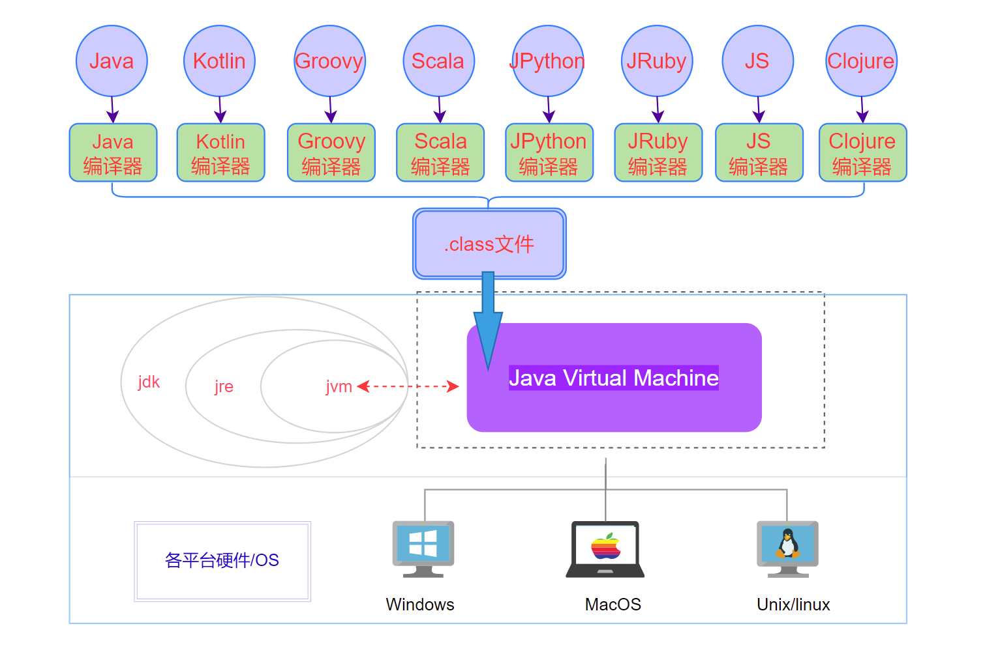

--- 

dir:
    order: 10
index: false
title: Java虚拟机

---

Java虚拟机（JVM）是运行Java字节码的虚拟计算机。它的设计目标是提供一种跨平台的执行环境，使得Java程序“一次编写，到处运行”。

Java Virtual Machine，JAVA程序的**运行环境**（JAVA二进制字节码的运行环境）

- 一次编写，到处运行
- 自动内存管理，垃圾回收机制
- 数组下标越界检查

::: info jdk、jre和jvm

- **JDK (Java Development Kits)** -- Java 开发工具集
  
  JDK 是整个 JAVA 的核心，包括了 Java 运行环 境（Java Runtime Environment），一堆 Java 工具（javac/java/jdb 等）和 Java 基的类库（即 Java API 包括 rt.jar），它不提供具体的开发软件，它提供的是无论你用何种开发软件写 Java 程序都必须用到的类库和 Java 语言规范。

- **JRE (Java Runtime Environment)** --Java 运行时环境

- **JVM （Java Virtual Machine）**-- Java虚拟机
  
  JVM 可以理解成一个可运行 Java 字节码的虚拟计算机系统， 它有一个解释器组件，可以实现 Java 字节码和计算机操作系统之间的通信 ，对于不同的运行平台，有不同 的 JVM，JVM 屏蔽了底层运行平台的差别，实现了“一次编译，随处运行”。
:::

值得注意的是：Java 虚拟机不和包括Java 在内的任何语言绑定，它只与“Class 文件”这种特定的二进制文件格式所关联。
无论使用何种语言进行软件开发，只要能将源文件编译为正确的Class文件，那么这种语言就可以在Java虚拟机上执行。可以说，统一而强大的Class文件结构，就是Java虚拟机的基石、桥梁。

JVM体系结构主要包括以下核心组件：

::: tip JVM体系结构
1. **类加载器子系统**：负责查找并加载类文件的二进制数据，转换为JVM可以理解的内部表示形式。
2. **运行时数据区**：包括方法区、堆、Java虚拟机栈、本地方法栈、程序计数器等，用于存储程序运行时的数据和控制信息。
3. **执行引擎**：负责解释或编译字节码至机器码，并执行这些代码。
4. **本地接口**：允许Java代码调用本地方法库，实现与操作系统交互的能力。
5. **垃圾收集器**：自动管理内存的分配和回收，主要针对堆区。
:::

#### JVM执行引擎工作原理
JVM执行引擎是JVM的核心组件之一，负责将字节码转换为机器码并执行。其工作流程大致可以分为三个阶段：

1. **加载与验证**：类加载器加载类文件后，执行引擎会对字节码进行验证，确保其符合JVM规范。
2. **准备与解析**：为类变量分配内存并初始化为默认值，同时解析符号引用转为直接引用。
3. **执行**：这是执行引擎的核心步骤，可以通过两种方式执行字节码：
   - **解释执行**：逐条解释字节码指令，每遇到一条指令就解释并执行。
   - **即时编译（JIT）**：将频繁执行的热点代码编译成本地机器码，以提高执行效率。

#### 字节码与字节码解释器
- **字节码**：Java源代码被编译成一种中间格式——字节码（.class文件），它是平台无关的，便于跨平台运行。
- **字节码解释器**：JVM的一部分，用于读取字节码并逐条转换为对应平台的机器指令执行。这一过程降低了执行速度，但带来了高度的平台兼容性。

#### Just-In-Time (JIT) 编译与热点代码识别
- **Just-In-Time (JIT) 编译**：JVM监测并识别出经常被执行的“热点”代码区域，将其从字节码转换为高度优化的本地机器码。这种动态编译技术显著提升了程序的运行效率。
- **热点代码识别**：JVM通过统计方法的调用频率和循环执行次数来确定哪些代码是热点。一旦某段代码被标识为热点，JIT编译器就会介入，将其编译为本地代码，并缓存起来供后续直接使用。这一步骤是自动进行的，无需开发者干预。

综上所述，JVM的体系结构和执行引擎设计确保了Java程序的跨平台运行能力、安全性以及高性能，通过字节码解释和JIT编译的结合，实现了执行效率与灵活性的平衡。

Oracle所给的相关规范：https://docs.oracle.com/javase/specs/index.html

[Java SE Specifications](https://docs.oracle.com/javase/specs/)

HTML：[The Java&reg; Virtual Machine Specification](https://docs.oracle.com/javase/specs/jvms/se8/html/index.html)

PDF：https://docs.oracle.com/javase/specs/jvms/se8/jvms8.pdf

### 1. JVM架构与基础
- JVM体系结构概览
- JVM执行引擎工作原理
- 字节码与字节码解释器
- Just-In-Time (JIT) 编译与热点代码识别

### 2. 类加载机制
- 类加载过程深入
- 双亲委派模型
- 类加载器分类与自定义类加载器
- 类加载器缓存机制

### 3. 内存管理与垃圾回收
- 内存区域详细划分与功能
- 对象生命周期与分配策略
- 垃圾回收算法详解（包括但不限于上述提到的）
- 垃圾收集器介绍与选择（Serial, Parallel, CMS, G1, ZGC, Shenandoah等）
- GC调优实践与监控工具（JVisualVM, JConsole, GC日志分析）

### 4. 内存泄漏与性能优化
- 内存泄漏的识别与避免
- 性能监控与分析工具
- 堆栈溢出分析与解决
- 线程与锁的性能影响
- JVM性能调优策略

### 5. 并发与多线程
- Java内存模型（JMM）
- synchronized与volatile关键字
- Locks与原子类
- 线程池与Executor框架
- 并发容器与工具类

### 6. 虚拟机字节码与指令集
- Java字节码结构
- 常见字节码指令分析
- 字节码操作与ASM库使用

### 7. 方法区与元数据管理
- 运行时常量池细节
- 类元数据存储与访问
- PermGen与Metaspace区别

### 8. 安全性与防护机制
- 类加载的安全策略
- 代码审计与沙箱机制
- 安全管理器与权限控制

### 9. 高级特性与实践
- 字符串常量池与 intern() 方法
- 类型擦除与泛型实现
- Lambda表达式与 invokedynamic 指令
- AOT编译（ Ahead-of-Time）与 GraalVM

### 10. 实战与案例分析
- 应用部署与JVM配置实战
- 真实场景下的性能瓶颈分析
- OpenJDK源码阅读指导
- 第三方JVM与替代实现（如OpenJ9）

