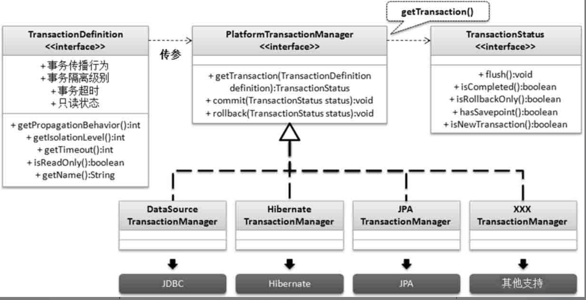

---

order: 1
title:  Spring框架
shortTitle: Spring框架

---


## 一 IOC Container

Spring Framework Introduction：https://spring.io/projects/spring-framework 

Spring Framework Documentation：https://spring.io/projects/spring-framework#learn

<br>

所有历史版本的PDF/HTML文档：https://docs.spring.io/spring-framework/docs/ 

Spring 的官方Github地址：https://github.com/spring-projects/spring-framework 


<br>


### 1. Introduction 

 the Inversion of Control (IoC) principle.

```bash

IoC is also known as dependency injection (DI). 
It is a process whereby objects define their dependencies (that is, the other objects they work with) only through constructor arguments, arguments to a factory method, or properties that are set on the object instance after it is constructed or returned from a factory method. 

The container then injects those dependencies when it creates the bean. 
This process is fundamentally the inverse (hence the name, Inversion of Control) of the bean itself controlling the instantiation or location of its dependencies by using direct construction of classes or a mechanism such as the Service Locator pattern.

```

<br>

```java

/**

1. 没有Spring框架时，我们需要自己创建User/Dao/Service，例如：

	UserSericeImpl userService = new UserServiceImpl();
	
2. 有了Spring框架，可以将原有Bean的创建工作转移给框架, 需要用时从Bean的容器中获取即可，
   这样便简化了开发工作（Bean的创建和使用分离了）
   
```

1. Spring框架管理Bean的创建工作，即由用户管理Bean转变为框架管理Bean，

   这个就叫**控制反转 - Inversion of Control (IoC)** 

2. Spring 框架托管创建的Bean放在哪里呢？ —— **IoC Container**;

3. Spring 框架为了更好让用户配置Bean，必然会引入**不同方式来配置Bean**

   ——  **xml配置，Java配置，注解配置**等

4. Spring 框架既然接管了Bean的创建，必然需要**管理整个Bean的生命周期**等；

5. 应用程序代码从Ioc Container中获取依赖的Bean，注入到应用程序中，

   这个过程叫 **依赖注入(Dependency Injection，DI)** ； 

   因此有人就说控制反转是通过依赖注入实现的，其实它们是同一个概念的不同角度描述。

   通俗来说就是**IoC是设计思想，DI是实现方式**

6. 在依赖注入时，有哪些方式呢？

   构造器方式，@Autowired, @Resource, @Qualifier... 

   同时Bean之间存在依赖（可能存在先后顺序问题，以及**循环依赖问题**等）

<br>

```bash

## IOC: IOC → Inverse of Control 控制反转

Spring容器：IOC容器

控制：实例的生成，使用Spring之前是应用程序生成

反转：实例的生成权由应用程序反转给Spring容器

组件、bea：Spring容器所管理的实例


## DI：DI → Dependency Injection 依赖注入

依赖：谁依赖谁，为什么 (应用程序依赖IOC容器，Spring容器富有、应用程序贫穷)

注入：谁注入谁，注入了什么 （IOC容器中的组件注入到我们开发的应用程序中）


## 小结

控制反转就是放进去（将对象`放到`IOC容器中，其本质是IOC容器接管了对象的整个创建过程）

依赖注入就是取出来 （将IOC容器中的组件注入到应用程序中）

```


<br>


### 2. 依赖和约束

5个核心包+1个日志包

<font color='red'>**spring-context **</font>\ aop \ beans \ core \ expression  + spring-jcl

```xml

<dependency>
    <groupId>org.springframework</groupId>
    <artifactId>spring-context</artifactId>
    <version>5.2.15.RELEASE</version>
</dependency>
<dependency>
    <groupId>junit</groupId>
    <artifactId>junit</artifactId>
    <version>4.12</version>
    <scope>test</scope>
</dependency>

```

<br>

**schema约束**：

官方文档：https://docs.spring.io/spring-framework/docs/current/reference/html/core.html#xsd-schemas

```xml

<?xml version="1.0" encoding="UTF-8"?>
<beans xmlns="http://www.springframework.org/schema/beans"
    xmlns:xsi="http://www.w3.org/2001/XMLSchema-instance"
    xmlns:util="http://www.springframework.org/schema/util"
    xsi:schemaLocation="
        http://www.springframework.org/schema/beans https://www.springframework.org/schema/beans/spring-beans.xsd
        http://www.springframework.org/schema/util https://www.springframework.org/schema/util/spring-util.xsd">

    <!-- bean definitions here -->
    <!--id属性：组件在容器中的唯一标识,单词通常是和实例相关的-->
    <!--name属性：省略不写，以id作为默认值-->
    <!--class属性：全限定类名-->
    <bean id="userService" class="com.xxx.service.UserServiceImpl"/>
    <bean id="orderService" class="com.xxx.service.OrderServiceImpl"/>
    
    
    
    <!--维护依赖关系-->
    <bean id="userService" class="com.xxx.service.UserServiceImpl">
        <!--property子标签的name属性值对应的就是set方法-->
        <!--ref属性：组件id-->
        <property name="userDao" ref="userDao"/>
	</bean>

	<bean id="orderService" class="com.xxx.service.OrderServiceImpl">
    	<property name="userDao" ref="userDao"/>
	</bean>

	<!--userDao组件-->
	<bean id="userDao" class="com.xxx.dao.UserDaoImpl"/>

</beans>

```

通常名字叫 <font color='red'>**application(-xxx).xml**</font> .

<br>


### 3. 容器与实例化

BeanFactory是Spring框架中IoC容器的顶层接⼝,它只是⽤来定义⼀些基础功能,定义⼀些基础规范,

ApplicationContext是它的⼀个⼦接⼝，所以ApplicationContext是具备BeanFactory提供的全部功能
的。通常，我们称BeanFactory为SpringIOC的基础容器，ApplicationContext是容器的⾼级接⼝，⽐
BeanFactory要拥有更多的功能，⽐如说国际化⽀持和资源访问（xml，java配置类）等等

<br>

#### 启动IoC容器

启动 IoC 容器的⽅式：

- Java环境下启动IoC容器

  ClassPathXmlApplicationContext：从类的根路径下加载配置⽂件（推荐使⽤）

  FileSystemXmlApplicationContext：从磁盘路径上加载配置⽂件

  AnnotationConfigApplicationContext：纯注解模式下启动Spring容器

  ```java
  
  // ClassPathXmlApplicationContext 使用示例
  @Test
  public void test() {
      // 通过容器取出Spring管理的实例
      ApplicationContext applicationContext = new ClassPathXmlApplicationContext("application.xml");
  
      //取出实例的方式
      //按照组件的id来取出组件
      UserService userService1 = (UserService) applicationContext.getBean("userService");
      UserService userService2 = (UserService) applicationContext.getBean("userService");
      UserService userService3 = (UserService) applicationContext.getBean("userService");
      UserService userService4 = (UserService) applicationContext.getBean("userService");
  
      userService1.sayHello();
  
      // 按照组件类型来取出 (可以写实现类，也可以写接口、更建议写接口）
      // 但是需要容器中只有一个该类型的组件（否则会出错）
      UserService userService5 = applicationContext.getBean(UserService.class);//泛型方法
  
      //按照类型和id来取出
      UserService userService6 = applicationContext.getBean("userService", UserService.class);
  }
  
  ```

  <br>

- Web环境下启动IoC容器

  从xml启动容器或从配置类启动容器


<br>


#### 构造方法实例化

**Bean的实例化**：容器要管理组件，组件是如何完成实例化的？

> 1. 构造方法
>    1. 有参构造
>    2. <font color='red'>**无参构造**</font>
> 2. 工厂
>    1. 静态工厂 → 简单工厂
>    2. 实例工厂 → 简单工厂
>    3. FactoryBean 

```xml

<bean id="no" class="com.xxx.bean.NoParamConstructorBean"/>

<!--默认使用无参构造方法，新增了有参构造方法，默认的无参构造方法就没了-->
<!--constructor-arg子标签 → 有参构造方法-->
<!--name属性：有参构造方法的形参名-->
<bean id="has" class="com.xxx.bean.HasParamConstructorBean">
    <constructor-arg name="username" value="zhangsan"/>
    <constructor-arg name="password" value="123465"/>
</bean>

```

<br>

```java

public class NoParamConstructorBean {
    public NoParamConstructorBean() {
        System.out.println("无参构造");
    }
}
public class HasParamConstructorBean {
    String username;
    String password;

    public HasParamConstructorBean(String username, String password) {
        this.username = username;
        this.password = password;
        System.out.println("有参构造方法：" + username + " → " + password);
    }
}

```

<br>


### 4. 工厂实例化


#### 静态工厂和实例工厂

```java

// 实例工厂
public class InstanceFactory {
    public Car getInstance() {
        Car car = new Car();
        car.setType("instance");
        return car;
    }
}

// 静态工厂
public class StaticFactory {

    public static Car getInstance() {
        Car car = new Car();
        car.setType("static");
        return car;
    }
}

```

<br>

```xml

<!--静态工厂-->
<!--factory-method属性：生产方法-->
<!--如果包含了factory-method属性：组件类型并不是class属性对应的类型，而是factory-method属性对应的方法的返回值类型-->
<bean id="carFromStaticFactory" class="com.xxx.factory.StaticFactory" factory-method="getInstance"/>

<!--实例工厂-->
<bean id="instanceFactory" class="com.xxx.factory.InstanceFactory"/>
<bean id="carFromInstanceFactory" factory-bean="instanceFactory" factory-method="getInstance"/>

```


```java

@Test
public void test() {
    //静态工厂直接使用生产方法 → 类、方法
    Car car1 = StaticFactory.getInstance();

    //实例工厂需要先获得工厂的实例 
    InstanceFactory instanceFactory = new InstanceFactory();
    Car car2 = instanceFactory.getInstance();
}

```

<br>

#### FactoryBean接口

```xml

<!--  Spring内置了对FactoryBean支持 → Spring会检查类是否有实现FactoryBean接口 -->
<!-- 取出组件时取出的是FactoryBean的getObject方法的返回值 -->

<bean id="userServiceProxy" class="com.xxx.proxy.ServiceProxyFactoryBean">
    <property name="clazz" value="com.xxx.service.UserServiceImpl"/>
</bean>

```

<br>

```java

// 该类能够提供一个service的代理组件，并且从单元测试类中取出该组件能够实现事务
public class ServiceProxyFactoryBean implements FactoryBean<Object> {
    String clazz;

    @Override
    public boolean isSingleton() {
        return true;
    }

    @Override
    public Object getObject() throws Exception {
        Class<?> cls = Class.forName(clazz);
        Object obj = cls.newInstance();
        return Enhancer.create(cls, new MethodInterceptor() {
            @Override
            public Object intercept(Object o, Method method, Object[] objects, 
                                    MethodProxy methodProxy) throws Throwable {
                SqlSession sqlSession = MyBatisUtil.getSqlSession();
                Field[] declaredFields = cls.getDeclaredFields();
                for (Field field : declaredFields) {
                    if (field.getName().contains("Mapper")) {
                        field.setAccessible(true);
                        Class<?> type = field.getType();
                        Object mapper = sqlSession.getMapper(type);
                        field.set(obj, mapper);
                    }
                }
                Object invoke = method.invoke(obj, objects);
                sqlSession.commit();
                sqlSession.close();
                return invoke;
            }
        });
    }

    @Override
    public Class<?> getObjectType() {
        return UserServiceImpl.class;
    }

    public void setClazz(String clazz) {
        this.clazz = clazz;
    }
}

```

<br>

```java

@RunWith(SpringJUnit4ClassRunner.class)
@ContextConfiguration("classpath:application.xml")
public class MyTest {

    // 取出的是ServiceProxyFactoryBean提供的组件
    @Qualifier("userServiceProxy")
    @Autowired
    UserService userService;

    @Test
    public void testSelect(){
        String name = userService.queryNameById(1);
        System.out.println(name);
    }

    @Test
    public void testInsert() {
        User user = new User();
        user.setUsername("fahai");
        user.setPassword("nohair");
        user.setAge(33);
        int insert = userService.insertUser(user);
        System.out.println("insert = " + insert);
    }

}

```


<br>


### 5. 作用域scope

singleton：单例  → 每一次取出组件都是同一个实例 → <font color='red'> 绝大多数场景用的都是默认的作用域 ：singleton</font> . 

prototype：原型 → 每一次取出组件都是新的实例

不管取出组件的方式是按照id还是按照类型取出

```xml

<!--scope属性：作用域-->
<bean id="default" class="com.xxx.bean.DefaultBean"/>
<bean id="singleton" class="com.xxx.bean.SingletonBean" scope="singleton"/>
<bean id="prototype" class="com.xxx.bean.PrototypeBean" scope="prototype"/>

```


<br>


### 6. Spring生命周期

Spring容器中的组件的生命周期 :  在组件可用状态之前可以使用哪一些方法，在组件可用之后可以使用哪一些方法

```bash

1. Bean的实例化

2. 设置参数（set方法）

3. Aware 
   1). BeanNameAware → setBeanName
   2). BeanFactoryAware → setBeanFactory
   3). ApplicationContextAware → setApplicationContext
   
4. BeanPostProcessor的before

5. init-method、InitializingBean提供的afterPropertiesSet

6. BeanPostProcessor的after

7. Bean作为容器中的组件是可用的


# 组件到达可用状态之前一定会执行的：Bean的实例化

# 当前组件实现接口才会执行的：Aware的3个方法、InitializingBean的afterPropertiesSet方法

# 单独指定：init-method

# 通用的（不仅仅针对当前组件）：BeanPostProcessor的before和after


容器关闭之前: 

 👉 destory-method、
 
 👉 DisposableBean提供的destroy

```

<br>


**BeanPostProcessor**：

<font color='red'>**如果容器中有组件实现了BeanPostProcessor接口，那么其他的所有的组件都会执行BeanPostProcessor的方法**</font> . 

即如果⼀个类实现了BeanPostProcessor，默认是会对整个Spring容器中所有的bean进⾏处理。

```java

public class CommonBeanPostProcessor implements BeanPostProcessor {
    
    @Override
    public Object postProcessBeforeInitialization(Object bean, String beanName) 
        throws BeansException {

        //如果我传入的是LifecycleBean，我能不能给他替换成代理对象呢？
        //返回的时候能不能换成动态代理的对象呢？

        return bean;
    }

    // 和before一摸一样，只有执行顺序不同
    @Override
    public Object postProcessAfterInitialization(Object bean, String beanName) throws BeansException {
        // 返回值如果写的是return null 👉 相当于return bean
        return null;
    }
}

```

如果要对具体的某个bean处理，可以通过⽅法参数判断，两个类型参数分别为Object和String，

第⼀个参数是每个bean的实例，第⼆个参数是每个bean的name或者id属性的值。

所以我们可以通过第⼆个参数，来判断我们将要处理的具体的bean。

<br>

生命周期及相关接口示例：

```java

public class LifeCycleBean implements BeanNameAware, BeanFactoryAware, ApplicationContextAware,
        InitializingBean,DisposableBean {

    private String name;

    private String beanName;
    private BeanFactory beanFactory;
    private ApplicationContext applicationContext;

    // 无参构造，Bean实例化时调用
    public LifeCycleBean() {
        System.out.println("Constructor");
    }

    // setter
    public void setName(String name) {
        this.name = name;
        System.out.println("Setter");
    }

    // BeanNameAware
    @Override
    public void setBeanName(String name) {
        this.beanName = name;
        System.out.println("BeanNameAware——setBeanName(), beanName = " + beanName);
    }

    // BeanFactoryAware
    @Override
    public void setBeanFactory(BeanFactory beanFactory) throws BeansException {
        this.beanFactory = beanFactory;
        System.out.println("BeanFactoryAware——setBeanFactory, beanFactory = " + beanFactory);
    }

    // ApplicationContextAware
    @Override
    public void setApplicationContext(ApplicationContext applicationContext) throws BeansException {
        this.applicationContext = applicationContext;
        System.out.println("ApplicationContextAware——setApplicationContext");
    }


    @Override
    public void afterPropertiesSet() throws Exception {
        System.out.println("afterPropertiesSet() of InitializingBean");
    }
    
    @PostConstruct
    public void customInit(){
        System.out.println("customInit");
    }

    @PreDestroy
    public void customDestroy() {
        System.out.println("customDestroy");
    }

    @Override
    public void destroy() throws Exception {
        System.out.println("destroy() of DisposableBean");
    }

}

```

spring配置文件：

```xml

<bean id="lifeCycleBean" class="cn.itdrizzle.bean.LifeCycleBean">
    <property name="name" value="zhangsan111"/>
</bean>

```

<br>


### 7. 使用Spring注解

当前组件注册的方式是在配置文件中新增Bean标签 → 解耦，把要注册的组件放在配置文件中做了一个集中的管理

但是随着应用程序发展，配置文件中的bean标签会变得非常多，当你要找一个组件的时候，可能要花的时间会增加

这时又回到了耦合的方式的来处理组件注册，通常容器中某个类型的组件只有一个，那么Spring就考虑将组件注册和类直接耦合在一起，通过在类上增加注解建立耦合关系。

开发中最常用的方式是使用注解来使用Spring框架

```xml

<!-- 提供了一个扫描包目录，就可以获得这个包以及它所有的子包下的所有的类；
	遍历这些类，检查这些类上是否有包含Spring提供的组件注册功能的注解，如果包含对应的注解，就把它注册为容器中的组件
-->
<context:component-scan base-package="cn.itdrizzle"/>

```

<br>

```bash

### 有关组件注册的注解

@Component → 比较通用

@Service → 通常service层的组件增加该注解

@Repository → 通常dao层的组件增加该注解

```

<br>

```java

// 组件id 通过注解的value属性指定, 如果没有指定，则使用默认值（默认值是类名的首字母小写）
//@Component(value = "userService")
//@Component("userService")         //组件id = userService
@Component                          //组件id = userServiceImpl
public class UserServiceImpl implements UserService{
    @Override
    public void sayHello() {
        System.out.println("hello world");
    }
}

```

<br>


<span style='color:blue;font-size:24px;font-family:字体;'>**组件和值的注入（注意：注入功能要在容器中的组件中才可以使用）**</span> . 

```java

1. 值的注入

//String username = "zhangsan";
@Value("zhangsan")
String username;

// 为了进一步解耦，可以把值在配置文件中集中管理起来，通过引用key来获得对应的value
// 加入配置文件中有如下内容： jdbc.username=root  , 则可以使用如下获取
@Value("${jdbc.username}")
String username;

// 注意需要配置 相关文件信息
<context:property-placeholder location="classpath:parameter.properties"/>
    
    
2. 组件的注入
- @Autowired             → 默认按照类型注入，这个类型的组件在容器中只有一个
- @Autowired+@Qualifier  → 既指定了组件类型，又指定了组件的id，@Qualifier指定组件id
- @Resource              → 默认按照类型注入，也可以指定组件id，使用name属性指定组件id

@Autowired
@Qualifier("userDaoImpl")
UserDao userDao;

@Resource(name = "userServiceImpl")
UserService userService;
    
```


<br>


### 8. Spring单元测试

为了在测试类中使用注解注入组件，可以使用spring-test：

引入依赖：

```xml

<dependency>
    <groupId>org.springframework</groupId>
    <artifactId>spring-test</artifactId>
    <version>5.2.15.RELEASE</version>
    <scope>test</scope>
</dependency>

```

<br>

测试类中通过设置相关注解，后续就可以使用注解注入了：

```java

@RunWith(SpringJUnit4ClassRunner.class)
@ContextConfiguration("classpath:application.xml")
public class OrderServiceTest {

    @Autowired
    OrderService orderService;

    @Test
    public void testHello(){
        orderService.sayHello();
    }

    @Test
    public void testInsertOrder(){
        Order order = new Order();
        order.setProductName("Iphone18");
        order.setUsername("zhangshan233");
        order.setPrice(999);

        orderService.insertOrder(order);
    }
}

```


<br>


## 二 动态代理和工厂

### 1. JDK动态代理

```java

public static <T> T getProxyObject(Object target){
    T proxy = (T) Proxy.newProxyInstance(target.getClass().getClassLoader(), 
                                         target.getClass().getInterfaces(), new InvocationHandler() {
        
        @Override
        public Object invoke(Object proxy, Method method, Object[] args) throws Throwable {
            // before invoke

            Object invoke = method.invoke(target, args);

            // after invoke

            return invoke;
        }
    });
    return proxy;
}

```


<br>

### 2. CGLIB动态代理

```xml

<dependency>
    <groupId>cglib</groupId>
    <artifactId>cglib</artifactId>
    <version>3.2.12</version>
</dependency>

```

<br>

使用InvocationHandler：

```java

public static <T> T getProxyObject(Class<T> clazz){
    T proxy = (T) Enhancer.create(clazz, new InvocationHandler() {
        @Override
        public Object invoke(Object o, Method method, Object[] objects) throws Throwable {
            //获得该类的实例
            T t = clazz.newInstance();

            // ... before invoke

            Object invoke = method.invoke(t, objects);

            // ... after invoke

            return invoke;
        }
    });
    return proxy;
}

```

使用MethodInterceptor：

```java

 public static <T> T getProxyObject(Class<T> clazz){
     T proxy = (T) Enhancer.create(clazz, new MethodInterceptor() {
         @Override
         public Object intercept(Object o, Method method, Object[] objects, MethodProxy methodProxy)
             throws Throwable {
             T t = clazz.newInstance();

             // before invoke

             Object invoke = method.invoke(t, objects);

             // after invoke

             return invoke;
         }
     });
     return proxy;
 }

```


<br>

### 3. 工厂设计模式


<br>

## 三 AOP with Spring

Spring AOP defaults to using standard JDK dynamic proxies for AOP proxies.

Spring AOP can also use CGLIB proxies. This is necessary to proxy classes rather than interfaces.

 By default, CGLIB is used if a business object does not implement an interface. 

<br>

### 1. AOP Concepts

Aspect Oriented Programming 面向切面编程. <span style='color:yellow;background:red;font-size:文字大小;font-family:字体;'>**AOP就是对容器中的组件的特定方法做一个特定的增强**</span>

**核心术语**：

Target：目标类、委托类（目标类组件、委托类组件）

Proxy：新产生的代理类

<font color='gray'>**Weaver：织入 → 右委托类对象生成代理对象的过程**</font> .

<font color='red'>**Pointcut**</font>：切入点 → 指定增强哪些方法 

<font color='red'>**Advice**</font>：通知 → 方法按照什么样的方式来增强 → <span style='color:yellow;background:red;font-size:文字大小;font-family:字体;'>**特定的增强**</span> → when do what

<font color='red'>**Aspect**</font>：切面 = 切入点(pointcut) + 通知(advice)

JoinPoint：连接点 →  增强过程中提供的对象 → 通过该对象提供的方法可以获得增强过程中的一些值

<br>


### 2. Spring AOP

半自动的 SpringAOP：

通知组件需要实现接口： <span style='color:yellow;background:red;font-size:文字大小;font-family:字体;'>**MethodInterceptor**</span> 

Advice（通知组件）做的事情 和 JDK动态代理的InvocationHandler相似：

```java

@Component
public class CountExecutionTimeAdvice implements MethodInterceptor {
    @Override
    public Object invoke(MethodInvocation methodInvocation) throws Throwable {
        long start = System.currentTimeMillis();
        //执行委托类的方法 → method.invoke(target,args)
        Object proceed = methodInvocation.proceed();
        long over = System.currentTimeMillis();
        System.out.println(methodInvocation.getMethod().getName() + "方法的执行时间：" + (over - start));
        
        return proceed;
    }
}

```

<br>

Spring配置文件：application.xml

```xml

<bean id="userServiceProxy" class="org.springframework.aop.framework.ProxyFactoryBean">
    <property name="target" ref="userServiceImpl"/>
    <property name="interceptorNames" value="countExecutionTimeAdvice"/>
</bean>

```

<br>

测试示例：

```java

@RunWith(SpringJUnit4ClassRunner.class)
@ContextConfiguration("classpath:application.xml")
public class MyTest {

    @Autowired
    @Qualifier("userServiceProxy")
    UserService userService;

    @Test
    public void mytest1() {
        userService.sayHello();
    }
}

```


<br>


### 3. Full AspectJ

全自动的 AspectJ

导入依赖：

```xml

<dependency>
    <groupId>org.aspectj</groupId>
    <artifactId>aspectjweaver</artifactId>
    <version>1.9.7</version>
</dependency>

```

<br>


#### Pointcut切入点

官方文档：https://docs.spring.io/spring-framework/docs/current/reference/html/core.html#aop-schema-pointcuts

划定增强范围，即指定增强哪些方法

<span style='color:blue;font-size:24px;font-family:字体;'>**注意：增强的方法的范围不能超过容器中的组件里的方法的范围，不是容器中的组件里的方法，就不能指定**</span> . 

<font color='red'>**最大范围：容器中的组件里的所有方法**</font>

```xml

<aop:config>
    <aop:pointcut id="mypointcut" expression=""/>
</aop:config>

```

标准的Aspectj Aop的pointcut的表达式类型是很丰富的，但是Spring Aop只支持其中的9种，外加Spring Aop自己扩充的一种一共是10种类型的表达式，分别如下

```bash

1. execution：一般用于指定方法的执行，用的最多。
2. within：指定某些类型的全部方法执行，也可用来指定一个包。
3. this：Spring Aop是基于代理的，生成的bean也是一个代理对象，this就是这个代理对象，
         当这个对象可以转换为指定的类型时，对应的切入点就是它了，Spring Aop将生效。
4. target：当被代理的对象可以转换为指定的类型时，对应的切入点就是它了，Spring Aop将生效。
5. args：当执行的方法的参数是指定类型时生效。
6. @target：当代理的目标对象上拥有指定的注解时生效。
7. @args：当执行的方法参数类型上拥有指定的注解时生效。
8. @within：与@target类似，看官方文档和网上的说法都是@within只需要目标对象的类或者父类上有指定的注解，
            则@within会生效，而@target则是必须是目标对象的类上有指定的注解。
            这两者都是只要目标类或父类上有指定的注解即可。
9. @annotation：当执行的方法上拥有指定的注解时生效。
10. bean：当调用的方法是指定的bean的方法时生效。

```

<br>


**execution表达式** ：

```bash

execution（ <修饰符模式>？ <返回值类型模式>  <方法名模式>（<参数模式> ）<异常模式>？）

# 除了返回类型模式，方法名模式和参数模式外，其它项都是可选的

```

<br>

| 模式 | 描述 |
| - | - |
| 修饰符 | public 表示public 级别方法。 可以不写，不写表示匹配所有的方法（public,private,protected等级别的方法） |
| 返回值类型 | 表示方法返回值的类型，  * 表示全部 （注意：类名要写全限定类名） |
| 包名 + 方法名 | 表示具体的包名，可以使用通配符，中间可以使用 `两个点`  省略，但包名开头和方法名不能省略 |
| 方法参数 | 省略不写代表无参方法，`*` 代表单个任意类型的参数, `..`  代表任意数量的任意类型的参数 |
| 异常 | 表示全部 |

**execution表达式的局限性**：

如果要增强的这些方法之间没有啥联系，如果强行建立联系，有可能把不需要增强的方法也划定到范围了

这是可以考虑使用 下面的 `@annotation` 的方式

<br>


**@annotation** 

需要自定义注解，直接将切入点和要增强的方法耦合起来 ，这是一种更精细的切入点的管理 → 指哪打哪

注解增加在组件中的哪一个方法上，哪一个方法就被增加到切入点的范围

使用示例：

```java

// 自定义一个新的注解
@Target(ElementType.METHOD)           // 注解可以出现在什么位置 → 方法上
@Retention(RetentionPolicy.RUNTIME)   // 注解在何时生效 → 运行时
public @interface CountTime {
    
}


// 在需要增强的方法上使用该注解即可
@CountTime
@Override
public String serviceMethod(User user) {
	// logic
}

```

<br>

当然，不要忘记在配置文件中 配置 该注解为 pointcut

```xml

<aop:config>

    <!--annotation-->
    <aop:pointcut id="mypointcut" expression="@annotation(com.xxx.anno.CountTime)"/>

    <aop:advisor advice-ref="countExecutionTimeAdvice" pointcut-ref="mypointcut"/>
    
</aop:config>

```


<br>

#### Advice通知/增强

**方式一：通常配合Advisor使用**：

```java

@Component
public class CountExecutionTimeAdvice implements MethodInterceptor {
    @Override
    public Object invoke(MethodInvocation methodInvocation) throws Throwable {
        long start = System.currentTimeMillis();
        //执行委托类的方法 → 类似于method.invoke(target,args)
        Object proceed = methodInvocation.proceed();
        long over = System.currentTimeMillis();
        System.out.println(methodInvocation.getMethod().getName() + "方法的执行时间：" + (over - start));

        return proceed;
    }
}

```

<br>

**方式二：通常配合Aspect使用** ：

```java

@Component
public class CustomAspect {

    //切面类中的方法名任意写

    public void mybefore(JoinPoint joinPoint) {
        System.out.println("before targetMethod");
    }

    public void myafter() {
        System.out.println("after targetMethod");
    }

    //around通知方法类似于InvocationHandler的invoke方法、类似于MethodInterceptor的invoke
    public Object around(ProceedingJoinPoint proceedingJoinPoint) throws Throwable {
        
        // 从此处开始到调用 proceed() 方法，相当于 before 部分
        System.out.println("around的前半部分");
        
        Object proceed = null;
        try {
            proceed = proceedingJoinPoint.proceed(args);
            
            // ... 次处的代码相当于 afterReturning
            
        } catch (Throwable e) {
            // ... 次处的代码相当于 afterThrowing
        } finally {
            // .. 次处的代码相当于 after
        }
        
        
        System.out.println("around的后半部分");

        return proceed;
    }

    //委托类方法的返回值以形参的方式传入AfterReturning通知方法里
    public void afterReturning(Object result) {
        System.out.println("委托类方法执行的结果：" + result);
    }

    //委托类方法抛出的异常以形参的方式传入AfterThrowing通知方法里
    public void afterThrowing(Exception exception) {
        System.out.println("afterThrowing接收到的异常：" + exception.getMessage());
    }
}

```


<br>

#### Advisor和Aspect

advisor —— advice + pointcut ：

```xml

<aop:config>
    <aop:pointcut id="mypointcut" expression="@annotation(com.xxx.anno.CountTime)"/>

    <aop:advisor advice-ref="countExecutionTimeAdvice" pointcut-ref="mypointcut"/>
    
</aop:config>

```

<br>

Aspect —— advice + point ：

```xml

<aop:config>
    <aop:pointcut id="servicePointcut" expression="execution(* com..service..*(..))"/>
    
    <!-- advice + pointcut -->
    <aop:aspect ref="customAspect">
        <aop:before method="mybefore" pointcut-ref="servicePointcut"/>
        <aop:after method="myafter" pointcut-ref="servicePointcut"/>
        <aop:around method="around" pointcut-ref="servicePointcut"/>
        
        <!--returning属性：method属性对应的方法中的哪一个形参接收到委托类方法的返回值-->
        <aop:after-returning method="afterReturning" pointcut-ref="servicePointcut"
                             returning="result"/>

        <!--throwing属性：method属性对应的方法中的哪一个形参接收到委托类方法抛出的异常-->
        <aop:after-throwing method="afterThrowing" pointcut-ref="servicePointcut"
                            throwing="exception"/>
    </aop:aspect>
    
</aop:config>

```


<br>

#### JoinPoint连接点

JoinPoint出现在Before通知或Around通知里 → 直接在形参里写JoinPoint

通过joinPoint可以拿到增强过程中的各种参数：

- 委托类对象
- 代理对象
- 方法
- 参数

```java

public void mybefore(JoinPoint joinPoint) {
    System.out.println("before");
    Object proxy = joinPoint.getThis();      //代理类对象
    Object target = joinPoint.getTarget();   //委托类对象
    System.out.println("代理类：" + proxy.getClass());
    System.out.println("委托类："+ target.getClass());

    String methodName = joinPoint.getSignature().getName();
    System.out.println("方法名：" + methodName);

    Object[] args = joinPoint.getArgs();
    System.out.println("参数：" + Arrays.asList(args));
}

public Object around(ProceedingJoinPoint proceedingJoinPoint) throws Throwable {
    System.out.println("around通知的前半部分");
    // 通过连接点获取方法参数，并进行修改
    Object[] args = proceedingJoinPoint.getArgs();
    if ("add".equals(proceedingJoinPoint.getSignature().getName())) {
        args[0] = 2;
        args[1] = 10;
    }
    Object proceed = proceedingJoinPoint.proceed(args);
    System.out.println("around通知的后半部分");

    return proceed;
}

```

<br>


### 4. AspectJ注解

开启注解支持：

Enabling @AspectJ Support with Java Configuration

```java
@Configuration
@EnableAspectJAutoProxy
public class AppConfig {

}

```

To enable @AspectJ support with XML-based configuration：

```xml

<aop:aspectj-autoproxy/>

```

<br>

```java

@Component
@Aspect                       // 指定组件为切面组件
public class CustomAspect {

    // 切入点 pointcut 以方法的形式体现出来
    // 方法名作为切入点(point)id、@Pointcut注解的value属性里写的是切入点表达式
    @Pointcut("execution(* com..service..*(..))")
    public void mypointcut() {
    }
    
    // 引用切入点方法
    @After("mypointcut()")
    public void myafter() {
        // 
    }
    
    // 也可以直接写切入点表达式
    @Before("execution(* com..service..*(..))")
	public void mybefore(JoinPoint joinPoint) {
        // 
    }
    
}

```


<br>


## 四 JavaConfig配置类

当前为止，我们如何来完成组件注册的呢？

- bean标签 → 已经编译后的类对应的组件注册
- 组件注册功能的注解，比如@Component、@Service等 → 自己开发的一些类

SpringBoot建议使用JavaConfig来做配置 → JavaConfig配置以<font color='red'>**配置类**</font>的形式体现出来

<br>

当前配置文件中主要做的事情就是组件注册

- bean标签完成组件注册
- 功能性的配置
  - <context:component-scan base-package=""/>
  - <context:property-placehodler location=""/>
  - \<aop:aspectj-autoproxy/>
  - \<tx:annotation-driven/>

接下来要做的就是把配置文件中的配置项，通过配置类来实现

<br>


### 1. 配置类及组件注册

在配置类上增加上 `@Configuration` 注解， 意味着把当前类当做是Spring的配置类

同时也把 <font color='red'>**该配置类注册为容器中的组件（可以使用注入功能的注解）**</font> . 

```java

@Configuration
public class SpringConfiguration {
    
}

```

<br>

组件注册：就是向容器中提供实例 → 通过方法的返回值提供实例（方法上增加一个<font color='red'>**@Bean**</font> ）

<span style='color:blue;font-size:28;'>默认的组件id是方法名，如果@Bean中包含value属性，value属性值作为组件id </span>

```java

@Bean
public DruidDataSource dataSource() {
    DruidDataSource dataSource = new DruidDataSource();
    dataSource.setDriverClassName("com.mysql.jdbc.Driver");
    dataSource.setUrl("jdbc:mysql://localhost:3306/spring?characterEncoding=utf-8");
    dataSource.setUsername("root");
    dataSource.setPassword("123456");
    return dataSource;
}

```

<br>

@Bean注解对应方法的形参默认按照类型从容器中取出组件，

如果该类型的组件在容器中不止一个，需要指定组件id → @Qualifier

```java

@Bean
public SqlSessionFactoryBean sqlSessionFactory(@Qualifier("dataSource") DataSource dataSource) {
    SqlSessionFactoryBean sqlSessionFactoryBean = new SqlSessionFactoryBean();
    sqlSessionFactoryBean.setDataSource(dataSource);
    return sqlSessionFactoryBean;
}

//映射器，映射mapper包下的所有mapper接口以及同名路径下的mapper.xml
@Bean
public MapperScannerConfigurer mapperScannerConfigurer(){
    MapperScannerConfigurer mapperScannerConfigurer = new MapperScannerConfigurer();
    mapperScannerConfigurer.setBasePackage("cn.itdrizzle.mapper");
    return mapperScannerConfigurer;
}

```

<br>


### 2. 功能性相关配置

直接通过注解的方式写在配置类上即可

```java

@Configuration
@ComponentScan("com.example")
@EnableAspectJAutoProxy
@EnableTransactionManagement
public class SpringConfiguration {
    
}

```

<br>

```xml

1. @ComponentScan

   @ComponentScan注解一般和 @Configuration注解一起使用，主要的作用就是定义包扫描的规则，
   然后根据定义的规则找出哪些需类需要自动装配到spring的bean容器中，然后交由spring进行统一管理
   
   <!-- 与之对应的配置文件设置：-->
   <context:component-scan base-package="cn.itdrizzle"/>


2. @PropertySource

   @PropertySource(value = {"classpath:xxx.properties"})
   将classpath下的 xxx.properties，注入到Spring环境中，使用 @Value("${key}") 取值

	<!-- 与之对应的配置文件设置：-->
	<context:property-placeholder location="classpath:db.properties"/>
    <bean id="druidDataSource" class="com.alibaba.druid.pool.DruidDataSource">
        <property name="url" value="${jdbc.url}"/>
        <property name="driverClassName" value="${jdbc.driverClassName}"/>
        <property name="username" value="${jdbc.username}"/>
        <property name="password" value="${jdbc.password}"/>
    </bean>


3. @EnableAspectJAutoProxy

   开启AOP (不要忘记引入依赖: aspectjweaver)

   <!-- 与之对应的配置文件设置：-->
   <aop:aspectj-autoproxy/>


4. @EnableTransactionManagement

   开启(声明式)事务的支持

   <!-- 与之对应的配置文件设置：-->
   <tx:annotation-driven />

```


<br>

### 3. 测试使用配置类

```java

// 测试类中需要改变 @ContextConfiguration

@RunWith(SpringJUnit4ClassRunner.class)
@ContextConfiguration(classes = SpringConfiguration.class)
public class SpringConfigTest {
    
}

```


<br>


##  五 Spring事务管理

项目开发中，事务是一个重要的数据库控制手段。利用事务操作，可以保证若干更新操作同时成功或失败，也可以防止并发访问数据库所造成的数据不同步问题

事务的核心特征：A 原子性、C 一致性、I 隔离性、D 持久性

事务并发引起的问题：脏读、不可重复读、虚（幻）读

数据库的隔离级别：

| 隔离级别 | 脏读 | 不可重复读 | 虚读 |
| -------- | ---- | ---------- | ---- |
| 读未提交 | ×    | ×          | ×    |
| 读已提交 | √    | ×          | ×    |
| 可重复读 | √    | √          | ×    |
| 串行化   | √    | √          | √    |

MySql默认的隔离级别是什么：可重复读


<br>


### 1. 事务的传播行为

事务的传播行为：<font color='red'>**Propagation**</font> Behavior，多个事务的方法之间如何处理事务，即：

假设有两个方法、且存在着调用关系，这时候需要考虑如果发生了异常，谁提交，谁回滚

<br>

**REQUIRED**：默认的传播行为, 也是最常用的

- 如果没有事务，则单独增加一个事务；
- 如果已经包含事务，则加入进来，当做是一个事务

<span style='color:yellow;background:red;font-size:文字大小;font-family:字体;'>**同生共死**</span>，要么一起提交，要么一起回滚

```bash

示例：

service1里有一个method1，service2里有一个method2，如果method1调用了method2，

那么称谁method1是外围，method2是内部

```

> 假设method1增加了事务，method2增加了事务，并且传播行为是REQUIRED
>
> 如果method1发生异常，谁提交，谁回滚  → 都回滚
>
> 如果method2发生异常，谁提交，谁回滚  → 都回滚

<br>

**REQUIRES_NEW** 

- 如果没有事务，则单独增加一个事务
- 如果已经包含事务，则作为一个新的事务

<span style='color:yellow;background:red;font-size:文字大小;font-family:字体;'>**自私型**</span> ，外围不能影响内部，但是内部可以影响外围

> service1里有一个method1，service2里有一个method2，如果method1调用了method2，
>
> 假设method1增加了事务，method2增加了事务，并且传播行为是REQUIRES_NEW
>
> 如果method1发生异常，谁提交，谁回滚  → method1回滚、method2提交
>
> 如果method2发生异常，谁提交，谁回滚  → 都回滚

通常指的是内部方法比外围的方法更重要的情况

<br>

**NESTED** 

- 如果没有事务，则单独增加一个事务
- 如果已经包含事务，则以嵌套事务的方式运行

<span style='color:yellow;background:red;font-size:文字大小;font-family:字体;'>**无私型**</span>，外围可以影响内部，但是内部不会影响外围

> service1里有一个method1，service2里有一个method2，如果method1调用了method2
>
> 假设method1增加了事务，method2增加了事务，并且传播行为是NESTED
>
> 如果method1发生异常，谁提交，谁回滚  → 都回滚
>
> 如果method2发生异常，谁提交，谁回滚  → method2回滚

通常指的是外围的方法比内部的方法更重要的情况，外围的方法是内部方法的基础

如：注册账号方法和发优惠券方法，注册账号方法会调用发优惠券方法


<br>


### 2. Spring事务处理架构


#### PlatformTransactionManager

事务处理的核心标准接口：PlatformTransactionManager 

Spring要管理事务，必然要使用平台事务管理器（帮我们开启事务、提交事务、事务的回滚）

此接口定义了事务控制的核心标准，在实际开发过程中可能有若干种数据库操作事务控制会实现此接口，这样就可以被Spring进行统一管理



HibernateTransactionManager → Hibernate( ssh → ssm)

<font color='red'>**DataSourceTransactionManager **</font>→ MyBatis

<br>

```java

public interface PlatformTransactionManager extends TransactionManager {
    //根据事务的定义获得事务的状态
    TransactionStatus getTransaction(@Nullable TransactionDefinition var1) 
        throws TransactionException;
    
    //提交 → 传入的参数是事务的状态
    void commit(TransactionStatus var1) throws TransactionException;
    
	//回滚 → 传入的参数是事务的状态
    void rollback(TransactionStatus var1) throws TransactionException;
}

```

<br>


#### TransactionStatus

TransactionStatus事务状态，提供的方法是和事务状态相关的方法


<br>


#### TransactionDefinition

TransactionDefinition接口，主要定义了事务的传播属性和隔离级别，同时确定了该事务是否只为只读事务以及超时时间配置

```java
public interface TransactionDefinition {
    int PROPAGATION_REQUIRED = 0;
    int PROPAGATION_SUPPORTS = 1;
    int PROPAGATION_MANDATORY = 2;
    int PROPAGATION_REQUIRES_NEW = 3;
    int PROPAGATION_NOT_SUPPORTED = 4;
    int PROPAGATION_NEVER = 5;
    int PROPAGATION_NESTED = 6;
    int ISOLATION_DEFAULT = -1;
    int ISOLATION_READ_UNCOMMITTED = 1;
    int ISOLATION_READ_COMMITTED = 2;
    int ISOLATION_REPEATABLE_READ = 4;
    int ISOLATION_SERIALIZABLE = 8;
    int TIMEOUT_DEFAULT = -1;

    default int getPropagationBehavior() {
        return 0;
    }

    default int getIsolationLevel() {
        return -1;
    }

    default int getTimeout() {
        return -1;
    }

    default boolean isReadOnly() {
        return false;
    }

    @Nullable
    default String getName() {
        return null;
    }

    static TransactionDefinition withDefaults() {
        return StaticTransactionDefinition.INSTANCE;
    }
}
```


<br>


### 3. 事务的使用案例

Spring事务需要spring-tx依赖 → 已经通过 spring-jdbc 引入进来了 

```xml

<!--DataSourceTransactionManager-->
<bean id="transactionManager"class="org.springframework.jdbc.datasource.DataSourceTransactionManager">
    <property name="dataSource" ref="datasource"/>
</bean>

```


<br>


#### TransactionTemplate 

手动管理事务，需要提供一个TransactionTemplate实例 → 可以使用Spring容器管理起来

```xml

<bean class="org.springframework.transaction.support.TransactionTemplate">
    <property name="transactionManager" ref="transactionManager"/>
</bean>

```


```java

@FunctionalInterface
public interface TransactionCallback<T> {
    //在事务里做什么事情 → 哪一些内容需要增加上事务
    @Nullable
    T doInTransaction(TransactionStatus var1);
}

```

这部分内容是需要增加事务的内容 → 应该放到doInTransaction

doInTransaction方法的返回值 → 作为TransactionTemplate的execute方法的返回值

```java

@Override
public void transfer(Integer fromId, Integer destId, Integer money) {
    
    Integer execute = template.execute(new TransactionCallback<Integer>() {
        
        @Override
        public Integer doInTransaction(TransactionStatus transactionStatus) {
            Integer fromMoney = accountMapper.queryMoneyByPrimaryKey(fromId);
            Integer destMoney = accountMapper.queryMoneyByPrimaryKey(destId);

            fromMoney -= money;
            destMoney += money;

            accountMapper.updateMoneyByPrimaryKey(fromId, fromMoney);
            int i = 1 / 0;
            accountMapper.updateMoneyByPrimaryKey(destId, destMoney);
            return 5; //doInTransaction返回值是多少，execute的值就是多少
        }
    });

}

```

<br>


#### TransactionProxyFactoryBean

通过委托类组件向容器中注册代理组件 → 通过FactoryBean的形式来注册的。代理组件做的增强是事务

```xml

<bean id="accountServiceProxy" class="org.springframework.transaction.interceptor.TransactionProxyFactoryBean">
    <property name="target" ref="accountServiceImpl"/>
    <property name="transactionManager" ref="transactionManager"/>
    <!--针对于委托类组件中的方法配置Definition-->
    <!--properties类型的值在property子标签里使用props子标签-->
    <property name="transactionAttributes">
        <props>
            <!--key:方法名-->
            <!--value：definition-->
            <!--Definition要按照规定的写法来书写，才能够正确解析-->
            <!--了解-->
            <!--
                传播行为：PROPAGATION_XXX
                隔离级别：ISOLATION_XXX
                只读属性：readOnly
                超时时间：timeout_数字 单位是秒
                不回滚的异常：+XXXException → 异常的全限定类名
                回滚的异常：-XXXException
                多个值通过逗号分开
            -->
            <!--<prop key="transfer">PROPAGATION_REQUIRED,readOnly</prop>-->
            <prop key="transfer">PROPAGATION_REQUIRED</prop>
        </props>
    </property>
</bean>

```

<br>


#### Transaction advice

advisor的方式：需要引用 advice组件 （ implements MethodInterceptor接口）

Spring事务已经提供了这样的一个实现类 → 通过这样的事务通知类提供一个事务的通知组件

```xml

<!--TransactionInterceptor这样的通知组件-->
<!--spring对事务的支持提供了一个额外的标签 → TransactionInterceptor的配置-->
<!--tx的schema约束 → tx:advice-->
<tx:advice id="transactionAdvice" transaction-manager="transactionManager">
    <!--方法和Definition对应关系的配置-->
    <tx:attributes>
        <tx:method name="transfer" isolation="REPEATABLE_READ" propagation="REQUIRED" />
    </tx:attributes>
</tx:advice>

<aop:config>
    <aop:advisor advice-ref="transactionAdvice" pointcut="execution(* com..service..*(..))"/>
</aop:config>

```

<br>

详细说明：

```xml

<!--声明式事务-->
<!--1.声明事务管理器-->
<bean class="org.springframework.jdbc.datasource.DataSourceTransactionManager" id="transactionManager2">
    <property name="dataSource" ref="myDataSource"/>
</bean>

<!--2.声明业务方法的事务属性（隔离级别，传播行为，超时）
            id：给业务方法配置事务段代码起个名字，唯一值
            transaction-manager:事务管理器的id
-->
<tx:advice id="serviceAdvice" transaction-manager="transactionManager2">
    <!--给具体的业务方法增加事务的说明-->
    <tx:attributes>
        <!-- 给具体的业务方法，说明他需要的事务属性
                name：业务方法名称，配置name的值 
					1.业务方法的名称（类中的某一个方法） 
					2.带有部分通配符的方法名称 
					3.使用*
                propagation：指定传播行为
                isolation：隔离级别
                read-only：是否只读，默认为false
                timeout：超时时间
                rollback-for：指定回滚的异常类列表，使用的异常类的全限定名称(多个异常时用都好分割)
                -->
        <tx:method name="buy"
                   isolation="DEFAULT"
                   propagation="REQUIRED"
                   timeout="20"
                   rollback-for="java.lang.NullPointerException"
                   />

        <!--在业务方法有命名规则的时候，可以对一些方法使用事务-->
        <tx:method name="add*" propagation="REQUIRED" timeout="20" isolation="DEFAULT"/>
        <tx:method name="delete*" propagation="REQUIRED" timeout="20" isolation="DEFAULT"/>
        <!--以上方法以外的-->
        <tx:method name="*"/>
    </tx:attributes>
</tx:advice>
<!--通过上述方法的声明，但是我们并不知道是哪个类的方法，让上述声明生效的方法：切入点表达式-->
<!--声明切入点表达式：表示哪些包中的哪些类的方法参与事务-->
<aop:config>
    <!--声明切入点表达式
          expression：切入点表达式，表示哪些类中的哪些方法要参与事务
            id：切入点表达式的名称，唯一值
            -->
    <aop:pointcut id="servicePointCut" expression="execution(* *..service..*.*(..))"/>
    <!-- 关联切入点表达式和事务的通知-->
    <aop:advisor advice-ref="serviceAdvice" pointcut-ref="servicePointCut"/>
</aop:config>

```

<br>


#### ★★★@Transactional

```xml

<!-- 打开事务的注解开关 -->

<tx:annotation-driven transaction-manager="transactionManager"/>

```

<br>

```java

//注解可以出现在类上或方法上，如果出现在类上，意味着每个方法都增加上事务
@Target({ElementType.TYPE, ElementType.METHOD})
@Retention(RetentionPolicy.RUNTIME)
@Inherited
@Documented
public @interface Transactional {
    @AliasFor("transactionManager")
    String value() default "";

    @AliasFor("value")
    String transactionManager() default "";

    Propagation propagation() default Propagation.REQUIRED;

    Isolation isolation() default Isolation.DEFAULT;

    int timeout() default -1;

    boolean readOnly() default false;

    Class<? extends Throwable>[] rollbackFor() default {};

    String[] rollbackForClassName() default {};

    Class<? extends Throwable>[] noRollbackFor() default {};

    String[] noRollbackForClassName() default {};
}

```


<br>


### 4. Spring整合Mybatis

**mybatis-spring**：

mybatis-spring文档介绍：http://mybatis.org/spring/zh/index.html 

```xml
<dependency>
    <groupId>org.mybatis</groupId>
    <artifactId>mybatis-spring</artifactId>
    <version>2.0.6</version>
</dependency>

```


<br>


## 六 Spring常见问题

### 1. BeanFactory和FactoryBean


<br>

### 2 JDBC Template

Spring设计之初，核心在于简化程序相关代码的开发。在实际商业项目开发与运行过程中，数据库成了极为重要的数据存储中介，几乎所有项目都是以数据库操作为核心展开的。

为了简化这传统JDBC的操作。Spring提供了JDBC可重用设计方案：JDBC Template（JDBC模板）

```bash

ORMapping组件:

JDBC是一个标准，所以注定了其内容会极其琐碎。为了提升项目开发速度，出现了大量ORMapping组件（对象关系映射），

即结合配置文件（或注解）与反射机制实现JDBC的可重用定义。

例如，JDO、Hibernate、EntityBean、IBatis、MyBatis、JPA等都属于此类组件。

JDBC Template是ORMapping设计中最小的一种组件。

```


通过对比可以发现，使用JDBC Template且基于Spring开发管理，虽然程序代码不够智能，但与传统JDBC相比，开发者多数情况下只需要关注SQL定义以及返回结果的处理即可。

<br>

所需依赖：

```xml
<properties>
    <spring.version>5.2.15.RELEASE</spring.version>
</properties>

<dependencies>
    <dependency>
        <groupId>org.springframework</groupId>
        <artifactId>spring-context</artifactId>
        <version>${spring.version}</version>
    </dependency>
    <dependency>
        <groupId>org.aspectj</groupId>
        <artifactId>aspectjweaver</artifactId>
        <version>1.9.9.1</version>
    </dependency>
    <dependency>
        <groupId>org.springframework</groupId>
        <artifactId>spring-test</artifactId>
        <version>${spring.version}</version>
        <scope>test</scope>
    </dependency>
    <dependency>
        <groupId>org.springframework</groupId>
        <artifactId>spring-jdbc</artifactId>
        <version>${spring.version}</version>
    </dependency>

    <dependency>
        <groupId>com.alibaba</groupId>
        <artifactId>druid</artifactId>
        <version>1.2.8</version>
    </dependency>

    <dependency>
        <groupId>mysql</groupId>
        <artifactId>mysql-connector-java</artifactId>
        <version>5.1.47</version>
        <scope>runtime</scope>
    </dependency>

    <dependency>
        <groupId>junit</groupId>
        <artifactId>junit</artifactId>
        <version>4.13.2</version>
        <scope>test</scope>
    </dependency>

</dependencies>

```

项目中引入spring-jdbc依赖支持库后，就可以直接使用JDBC Template进行项目开发了
