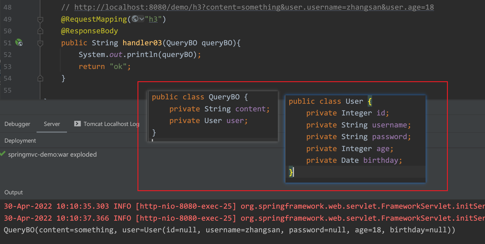

---

order: 10
title:  SpringMVC
shortTitle: SpringMVC

---


## 一 SpringMVC

[SpringMVC文档](https://docs.spring.io/spring-framework/docs/current/reference/html/web.html#spring-web)

SpringMVC是为了解决JavaEE开发的复杂性而设计的，它是一个基于Servlet的view层框架

SpringMVC搭建的仍然是Web应用 → 仍然在web容器（Tomcat）中运行

<br>


### 1. MVC依赖及配置

#### 引入MVC相关依赖

spring-web、<font color='red'>**spring-webmvc**</font> 、servlet-api（scope=provided，编译的时候需要而运行时不需要）

```xml

<dependency>
    <groupId>org.springframework</groupId>
    <artifactId>spring-webmvc</artifactId>
    <version>5.2.15.RELEASE</version>
</dependency>
<dependency>
    <groupId>javax.servlet</groupId>
    <artifactId>javax.servlet-api</artifactId>
    <version>4.0.1</version>
    <scope>provided</scope>
</dependency>

<!-- 如果需要使用Json → 需要导入jackson的依赖（springmvc官方支持） -->
<dependency>
    <groupId>com.fasterxml.jackson.core</groupId>
    <artifactId>jackson-databind</artifactId>
    <version>2.12.4</version>
</dependency>

```

<br>

#### DispatcherServlet

web资源根路径/WEB-INF/web.xml

配置文件的位置 → contextConfigLocation

DispatcherServlet的作用范围 →  /

```xml

<!--DispatcherServlet配置-->
<servlet>
    <servlet-name>dispatcherServlet</servlet-name>
    <servlet-class>org.springframework.web.servlet.DispatcherServlet</servlet-class>
    <!-- initWebApplicationContext的过程中需要加载配置文件，提供配置文件的位置-->
    <init-param>
        <!-- setContextConfigLocation() -->
        <param-name>contextConfigLocation</param-name>
        <param-value>classpath:application.xml</param-value>
    </init-param>
</servlet>
<servlet-mapping>
    <servlet-name>dispatcherServlet</servlet-name>
    <!--映射范围：除了jsp之外，其他的所有请求-->
    <url-pattern>/</url-pattern>
</servlet-mapping>

```

<br>

我们要在Web应用中整合Spring容器 → ApplicationContext


<br>

SpringMVC的简单流程示例：


jsp文件要在tomcat中才能运行起来 → 编译为servlet


<br>


####  application.xml配置


```xml

<!-- bean definitions here -->
<context:component-scan base-package="com.xxx"/>

<!--  SpringMVC 相关配置 -->

<!--注意mvc开头的标签，意味着要引入mvc的schema约束-->
<!--  开启mvc的注解支持  -->
<mvc:annotation-driven />


<!-- 静态资源处理方式一： 将静态资源请求交还给Tomcat的DefaultServlet处理  -->
<!--    <mvc:default-servlet-handler/>-->

<!-- 静态资源处理方式二： mvc自己处理静态资源  -->
<mvc:resources mapping="/static/*" location="/WEB-INF/static/, /static/"/>

<!-- 处理返回视图的配置 -->
<bean class="org.springframework.web.servlet.view.InternalResourceViewResolver">
    <property name="prefix" value="/WEB-INF/jsp/"/>
    <property name="suffix" value=".jsp"/>
</bean>

```

<br>


### 2. 静态资源处理方式★

SpringMVC访问不到静态资源的原因：`web.xml` 中配置的 DispatcherServlet 与 DefaultServlet 一样，

由于SpringMVC只有一个Servlet：DispatcherServlet ，此时所有的请求（除了JSP有单独的Servlet处理）

都将由DispatcherServlet 处理，默认什么都不会做，自然只能返回 404 了

```xml

<servlet>
    <servlet-name>springmvc</servlet-name>
    <servlet-class>org.springframework.web.servlet.DispatcherServlet</servlet-class>
    <init-param>
        <param-name>contextConfigLocation</param-name>
        <param-value>classpath:application.xml</param-value>
    </init-param>
</servlet>
<servlet-mapping>
    <servlet-name>springmvc</servlet-name>
    <url-pattern>/</url-pattern>
</servlet-mapping>

```

<br>

此时想要访问静态资源，需要额外做一些配置：

在web.xml中进行配置，将静态资源交给 DefaultServlet 处理：

```xml

<servlet-mapping>
    <servlet-name>default</servlet-name>
    <url-pattern>*.jpg</url-pattern>
</servlet-mapping>

```

<br>

Spring中的配置（交给SpringMVC处理）：

```xml

<!-- 静态资源处理方式一： 将静态资源请求交还给Tomcat的DefaultServlet处理  -->
<!--    <mvc:default-servlet-handler/>-->

在springMVC-servlet.xml中配置 <mvc:default-servlet-handler /> 后，会在Spring MVC上下文中定义一个org.springframework.web.servlet.resource.DefaultServletHttpRequestHandler，
它会对进入DispatcherServlet的URL进行筛查，如果发现是静态资源的请求，就将该请求转由Web应用服务器默认的Servlet处理，
如果不是静态资源的请求，才由DispatcherServlet继续处理。

一般Web应用服务器默认的Servlet名称是"default"，因此DefaultServletHttpRequestHandler可以找到它。如果你所有的Web应用服务器的默认Servlet名称不是"default"，则需要通过default-servlet-name属性显示指定：

<mvc:default-servlet-handler default-servlet-name="所使用的Web服务器默认使用的Servlet名称" />


```

<br>

```xml

<!-- 静态资源处理方式二： mvc自己处理静态资源  -->
<mvc:resources mapping="/static/**" location="/WEB-INF/static/, /static/"/>

通过location属性指定静态资源的位置（<mvc:resources />允许静态资源放在任何地方，如WEB-INF目录下、类路径下等）
	由于location属性是Resources类型，因此可以使用诸如 "classpath:" 等的资源前缀指定资源位置

例如上述配置：假如web根路径下的static目录下有images、或js等资源资源目录，images目录下还有一个a.jpg文件，
			则可以通过/static/images/a.jpg w


<mvc:resources mapping="/pic/**" location="file:d://tmp/"/> <!--文件路径 → file:文件路径-->
<mvc:resources mapping="/pic2/**" location="/"/>            <!--web资源根路径-->
<mvc:resources mapping="/pic4/**" location="classpath:/"/>  <!--classpath根路径-->

```

小结：

- mapping映射路径中通常会有一个/**，映射的是多级任意路径
- location有不同的位置
  - 文件路径 → 推荐使用
  - web资源路径
  - 类加载路径
- location最后有一个/，不要漏掉了，否则指的就不是当前路径了
- 访问静态资源需要的请求url的写法 → mapping属性值 + 静态资源相对于location位置的文件名


<br>


## 二 Controller和Handler

### 1. Controller组件

通常类名叫XXXController，

@Controller：SpringMVC的控制器需要使用@Controller注解声明（与@Service、@Repository注解意义相同）。

功能是向Spring中配置一个自定义的Bean。

```java

@Controller
public class HelloController {

    //Handler方法的开发 → 该Handler方法和请求URL之间的关系要建立 → URL和Handler方法直接耦合在一起
    //value属性：请求url
    @RequestMapping("hello")
    @ResponseBody
    public String hello() {
        return "hello springmvc";
    }
    
    @RequestMapping("goodbye")
    @ResponseBody
    public String goodbye() {
        return "goodbye";
    }
}

```

<br>

引申注解：<font color='red'>**@RestController**</font>

@ResponseBody注解可以直接写在类上，该Controller组件下所有的Handler方法响应的都是Json

<span style='color:yellow;background:red;font-size:文字大小;font-family:字体;'>**@RestController = @Controller + @ResponseBody**</span>

```java

@Target({ElementType.TYPE})
@Retention(RetentionPolicy.RUNTIME)
@Documented
@Controller
@ResponseBody
public @interface RestController {
    @AliasFor(
        annotation = Controller.class
    )
    String value() default "";
}

```


<br>

### 2. Handler方法


<br>


### 3. RequestMapping

`@RequestMapping`：控制器的访问路径。

注解中如果直接定义访问路径，则表示支持全部的HTTP请求模式（GET、POST、PUT等），

可通过RequestMethod枚举类设置请求类型。


<br>


#### url路径映射★★

★★★value属性 → url路径映射


将多个URL映射到一个Handler方法上


可以使用通配符*


**思考**：是否允许存在相同映射路径的方法？  

可以，但是请求方法要求不同 （比如一个是get，一个是post请求）


<br>

#### 窄化请求★★★

/user/login

/user/register

这些请求url有一个共同的前缀 → user


<font color='red'>**Handler方法映射的URL：**</font><span style='color:yellow;background:red;font-size:文字大小;font-family:字体;'>**类上的@RequestMapping的value属性值 + 方法上的@RequestMapping的value属性值**</span>

类上的@RequestMapping的value属性值和方法上的@RequestMapping的value属性值之间的 `/` 可写可不写

可以在Controller组件中**提供一个统一的url前缀**，也可以**方便设计过滤器（或拦截器）**


<br>

#### 请求方法的限定

method属性 → 请求方法的限定


引申的注解@GetMapping、@PostMapping

就是限定了请求方法为GET或POST的@RequestMapping


<br>

#### 请求参数的限定

params属性 → 请求参数的限定

限定的是：是否有包含对应的请求参数


<br>

#### 请求头的限定

headers属性 → 请求头的限定

限定的是请求头的key

<font color='red'>**String[]**</font>


<font color='red'>**con**</font>sumes属性 → <font color='red'>**Con**</font>tent-Type请求头对应的值的限定

限定的是<span style='color:red;background:yellow;font-size:文字大小;font-family:字体;'>**特定请求头**</span>的<span style='color:yellow;background:red;font-size:文字大小;font-family:字体;'>**value**</span>

<font color='red'>**String[]**</font>


produ<font color='red'>**ce**</font>s属性 → Ac<font color='red'>**ce**</font>pt请求头对应的值的限定

限定的是<span style='color:red;background:yellow;font-size:文字大小;font-family:字体;'>**特定请求头**</span>的<span style='color:yellow;background:red;font-size:文字大小;font-family:字体;'>**value**</span>

<font color='red'>**String[]**</font>


<br>


### 5. 接收请求参数

### HttpServletRequest

在使用Servlet开发时，接收请求参数的方式都是通过 HttpServletRequest，获得字符串后再进行处理。

在SpringMVC中也支持这种较为原始的方式：

```java

@Controller
@RequestMapping("/demo")
public class DemoController {

    @RequestMapping("/h1")
    public ModelAndView handler01(HttpServletRequest request, HttpServletResponse response, HttpSession session){
        String id = request.getParameter("id");

        ModelAndView modelAndView = new ModelAndView();

        Date date = new Date();

        modelAndView.addObject("date", date);
        modelAndView.setViewName("hello");

        return modelAndView;
    }

}

```

<br>


#### 基本数据类型和日期

SPringMVC中，获取参数的方式可以更简洁

基本数据类型及其包装类，只要参数名称一致，可直接 获取并使用，不一致时使用 `@RequestParam` 注解声明即可

日期类型的默认支持格式为：`yyyy/MM/dd` ，也可以通过 `@DateTimeFormat` 注解自定义

SpringMVC还支持直接获取数组参数，但需要注意请求数组参数的构造方式

```java

//http://localhost:8080/user/handler?name=zhangsan&password=abc123
//&age=30&married=false
//&birthday=2022-04-29
//&hobbies=sing&hobbies=dance&hobbies=rap
//&ids=1&ids=2&ids=3
@RequestMapping("register5")
public String handler(@RequestParam("name") String username, 
                        String password, int age, boolean married,
                        @DateTimeFormat(pattern = "yyyy-MM-dd") Date birthday,
                        String[] hobbies,Integer[] ids) {
    System.out.println("username = " + username);
    System.out.println("password = " + password);
    System.out.println("age = " + age);
    System.out.println("married = " + married);
    System.out.println("birthday = " + birthday);
    System.out.println("hobbies = " + Arrays.asList(hobbies));
    System.out.println("ids = " + Arrays.asList(ids));

    return "ok";
}

```

<br>

#### 自定义类型转换器

自定义类型转换器需要实现 Converter 接口 的唯一方法：convert()

```java

//@Component
public class DateConverter implements Converter<String, Date> {

    @Override
    public Date convert(String source) {
        SimpleDateFormat sdf = new SimpleDateFormat("yyyy-MM-dd");
        try {
            Date parse = sdf.parse(source);
            return parse;
        } catch (ParseException e) {
            e.printStackTrace();
        }
        return null;
    }
}

```

配置类型转换器：

```xml

<!--  开启mvc的支持  ⾃动注册最合适的处理器映射器、处理器适配器(调⽤handler⽅法)-->
<mvc:annotation-driven conversion-service="conversionServiceBean" />

<!--  注册⾃定义类型转换器  -->
<bean id="conversionServiceBean" 
      class="org.springframework.format.support.FormattingConversionServiceFactoryBean">
    <property name="converters">
        <set>
            <bean class="cn.itdrizzle.util.DateConverter"/>
            <!-- 如果已将DateConverter类注册到Spring容器中，则可以使用下列方式：  -->
            <!-- <ref bean="dateConverter"/>-->
        </set>
    </property>
</bean>

```


<br>


#### POJO对象接收参数

绑定Pojo对象参数，示例：

```java

/*
* SpringMVC接收pojo包装类型参数:
* 1、绑定时候直接形参声明即可
* 2、传参参数名和pojo属性保持⼀致，如果不能够定位数据项，那么通过属性名 + "." 的⽅式进⼀步锁定数据
* 
*/
    // http://localhost:8080/demo/h3?content=something&user.username=zhangsan&user.age=18
    @RequestMapping("h3")
    @ResponseBody
    public String handler03(QueryBO queryBO){
        System.out.println(queryBO);
        return "ok";
    }

```



<br>


POST请求：使用JSON格式数据发起请求时（Content-Type：application/json）

可以使用 `@RequestBody` 注解，方便直接使用POJO类接收参数

@RequestBody主要用来接收前端传递给后端的json字符串数据

```java

@RequestMapping(value = "h4", method = RequestMethod.POST)
@ResponseBody
public String handler04(@RequestBody QueryBO queryBO) throws JsonProcessingException {
    System.out.println(queryBO);
    return objectMapper.writeValueAsString(queryBO);
}

```

<br>

#### 选择那种方式呢 ☆

- 参数比较少 → 直接接收

- 参数比较多 → 使用引用类型来接收

- 如果某一些请求参数被多个方法反复接收，可以考虑使用引用类型的对象来接收

- 有一些参数是被多个方法所接收，但有些参数只是部分方法中的参数的一部分 → 两种方式结合起来

  ```java
  
  //localhost:8080/product/list?username=cat&page=1&limit=10
  @RequestMapping("list")
  public String list(PageInfo pageInfo,String username) {
  
  }
  
  ```

- 封装到不同的对象中 （或者可以使用一个对象进行接收 → 采用继承方式来封装）

  ```java
  
  //localhost:8080/user/list2?username=songge&password=ligenli&age=10&birthday=2022/04/30
  // &page=1&limit=10
  @RequestMapping("list2")
  public String list2(User2 user, PageInfo pageInfo) {
  
  }
  
  ```

  <br>

  ```java
  
  //localhost:8080/user/list3?username=songge&password=ligenli&age=10&birthday=2022/04/30
  // &page=1&limit=10
  @RequestMapping("list3")
  public String list2(User3 user) {
  
  }
  
  @Data
  public class User3 extends PageInfo{
      String username;
      String password;
      Integer age;
      Date birthday;
      
      // Integer page;
      // Integer limit;
  }
  
  ```


<br>

### 6. 返回View或字符串

#### ModelAndView

Handler方法的返回值

场景：提供一个视图文件 src\main\webapp\hello.jsp

/hello.jsp就作为ModelAndView中的视图文件


String：返回值字符串是作为视图名的

```java
@RequestMapping("hello2")
public String hello2(Model model) {//Model可以直接写在Handler方法的形参中
    model.addAttribute("name", "zhangsan");
    return "/hello.jsp"; //返回值字符串作为ModelAndView中的视图名
}
```


<br>


#### ResponseBody

如果你的Handler方法的返回值为字符串，并且包含`@ResponseBody` 注解，就意味着直接输出该字符串；

如果不包含该注解，就是将该字符串作为视图名

```bash

`@responseBody` 注解的作⽤是：将controller的⽅法返回的对象通过适当的转换器转换为指定的格式之后，写⼊到response对象的body区，通常⽤来返回JSON数据或者是XML数据。 

注意：在使⽤此注解之后不会再⾛视图处理器，⽽是直接将数据写⼊到输⼊流中，他的效果等同于通过response对象输出指定格式的数据

```


<br>


#### 使用Jackson★★

引入maven依赖：

```xml

<dependency>
    <groupId>com.fasterxml.jackson.core</groupId>
    <artifactId>jackson-databind</artifactId>
    <version>2.12.4</version>
</dependency>

```

<br>

将ObjectMapper注册到容器中：

```xml

<bean id="objectMapper" class="org.springframework.http.converter.json.Jackson2ObjectMapperFactoryBean"/>

```

使用示例：

```java

public class UserController {
    // 注入 ObjectMapper
    @Autowired
    ObjectMapper objectMapper;
    
    @RequestMapping(value = "getUser", method = RequestMethod.GET)
    public String getUser(){
        
        List<User> userList = userService.searchUser(username);
    
        // 将对象装换为Json字符串
        String str = objectMapper.writeValueAsString(userList);

        // 将Json字符创转换为Java对象 （List<类>的对象, 需要使用 TypeReference 这个标志）
        List<User> users = objectMapper.readValue(str, new TypeReference<List<User>>() { });

        return result;
    }

}

```

<br>

在实际使用时，只需要引入依赖，响应数据时会自动将对象变为JSON字符串：

```java

@RequestMapping("login")
public R login(String username, String password, HttpSession session) {
    User user = userService.selectUser(username, password);
    return R.ok(user);
}

```


<span style='color:red;font-size:26;'>**注意：使用json工具类时都需要注意的点 → 要转换对象对应的类要包含无参构造方法、getter、setter方法**</span> . 


<br>


### 7. multipartResolver

导入maven依赖 `commons-fileupload` ：

```xml

<dependency>
    <groupId>commons-fileupload</groupId>
    <artifactId>commons-fileupload</artifactId>
    <version>1.4</version>
</dependency>

```

配置文件上传解析器：

```xml

<!--  配置⽂件上传解析器，id是固定的multipartResolver  -->
<bean id="multipartResolver" 
      class="org.springframework.web.multipart.commons.CommonsMultipartResolver">
    <!--设置上传⼤⼩，单位字节-->
    <property name="maxUploadSize" value="10000000"/>
</bean>

```

Handler方法示例：

```java

// 文件上传 （上传文件保存到 /static/upload 目录下）

@RequestMapping(value = "upload", method = RequestMethod.POST)
@ResponseBody
public String upload(MultipartFile uploadFile, HttpServletRequest request) throws IOException {
    // 上传时的文件原名
    String originalFilename = uploadFile.getOriginalFilename();
    // 获取文件扩展名(包含.)
    int index = Objects.requireNonNull(originalFilename).lastIndexOf(".");
    String suffix = originalFilename.substring(index);

    // 使用UUID重命名文件名, 文件按日期存储
    String newName = UUID.randomUUID().toString();
    newName = newName + suffix;
    String realPath = request.getSession().getServletContext().getRealPath("/static/upload");
    String datePath = new SimpleDateFormat("yyyy-MM-dd").format(new Date());
    File folder = new File(realPath + "/" + datePath);
    if (!folder.exists()) {
        folder.mkdirs();
    }

    uploadFile.transferTo(new File(folder, newName));

    return "/static/upload/" + datePath + "/" + newName;
}

```

前端代码示例：

```jsp

<form action="/demo/upload" method="post" enctype="multipart/form-data">
    <!--需要注意的是：input标签的name属性要与 Handler方法的参数名称相对应 -->
    <input type="file" name="uploadFile"/>
    <input type="submit" value="上传图片">
</form>

```

<br>


上传多个文件时，只需要 MultipartFile类型的参数变为数组即可：

```java

@RequestMapping("files")
public String uploadFiles(MultipartFile[] myfiles) throws IOException {
    for (MultipartFile myfile : myfiles) {

        String name = myfile.getName();  // 请求参数名 → myfile（input标签的name属性）
        long size = myfile.getSize();    // 文件大小
        String contentType = myfile.getContentType(); //正文类型（如果上传图片文件 → image/jpeg）
        
        String originalFilename = myfile.getOriginalFilename(); //上传时的文件名

        myfile.transferTo(new File("D:\\tmp",originalFilename));
    }
    return "ok";
}

```


<br>


### 8. RESTful风格

REST → 表述性状态传递 Representational  State Transfer

```bash

现在要围绕这user去做一些业务：新增、删除、修改、查询

通常我们需要根据请求的不同映射到不同的方法上处理不同的业务
> /user/add
> /user/remove
> /user/modify
> /user/query

> RESTful风格的写法 → 设定不同的请求方法
> /user 新增 → POST
> /user 删除 → DELETE
> /user 修改 → PUT
> /user 查询 → GET

```

这种方式实际上并不常用，通常请求方法只需要使用GET或POST，通过请求url的不同来区分不同的方法

我们当前写的请求URL → 名词+动词  → <font color='red'>**资源 + 操作**</font> . 

<font color='red'>**这里主要是为了使用Json数据做交互：@RequestBody、@ResponseBody（@RestController）**</font>etc. 

<br>


#### PathVariable★★

获得请求URL的一部分作为其参数 → 利用请求URL来传参了

csdn (将用户名和文章id都写在了请求URL中)

> blog.csdn.net/OneFlow_Official/<font color='red'>**article/details**</font>/124464420
>
> blog.csdn.net/programmer_editor/<font color='red'>**article/details**</font>/124487701
>
> blog.csdn.net/csdnsevenn/<font color='red'>**article/details**</font>/124480185

```java

//{}里面的值写的是占位符的名称
//@PathVariable注解的value属性中指定占位符的名称
@RequestMapping("{username}/article/details/{id}")
public String articleDetail(@PathVariable("username")String name,
                            @PathVariable("id")Integer id) {
    System.out.println("name = " + name);
    System.out.println("id = " + id);
    return "ok";
}

```

<br>


#### RequestHeader

通过该注解的value属性指定请求头，获得该请求头对应的值

```java

//可以直接使用字符串来接收，也可以使用字符串数组来接收
//当我们使用字符串数组来接收的时候，实际上是将字符串分割为字符串数组 → 根据逗号分隔
@RequestMapping("header")
public String header(@RequestHeader("Accept") String[] accept,
                     @RequestHeader("Host") String host) {
    System.out.println("accept = " + Arrays.asList(accept));
    System.out.println("host = " + host);
    return "ok";
}

```

<br>


#### RequestParam

获得请求参数对应的值 → 没啥用( 除了能够限定你要携带某个请求参数之外) 就是多此一举

localhost:8080/user/login?username=songge&password=ligenli

```java

//http://localhost:8080/login?username=zhangsan&password=abc
@RequestMapping("login")
public String login(@RequestParam("username") String name,
                    @RequestParam("password")String pwd) {
    return "ok";
}

```


<br>


### 9. Cookie和Session

除了正常的cookie设置外，还可以直接通过浏览器或者postman之类的工具构建cookie

获得cookie（通过 HttpServletRequest获取，或者使用 `@CookieValue` 注解）：

```java

// 通过 HttpServletRequest获取
@RequestMapping("cookie")
public String cookie(HttpServletRequest request) {
    Cookie[] cookies = request.getCookies();
    for (Cookie cookie : cookies) {
        System.out.println("cookie.getName() = " + cookie.getName());
        System.out.println("cookie.getValue() = " + cookie.getValue());
        System.out.println("*****");
    }
    return "ok";
}

```

<br>

通过`@CookieValue` 的value属性传入cookie的name获得cookie的value

```java

// 使用 `@CookieValue` 注解
@RequestMapping("cookie")
public String selectUserByCookieUsername(@CookieValue("username") String username){
    User user = userService.selectByUsername(username);
    String result = objectMapper.writeValueAsString(R.ok(user));
    return result;
}

```

<br>


**Session** 可以直接通过形参获得：HttpSession (当然也可以通过HttpServletRequest来获得)

```java

@RequestMapping("session")
public String session2(HttpSession session) {
    Object username = session.getAttribute("username");
    System.out.println("username = " + username);
    return "ok";
}

```

<br>

**@SessionAttribute**  （有时使用注解更简单）

通过其value属性传入session的attributeName获得对应的value

```java

//@SessionAttribute和@CookieValue都是根据key来获得value
//但是CookieValue对应的参数的类型是String、SessionAttribute对应的参数的类型是Object
// → 放入session时值的类型是什么，就可以以什么类型取出
@RequestMapping("session/get")
public String sessionGet(@SessionAttribute("useridxxxx")User user) {
    System.out.println("user = " + user);
    return "ok";
}
```


<br>


## 三 Filter和Interceptor

### 1. OncePerRequestFilter


实现自定义的Filter：即继承OncePerRequestFilter类，重写doFilterInternal() 方法即可

```java

public class CustomFilter extends OncePerRequestFilter {
    @Override
    protected void doFilterInternal(HttpServletRequest request, HttpServletResponse response, 
                                    FilterChain filterChain) 
        throws ServletException, IOException {
        
        System.out.println("hello filter");
        filterChain.doFilter(request,response);
    }
}

```

在 `web.xml` 中配置Filter：

```xml

<filter>
    <filter-name>customFilter</filter-name>
    <filter-class>com.xxx.filter.CustomFilter</filter-class>
</filter>
<filter-mapping>
    <filter-name>customFilter</filter-name>
    <url-pattern>/*</url-pattern>
</filter-mapping>

```


<br>


### 2. CharacterEncodingFilter

CharacterEncodingFilter是OncePerRequestFilter的子类 → SpringMVC提供的编码Filter 

```java

public class CharacterEncodingFilter extends OncePerRequestFilter {
	@Nullable
	private String encoding;
	private boolean forceRequestEncoding = false;
	private boolean forceResponseEncoding = false;
    
    // ...... setter and getter
    
    public void setForceEncoding(boolean forceEncoding) {
		this.forceRequestEncoding = forceEncoding;
		this.forceResponseEncoding = forceEncoding;
	}

	@Override
	protected void doFilterInternal(
			HttpServletRequest request, HttpServletResponse response, FilterChain filterChain)
			throws ServletException, IOException {

		String encoding = getEncoding();
		if (encoding != null) {
			if (isForceRequestEncoding() || request.getCharacterEncoding() == null) {
				request.setCharacterEncoding(encoding);
			}
			if (isForceResponseEncoding()) {
				response.setCharacterEncoding(encoding);
			}
		}
		filterChain.doFilter(request, response);
	}

}

```

doFilterInternal() 方法会先判断是否强制request设置字符集或没有设置字符集，如果强制或没有设置字符集，则设置request字符集，判断是否强制response设置字符集，如果强制，则设置response字符集。这个过程中我们使用到了CharacterEncodingFilter的3个成员变量 → <font color='red'>**forceRequestEncoding、forceResponseEncoding、encoding**</font>

CharacterEncodingFilter可以直接按照上面的方式配置，但是需要提供3个成员变量的值

<br>

```xml

<filter>
    <filter-name>customFilter</filter-name>
    <filter-class>org.springframework.web.filter.CharacterEncodingFilter</filter-class>
    <init-param>
        <param-name>encoding</param-name>
        <param-value>utf-8</param-value>
    </init-param>
    <!--<init-param>
        <param-name>forceRequestEncoding</param-name>
        <param-value>true</param-value>
    </init-param>
    <init-param>
        <param-name>forceResponseEncoding</param-name>
        <param-value>true</param-value>
    </init-param>-->
    <init-param>
        <param-name>forceEncoding</param-name>
        <param-value>true</param-value>
    </init-param>
</filter>
<filter-mapping>
    <filter-name>customFilter</filter-name>
    <url-pattern>/*</url-pattern>
</filter-mapping>

```

<br>


### 3. HandlerInterceptor★★

HandlerInterceptor是一个接口，这个接口中主要提供了 preHandle、postHandle 和 afterCompletion 三个方法：

```java

public interface HandlerInterceptor {
    // 在handler方法执行之前
    // 返回值类型 → boolean ( 如果为true则继续执行流程、如果为false则流程中断 ）
    default boolean preHandle(HttpServletRequest request, HttpServletResponse response, Object handler) throws Exception {
        return true;
    }
	// 在handler方法执行之后
    default void postHandle(HttpServletRequest request, HttpServletResponse response, Object handler, @Nullable ModelAndView modelAndView) throws Exception {
    }
	// 在处理结果完成之后
    // 形参中包含Exception，也可以获得处理过程中的异常
    default void afterCompletion(HttpServletRequest request, HttpServletResponse response, Object handler, @Nullable Exception ex) throws Exception {
    }
}

```

<br>


#### doDispatch()


#### HandlerExecutionChain


#### applyPreHandle()


#### applyPostHandle()


<br>


### 4. 自定义过滤器★★

如果要使用自定义的HandlerInterceptor要考虑哪些问题？

- 实现类
- 映射范围
- 多个HandlerInterceptor的顺序是什么样子的？

<br>

自定义实现类：

```java

@Component
public class CustomInterceptor2 implements HandlerInterceptor {
    @Override
    public boolean preHandle(HttpServletRequest request, HttpServletResponse response, Object handler) throws Exception {
        System.out.println("preHandle2");
        return true;
    }

    @Override
    public void postHandle(HttpServletRequest request, HttpServletResponse response, Object handler, ModelAndView modelAndView) throws Exception {
        System.out.println("postHandle2");
    }

    @Override
    public void afterCompletion(HttpServletRequest request, HttpServletResponse response, Object handler, Exception ex) throws Exception {
        System.out.println("afterCompletion2");
    }
}

```

<br>

配置映射范围和顺序：

```xml

<!--  拦截器顺序为书写顺序，作用范围：默认为DispatcherServlet的全局范围  -->
<mvc:interceptors>
    
    <bean id="interceptor1" class="cn.itdrizzle.filter.CustomInterceptor1"/>
    
    <!-- customInterceptor2已经通过添加了 @Component 注解 注册到了容器中 -->
    <ref bean="customInterceptor2"/>

    <!-- 限定作用范围  -->
    <mvc:interceptor>
        <mvc:mapping path="/demo/**"/>
        <bean class="cn.itdrizzle.filter.CustomInterceptor3"/>
    </mvc:interceptor>
    
</mvc:interceptors>

```


<br>


### 5. Handler方法的异常处理

通常针对于Handler方法<font color='red'>**抛出的**</font>异常做处理


#### HandlerExceptionResolver

全局异常处理器 → 任意异常 → 处理结果是ModelAndView

- 作用范围不够灵活
- 返回值ModelAndView过时了

HandlerExceptionResolver是一个接口，接口中提供了一个方法resolveException 

形参中包含一个参数Exception → Handler抛出的异常对象

```java

@Component
public class CustomHandlerExceptionResolver implements HandlerExceptionResolver {

    @Override
    public ModelAndView resolveException(HttpServletRequest request, HttpServletResponse response, Object handler, Exception ex) {
        ModelAndView view = new ModelAndView();
        view.setViewName("/exception.jsp");
        view.addObject("msg", ex.toString());
        return view;
    }
}

```

如果想要对异常类型做区分，也可以做，只是需要手写代码

自定义的HandlerExceptionResolver，然后注册到容器中就会生效

<br>

```jsp

<%@ page contentType="text/html;charset=UTF-8" language="java" %>
<html>
    <head>
        <title>Exception</title>
    </head>
    <body>

        <h1>Exception</h1>
        <div>${requestScope.msg}</div>

    </body>
</html>

```


<br>


#### ExceptionHandler★★

映射的建立过程 （在方法上直接增加注解）

返回值：ModelAndView（或String）、Json

```java

//@RestControllerAdvice  // 等于 @ResponseBody + @ControllerAdvice
//@ResponseBody
@ControllerAdvice
public class CustomControllerAdvice {

    @ExceptionHandler(PasswordException.class)
    public ModelAndView handlePasswordException(PasswordException exception) {
        ModelAndView modelAndView = new ModelAndView("/exception.jsp");
        modelAndView.addObject("exception", exception);
        return modelAndView;
    }

    @ExceptionHandler(OutLengthOfUsernameException.class)
    public ModelAndView handleOutLengthOfUsernameException(OutLengthOfUsernameException exception) {
        ModelAndView modelAndView = new ModelAndView("/exception.jsp");
        modelAndView.addObject("exception", exception);
        return modelAndView;
    }
    
    
    // 返回JSON数据
    @ResponseBody
    @ExceptionHandler(ArithmeticException.class)
    public R handleArithmeticException(ArithmeticException exception) {
        R result = new R();
        result.setNo(500);
        result.setMessage(exception.getMessage());
        result.setDate(exception);
        return result;
    }

}

```


<br>


## 四 JavaConfig纯注解开发

使用Java代码和注解做对应的配置 来替代配置文件


### 1. AACDSI抽象类

继承了`AbstractAnnotationConfigDispatcherServletInitializer` 的任意类都会自动的配置 `DispatcherServlet` 和Spring applicationContext，applicationContext会位于应用程序的Servlet上下文之中。

即通过AbstractAnnotationConfigDispatcherServletInitializer 来配置DispatcherServlet是传统web.xml的替代方案


```java

/**
 * 对应 web.xml
 */
public class ApplicationInitializer extends AbstractAnnotationConfigDispatcherServletInitializer {
    // 增加@Configuration注解的配置类 → 会在getServletConfigClasses之前执行（加载）
    @Override
    protected Class<?>[] getRootConfigClasses() {
        return new Class[]{SpringConfiguration.class};
    }

    // 加载SpringMVC相关配置的配置类
    @Override
    protected Class<?>[] getServletConfigClasses() {
        return new Class[]{MvcConfiguration.class};
    }

    //配置DispatcherServlet的映射范围的
    @Override
    protected String[] getServletMappings() {
        return new String[]{"/"};
    }
    
    // 配置过滤器 Fileter(implements OncePerRequestFilter) （ web.xml → AACDSI ）
    @Override
    protected Filter[] getServletFilters() {
        CharacterEncodingFilter characterEncodingFilter = new CharacterEncodingFilter();
        characterEncodingFilter.setEncoding("utf-8");
        characterEncodingFilter.setForceEncoding(true);
        return new Filter[]{characterEncodingFilter};
    }
    
}

```


<br>


### 2. 配置类和组件注册

#### SpringMVC相关的配置

```java

/**
 * 实现WebMvcConfigurer，需要实现里面的方法做对应配置 → mvc开头的标签的配置
 */
@ComponentScan("cn.itdrizzle.controller")
@EnableWebMvc
public class MvcConfiguration implements WebMvcConfigurer {

    @Bean
    public CommonsMultipartResolver multipartResolver() {
        // 文件上传组件
        return new CommonsMultipartResolver();
    }

    // 自定义converter（类型转换器配置）
    @Override
    public void addFormatters(FormatterRegistry registry) {
        registry.addConverter(new String2DateConverter());
    }

    // 静态资源映射的配置
    @Override
    public void addResourceHandlers(ResourceHandlerRegistry registry) {
        //                   mapping属性                      location属性
        registry.addResourceHandler("/pic/**").addResourceLocations("file:d:/tmp/");
    }

    // HandlerInterceptor过滤器配置
    @Override
    public void addInterceptors(InterceptorRegistry registry) {
        
        //默认作用范围是全局，书写顺序就是顺序
        registry.addInterceptor(new CustomInterceptor1());
        registry.addInterceptor(new CustomInterceptor2());
        
        //addPathPatterns指定作用范围
        registry.addInterceptor(new CustomInterceptor3()).addPathPatterns("/user/**");
    }
}

```

<br>


#### SpringMVC之外的配置

```java

/**
 * mvc的配置已扫描controller包，这里扫描到 带有@Controller注解的类时需要排除掉
 */
@Configuration
@ComponentScan(value = "cn.itdrizzle",
//excludeFilters = @ComponentScan.Filter(type = FilterType.ANNOTATION,classes = Controller.class))
//excludeFilters = @ComponentScan.Filter(type = FilterType.ANNOTATION,value = Controller.class))
//excludeFilters = @ComponentScan.Filter(value = Controller.class))
        excludeFilters = @ComponentScan.Filter(Controller.class))
@EnableAspectJAutoProxy
@EnableTransactionManagement
public class SpringConfiguration {

    @Bean
    public DruidDataSource dataSource() {
        DruidDataSource dataSource = new DruidDataSource();
        dataSource.setDriverClassName("com.mysql.jdbc.Driver");
        dataSource.setUrl("jdbc:mysql://localhost:3306/spring?characterEncoding=utf-8");
        dataSource.setUsername("root");
        dataSource.setPassword("123456");
        return dataSource;
    }

    @Bean
    public SqlSessionFactoryBean sqlSessionFactory(@Qualifier("dataSource") DataSource dataSource) {
        SqlSessionFactoryBean sqlSessionFactoryBean = new SqlSessionFactoryBean();
        sqlSessionFactoryBean.setDataSource(dataSource);
        return sqlSessionFactoryBean;
    }

    //映射器，映射mapper包下的所有mapper接口以及同名路径下的mapper.xml
    @Bean
    public MapperScannerConfigurer mapperScannerConfigurer(){
        MapperScannerConfigurer mapperScannerConfigurer = new MapperScannerConfigurer();
        mapperScannerConfigurer.setBasePackage("cn.itdrizzle.mapper");
        return mapperScannerConfigurer;
    }

}

```

