---

order: 40
title: JavaIO

---


## 一 File类

File类是文件和目录路径名的抽象表示，文件和目录都可以通过File封装成对象，对于File而言，其封装的并不是一个真正存在的文件，仅仅是一个路径名而已。它可以是存在的，也可以是不存在的。将来可以通过具体的操作把这个路径的内容转换为具体存在

- File 类是 java.io 包中唯一代表磁盘文件本身的对象
- File 类不能访问文件内容本身，如果需要访问文件内容本身，则需要使用输入/输出流

| 构造方法                          | 说明                                                       |
| --------------------------------- | ---------------------------------------------------------- |
| File(String pathname)             | 通过将给定的路径名字符串转换为抽象路径名来创建新的File实例 |
| File(String parent, String child) | 从父路径名字符串和子路径名字符串创建新的File实例           |
| File(File parent, String child)   | 从父抽象路径名和子路径名字符串创建新的File实例             |

```java
File dataDir = new File(".\\data");
File file1 = new File(dataDir, "a.txt");
File file2 = new File(".\\data\\b.txt");
```


### 1. 常用方法

**创建、删除文件/目录**：

| 方法名称                       | 说明                                                         |
| ------------------------------ | ------------------------------------------------------------ |
| public boolean createNewFile() | 当文件不存在时，创建一个空文件                               |
| boolean mkdir()                | 创建一个目录，它的路径名由当前 File 对象指定                 |
| boolean mkdirs()               | 创建一个目录，它的路径名由当前 File 对象指定                 |
| boolean delete()               | 删除当前对象指定的文件或空目录                               |
| boolean renameTo(File)         | 将当前 File 对象指定的文件更名为给定参数 File 指定的路径名（剪贴） |

- 如果被重命名的文件已存在，那么renameTo()不会成功
- renameTo()成功后，原文件会被删除

```java
if (!dataDir.exists()) dataDir.mkdir();
if(!file1.exists()) file1.createNewFile();
```


**File类相关判断方法**：

| 方法名称              | 说明                                             |
| --------------------- | ------------------------------------------------ |
| boolean exists()      | 测试当前 File 是否存在                           |
| boolean isAbsolute()  | 测试当前 File 对象表示的文件是否为一个绝对路径名 |
| boolean isDirectory() | 测试当前 File 对象表示的文件是否为一个路径       |
| boolean isFile()      | 测试当前 File 对象表示的文件是否为一个“普通”文件 |
| boolean canRead()     | 测试应用程序是否能从指定的文件中进行读取         |
| boolean canWrite()    | 测试应用程序是否能写当前文件                     |


**File类相关的获取功能**：

| 方法名称                      | 说明                                                         |
| ----------------------------- | ------------------------------------------------------------ |
| String getAbsolutePath()      | 返回由该对象表示的文件的绝对路径名                           |
| String getPath()              | 返回构造file时候的路径                                       |
| String getName()              | 返回表示当前对象的文件名或路径名（如果是路径，则返回最后一级子路径名） |
| String getParent()            | 返回当前 File 对象所对应目录（最后一级子目录）的父目录名     |
| long lastModified()           | 返回当前 File 对象表示的文件最后修改的时间                   |
| long length()                 | 返回当前 File 对象表示的文件长度                             |
| String[] list()               | 返回当前 File 对象指定的路径文件列表                         |
| String[] list(FilenameFilter) | 返回当前 File 对象指定的目录中满足指定过滤器的文件列表       |

【注】因为 `getPath()` 得到的是构造file的时候的路径，如果构造的时候就是全路径那直接返回全路径

  		 如果构造的时候为相对路径，返回的就是构造file时候的路径

```java
public class FileDemo {
    public static void main(String[] args) {
        File file = new File("..\\temp\\a.txt");
        System.out.println(file.getPath());
        System.out.println(file.getAbsolutePath());

        File file1 = new File("E:\\WorkPlace\\Java\\Demo\\temp");
        System.out.println("\n" + file1.getPath());
        System.out.println(file1.getAbsolutePath() + "\n");
    }
}
```

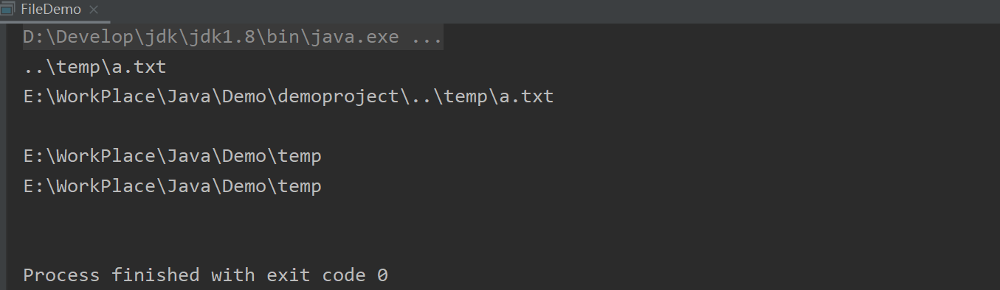


### 2. FileFilter

**文件过滤器** `FileFilter` 的三种应用方式： 

- 手写实现类
- 匿名内部类
- lambda表达式

```java
// 通过匿名内部类和Lambda表达式过滤文件
public class ListFileDemo {
    public static void main(String[] args) {
        File file = new File("app2");

        // 匿名内部类
        File[] f1 = file.listFiles(new FileFilter() {
            @Override
            public boolean accept(File pathname) {
                // 仅留下文件夹名包括a的文件夹
                return pathname.isDirectory() && pathname.getName().contains("a");
            }
        });

        // Lambda表达式, 仅留下.txt结尾的文本文件
        File[] f2 = file.listFiles(f -> f.isFile() && f.getName().endsWith(".txt"));
    }
}
```


【注】**File 类中有以下两个常用常量**：（File 类出现较早，当时并没有对命名规范有严格的要求）

- `pathSeparator`：分隔连续多个路径字符串的分隔符
- `separator`：目录分隔符

```java
public static final String pathSeparator //Windows下指`;`
public static final String separator     //Windows下指`/`
```


## 二 Java IO流

## 1. 流的分类

Java中所有数据都是使用流读写的。流是一组有序的数据序列，将数据从一个地方带到另一个地方。

数据流是 Java 进行 I/O 操作的对象，它按照不同的标准可以分为不同的类别。

- 按照流的方向主要分为：输入（Input）流和输出（Output）流两种

  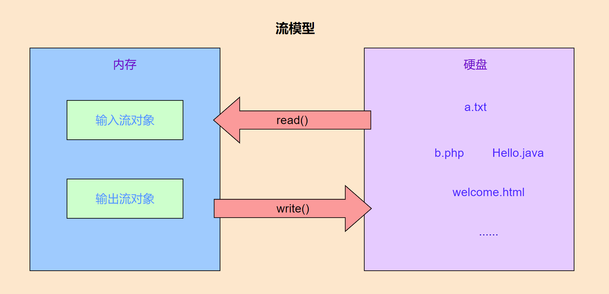

- 数据流按照数据单位的不同分为：字节流、字符流

  - 字节流: 逻辑单位是字节,一个字节一个字节的传输 0000 0000   1B

  - 字符流: 逻辑单位是字符(理解为一种文化符号, 你好, ABC, の)，一个字符一个字符的传输

  - 一般情况下，如果是文本文件,一般采用字符流方便一些，对于非文本文件,一般采用字节流(字节流是万能的)

    

- 按照功能可以划分为：节点流、处理流


**常用的IO流实现类**：

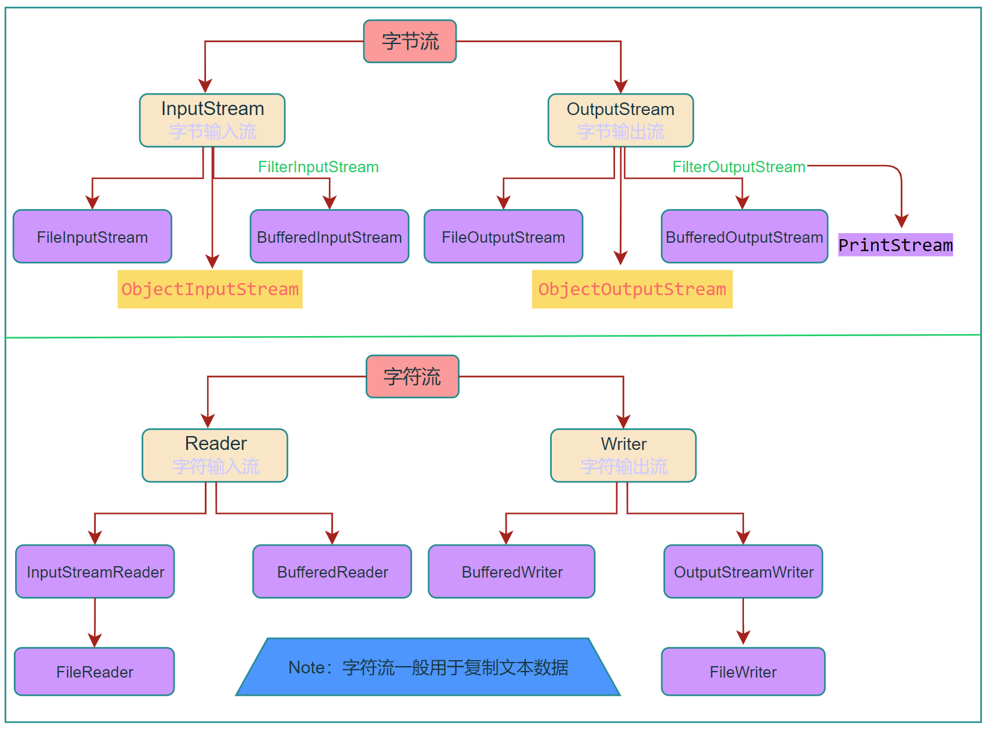


### 2. 字节流

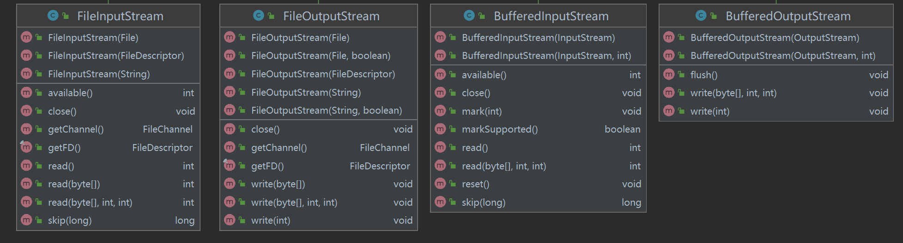

### OutputStream

**字节输出流**：（OutputStream 类的常用方法）

- `void write(int b)`：写入一个字节（参数是 int 类型），为了提高 I/O 操作的效率，建议尽量使用 write() 方法的另外两种形式
- `void write(byte[] b)`：把字节数组中的所有字节写到输出流中
- `void write(byte[] b,int off,int len)`：off 指定字节 数组中的起始下标，len 表示元素个数
- `void close()`：关闭输出流
- `void flush()`：使用 flush() 方法则可以强制将缓冲区中的数据写入输出流， 并清空缓冲区


在创建 FileOutputStream 类的对象时，如果指定的文件不存在，则创建一个新文件；**如果文件已存在，则清除原文件的内容重新写入**

```java
public class OutputStreamDemo {
    public static void main(String[] args) throws IOException {
        FileOutputStream fos = new FileOutputStream(".\\data\\output.txt",true); //append为true表示追加写入
        // 1. 写入指定字节
        fos.write(97);  //a
        fos.write(98);
        fos.write(99);

        // 2. 写入字节数组
        byte[] b = {',',97,98,99,100};
        byte[] b2 = ",abcde".getBytes();
        fos.write(b);
        fos.write(b2);
        // 指定写入的字节数组内容
        fos.write(b2,0,b2.length);

        // 3. 写数据时如何实现换行？ （ ）
        fos.write("\n\r".getBytes());
        for (int i = 0; i < 5; i++) {
            fos.write("Hello\n\r".getBytes());
        }
        fos.close();
    }
}
```

【注】两种输出换行符的方式：

- `System.lineSeparator() ` 根据不同的操作系统使用对应的换行符

- 各个操作系统的换行符不同 win: `\r\n` ，  mac: `\r` ,   linux: `\n` ，直接使用 `\r\n` 即可三个平台都生效

  | 缩写  | ASCⅡ转义 | 系统                   | ASCⅡ值 |
  | ----- | -------- | ---------------------- | ------ |
  | CR    | \r       | MacIntosh（早期的Mac） | 13     |
  | LF    | \n       | Unix/Linux/Mac OS X    | 10     |
  | CR LF | \r\n     | Windows                |        |

  - CR：Carriage Return，对应ASCII中转义字符\r，表示回车
  - LF：Linefeed，对应ASCII中转义字符\n，表示换行
  - CRLF：Carriage Return & Linefeed，\r\n，表示回车并换行


### InputStream

**字节输入流**：（InputStream 类的常用方法）

- `int read()`：从输入流中读取一个 8 位的字节，并把它转换为 0~255 的整数，最后返回整数

  如果返回 -1，则表示已经到了输入流的末尾。为了提高 I/O 操作的效率，建议尽量使用 read() 方法的另外两种形式

- `int read(byte[] b)`：从输入流中读取若干字节，并把它们保存到字节数组中。返回结果读到数组中的字节数

- `int read(byte[] b, int off, int len)`：off 指定在字节数组中开始保存数据的起始下标；len 指定读取的字节数

- `void close()`：关闭输入流

- `int available()`：返回可以从输入流中读取的字节数 


- `long skip(long n)`：从输入流中跳过参数 n 指定数目的字节。该方法返回跳过的字节数
- `void mark(int readLimit)`：在输入流的当前位置开始设置标记
- `boolean markSupported()`：判断当前输入流是否允许设置标记，是则返回 true，否则返回 false
- `void reset()`：将输入流的指针返回到设置标记的起始处


```java
public class FileInputStreamDemo {
    public static void main(String[] args) {
        try (FileInputStream fis = new FileInputStream("abc.txt")) {
            // read() 方法一次读一个字节（8位）
            int r1 = fis.read();
            int r2 = fis.read();
            System.out.println(r1 + ", " + r2);

            // int read(byte[] b) 从输入流中读取若干字节，并把它们保存到字节数组中
            byte[] bytes = new byte[10];
            int count = fis.read(bytes);
            System.out.println("读取的字符个数：" + count);
            System.out.println("读到的字符：" + new String(bytes, 0, count));
        } catch (IOException e) {
            e.printStackTrace();
        }
    }
}
```

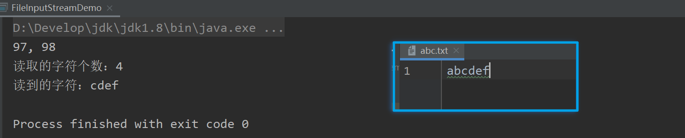


#### 复制图片示例

【应用】：利用字节流复制图片

```java
// 复制图片
public class CopyPicture {
    public static void main(String[] args) {
        try {
            FileInputStream fis = new FileInputStream(".\\data\\io\\abc.png");
            FileOutputStream fos = new FileOutputStream(".\\data\\io\\abc_copy.png");
            byte[] bys = new byte[1024];
            int len;
            while ((len = fis.read(bys)) != -1){
                fos.write(bys,0,len);
            }
            fis.close();
            fos.close();
        } catch (IOException e) {
            e.printStackTrace();
        }
    }
}
```


### 字节缓冲流

普通字节流（一个字节一个字节的读）读取数据量大的文件时，读取的速度会很慢，很影响我们程序的效率，

Java中提高了一套缓冲流，它的存在，可提高IO流的读写速度

```java
BufferedOutputStream(QutputStream out)  // 字节缓冲输出流
BufferedInputStream(lnputStream in)     // 字节缓冲输入流
```

为什么构造方法需要的是字节流，而不是具体的文件或者路径呢?

- 因为字节缓冲流**仅仅提供缓冲区**（默认为 8kb ），而真正的读写数据还得依靠基本的字节流对象进行操作
- 这种需要传递底层类对象的， 又称为包装类

```java
public class BufferStreamDemo {
    public static void main(String[] args) throws Exception{
        // 字节缓冲输出流：
        FileOutputStream fos = new FileOutputStream(".\\data\\buffer\\buffer.txt");
        BufferedOutputStream bos = new BufferedOutputStream(fos);
        bos.write("Hello\r\n".getBytes());
        bos.write("World\r\n".getBytes());
        bos.close();  // close() 内会调用 flush() 方法

        // 字节缓冲输入流：
        FileInputStream fis = new FileInputStream(".\\data\\buffer\\buffer.txt");
        BufferedInputStream bis = new BufferedInputStream(fis);
        bis.mark(1);  // 设置标记
        // 一次读取一个字节：
        int b;
        while ((b = bis.read())!= -1){
            System.out.print((char) b);
        }
        bis.reset();  // 将输入流的指针返回到设置标记的起始处
        // 一次读取一个字节数组：
        byte[] bys = new byte[1024];
        int len;
        while ((len = bis.read(bys)) != -1){
            System.out.println(new String(bys,0,len));
        }
        bis.close();
    }
}
```


## 3. 字符流

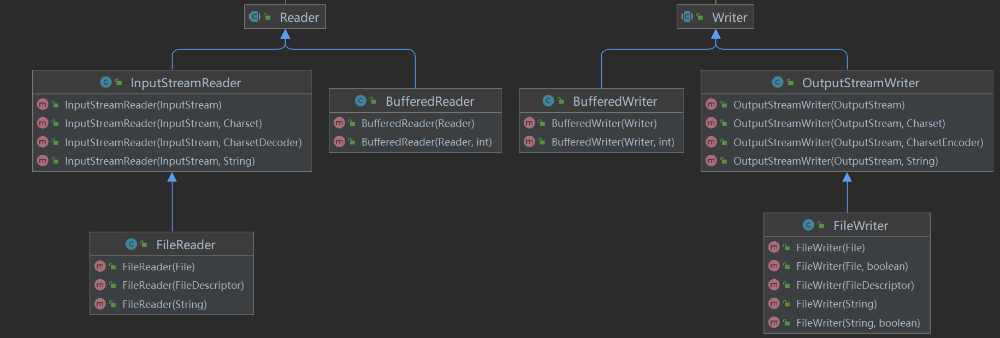


### 编码和解码

| 常见编码表 | 每个字符多少字节            | 其他说明                                               |
| ---------- | --------------------------- | ------------------------------------------------------ |
| ASCII      | 用**一个字节**的7位         |                                                        |
| ISO8859-1  | 用**一个字节**的8位         | 拉丁码表                                               |
| GB2312     | 中文2个字节，英文1个字节    | 中国的中文编码表                                       |
| GBK        | gbk中文2个字节，英文1个字节 | 中国的中文编码表升级，融合了更多的中文文字符号         |
| GB18030    | 中文2个字节，英文1个字节    | GBK的取代版本                                          |
| BIG-5码    |                             | 通行于台湾、香港地区的一个繁体字编码方案，俗称“大五码” |
| Unicode    | 两个字节                    | 国际标准码，融合了多种文字                             |
| UTF-8      | 中文3个字节，英文1个字节    | 可变长度来表示一个字符, 使用1-4个字节表示一个符号      |

**Java 中常见编码说明如下**：

- `ISO8859-1`：属于单字节编码，最多只能表示 0~255 的字符范围。向下兼容ASCII
- `GBK/GB2312`：中文的国标编码，用来表示汉字，属于双字节编码。GBK 可以表示简体中文和繁体中文，而 GB2312 只能表示简体中文。**GBK 兼容 GB2312**。
- `Unicode`：是一种编码规范，是为解决全球字符通用编码而设计的。UTF-8 和 UTF-16 是这种规范的一种实现，此编码不兼容 ISO8859-1 编码。Java 内部采用此编码。
- `UTF`：UTF 编码兼容了 ISO8859-1 编码，同时也可以用来表示所有的语言字符，不过 UTF 编码是不定长编码，每一个字符的长度为 1~6 个字节不等。一般在中文网页中使用此编码，可以节省空间。

```java
 // 获取当前系统编码
 System.out.println(System.getProperty("file.encoding"));
```


### Reader和Writer

**InputStreamReader和OutputStreamWriter**：

```java
// 构造函数
public InputStreamReader(InputStream in)       // 字符输入流
public OutputStreamWriter(OutputStream out)    // 字符输出流
```


**Reader类中的read()方法**：

| 方法名及返回值类型                      | 说明                                                         |
| --------------------------------------- | ------------------------------------------------------------ |
| int read()                              | 从输入流中读取一个字符，并把它转换为 0~65535 的整数          |
| int read(char[] cbuf)                   | 从输入流中读取若干个字符，并把它们保存到指定的字符数组中     |
| int read(char[] cbuf, int off, int len) | off 指定在字符数组中开始保存数据的起始下标，len 指定读取的字符数 |


**Writer类中的write()方法和append()方法**：

| 方法名及返回值类型                           | 说明                                                       |
| -------------------------------------------- | ---------------------------------------------------------- |
| void write(int c)                            | 向输出流中写入一个字符                                     |
| void write(char[] cbuf)                      | 把字符数组中的所有字符写到输出流中                         |
| void write(char[] cbuf,int off,int len)      | off 指定 字符数组中的起始下标，len 表示元素个数            |
| void write(String str)                       | 向输出流中写入一个字符串                                   |
| void write(String str,  int off, int len)    | off 指定字符串中的起 始偏移量，len 表示字符个数            |
| append(char c)                               | 将参数 c 指定的字符添加到输出流中                          |
| append(charSequence esq)                     | 将参数 esq 指定的字符序列添加到输出流中                    |
| append(charSequence esq, int start, int end) | start 指第一个字符的索引，end 指最后一个字符后面的字符索引 |

```java
public class CharStreamDemo {
    public static void main(String[] args) throws Exception {
        FileInputStream fis = new FileInputStream(".\\data\\charstream\\a.txt");
        FileOutputStream fos = new FileOutputStream(".\\data\\charstream\\a.txt");
        InputStreamReader isr = new InputStreamReader(fis);
        OutputStreamWriter osw = new OutputStreamWriter(fos);

        // 多种写入方式
        osw.write(97);                        //写入一个字符 a  相当于：osw.write('a');
        osw.append('b');
        osw.write("abc");                    // 写入字符串
        osw.write("uvwxyz", 0, 3);   // off 指定字符串中的起始偏移量，len表示字符个数
        osw.flush();
        //写入字符数组：
        char[] chs = {'x', 'y', 'z'};
        osw.write(chs);                        // 把字符数组中的所有字符写到输出流中
        osw.write(chs, 0, 2);
        osw.close();

        //  一次读一个字符数据
        /*int ch;
        while ((ch = isr.read()) != -1) {
            System.out.print((char) ch);
        }*/

        // 一次读取一个字符数组数据
        char[] chsArr = new char[1024];
        int len;
        while ((len = isr.read(chsArr)) != -1) {
            System.out.println(new String(chsArr, 0, len));
        }
    }
}
```


### FileReader和FileWriter

**FileReader和FileWriter**：

```java
// 构造函数
public FileReader(String fileName) throws FileNotFoundException {
    super(new FileInputStream(fileName));
}

public FileWriter(String fileName) throws IOException {
    super(new FileOutputStream(fileName));
}
```


相较于InputStreamReader和OutputStreamWriter，FileReader和FileWriter不用再自行定义字节流了。省了一小步。。。

```java
public class FileReaderDemo {
    public static void main(String[] args) throws Exception{
        FileReader fr = new FileReader(".\\data\\charstream\\a.txt");
        FileWriter fw = new FileWriter(".\\data\\charstream\\a_copy.txt");
        // int ch;
        // while ((ch = fr.read())!= -1){
        //   fw.write(ch);
        // }

        // 按数组读写
        char[] chs = new char[1024];
        int len;
        while ((len=fr.read(chs))!=-1){
            fw.write(chs,0,len);
        }
        fr.close();
        fw.close();
    }
}
```


### 字符缓冲流

**BufferedReader和BufferedWriter**：

【注】虽然字符流缓冲区大小和字节流缓冲区一样是一个 8192 的常量，但是真正存储数据的 数组的数据类型 并不相同

- 字节流缓冲区的单位是 byte ，`protected volatile byte buf[]; ` 故其缓冲区实际大小为 8kb
- 字符流缓冲区的单位是 char ，`private char cb[]; ` 故其缓冲区实际大小为 16kb

```java
// 构造函数
public BufferedReader(Reader in)
public BufferedWriter(Writer out)
```

```java
public class BufferedReaderDemo {
    public static void main(String[] args) throws Exception{
        FileWriter fw = new FileWriter(".\\data\\charstream\\b.txt");
        BufferedWriter bw = new BufferedWriter(fw);
        for (int i = 0; i < 10; i++) {
            bw.write("Hello" + i);
            bw.newLine();   // 相当于 bw.write("\r\n");
            // bw.flush();
        }
        bw.close();

        FileReader fr = new FileReader(".\\data\\charstream\\b.txt");
        BufferedReader br = new BufferedReader(fr);
        // int ch;
        // while ((ch=br.read())!=-1){
        //    System.out.print((char) ch);
        // }

        // char[] chs = new char[1024];
        // int len;
        // while ((len=br.read(chs))!=-1){
        //    System.out.println(new String(chs, 0, len));
        // }

        // readLine() 读取一行数据（不包含换行符）
        String line;
        while ((line = br.readLine()) != null) {
            System.out.println(line);
        }
    }
}
```


### 缓冲流和flush

缓冲字节流和字符流都使用了缓冲区，详细如下：

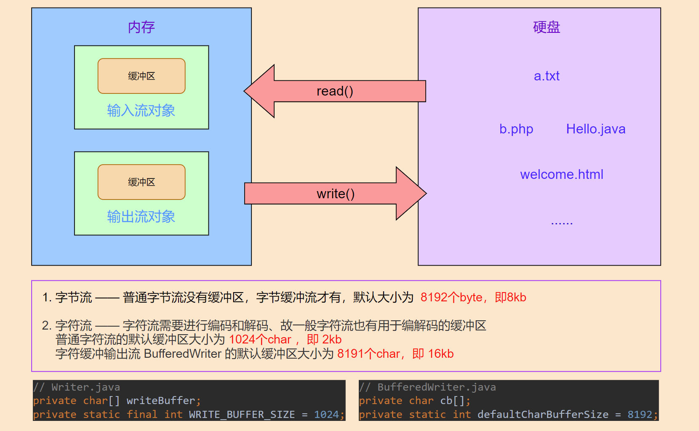

【注】flush方法的使用说明：

- 调用close()方法时会自动flush, 在不调用close()的情况下，缓冲区不满，又需要把缓冲区的内容写入到文件或通过网络发送到别的机器时，才需要调用flush();

- FileInputStream的 flush()是继承于其父类OutputStream的，但是OutputStream类的flush()什么都没做。

- 当OutputStream是BufferedOutputStream时，BufferedOutputStream中重写了flush()方法，并在其中调用了flushBuffer()方法以及OutputStream的flush()方法


## 4. 其他流

### 数据流(Data)

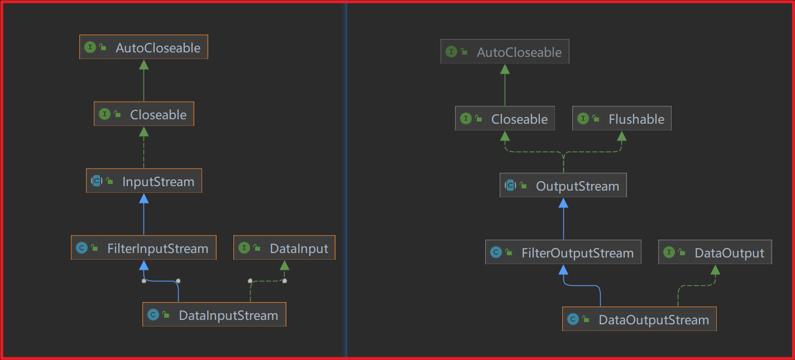

- DataOutputStream

  数据输出流允许应用程序以适当方式将基本 Java 数据类型写入输出流中。然后，应用程序可以使用数据输入流将数据读入

  ```java
  // 构造方法
  DataOutputStream(OutputStream out)        // 创建一个新的数据输出流，将数据写入指定基础输出流
  ```

  ```java
  // 成员方法
  // 每个java基本数据类型 都有1个write方法与之对应 比如
      DataOutputStream dos = new DataOutputStream(new FileOutputStream("dos.txt"));
      dos.writeByte(1);
      dos.writeShort(20);
      dos.writeInt(300);
      dos.writeLong(4000);
      dos.writeFloat(12.34f);
      dos.writeDouble(12.56);
      dos.writeChar('a');
      dos.writeBoolean(true);
      dos.close();
  ```

  

- DataInputStream

  **构造方法**

  ```java
  DataInputStream(InputStream in)        // 使用指定的底层 InputStream 创建一个 DataInputStream
  ```

  **成员方法**

  每个java基本数据类型都有1个read方法与之对应， 如 readInt()

  


### 打印流(Print)

把java基本数据类型,转为相应的字符串,写到文件中

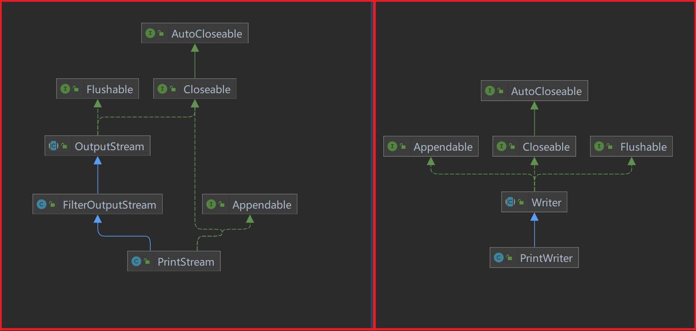

- **字节打印流 PrintStream**  

  `PrintStream` 为其他输出流添加了功能，使它们能够方便地打印各种数据值表示形式 

  | *构造方法*                                                   |
  | ------------------------------------------------------------ |
  | PrintStream(File file)        创建具有指定文件且不带自动行刷新的新打印流。 |
  | PrintStream(OutputStream out)        创建新的打印流。        |
  | PrintStream(OutputStream out,  boolean autoFlush)       创建新的打印流。 |
  | PrintStream(String fileName)        创建具有指定文件名称且不带自动行刷新的新打印流。 |

  *成员方法*

  每个java基本数据类型都有1个print方法与之对应，比如 printInt(int i)


- **字符打印流PrintWriter** 

  | *构造方法*                                                   |
  | ------------------------------------------------------------ |
  | PrintWriter(File file)        使用指定文件创建不具有自动行刷新的新 PrintWriter。 |
  | PrintWriter(OutputStream out)        根据现有的 OutputStream 创建不带自动行刷新的新 PrintWriter。 |
  | PrintWriter(OutputStream out,  boolean autoFlush)       通过现有的 OutputStream 创建新的  PrintWriter。 |
  | PrintWriter(String fileName)        创建具有指定文件名称且不带自动行刷新的新 PrintWriter。 |
  | PrintWriter(Writer out)        创建不带自动行刷新的新 PrintWriter。 |
  | PrintWriter(Writer out,  boolean autoFlush)       创建新 PrintWriter。 |

  *成员方法*

  每个java基本数据都有1个相对应的print方法


- 打印流的特点

  - 只能操作目的地，不能操作数据来源。即只有输出流,没有1个与之对应的输入流

  - 可以操作任意类型的数据。把不同类型的数据转为字符串

  - 如果启动了自动刷新，能够自动刷新（但只有在调用 `println`、`printf` 或 `format`  的其中一个方法时才可以）

    

- **系统流**：每个 Java程序运行时都带有一个系统流，系统流对应的类为 java.lang.System

  Sytem 类封装了 Java 程序运行时的 3 个系统流： 
  - `System.in`：标准输入流，默认设备是键盘  （是 InputStream 类的一个对象） 
  - `System.out`：标准输出流，默认设备是控制台（屏幕）（是 PrintStream 类的对象） 
  - `System.err`：标准错误流，默认设备是控制台（屏幕）（是 PrintStream 类的对象） 

  ```java
  public final static InputStream in = null;
  public final static PrintStream out = null;
  public final static PrintStream err = null;
  ```


### 对象流(Object)

对象流又称序列化、反序列化流。

- 序列化: 把对象数据,转为二进制数据,持久化存储的过程 （即把Java对象转换为字节序列的过程）

- 反序列化: 把二进制数据还原为对象数据 （即把字节序列恢复为Java对象的过程）

- 要实现Java对象的序列化，只要将类实现标识接口——Serializable接口即可，不需要重写任何方法

  **Serializable是1个空接口, 想要实现序列化功能, 须实现该接口 空接口, 起标记作用** 

- <font color=purple> **transient** </font> 关键字：用于指定不需要序列化的对象属性

  将不需要序列化的属性前添加关键字transient，序列化对象的时候，这个属性就不会序列化

  ```java
  class Student implements Serializable {
      transient String name; // 不会被序列化
      // ... other fields
  }
  ```


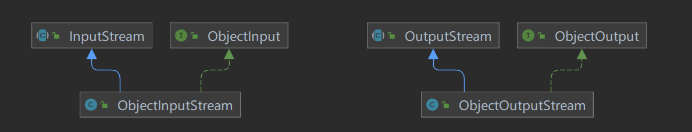

- **ObjectOutputStream**

  ObjectOutputStream 将 Java 对象的基本数据类型和图形写入 OutputStream

  *构造方法* 

  ```java
  ObjectOutputStream(OutputStream out)       // 创建写入指定 OutputStream 的 ObjectOutputStream
  ```

  *成员方法* 

  ```java
  writeObject(Object obj)       // 将指定的对象写入 ObjectOutputStream。
  ```

  

- **ObjectInputStream** 

  ObjectInputStream 对以前使用 ObjectOutputStream 写入的基本数据和对象进行反序列化

  *构造方法* 

  ```java
  ObjectInputStream(InputStream in)      //  创建从指定 InputStream 读取的 ObjectInputStream
  ```

  *成员方法* 

  ```java
  readObject()      //  从 ObjectInputStream 读取对象
  ```

【注意】

- java.io.NotSerializableException 异常表示  对象没有实现Serializable接口

- java.io.InvalidClassException:  xxxxx local class incompatible: stream classdesc serialVersionUID = -8449572629204967338, local class serialVersionUID = 5807530389656511599   

  **serialVersionUID不匹配**   （一般是使用了不一样的类，或修改了相应的类定义 导致的） 可以可以通过显示声明方式解决

  ```java
  static final long serialVersionUID = -8449572629204967338l;
  ```


【例】

```java
public class Student implements Serializable{...}
```

```java
// 对象序列化和反序列化工具类示例
public class IOUtils {
	// Java序列化（将java对象序列化并存储到硬盘）
    public static void writeFile(Object obj, String fileName) {
        try (FileOutputStream fileOutputStream = new FileOutputStream(fileName);
             ObjectOutputStream objectOutputStream = new ObjectOutputStream(fileOutputStream)) {
            objectOutputStream.writeObject(obj);
        } catch (Exception e) {
            e.printStackTrace();
        }
    }
	// Java反序列化
    public static Object readFile(String fileName) {
        try (FileInputStream fileInputStream = new FileInputStream(fileName);
             ObjectInputStream objectInputStream = new ObjectInputStream(fileInputStream)) {
            return objectInputStream.readObject();
        } catch (Exception e) {
            e.printStackTrace();
        }
        return null;
    }
}
```


## 5. IO资源释放

方式一：直接释放（较为繁琐）

```java
public static void byteArrayTofile(byte[] src,String filePath){
    InputStream is = null;
    FileOutputStream os = null;
    try {
        is = new ByteArrayInputStream(src);
        os = new FileOutputStream(dest);
		// 一系列的IO流操作 ...... 
    } catch (FileNotFoundException e) {
        e.printStackTrace();
    } catch (IOException e) {
        e.printStackTrace();
    }finally{     
        try {
            if (null != os) {
                os.close();
            } 
        } catch (Exception e) {
            e.printStackTrace();
        }
    }
}
```


方拾二：利用函数可变参数，可关闭多个流，更灵活

```java
public static void close2(Closeable...ios){    
    for(Closeable io:ios){
        try {
            if(null!=io){  
                io.close();
            }
        } catch (Exception e) {
            e.printStackTrace();
        }
    }
}
```


方式三：try…with…resource

jdk1.7之后可以不用手动释放资源，将声明与初始化写入 try () 中，删去 finally { } ，自动释放系统资源

```java
try (InputStream is = new FileInputStream("abc.txt");
     OutputStream os = new FileOutputStream("abc_copy.txt");) {
    // 具体IO操作
    } catch (FileNotFoundException e) {
        e.printStackTrace();
    } catch (IOException e) {
        e.printStackTrace();
	}
```


## 三 补充和拓展

## 1. Properties

Properties类主要用于读取Java的配置文件，在Java中，其配置文件常为.properties文件，格式为文本文件，文件的内容的格式是“键=值”的格式，文本注释信息可以用"#"来注释。

```java
public class Properties extends Hashtable<Object,Object> 
```

- Properties是一个Map体系的集合类 
- Properties可以保存到流中或从流中加载 
- 属性列表中的每个键及其对应的值都是一个字符串

| 方法名称                                   | 说明                                 |
| ------------------------------------------ | ------------------------------------ |
| getProperty ( String key)                  | 获取key 所对应的 value               |
| setProperty ( String key, String value)    | 调用 Hashtable 的put方法来设置键值对 |
| load ( InputStream inStream)               | 从输入流中读取属性列表（键和元素对） |
| store ( OutputStream out, String comments) | 将键值对写入到指定的文件中去         |
| clear ()                                   | 清除所有的键值对                     |

```java
// Properties类的简单使用：
Properties properties = new Properties();
properties.setProperty("username", "admin");
properties.put("password", "123");

Set<Object> keySet = properties.keySet();
for (Object key : keySet) {
    System.out.println(properties.get(key));
    System.out.println(properties.getProperty((String)key));
}
```


**Properties和IO流相结合的方法**：

| 方法名                                        | 说明                                                 |
| --------------------------------------------- | ---------------------------------------------------- |
| void load(InputStream inStream)               | 从输入字节流读取属性列表                             |
| void load(Reader reader)                      | 从输入字符流读取属性列表                             |
| void store(OutputStream out, String comments) | 适合于使用 load(InputStream)方法的格式写入输出字节流 |
| void store(Writer writer, String comments)    | 适合使用 load(Reader)方法的格式写入输出字符流        |

```java
Properties prop = new Properties();
FileReader fileReader = new FileReader(".\\data\\prop.txt");
FileWriter fileWriter = new FileWriter(".\\data\\prop.txt");

prop.setProperty("username", "admin");
prop.put("password", "123");
// 写入文件
prop.store(fileWriter, "user");
fileWriter.close();

// 从文件中读取
Properties properties = new Properties();
properties.load(fileReader);
fileReader.close();
System.out.println(properties);
```


## 2. RandomAccessFile

RandomAccessFile 类支持 “随机访问” 的方式，RandomAccessFile 对象包含一个记录指针，用以标示当前读写处的位置，程序可以直接跳到文件的任意位置来读、写文件 

| *构造方法*                                                   |
| ------------------------------------------------------------ |
| RandomAccessFile(File file, String mode)        创建从中读取和向其中写入（可选）的随机访问文件流，该文件由 File 参数指定。 |
| RandomAccessFile(String name, String mode)        创建从中读取和向其中写入（可选）的随机访问文件流，该文件具有指定名称。 |

创建 RandomAccessFile 类实例需要指定一个 mode 参数，该参数指 定 RandomAccessFile 的访问模式(介绍2种常用的)：

- `r`: 以只读方式打开(不会创建文件,读取已经存在的文件)
- `rw`:可读可写(文件不存在会创建,存在不会创建) 


*成员方法*：

除了常规的read write方法外， RandomAccessFile 类对象还有自由移动记录指针的相关方法： 

- long getFilePointer()：获取文件记录指针的当前位置 
- void seek(long pos)：将文件记录指针定位到 pos 位置


随机读写示例：

```Java
package cn.itdrizzle.javase.p19.demo;

import java.io.IOException;
import java.io.RandomAccessFile;
import java.nio.charset.StandardCharsets;

/**
 * @Classname RandomAccessFileDemo
 * @Description 向文件中指定位置插入数据
 * @Date 2022/2/22 8:41
 * @Author idrizzle
 */
public class RandomAccessFileDemo {
    public static void main(String[] args) {
        try (final RandomAccessFile raf = new RandomAccessFile("temp\\test\\raf.txt", "rw")) {
            // 先向文件中写入一些数据
            raf.write("abcdef".getBytes(StandardCharsets.UTF_8));
            System.out.println("写入数据后，FilePointer：" + raf.getFilePointer());

            // 指定插入的位置
            raf.seek(3);
            System.out.println("指定插入位置后，FilePointer：" + raf.getFilePointer());

            // 现将插入点后的数据暂存起来
            final StringBuffer temp = new StringBuffer();
            final byte[] bytes = new byte[1024];
            int len;
            while ((len = raf.read(bytes)) != -1) {
                temp.append(new String(bytes, 0, len));
            }
            System.out.println("读数据后，FilePointer：" + raf.getFilePointer());

            // 移动指针到插入位置
            raf.seek(3);
            System.out.println("重新指定插入位置后，FilePointer：" + raf.getFilePointer());
            // 插入新的数据
            raf.write("xyz2333".getBytes());
            // 之前的数据重写回
            raf.write(temp.toString().getBytes());
            System.out.println("最后的位置，FilePointer：" + raf.getFilePointer());
        } catch (IOException e) {
            e.printStackTrace();
        }
    }
}
```

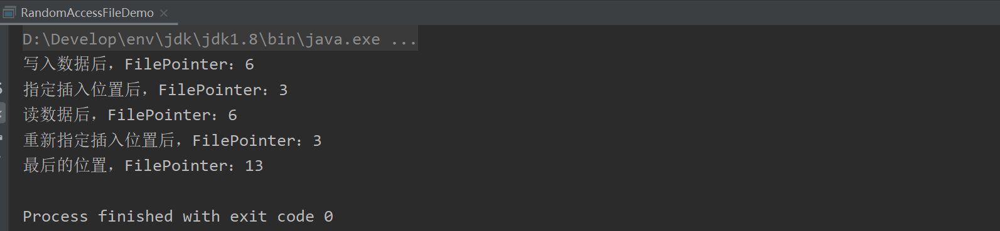


