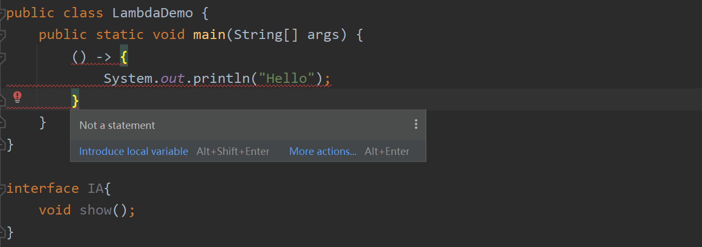
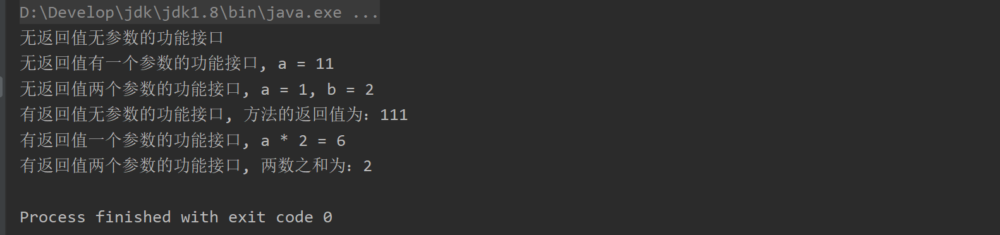
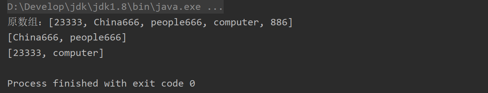
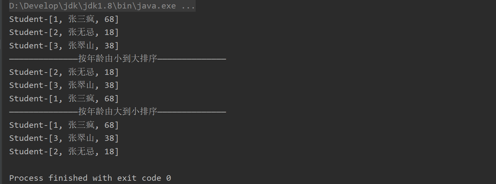

---

order: 30
title: Lambda
shortTitle: Lambda表达式

---


## 1. 语法简介

Lambda 表达式是 JDK8 的一个新特性，可以取代接口的匿名内部类，写?更优雅的Java 代码。

如果说匿名内部类实际上是局部内部类的更进一步，简化了局部内部类，那么Lambda就是匿名内部类更进一步，语法上更简洁了，代码更优雅了

1. Lambda表达式仍然是局部内部类，是特殊的局部内部类，仍然定义在局部位置。而且局部内部类的注意事项，也一样存在。
2. Lambda表达式在取代匿名内部类时，不是全部都取代，而是取代接口的匿名内部类，而类的匿名内部类Lambda表达式是不能取代的。
3. Lambda表达式是匿名内部类的更进一步，  ==Lambda表达式得到的不是一个类，而是一个对象，并且是接口的子类对象==  

<br/>

**Lambda语法格式**： 

```java
(形参列表) -> {
 // 方法体
}
```

1. `(形参列表)`表示功能接口中，必须要重写的抽象方法的形参列表
2. `->`由一个`英文横杠 + 英文大于号`字符组成，它是Lambda表达式的运算符，读作`goes to` 
3. `{ //方法体 }`表示功能接口中，必须要重写的抽象方法的方法实现

**因为语法中仅有一套形参列表和方法体，只能重写一个方法。** 而且，这个语法写出来，很明显**Lambda表达式只能重写父接口中的抽象方法，是不能自己新增成员的！** 

<br/>

## 2. 功能接口

Lambda表达式虽然说是取代接口的匿名内部类，但也不是什么接口都能用Lambda表达式创建子类对象。

**Lambda表达式要求的接口中，必须有且仅有一个必须要实现的抽象方法。这种接口在Java中，被称之为"功能接口"。**  

功能接口在语法上，可以使用注解`@FunctionalInterface`标记在接口头上，用于检测一个接口是否是功能接口。

```java
@FunctionalInterface
interface IA{
    void test();
}
```

 ==功能接口指的是，有且仅有一个必须要子类实现的抽象方法的接口==  

思考两个问题：

1. 功能接口中只能有一个方法吗？ 不是，Java8起，默认方法和静态方法不需要子类实现，功能接口中可以允许有它们存在

2. 功能接口中只能有一个抽象方法吗？ 不是，有极个别比较特殊的抽象方法，可以不需要子类实现
   
   如：Object类是Java每一个类的父类，所以Object类当中的方法实现就可以作为接口抽象方法的实现
   
   ```java
   @FunctionalInterface
   interface IA{
     void test();
     boolean equals(Object obj);
   }
   // 接口IA仍然是一个功能方法，因为抽象方法boolean equals(Object obj);可以直接使用Object类中的实现，无需子类实现
   ```

<br/>

## 3. 类型推断

在方法等局部位置，写上述语法后，肯定会报错。原因在于Java是强类型语言，任何变量都有它的数据类型，而直接写Lambda表达式语言，编译器是无从得知它的数据类型的——**这个Lambda表达式创建了接口的子类对象，到底是哪个接口的子类对象呢？**



所以我们需要帮助编译器，明确Lambda表达式所表示的对象的类型，这个过程称之为 **"Lambda表达式的类型推断"**: 

1. **直接用父接口引用接收。**由于Lambda表达式表示的子类对象并没有自己独有的成员，所以直接用父类引用接收完全不会有任何问题。
   
   <br/>

2. **不用引用接收，但是要直接告诉编译器Lambda表达式是哪个接口的子类对象，语法上有点像强转（但不是）**。
   
   ```java
   public class LambdaDemo {
       public static void main(String[] args) {
           ((IA) () -> {
               System.out.println("Hello");
           }).show();
       }
   }
   
   interface IA {
       void show();
   }
   ```
   
   这种方式有点类似于匿名对象，所以必须直接调用方法，不然会编译语法报错。
   
   <br/>

3. **借助方法完成类型推断（最主要的使用方式）**  
   
   1. 可以借助方法的返回值数据类型完成类型推断，因为方法的返回值编译器已经知道该返回什么对象
   2. 可以借助方法的形参的数据类型完成类型推荐，因为方法的实参编译器已经知道该传入什么对象

<br/>

## 4. 简化使用

**Lambda表达式的进阶使用**: (Lambda表达式的简化)

 ==Lambda表达式能够简化的前提是：它是功能接口的子类对象，而功能接口中有且只有一个必须要实现的抽象方法！==  

-  ==形参列表== ：
  
  - 参数类型可以省略
  - 如果形参列表中的形参只有一个，那么`()`小括号，也是可以省略的。但是如果形参为空则不可省略

-  ==方法体== ：
  
  - **如果方法重写的方法体只有一条语句的话，那么可以省略大括号。（类似于if/for省略大括号）** 
  
  - **特殊的，如果只有一条语句且这条语句是返回值语句，那么大括号和return可以一起省略** 

- **Lambda表达式的抽象方法的实现可以直接指向一个已经存在的方法，而不是自己书写实现。这种语法在Java中称之为"方法引用"**  
  
  ```java
  public class Demo {
      public static void main(String[] args) {
          IA ia = Demo::method;
          System.out.println(ia.add(1.1, 1.2));
      }
  
      public static double method(double a, double b) {
          return a + b;
      }
  }
  
  @FunctionalInterface
  interface IA {
      double add(double a, double b);
  }
  ```

```java
/**
 * @Classname Demo
 * @Description 一些Lambda表达式的简单使用示例
 * @CreateTime 2022/2/12 13:58
 * @CreatedBy itdrizzle
 */
public class Demo {
    public static void main(String[] args) {
        INoReturnNoParam nrnp = () -> System.out.println("无返回值无参数的功能接口");
        nrnp.test();

        INoReturnOneParam nrop = a -> System.out.println("无返回值有一个参数的功能接口, a = " + a);
        nrop.test(11);

        INoReturnTwoParam nrtp = Demo::method;
        nrtp.test(1, 2);

        IHasReturnNoParam hrnp = () -> 111;
        System.out.println("有返回值无参数的功能接口, 方法的返回值为：" + hrnp.test());

        IHasReturnOneParam hrop = a -> a * 2;
        System.out.println("有返回值一个参数的功能接口, a * 2 = " + hrop.method(3));

        IHasReturnTwoParam hrtp = (int a, int b) -> a + b;
        System.out.println("有返回值两个参数的功能接口, 两数之和为：" + hrtp.test(1, 1));
    }

    public static void method(int a, int b){
        System.out.println("无返回值两个参数的功能接口, a = " + a + ", b = " + b);
    }
}

//无返回值无参数的功能接口
@FunctionalInterface
interface INoReturnNoParam {
    void test();
}

//无返回值有一个参数的功能接口
@FunctionalInterface
interface INoReturnOneParam {
    void test(int a);
}

//无返回值两个参数的功能接口
@FunctionalInterface
interface INoReturnTwoParam {
    void test(int a, int b);
}

//有返回值无参数的功能接口
@FunctionalInterface
interface IHasReturnNoParam {
    int test();
}

//有返回值一个参数的功能接口
@FunctionalInterface
interface IHasReturnOneParam {
    int method(int a);
}

//有返回值两个参数的功能接口
@FunctionalInterface
interface IHasReturnTwoParam {
    int test(int a, int b);
}
```



<br/>

## 5. 注意事项

 ==Lambda表达式没有自身独立的作用域，不能自定义成员，只能和方法共用同一个作用域==  

但`方法引用`的方式例外，毕竟一个独立的方法不可能受此限制

**Lambda表达式的优缺点**：

**优点**：

- 极大得简化了代码，使代码变得更加优雅。

- 函数式编程的代表，可能是未来高端的编程趋势
  
  Lambda表达式在Stream API中，配合集合类去使用，代码非常优雅和简洁，并且高效，实际开发中十分常用

**缺点**： 

- 过于简单的Lambda表达式，显然可读性很低
- 过于简洁也意味着不容易Debug。（当然idea有专门调试Lambda表达式的功能）
- 语法难度不低，熟练使用需要时间锻炼

<br/>

## 6. 应用示例

按照 **规则** 过滤字符串数组中的元素：

```java
public class FilterDemo {
    public static void main(String[] args) {
        String[] strArr = {"23333", "China666", "people666", "computer", "886"};

        System.out.println("原数组：" + Arrays.toString(strArr));

        // 过滤规则：保留所有以 666 结尾的字符串
        String[] str1 = StringTool.getNewStringArrByFilter(strArr, str -> str.endsWith("666"));
        System.out.println(Arrays.toString(str1));

        // 过滤规则：去除所有末尾为 6 的字符串
        String[] str2 = StringTool.getNewStringArrByFilter(strArr, str -> !str.endsWith("6"));
        System.out.println(Arrays.toString(str2));
    }

    // 功能接口,表示过滤,表示对String数组中元素的过滤规则
    @FunctionalInterface
    interface StringArrFiler {
        boolean accept(String str);
    }

    static class StringTool {
        public static String[] getNewStringArrByFilter(String[] oldArr, StringArrFiler filter) {
            ArrayList<String> list = new ArrayList<>();
            for (String str : oldArr) {
                if (filter.accept(str)) {
                    list.add(str);
                }
            }
            String[] result = new String[list.size()];
            list.toArray(result);
            return result;
        }
    }
}
```



<br/>

## 7. 自然排序

**集合排序**示例：

```java
public class SortDemo {
    public static void main(String[] args) {
        List<Student> list = new ArrayList<>();
        list.add(new Student(1L, "张三疯", 68));
        list.add(new Student(2L, "张无忌", 18));
        list.add(new Student(3L, "张翠山", 38));

        for (Student student : list) {
            System.out.println(student);
        }


        // 在java8以前(没有Lambda表达式)对于对象排序，需要实现匿名内部类来做比较
        System.out.println("——————————————按年龄由小到大排序——————————————");
        Collections.sort(list, new Comparator<Student>() {
            @Override
            public int compare(Student o1, Student o2) {
                return o1.getAge().compareTo(o2.getAge());
            }
        });
        for (Student student : list) {
            System.out.println(student);
        }

        // 使用Lambda表达式实现排序
        System.out.println("——————————————按年龄由大到小排序——————————————");
        Collections.sort(list, (o1, o2) -> o2.getAge().compareTo(o1.getAge()));
        for (Student student : list) {
            System.out.println(student);
        }
    }
}
```


)
