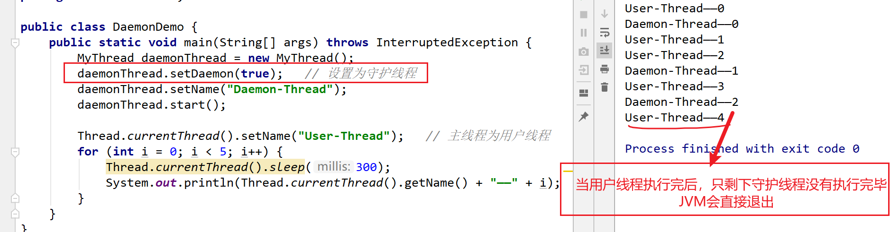
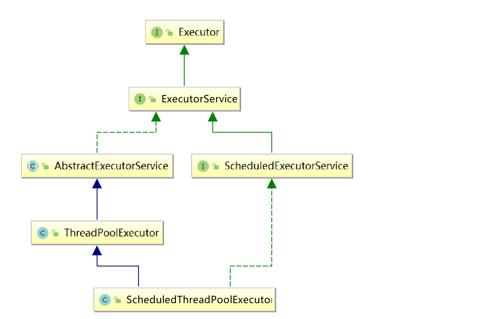

---

order: 1
title: Java多线程基础

---


## Java多线程

线程的优点及成本：

​ 1）充分利用多CPU的计算能力，单线程只能利用一个CPU，使用多线程可以利用多CPU的计算能力。

​ 2）充分利用硬件资源，CPU和硬盘、网络是可以同时工作的，一个线程在等待网络IO的同时，另一个线程完全可以利用CPU，对于多个独立的网络请求，完全可以使用多个线程同时请求。

​ 3）在用户界面（GUI）应用程序中，保持程序的响应性，界面和后台任务通常是不同的线程，否则，如果所有事情都是一个线程来执行，当执行一个很慢的任务时，整个界面将停止响应，也无法取消该任务。

​ 4）简化建模及IO处理，比如，在服务器应用程序中，对每个用户请求使用一个单独的线程进行处理，相比使用一个线程，处理来自各种用户的各种请求，以及各种网络和文件IO事件，建模和编写程序要容易得多。

需要注意的是线程是有成本的：创建线程需要消耗操作系统的资源，操作系统会为每个线程创建必要的数据结构、栈、程序计数器等，创建也需要一定的时间。

此外，线程调度和切换也是有成本的，当有大量可运行线程的时候，操作系统会忙于调度，为一个线程分配一段时间，执行完后，再让另一个线程执行，一个线程被切换出去后，操作系统需要保存它的当前上下文状态到内存，上下文状态包括当前CPU寄存器的值、程序计数器的值等，而一个线程被切换回来后，操作系统需要恢复它原来的上下文状态，整个过程称为上下文切换，这个切换不仅耗时，而且使CPU中的很多缓存失效。

当然，这些成本是相对而言的，如果线程中实际执行的事情比较多，这些成本是可以接受的；如果执行的任务都是CPU密集型的，即主要消耗的都是CPU，那创建超过CPU数量的线程就是没有必要的，并不会加快程序的执行。


### 1. 基本概念

- 进程： 是指一个内存中运行的应用程序，每个进程都有一个独立的内存空间 

- 线程： 是进程中的一个执行路径，共享一个内存空间，线程之间可以自由切换，并发执行. 一个进程最少 有一个线程 

  线程实际上是在进程基础之上的进一步划分，一个进程启动之后，里面的若干执行路径又可以划分成若干个线程

  

- 同步: 排队执行 , 效率低但是安全

  **调用某个东西（IO，http请求）时，调用方得等待这个调用返回结果才能继续往后执行** 

- 异步: 同时执行 , 效率高但是数据不安全

  **和同步相反，用发出后调用者可用继续执行后续操作，被调用者通过状体来通知调用者，或者通过回掉函数来处理这个调用**  

  

- 串行：一个任务接一个任务按顺序执行

- 并发：指两个或多个事件在同一个时间段内发生

- 并行：指两个或多个事件在同一时刻发生（同时发生）


### 2. 继承Thread

继承Thread实现多线程的步骤：

- 定义一个继承Thread的类， 并重写`run()`方法 

- 创建这个类的对象， 通过`start()`方法启动线程

```java
public class MyThread extends Thread {
    @Override
    public void run() {
        for (int i = 0; i < 10; i++) {
            System.out.println(Thread.currentThread().getName() + "——" + i);
        }
    }
}
```

```java
public class ThreadDemo1 {
    public static void main(String[] args) {
        MyThread th1 = new MyThread();
        MyThread th2 = new MyThread();

        th1.start();
        th2.start();
    }
}
```

- `run()`：用来封装被线程执行的代码
- `start()`：启动线程；然后由JVM调用此线程的run()方法


### 3. 实现Runnable

通过实现Runnable接口实现多线程的步骤：

- 定义一个实现Runnable接口的类， 并在类中重写`run()`方法 
- 创建该类的对象，创建Thread类的对象，把该类的对象作为Thread类的构造方法参数
- 通过`start()` 启动线程

```java
public class MyRunnable implements Runnable {
    @Override
    public void run() {
        for (int i = 0; i < 10; i++) {
            System.out.println(Thread.currentThread().getName() + "——" + i);
        }
    }
}
```

```java
public class ThreadDemo2 {
    public static void main(String[] args) {
        MyRunnable task = new MyRunnable();
        Thread t1 = new Thread(task, "T1");
        Thread t2 = new Thread(task, "T2");

        t1.start();
        t2.start();
    }
}
```

实现Runnable相对于继承Thread有如下优势：

- 可以实现多个接口，避免单继承带来的局限性
- 通过先创建任务，然后创建线程的方式来实现，任务与线程分离，提高了程序的健壮性
- 线程池接收Runnable类型的任务，但不接收Thread类型的对象


**可以通过匿名内部类的方式实现**：

```java
public static void main(String[] args) {
    new Thread(new Runnable() {
        @Override
        public void run() {
            for (int i = 0; i < 10; i++) {
                System.out.println(Thread.currentThread().getName() + i);
            }
        }
    }).start();
}
```

**上述案例的Lambda表达式**：

```java
new Thread(()->{
    for (int i = 0; i < 10; i++) {
        System.out.println(Thread.currentThread().getName() + i);
    }
}).start();
```


### 4. 实现Callable

Thread类和Runnable接口都不允许声明检查型异常，也不能定义返回值

Runnable 与 Callable的不同点：

（1）Callable规定的方法是call()，而Runnable规定的方法是run()。

（2）Callable的任务执行后可返回值，而Runnable的任务是不能返回值的。

（3）call()方法可抛出异常，而run()方法是不能抛出异常的。

（4）运行Callable任务可拿到一个Future对象。


Callable使用步骤：

1. 编写类实现Callable接口 , 实现call方法
2. 创建FutureTask对象 , 并传入第一步编写的Callable类对象
3. 通过Thread, 启动线程

```java
public class MyCallable implements Callable {
    @Override
    public Integer call() throws Exception {
        int sum = 0;
        for (int i = 0; i < 100000; i++) {
            sum += i;
        }
        return sum;
    }
}
```

```java
public class CallableDemo {
    public static void main(String[] args) throws ExecutionException, InterruptedException {
        MyCallable myCallable = new MyCallable();
        // 执行Callable的任务，需要用FutureTask来接收运算结果
        FutureTask<Integer> futureTask = new FutureTask<Integer>(myCallable);

        new Thread(futureTask).start();

        // 接收线程运算后的结果（调用FutureTask对象的get()方法阻塞性地获得并发线程的执行结果）
        Integer result = futureTask.get();
        System.out.println(result);
    }
}
```


### 5. Thread类

| 构造方法                             | 说明                                                       |
| ------------------------------------ | ---------------------------------------------------------- |
| Thread()                             | 创建一个线程对象                                           |
| Thread(String name)                  | 创建一个具有指定名称的线程对象                             |
| Thread(Runnable target)              | 创建一个基于Runnable接口实现类的线程对象                   |
| Thread(Runnable target, String name) | 创建一个基于Runnable接口实现类，并且具有指定名称的线程对象 |


**Thread类的常用方法**：

| 方法名                           | 说明                                     |
| -------------------------------- | ---------------------------------------- |
| void setName(String name)        | 将此线程的名称更改为等于参数name         |
| String getName()                 | 返回此线程的名称                         |
| Thread currentThread()           | 返回对当前正在执行的线程对象的引用       |
| public void run()                | 线程相关的代码写在该方法中，一般需要重写 |
| public void start()              | 启动线程的方法                           |
| public static void sleep(long m) | 线程休眠m毫秒的方法                      |
| public void join()               | 优先执行调用join()方法的线程             |
| void setDaemon(boolean on)       | 将此线程标记为守护线程                   |


**run方法跟start方法的区别**：

- run方法根本就没有开辟新的执行路径,还是按照顺序执行的，直接调用run方法,相当于普通成员方法调用

- start方法才是真正的去创建线程
- 只有run方法当中的代码才会执行在子线程中,我们要把我们的代码写到run方法中,并且启动的时候一定是start方法
- run方法中调用了别的方法

【注意】

​	同1个线程,能否启动多次? 不可以 java.lang.IllegalThreadStateException  同一个线程 多次启动会报异常

​	谁才代表一个真正的线程?  Thread类的对象及其子类的对象才代表1个线程


### 6. 线程生命周期

 简单来说线程一共有五种状态，线程在各种状态之间转换（这只是帮助理解的状态模型，并非真正的java线程状态）：


实际上Java中线程的生命周期分为6种状态。Thread类有一个实例属性和一个实例方法专门用于保存和获取线程的状态。其中，用于保存线程Thread实例状态的实例属性为threadStatus，以下为Thread类相关属性：

```java
// Java thread status for tools,  initialized to indicate thread 'not yet started'
private volatile int threadStatus = 0;


/**
     * Returns the state of this thread.
     * This method is designed for use in monitoring of the system state,
     * not for synchronization control.
     *
     * @return this thread's state.
     * @since 1.5
     */
public State getState() {
    // get current thread state
    return sun.misc.VM.toThreadState(threadStatus);
}
```


Thread.State是一个内部枚举类，定义了6个枚举常量，分别代表Java线程的6种状态，具体如下：

```java
public enum State {
    NEW,             // 新建
    RUNNABLE,        // 可执行（包含操作系统的就绪、运行两种状态）
    BLOCKED,         // 阻塞
    WAITING,         // 等待
    TIMED_WAITING,   // 限时等待
    TERMINATED;      // 终止
}
```


### 7. 线程状态总结

- **NEW状态**：Java源码对NEW状态的说明是：创建成功但是没有调用start()方法启动的Thread线程实例都处于NEW状态。

  当然，并不是Thread线程实例的start()方法一经调用，其状态就从NEW状态到RUNNABLE状态，此时并不意味着线程立即获取CPU时间片并且立即执行，中间需要一系列操作系统的内部操作


- **RUNNABLE**：Java把 `Ready（就绪）`和`Running（执行）`两种状态合并为一种状态：`RUNNABLE（可执行）`状态

  当Java线程的Thread实例的start()方法被调用后，操作系统中的对应线程进入的并不是运行状态，而是就绪状态，而Java线程并没有这个就绪状态。JVM的线程状态与其幕后的操作系统线程状态之间的转换关系简化后如图：

  

​	

> ​	**前线程进入就绪状态的条件**大致包括以下几种：
>
> ​	（1）调用线程的start()方法，此线程就会进入就绪状态。·
>
> ​	（2）当前线程的执行时间片用完。
>
> ​	（3）线程睡眠（Sleep）操作结束。
>
> ​	（4）对其他线程合入（Join）
>
> ​	（5）等待用户输入结束。
>
> ​	（6）线程争抢到对象锁（Object Monitor）。
>
> ​	（7）当前线程调用了yield()方法出让CPU执行权限。
>
> 
>
> **线程进入执行状态**：调度程序从就绪状态的线程中选择一个线程，被选中的线程状态将变成执行状态。
>
> ​                                   这也是线程进入执行状态的唯一方式


- **BLOCKED**：处于BLOCKED（阻塞）状态的线程并不会占用CPU资源，以下情况会让线程进入阻塞状态：

  （1）线程等待获取锁：等待获取一个锁，而该锁被其他线程持有，则该线程进入阻塞状态。

  ​          当其他线程释放了该锁，并且线程调度器允许该线程持有该锁时，该线程退出阻塞状态。

  （2）IO阻塞：线程发起了一个阻塞式IO操作后，如果不具备IO操作的条件，线程就会进入阻塞状态。

  ​          IO包括磁盘IO、网络IO等。IO阻塞的一个简单例子：线程等待用户输入内容后继续执行。


- **WAITING**：线程的WAITING（**无限期等待**）状态表示线程在等待被唤醒。处于WAITING状态的线程不会被分配CPU时间片。执行以下两个操作，当前线程将处于WAITING状态：

  

​	（1）执行没有时限（timeout）参数的thread.join()调用：

​			  在线程合并场景中，若线程A调用B.join()去合入B线程，则在B执行期间线程A处于WAITING状态，一直等线程B执行完成。

​	（2）执行没有时限（timeout）参数的object.wait()调用：

​			 指一个拥有object对象锁的线程，进入相应的代码临界区后，调用相应的object的wait()方法去等待 

​             其“对象锁”（Object Monitor）上的信号，若“对象锁”上没有信号，则当前线程处于WAITING状态 

​	（2）LockSupport.park()方法，对应的唤醒方式为：LockSupport.unpark(Thread) 


- **TIMED_WAITING**：线程处于一种特殊的等待状态，准确地说，线程处于**限时等待**状态。能让线程处于限时等待状态的操作大致有以下几种：

  - （1）`Thread.sleep(int n)`：使得当前线程进入限时等待状态，等待时间为n毫秒。对应的唤醒方式为：sleep睡眠时间结束

  - （2）`Object.wait()`：带时限的抢占对象的monitor锁。

    ​		  对应的唤醒方式为：调用Object.notify()/Object.notifyAll()主动唤醒，或者限时结束

  - （3）`Thread.join()`：带时限的线程合并。

  - （4）`LockSupport.parkNanos()`：让线程等待，时间以纳秒为单位。

  - （5）`LockSupport.parkUntil()`：让线程等待，时间可以灵活设置。


- **TERMINATED**：处于RUNNABLE状态的线程在run()方法执行完成之后就变成终止状态TERMINATED了。当然，如果在run()方法执行过程中发生了运行时异常而没有被捕获，run()方法将被异常终止，线程也会变成TERMINATED状态。


## Java线程控制

### 1. 线程调度

由于CPU的计算频率非常高，每秒计算数十亿次，因此可以将CPU的时间从毫秒的维度进行分段，每一小段叫作一个CPU时间片。

目前操作系统中主流的线程调度方式是：基于CPU时间片方式进行线程调度

线程调度：给线程分配CPU时间片的过程。线程调度分类：

- 协同式线程调度：线程的执行时间是由线程本身决定. 该线程的内容执行完后,报告操作系统进行切换.

- 分时调度模型：所有线程轮流使用 CPU 的使用权，平均分配每个线程占用 CPU 的时间片 

- 抢占式调度模型：优先让优先级高的线程使用 CPU，如果线程的优先级相同，那么会随机选择一 个，优先级高的线程获取的 CPU 时间片相对多一些 

  

**Java使用的是抢占式调度模型** ：由于目前大部分操作系统都是使用抢占式调度模型进行线程调度，Java的线程管理和调度是委托给操作系统完成的，与之相对应，Java的线程调度也是使用抢占式调度模型

- 随机性：假如计算机只有一个 CPU，那么 CPU 在某一个时刻只能执行一条指令，线程只有得到CPU时间片，也就是使用权，才可以执行指令。即多线程程序的执行是有随机性，因为谁抢到CPU的使用权是不一 定的


### 2. 线程优先级

操作系统的优先级: （静态优先级+动态优先级）

- 静态优先级:固定值
- 动态优先级:正在的线程会随着执行时间的延长优先级会降低, 正在等待的线程的优先级会随着等待时间的延长,优先级会升高


**java中的优先级到底为什么没有用**？

java中优先级是静态优先级, 只是向操作系统建议，然而，我们在java语言中设置的线程优先级，它仅仅只能被看做是一种"建议"(对操作系统的建议)，实际上，操作系统本身，有它自己的一套线程优先级 (静态优先级 + 动态优先级)，故而即使设置了线程优先级，也不能保证执行顺序！

 **java官方说明**： 线程优先级并非完全没有用，我们Thread的优先级，它具有统计意义，总的来说，高优先级的线程占用的cpu执行时间多一点，低优先级线程，占用cpu执行时间，短一点 （也就是说，优先级高最多意味着抢到执行权的可能性高一点点而已！）


Java为线程类提供了10个优先级，优先级可以用整数1-10表示，超过范围会抛出异常，主线程默认优先级为5

**Thread类的优先级常量**：

```java
// The minimum priority that a thread can have.
public final static int MIN_PRIORITY = 1;    

// The default priority that is assigned to a thread.
public final static int NORM_PRIORITY = 5;  

// The maximum priority that a thread can have.
public final static int MAX_PRIORITY = 10;   
```

优先级相关的方法：

| 方法                                     | 说明                 |
| ---------------------------------------- | -------------------- |
| public int getPriority()                 | 获取线程优先级的方法 |
| public void setPriority(int newPriority) | 设置线程优先级的方法 |


### 3. 线程控制API

- `sleep()` ：释放资源，自己休眠，让其他线程先执行。

  sleep的作用是让目前正在执行的线程休眠，让CPU去执行其他的任务。从线程状态来说，就是从执行状态变成限时阻塞状态

  ```java
  // sleep 案例
  new Thread(new Runnable() {
      @Override
      public void run() {
          for (int i = 0; i < 10; i++) {
              try {
                  Thread.currentThread().sleep(500);  // 休眠半秒
              } catch (InterruptedException e) {
                  e.printStackTrace();
              }
              System.out.println(Thread.currentThread().getName() + i);
          }
      }
  }).start();
  ```

  

- `join()`： 抢占资源，让自己占有线程， 先执行完毕后（或达到指定时间）才释放资源。( <font color=red>可以用来保证执行顺序</font> ) 

  调用join()方法的语句可以理解为合并点，合并的本质是：线程A需要在合并点等待，一直等到线程B执行完成，或者等待超时

  ```java
  // join 案例
  public class JoinDemo {
      public static void main(String[] args) throws InterruptedException {
          MyThread thread0 = new MyThread();
          MyThread thread1 = new MyThread();
          MyThread thread2 = new MyThread();
  
          thread0.start();
          thread0.join();   //Thread-0 执行完毕后，Thread-1和Thread-2才能执行
          thread1.start();
          thread2.start();
      }
  }
  ```

  

  

  

- `yield()`： 暂停当前正在执行的线程对象，并执行其他线程 （**注意该方法并不能保证执行顺序**）

  - 线程的yield（让步）操作的作用是让目前正在执行的线程放弃当前的执行，让出CPU的执行权限，使得CPU去执行其他的线程。
  - 处于让步状态的JVM层面的线程状态仍然是RUNNABLE状态，**它不会阻塞该线程，但是该线程所对应的操作系统层面的线程从状态上来说会从执行状态变成就绪状态**。
  
  - 线程在yield时，线程放弃和重占CPU的时间是不确定的，可能是刚刚放弃CPU，马上又获得CPU执行权限，重新开始执行。
  
  
  
  总结起来，Thread.yeid()方法有以下特点：
  
  （1）yield仅能使一个线程从运行状态转到就绪状态，而不是阻塞状态。
  
  （2）yield不能保证使得当前正在运行的线程迅速转换到就绪状态。
  
  （3）即使完成了迅速切换，系统通过线程调度机制从所有就绪线程中挑选下一个执行线程时，就绪的线程有可能被选中，
  
  ​          也有可能不被选中，其调度的过程受到其他因素（如优先级）的影响。


### 4. 守护线程

在Java中有两类线程：User Thread(用户线程)、Daemon Thread(守护线程) ，User和Daemon两者几乎没有区别，不同之处在于：

- 如果 User Thread已经全部退出运行了，只剩下Daemon Thread存在了，虚拟机也就退出了。 

  因为没有了被守护者，Daemon也就没有工作可做了，也就没有继续运行程序的必要了。

- Daemon的作用是为其他线程的运行提供便利服务，守护线程最典型的应用就是 GC (垃圾回收器)

示例：

```java
public class MyThread extends Thread {
    @Override
    public void run() {
        for (int i = 0; i < 5; i++) {
            try {
                Thread.currentThread().sleep(500);
            } catch (InterruptedException e) {
                e.printStackTrace();
            }
            System.out.println(Thread.currentThread().getName() + "——" + i);
        }
    }
}
```

```java
public class DaemonDemo {
    public static void main(String[] args) throws InterruptedException {
        MyThread daemonThread = new MyThread();
        daemonThread.setDaemon(true);   // 设置为守护线程
        daemonThread.setName("Daemon-Thread");
        daemonThread.start();

        Thread.currentThread().setName("User-Thread");   // 主线程为用户线程
        for (int i = 0; i < 5; i++) {
            Thread.currentThread().sleep(300);
            System.out.println(Thread.currentThread().getName() + "——" + i);
        }
    }
}
```




守护线程的要点使用守护线程时，有以下几点需要特别注意：

（1）守护线程必须在启动前将其守护状态设置为true，启动之后不能再将用户线程设置为守护线程，否则JVM会抛出一个

​           InterruptedException异常。具体来说，如果线程为守护线程，就必须在线程实例的start()方法调用之前调用线程实例

​          的setDaemon(true)，设置其daemon实例属性值为true。

（2）守护线程存在被JVM强行终止的风险，所以在守护线程中尽量不去访问系统资源，如文件句柄、数据库连接等。

​           守护线程被强行终止时，可能会引发系统资源操作不负责任的中断，从而导致资源不可逆的损坏。

（3）守护线程创建的线程也是守护线程。在守护线程中创建的线程，新的线程都是守护线程。

​          在创建之后，如果通过调用setDaemon(false)将新的线程显式地设置为用户线程，新的线程可以调整成用户线程。

（3）**守护线程创建的线程也是守护线程**，如果要将守护线程所创建的线程调整为用户线程，可以通过`setDaemon(false)`

​          显式地将这些线程设置为用户线程


### 5. 线程中断

通常，程序执行过程中某个线程需要中断的场景有以下几个（举例）：

- 点击某个桌面应用中的取消按钮时；

- 某个操作超过了一定的执行时间限制需要中止时；

- 多个线程做相同的事情，只要一个线程成功其它线程都可以取消时；

- 一组线程中的一个或多个出现错误导致整组都无法继续时；

- 当一个应用或服务需要停止时。

  

Java没有提供一种安全直接的方法来停止某个线程，但是Java提供了中断机制。那中断机制是如何工作的？

（如果对Java中断没有一个全面的了解，可能会误以为被中断的线程将立马退出运行，但事实并非如此）


**中断的原理**：Java中断机制是一种协作机制，也就是说通过中断并不能直接终止一个线程，而需要被中断的线程自己处理中断。

（例如，当线程t1想中断线程t2，只需要在线程t1中将线程t2对象的中断标识置为true，然后线程2可以选择在合适的时候处理该中断请求，甚至可以不理会该请求，就像这个线程没有被中断一样）


| 方法                    | 方法描述                                     |
| ----------------------- | -------------------------------------------- |
| public void interrupt() | 中断线程（唯一能将中断状态设置为true的方法） |

当我们调用线程的interrupt()方法时，它有两个作用：

- 如果此线程处于阻塞状态（如调用了`Object.wait()`方法），就会立马退出阻塞，并抛出`InterruptedException`异常，

  线程就可以通过捕获InterruptedException来做一定的处理，然后让线程退出。

  - 更确切地说，如果线程被 `Object.wait()、Thread.join()和Thread.sleep()` 三种方法之一阻塞，此时调用该线程的interrupt()方法，该线程将抛出一个InterruptedException中断异常（该线程必须事先预备好处理此异常），从而提早终结被阻塞状态。

  - 如果线程的interrupt()方法先被调用，然后线程开始调用阻塞方法进入阻塞状态，InterruptedException异常依旧会抛出。

    如果线程捕获InterruptedException异常后，继续调用阻塞方法，将不再触发InterruptedException异常。

- 如果此线程正处于运行之中，线程就不受任何影响，继续运行，**仅仅是线程的中断标记被设置为true**。所以，程序可以在适当的位置通过调用isInterrupted()方法来查看自己是否被中断，并执行退出操作。


**Thread.interrupt VS Thread.stop**：Thread.stop方法已经不推荐使用了。

在某些方面Thread.stop与中断机制有着相似之处。如：

- 当线程在等待内置锁或IO时，stop跟interrupt一样，不会中止这些操作；

- 最重要的就是<font color=red>中断需要程序自己去检测然后做相应的处理</font>，而Thread.stop会直接在代码执行过程中抛出ThreadDeath错误
- 当catch住stop导致的异常时，程序也可以继续执行，虽然stop本意是要停止线程，这么做会让程序行为变得更加混乱。


### 6. 安全的终止线程

示例：子线程打印10个数, 打印1个休眠1s， main线程 打印3个数, 打印1个休眠1s  中断子线程

设置1个boolean值 , 默认是false, 如果为true表示中断线程，把中断信息保存到日志文件 

```java
package cn.itdrizzle.javase.p20.practice;

import java.io.FileWriter;
import java.io.IOException;
import java.text.SimpleDateFormat;
import java.util.Date;

/**
 * @Classname SecurityInterruptThreadDemo
 * @Description 安全的终止线程
 * @Date 2022/2/22 12:40
 * @Author idrizzle
 */
public class SecurityInterruptThreadDemo {
    public static void main(String[] args) throws InterruptedException {
        final MyThread myThread = new MyThread();
        myThread.start();

        //  主线程打印3个数, 打印1个休眠1s
        for (int i = 0; i < 3; i++) {
            System.out.println(Thread.currentThread().getName() + "————" + i);
            Thread.sleep(1000);
        }
        //  中断子线程
        myThread.flag = true;
    }

    static class MyThread extends Thread {
        // 定义1个成员变量
        boolean flag = false;

        @Override
        public void run() {
            //子线程打印10个数,打印1个休眠1s
            for (int i = 0; i < 10; i++) {
                if (!flag) {
                    // 此时表示的没有线程中断 程序正常运行
                    System.out.println(getName() + "-----" + i);
                    try {
                        Thread.sleep(1000);
                    } catch (InterruptedException e) {
                        e.printStackTrace();
                    }
                } else {
                    // 此时已经发生了线程中断
                    //把中断信息保存到日志文件  那个线程 在2022-02-22 09:50:00 发生了线程中断
                    try (FileWriter fileWriter = new FileWriter("temp\\p20\\log.txt")) {
                        SimpleDateFormat sdf = new SimpleDateFormat("yyyy-MM-dd HH:mm:ss");
                        String date = sdf.format(new Date());
                        fileWriter.write(getName() + "在" + date + " 发生了异常中断!");
                        fileWriter.flush();
                        break;
                    } catch (IOException e) {
                        e.printStackTrace();
                    }
                }
            }
        }
    }
}
```


将上述代码改造为使用Java中断机制提供的方法：

( 注意：`Thread.sleep` 在检查到线程的中断状态时，会抛出InterruptedException，同时会清除线程的中断状态 )

```Java
public class SecurityInterruptThreadDemo {
    public static void main(String[] args) throws InterruptedException {
        final MyThread myThread = new MyThread();
        myThread.start();

        //  主线程打印3个数, 打印1个休眠1s
        for (int i = 0; i < 3; i++) {
            System.out.println(Thread.currentThread().getName() + "————" + i);
            Thread.sleep(1000);
        }
        //  中断子线程
        myThread.interrupt();
    }

    static class MyThread extends Thread {
        @Override
        public void run() {
            //子线程打印10个数,打印1个休眠1s
            for (int i = 0; i < 10; i++) {
                try {
                    // Thread.sleep 在检查到线程的中断状态时，会抛出InterruptedException，同时会清除线程的中断状态
                    Thread.sleep(1000);
                    // 执行到此表示线程没有中断 程序正常运行
                    System.out.println(getName() + "-----" + i);
                } catch (InterruptedException e) {
                    e.printStackTrace();
                    // 此时已经发生了线程中断
                    //把中断信息保存到日志文件  那个线程 在2022-02-22 09:50:00 发生了线程中断
                    try (FileWriter fileWriter = new FileWriter("temp\\p20\\log.txt")) {
                        SimpleDateFormat sdf = new SimpleDateFormat("yyyy-MM-dd HH:mm:ss");
                        String date = sdf.format(new Date());
                        //System.out.println(getName() + "在" + date + " 发生了异常中断!");
                        fileWriter.write(getName() + "在" + date + " 发生了异常中断!");
                        fileWriter.flush();
                        break;
                    } catch (IOException exception) {
                        exception.printStackTrace();
                    }
                }
            }
        }
    }
}
```


## 线程同步问题

**多线程数据安全问题产生的原因**：

- 多线程的运行环境、多线程共享数据  

- 存在非原子操作（原子操作:一个操作要么完成,要么不完成）或存在内存可见性问题

  

共享内存及可能存在的问题：

**内存可见性**：多个线程可以共享访问和操作相同的变量，但一个线程对一个共享变量的修改，另一个线程不一定马上就能看到，甚至永远也看不到

```java
public class VisibilityDemo {
    private static boolean shutdown = false;

    static class MyThread extends Thread {
        @Override
        public void run() {
            while (!shutdown) {
                /*
                 * 该线程很可能会永远都不会退出，也就是说，在MyThread执行流看来，shutdown永远为false，
                 * 即使main线程已经更改为了true。这就是内存可见性问题。
                 *
                 * 这是怎么回事呢？在计算机系统中，除了内存，数据还会被缓存在CPU的寄存器以及各级缓存中，
                 * 当访问一个变量时，可能直接从寄存器或CPU缓存中获取，而不一定到内存中去取，
                 * 当修改一个变量时，也可能是先写到缓存中，稍后才会同步更新到内存中。
                 * 在单线程的程序中，这一般不是问题，但在多线程的程序中，尤其是在有多CPU的情况下，这就是严重的问题。
                 * 一个线程对内存的修改，另一个线程看不到，一是修改没有及时同步到内存，二是另一个线程根本就没从内存读。
                 * */
            }
            System.out.println("Exit~");
        }
    }

    public static void main(String[] args) throws InterruptedException {
        new MyThread().start();

        Thread.sleep(1000);
        VisibilityDemo.shutdown = true;
        System.out.println("exit main");
    }
}
```


**竞态条件（race condition）**是指，当多个线程访问和操作同一个对象时，最终执行结果与执行时序有关，可能正确也可能不正确


我们先用多线程来模拟该电影院卖票（共有100张票，分3个窗口卖票）

```java
public class SellTicket implements Runnable{
    private int tickets = 100;

    @Override
    public void run() {
        while(true){
            if(tickets > 0){
                try {
                    Thread.sleep(100);
                } catch (InterruptedException e) {
                    e.printStackTrace();
                }
                tickets--;
                System.out.println(Thread.currentThread().getName() + "卖了一张票, 剩余：" + tickets);
            }
        }
    }
}
```

```java
public class SellTicketDemo {
    public static void main(String[] args) {
        SellTicket sellTicket = new SellTicket();
        Thread thread1 = new Thread(sellTicket, "1号窗口");
        Thread thread2 = new Thread(sellTicket, "2号窗口");
        Thread thread3 = new Thread(sellTicket, "3号窗口");

        thread1.start();
        thread2.start();
        thread3.start();
    }
}
```


多线程环境下，极可能存在多条语句操作共享数据的情形，这会导致极其糟糕的后果（如上例中票数问题），即多线程数据安全问题

解决方案：synchronized 和 Lock等


### 1. synchronized

对于复杂一些的操作，synchronized可以实现原子操作，避免出现竞态条件。synchronized除了保证原子操作外，它还有一个重要的作用，就是保证内存可见性，在释放锁时，所有写入都会写回内存，而获得锁后，都会从内存中读最新数据。

【注】如果只是为了保证内存可见性，使用synchronized的成本有点高，有一个更轻量级的方式，那就是给变量加修饰符volatile

```java
private volatile boolean flag;
```


#### 同步代码块

```java
synchronized(锁对象) {   // 注意需要的是同一个锁，切勿在此处直接new对象
	// 操作共享数据的代码
}
```

【注意】锁对象可以是任意的java对象, 但要保证是同一把锁（保证锁的唯一性），在对象里面有1个标识位,专门表示加锁和释放锁的状态


```java
// 使用同步代码块的方式改造上例代码
public class SellTicket implements Runnable {
    private int tickets = 100;
    private Object obj = new Object();

    @Override
    public void run() {
        while (true) {
            synchronized (obj) {  // 同步代码块
                if (tickets > 0) {
                    try {
                        Thread.sleep(100);
                    } catch (InterruptedException e) {
                        e.printStackTrace();
                    }
                    tickets--;
                    System.out.println(Thread.currentThread().getName() + "卖了一张票, 剩余：" + tickets);
                }
            }
        }
    }
}
```

同步代码块格虽然解决了多线程的数据安全问题，但当线程很多时，因为每个线程都会去判断同步上的锁，这是很耗费时间资源的，无形中会降低程序的运行效率。


#### 同步方法

同步方法就是把synchronized关键字加到方法上：

```java
修饰符 synchronized 返回值类型 方法名(方法参数) {
	// 方法体；
}
```

【注意】同步方法的锁对象是 `this`， 同步静态方法的锁对象是 字节码文件对象


```java
public class SellTicket implements Runnable {
    private int tickets = 100;
    private Object obj = new Object();

    @Override
    public void run() {
        while (true) {
            sellTicket();
        }
    }

    // 同步方法
    private synchronized void sellTicket() {
        if (tickets > 0) {
            try {
                Thread.sleep(100);
            } catch (InterruptedException e) {
                e.printStackTrace();
            }
            tickets--;
            System.out.println(Thread.currentThread().getName() + "卖了一张票, 剩余：" + tickets);
        }
    }
}
```


synchronized方法和synchronized同步块有什么区别呢？

总体来说，synchronized方法是一种粗粒度的并发控制，某一时刻只能有一个线程执行该synchronized方法；

而synchronized代码块是一种细粒度的并发控制，处于synchronized块之外的其他代码是可以被多个线程并发访问的。

在一个方法中，并不一定所有代码都是临界区代码段，可能只有几行代码会涉及线程同步问题。

所以synchronized代码块比synchronized方法更加细粒度地控制了多个线程的同步访问。


synchronized方法和synchronized代码块有什么联系呢？

在Java的内部实现上，synchronized方法实际上等同于用一个synchronized代码块，这个代码块包含同步方法中的所有语句，

然后在synchronized代码块的括号中传入this关键字，使用this对象锁作为进入临界区的同步锁。


#### 死锁问题

**什么是死锁**：2个以上线程争抢资源而造成的互相等待的现象，一般出现在同步代码块嵌套的情形下

```java
synchronized(obj A ){
    synchronized(obj B ){
        
    }
}
```


所谓死锁就是类似这种现象，比如，有a、b两个线程，a持有锁A，在等待锁B，而b持有锁B，在等待锁A, a和b陷入了互相等待，最后谁都执行不下去，如下：

```java
public class DeadLockDemo {
    private static Object lockA = new Object();
    private static Object lockB = new Object();

    private static void startThreadA() {
        Thread aThread = new Thread() {
            @Override
            public void run() {
                synchronized (lockA) {
                    try {
                        Thread.sleep(1000);
                    } catch (InterruptedException e) {
                    }
                    synchronized (lockB) {
                    }
                }
            }
        };
        aThread.start();
    }

    private static void startThreadB() {
        Thread bThread = new Thread() {
            @Override
            public void run() {
                synchronized (lockB) {
                    try {
                        Thread.sleep(1000);
                    } catch (InterruptedException e) {
                    }
                    synchronized (lockA) {
                    }
                }
            }
        };
        bThread.start();
    }

    public static void main(String[] args) {
        startThreadA();
        startThreadB();
    }
}
```


如果出现了死锁，怎么解决呢？

- 更改加锁顺序

  首先，应该尽量避免在持有一个锁的同时去申请另一个锁，如果确实需要多个锁，所有代码都应该按照相同的顺序去申请锁

- 再加一把锁、将嵌套的两个操作变为一个原子操作

- 使用显式锁接口Lock

  Lock支持尝试获取锁（tryLock）和带时间限制的获取锁方法，使用这些方法可以在获取不到锁的时候释放已经持有的锁，然后再次尝试获取锁或干脆放弃，以避免死锁。


### 2. Lock接口

-  创建ReentrantLock对象（Lock是接口，不能直接实例化，这里采用它的实现类ReentrantLock来实例化）
-  在代码块中显式的调用`lock()`和`unlock()`方法

```java
public class SellTicket implements Runnable {
    private int tickets = 100;
    private Lock lock = new ReentrantLock();

    @Override
    public void run() {
        while (true) {
            lock.lock();  // 加锁
            try {
                if (tickets > 0) {
                    Thread.sleep(100);
                    tickets--;
                    System.out.println(Thread.currentThread().getName() + "卖了一张票, 剩余：" + tickets);
                }
            } catch (InterruptedException e) {
                e.printStackTrace();
            } finally {
                lock.unlock();  // 解锁,释放锁要在finally里面,保证释放锁
            }
        }
    }
}
```


**synchronized  VS lock**：

- 语法

  - ```java
    synchronized(锁对象){
    	// 对共享数据的访问操作
    }
    
    // lock:
    lock();
    // 对共享数据的访问操作
    unlock();
    ```

- synchronized是一把隐式的锁, 加锁, 释放的过程是jvm帮我们完成的, 

  对于lock来说,能够直观的看到加锁和释放锁的过程, lock是以把显式的锁

- 早期的synchronized效率比较低, 现在的版本, 2者效率差不多，推荐使用synchronized （代码多了，万一unlock写错位置了呢！）


### 3. 线程间通信

Object类的等待和唤醒方法：

| 方法名           | 说明                                   |
| ---------------- | -------------------------------------- |
| void wait()      | 中断方法的执行，使线程等待             |
| void notify()    | 唤醒处于等待的某一个线程，使其结束等待 |
| void notifyAll() | 唤醒所有处于等待的线程，使它们结束等待 |


**wait**：

    1. 阻塞功能：
        当在某线程中，对象上.wait(), 在哪个线程中调用wait(), 导致哪个线程处于阻塞状态
        当某线程，因为调用执行某对象的wait(),而处于阻塞状态，我们说，该线程在该对象上阻塞。
    2. 唤醒条件
       当某线程，因为某对象A的wait(), 而处于阻塞状态时，如果要唤醒该线程，只能在其他线程中，
       再同一个对象(即对象A)上调用其notify()或notifyAll()
       即在线程的阻塞对象上，调用notify或notifyAll方法，才能唤醒，在该对象上阻塞的线程
    3. 运行条件
        当前线程必须拥有此对象监视器。监视器：指synchronized代码块中的锁对象
        即我们只能在当前线程所持有的synchronized代码块中的锁对象上调用wait方法，才能正常执行
        如果我不在同步代码块中调用就会有这样一个异常： IllegalMonitorStateException
    4. 执行特征
          a.该线程发布(release)对此监视器的所有权
          b.等待(阻塞)
       注意：Thread的sleep方法，执行的时候：该线程不丢失任何监视器的所属权


**notify**：

- 唤醒在此对象监视器上等待的单个线程。
- 如果所有线程都在此对象上等待，则会选择唤醒其中一个线程。
- 选择是任意性的


**notifyAll**：

唤醒所有在锁对象上等待的线程


### 4. 生产者消费者

生产者消费者模式是一个十分经典的多线程协作的模式，生产者消费者问题主要是包含了两类线程：

- 生产者线程 用于生产数据
- 消费者线程 用于消费数据

为了解耦生产者和消费者的关系，通常会采用共享的数据区域，就像是一个仓库。 生产者生产数据之后直接放置在共享数据区中，并不需要关心消费者的行为。 消费者只需要从共享数据区中去获取数据，并不需要关心生产者的行为


模拟生产蛋糕：

```java
// 生产者生产蛋糕，将其打包装进箱子（box）, 消费者每次消费一个
public class Box {
    private int cake; // 箱子中的蛋糕数量

    public Box() {
        this.cake = 0;
    }

    // 生产蛋糕
    public synchronized void put(int cake) {
        // 如果蛋糕超过5个，则等待消费
        if (this.cake > 5) {
            try {
                System.out.println(Thread.currentThread().getName() + "-蛋糕太多了，等待消费...");
                wait();
            } catch (InterruptedException e) {
                e.printStackTrace();
            }
        } else {
            // 生产蛋糕
            this.cake += cake;
            System.out.println(Thread.currentThread().getName() + "-生产了" + cake + "个蛋糕, 剩余：" + this.cake);
        }
        // 唤醒其他线程
        notifyAll();
    }

    // 消费蛋糕
    public synchronized void get() {
        // 如果没有蛋糕，则等待生产
        if (this.cake <= 0) {
            try {
                System.out.println(Thread.currentThread().getName() + "-没有蛋糕了，等待生产...");
                wait();
            } catch (InterruptedException e) {
                e.printStackTrace();
            }
        } else {
            // 消费蛋糕
            this.cake--;
            System.out.println(Thread.currentThread().getName() + "-消费一个蛋糕, 剩余：" + this.cake);
        }
        // 唤醒其他线程
        notifyAll();
    }
}
```

```java
public class Producer implements Runnable {
    private Box box;

    public Producer(Box box) {
        this.box = box;
    }

    @Override
    public void run() {
        for (int i = 1; i < 10; i++) {  // 只生产10次
            try {
                // 生产蛋糕，每次耗费 3~5s
                Thread.sleep((long) Math.random() * 5000 + 3000);
            } catch (InterruptedException e) {
                e.printStackTrace();
            }
            box.put(i); // 每次生产数量
        }
        System.out.println(Thread.currentThread().getName() + "-生产结束，该放假了~\n");
    }
}
```

```java
public class Customer implements Runnable{
    private Box box;

    public Customer(Box box) {
        this.box = box;
    }

    @Override
    public void run() {
        while (true){
            try {
                // 消费蛋糕
                Thread.sleep((long) Math.random() * 3000 + 1000);
            } catch (InterruptedException e) {
                e.printStackTrace();
            }
            box.get();
        }
    }
}
```

```java
public class CakeDemo {
    public static void main(String[] args) {
        Box box = new Box();
        Producer producer = new Producer(box);
        Customer customer = new Customer(box);

        new Thread(producer, "producer").start();
        new Thread(customer, "customer").start();
    }
}
```


## Java线程池

如果并发的线程数量很多，并且每个线程都是执行一个时间很短的任务就结束了，这样频繁创建线程 就会大大降低 系统的效率，因为频繁创建线程和销毁线程需要时间.  线程池就是一个容纳多个线程的容器，池中的线程可以反复使用，省去了频繁创建线程对象的操作，节省了大量的时间和资源。


线程池的好处：

- 降低资源消耗
- 提高响应速度 
- 提高线程的可管理性。


### 1. 线程池架构

Java 5中引入了Executor框架，其内部使用了线程池机制，它在java.util.cocurrent 包下

- 通过Executor来启动线程比使用Thread的start方法更好，更易管理，效率更好（用线程池实现，节约开销）

- Executor的实现还提供了对生命周期的支持，以及统计信息收集，应用程序管理机制和性能监视等机制。

- 有助于避免this逃逸问题

  this逃逸问题——如果我们在构造器中启动一个线程，因为另一个任务可能会在构造器结束之前开始执行，此时可能会访问到初始化了一半的对象



**Executor 、 ExecutorService 、 Executors**：

- ExecutorService 接口继承了 Executor 接口，是 Executor 的子接口，ExecutorService 还提供用来控制线程池的方法

  Executor 接口定义了 `execute()`方法用来接收一个`Runnable`接口的对象，`execute()` 方法不返回任何结果

  而 ExecutorService 接口中的 `submit()`方法可以接受`Runnable`和`Callable`接口的对象，通过一个Future对象返回运算结果

  ```java
  public interface Executor {
      void execute(Runnable command);
  }
  ```

  ```java
  public interface ExecutorService extends Executor {
  	<T> Future<T> submit(Callable<T> task);
  	<T> Future<T> submit(Runnable task, T result);
      Future<?> submit(Runnable task);
  
  	void shutdown();              //启动一次顺序关闭，执行以前提交的任务，但不接受新任务
  	List<Runnable> shutdownNow(); //试图停止所有正在执行的活动任务，暂停处理正在等待的任务，并返回等待执行的任务列表
  }
  ```

  

- `Executors` 类提供工厂方法用来创建不同类型的线程池，以下为java中常见的四种线程池：
  - `Executors.newCachedThreadPool()` ：缓存线程池（长度无限制，自动创建线程）
  - `Executors.newFixedThreadPool()` ：定长线程池 （线程池已满时需要等待）
  - `Executors.newSingleThreadExecutor()` ：单线程线程池（效果与定长线程池 创建时传入数值1效果一致）
  - `Executors.newScheduledThreadPool()`：周期性任务定长线程池 


### 2. 快捷创建方式

#### 缓存线程池

**newCachedThreadPool**：创建“可缓存线程池”

定义：

```java
public static ExecutorService newCachedThreadPool() {
    return new ThreadPoolExecutor(0, Integer.MAX_VALUE, 60L, TimeUnit.SECONDS,
                                  new SynchronousQueue<Runnable>() );
}
```

执行流程:

1. 判断线程池是否存在空闲线程 
2. 存在则使用 
3. 不存在则创建线程、并放入线程池, 然后使用

```java
public class CachedThreadPoolDemo {
    public static void main(String[] args) {
        final ExecutorService pool = Executors.newCachedThreadPool();

        // 计算 1 + 2 + ... + 1000000 的值
        Callable<Long> task = new Callable<Long>() {
            @Override
            public Long call() throws Exception {
                long result = 0;
                for (int i = 0; i < 1000000; i++) {
                    result += i;
                }
                return result;
            }
        };

        final Future<Long> future = pool.submit(task);
        try {
            final Long result = future.get();
            System.out.println("Result：" + result);
        } catch (InterruptedException | ExecutionException e) {
            e.printStackTrace();
        }
        // get() 方法会阻塞后面的执行
        System.out.println("After task!");
        pool.shutdown();
    }
}
```


“可缓存线程池”的特点大致如下：

（1）在接收新的异步任务target执行目标实例时，如果池内所有线程繁忙，此线程池就会添加新线程来处理任务。

（2）此线程池不会对线程池大小进行限制，线程池大小完全依赖于操作系统（或者说JVM）能够创建的最大线程大小。

（3）如果部分线程空闲，也就是存量线程的数量超过了处理任务数量，就会回收空闲（60秒不执行任务）线程。


“可缓存线程池”的适用场景：

（1）需要快速处理突发性强、耗时较短的任务场景，如Netty的NIO处理场景、REST API接口的瞬时削峰场景。

（2）“可缓存线程池”的线程数量不固定，只要有空闲线程就会被回收；

（3）接收到的新异步任务执行目标，查看是否有线程处于空闲状态，如果没有就直接创建新的线程。


“可缓存线程池”的弊端：

线程池没有最大线程数量限制，如果大量的异步任务执行目标实例同时提交，可能会因创建线程过多而导致资源耗尽。


#### 定长线程池 

定义：

```java
public static ExecutorService newFixedThreadPool(int nThreads) {
    return new ThreadPoolExecutor(nThreads, nThreads, 0L, TimeUnit.MILLISECONDS,
                                  new LinkedBlockingQueue<Runnable>() );
}
```

执行流程:

1. 判断线程池是否存在空闲线程 
2. 存在则使用 
3. 不存在空闲线程,且线程池未满的情况下,则创建线程 并放入线程池, 然后使用
4. 不存在空闲线程,且线程池已满的情况下,则等待线程池存在空闲线程

```java
public class FixedThreadPoolDemo {
    public static void main(String[] args) {
        final ExecutorService pool = Executors.newFixedThreadPool(2);

        Runnable task = new Runnable() {
            @Override
            public void run() {
                for (int i = 0; i < 5; i++) {
                    try {
                        Thread.sleep(1000);
                        System.out.println(Thread.currentThread().getName() + "——" + i);
                    } catch (InterruptedException e) {
                        e.printStackTrace();
                    }
                }
            }
        };

        pool.execute(task);
        pool.submit(task);
        pool.shutdown();
    }
}
```


“固定数量的线程池”的特点大致如下：

（1）如果线程数没有达到“固定数量”，每次提交一个任务线程池内就创建一个新线程，直到线程达到线程池固定的数量。

（2）线程池的大小一旦达到“固定数量”就会保持不变，如果某个线程因为执行异常而结束，那么线程池会补充一个新线程。

（3）在接收异步任务的执行目标实例时，如果池中的所有线程均在繁忙状态，新任务会进入阻塞队列中（无界的阻塞队列）。


“固定数量的线程池”的适用场景：需要任务长期执行的场景。“固定数量的线程池”的线程数能够比较稳定地保证一个数，能够避免频繁回收线程和创建线程，故适用于处理CPU密集型的任务，在CPU被工作线程长时间占用的情况下，能确保尽可能少地分配线程。


“固定数量的线程池”的弊端：内部使用无界队列来存放排队任务，当大量任务超过线程池最大容量需要处理时，队列无限增大，使服务器资源迅速耗尽。


#### 单线程线程池

定义：

```java
public static ExecutorService newSingleThreadExecutor() {
    return new FinalizableDelegatedExecutorService
        (new ThreadPoolExecutor(1, 1, 0L, TimeUnit.MILLISECONDS,
                                new LinkedBlockingQueue<Runnable>()) );
}
```

执行流程：

1. 判断线程池中的那个唯一的线程是否空闲
2. 空闲则使用 
3. 不空闲, 则等待池中的单个线程空闲后再使用

```java
public class SingleThreadExecutorDemo {
    public static void main(String[] args) {
        final ExecutorService singleThreadExecutor = Executors.newSingleThreadExecutor();

        Runnable task = () -> {
            for (int i = 0; i < 5; i++) {
                try {
                    Thread.sleep(1000);
                    System.out.println(Thread.currentThread().getName() + "——" + i);
                } catch (InterruptedException e) {
                    e.printStackTrace();
                }
            }
        };

        singleThreadExecutor.submit(task);
        singleThreadExecutor.execute(task);
        singleThreadExecutor.shutdown();
    }
}
```


单线程线程池有以下特点：

（1）单线程化的线程池中的任务是按照提交的次序顺序执行的。

（2）池中的唯一线程的存活时间是无限的。

（3）当池中的唯一线程正繁忙时，新提交的任务实例会进入内部的阻塞队列中，并且其阻塞队列是无界的。

总体来说，单线程化的线程池所适用的场景是：任务按照提交次序，一个任务一个任务地逐个执行的场景。


#### 可调度线程池

newScheduledThreadPool工厂方法可以创建一个执行“延时”和“周期性”任务的可调度线程池

定义：

```java
public static ScheduledExecutorService newScheduledThreadPool(int corePoolSize) {
    return new ScheduledThreadPoolExecutor(corePoolSize);
}
public ScheduledThreadPoolExecutor(int corePoolSize) {
    // super: ThreadPoolExecutor
    super(corePoolSize, Integer.MAX_VALUE, 0, NANOSECONDS,
          new DelayedWorkQueue() );
}
```

执行流程：

1. 判断线程池是否存在空闲线程 
2. 存在则使用 
3. 不存在空闲线程,且线程池未满的情况下,则创建线程 并放入线程池, 然后使用 
4. 不存在空闲线程,且线程池已满的情况下,则等待线程池存在空闲线程

```java
public class ScheduledThreadPoolDemo {
    public static void main(String[] args) {
        ScheduledExecutorService scheduledExecutorService = Executors.newScheduledThreadPool(2);

        // 定时任务：（5秒后执行）
        scheduledExecutorService.schedule(new Runnable() {
            @Override
            public void run() {
                System.out.println(Thread.currentThread().getName());
            }
        }, 5, TimeUnit.SECONDS);

        // 周期任务 (5秒后开始执行，间隔2秒重复执行)
        scheduledExecutorService.scheduleAtFixedRate(()->{
            System.out.println(Thread.currentThread().getName());
        }, 5, 2, TimeUnit.SECONDS);
    }
}
```

方法定义：

```java
public ScheduledFuture<?> schedule(Runnable command,long delay, TimeUnit unit);
public ScheduledFuture<?> scheduleAtFixedRate(Runnable command,long initialDelay,long period,TimeUnit unit);
```

参数说明：

- `Runnable command`：runnable类型的任务 
- `long delay`：时长数字(延迟执行的时长) 
- `long period`：周期时长(每次执行的间隔时间) 
- `TimeUnit unit`：时长数字的单位


### 3. 标准创建方式

如果需要自定义线程池，可以用 `ThreadPoolExecutor ` 类创建，它有多个构造方法来创建线程池

```java
// 以此为例：
public ThreadPoolExecutor (int corePoolSize, int maximumPoolSize, long keepAliveTime, 
                           TimeUnit unit, BlockingQueue<Runnable> workQueue)
```

- `corePoolSize`：线程池中所保存的核心线程数，包括空闲线程
- `maximumPoolSize`：池中允许的最大线程数
- `keepAliveTime`：线程池中的空闲线程所能持续的最长时间
- `unit`：持续时间的单位
- `workQueue`：任务执行前保存任务的队列，仅保存由execute方法提交的Runnable任务

```java
public class ThreadPoolExecutorDemo {
    public static void main(String[] args) {
        //创建等待队列
        ArrayBlockingQueue<Runnable> queue = new ArrayBlockingQueue<Runnable>(10);
        //创建线程池，池中保存的线程数为3，允许的最大线程数为5
        ThreadPoolExecutor poolExecutor = new ThreadPoolExecutor(3, 5, 50, TimeUnit.MILLISECONDS, queue);

        poolExecutor.execute(()->{
            System.out.println(Thread.currentThread().getName());
        });

        // 关闭线程池
        poolExecutor.shutdown();
    }
}
```

