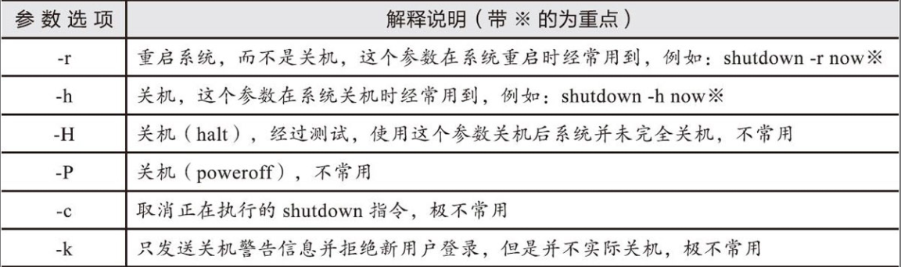
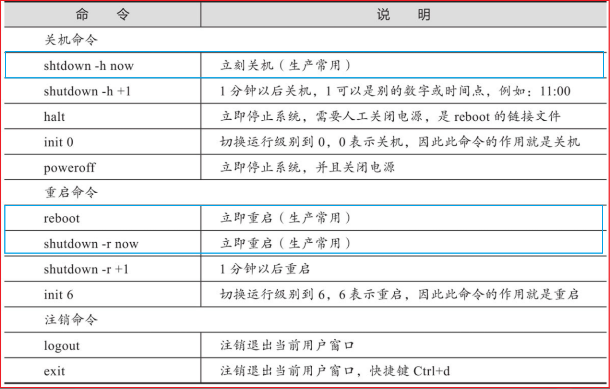
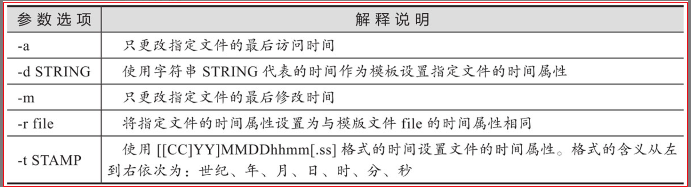
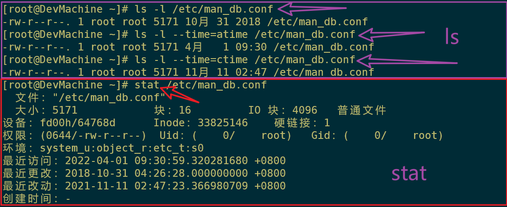
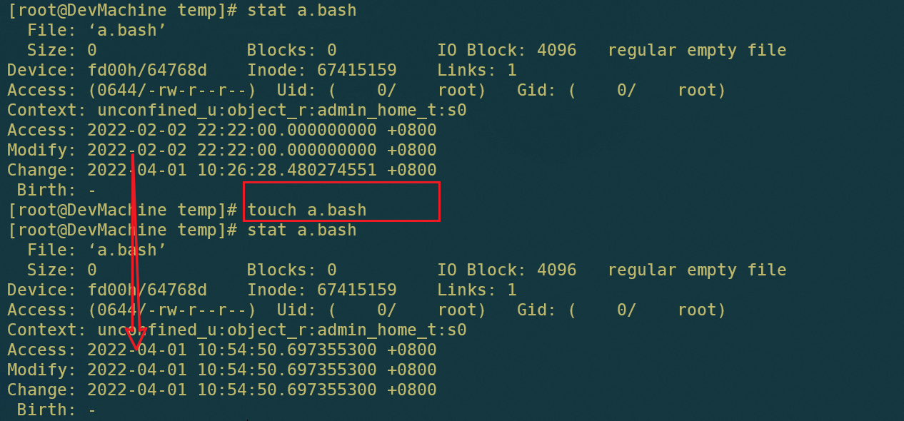
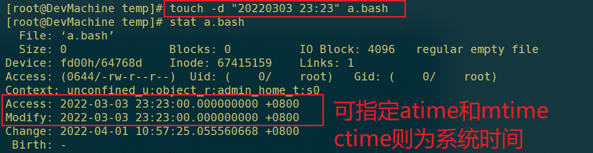
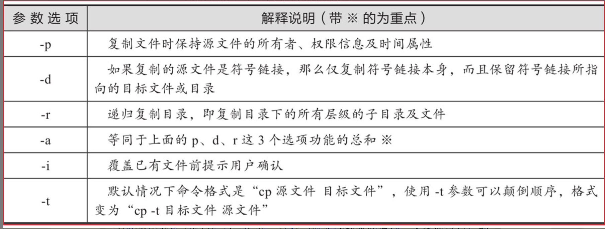
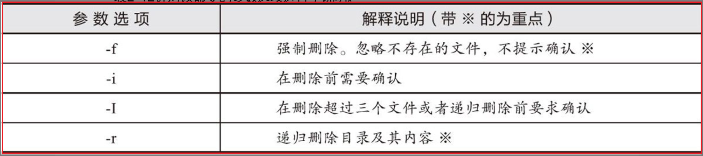
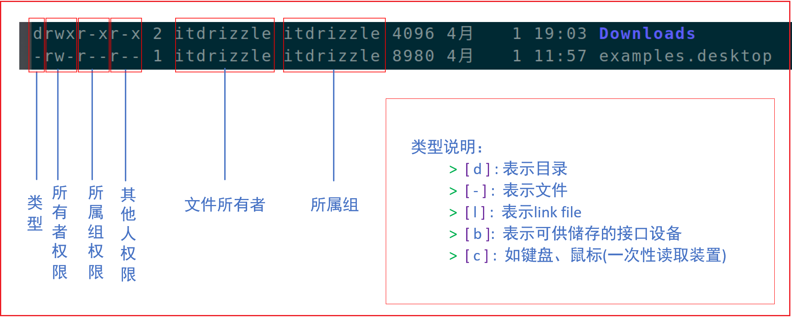

---

order: 10
title:  Linux常用命令
shortTitle: Linux命令
icon: linux01

---


## 一 Linux简介


一些在线网站：

- [鸟哥的 Linux 私房菜 服务器架设篇](http://cn.linux.vbird.org/linux_server/)
- [鸟哥的 Linux 私房菜 基础学习篇](http://cn.linux.vbird.org/linux_basic/linux_basic.php) 


<br/>


### 1. 命令行提示符

Linux命令行结尾的提示符有 “#” 和 “$” 两种不同的符号

```shell
[root@hostname ~]#        # <==这是超级管理员root用户对应的命令行。
[hostname@hostname ~]$    # <==这是普通用户oldboy对应的命令行。
```

> 命令行提示符@前面的字符代表当前登录的用户（可用whoami查询）
>
> @后面的为主机名（可用hostname查询）


<br/>

Linux命令提示符由PS1环境变量控制

```shell
set|grep PS1            # 注意PS要大写

> PS1='[\u@\h \W]\$ '   # 可以通过全局配置文件/etc/bashrc或/etc/profile进行按需配置和调整
```


<br/>


### 2. 查看命令帮助

  ==使用 man 或 --help 获取命令帮助信息==：

man命令是Linux系统中最核心的命令之一，因为通过它可以查看其他Linux命令的使用信息。

当然了，man命令不仅可以查看命令的使用帮助，还可以查看软件服务配置文件、系统调用、库函数等的帮助信息


```shell
man ls                        # 使用man 产看 ls 相关的信息

ls --help                     # --help 虽然有时这个输出很简单，但是相应地查看起来也会更方便
```

工作中建议结合使用，“命令--help”获取的是常用的帮助信息，“man命令”获取的是更多更复杂的帮助信息

<br/>


 ==使用help命令==：

在Linux系统里有一些特殊的命令，它们就是bash程序的内置命令，例如 `cd、history、read` 等，这些命令在系统目录里不存在真实的程序文件（存在于bash程序里），对于这部分命令，查看帮助的方法就是使用help命令

```shell
help cd            # 如果使用man cd，那么通常是查不到帮助信息的，而是会进入bash的帮助页面
```

<br/>


  ==使用info获取帮助信息==：

Linux系统中的info命令是一个查看程序对应文档信息的命令，可以作为man及help命令的帮助补充，不过一般在企业运维工作中，很少会有机会需要使用info去查询命令的使用帮助，因此，知道有这个命令就可以了，普通读者无需关注太多。使用info命令查看命令帮助的语法操作和man类似


<br/>


### 3. 关机重启注销

 ==重启或关机命令：shutdown== 

shutdown是一个用来安全关闭或重启Linux系统的命令，系统在关闭之前会通知所有的登录用户，系统即将关闭，此时所有的新用户都不可以登录，与shutdown功能类似的命令还有init、halt、poweroff、reboot。

1）注意shutdown命令和后面的选项之间至少要有一个空格。

2）通常情况下，我们执行的shutdown命令为 `shutdown -h now` 或 `shutdown -r now`。





> shutdown命令的工作过程就是当用户执行了对应参数并附带关机时间的命令之后，
>
> 通知所有用户即将关机的信息，并且在这个时间段内禁止新用户登录，
>
> 仅当到了指定的关机时间时，shutdown命令才会根据所接收的参数选项，发送请求给系统的init进程，请求将系统调整到对应参数的状态（例如-h参数），系统关机状态实际上对应的是Linux系统里的运行级别0。
>
> 和系统关机相关的运行级别有：0（关机运行级别）-halt，6（重启运行级别）-reboot，更多相关内容可查看/etc/inittab文件。


<br/>

 ==关机与重启命令：halt/poweroff/reboot==：

从RedHat或CentOS 6开始，你会发现halt、poweroff、reboot这三个命令对应的都是同一个man帮助文档，而halt和poweroff命令是reboot命令的链接文件，通常情况下，我们执行这三个命令时都不带任何参数。

> 为什么halt、poweroff命令是reboot命令的链接文件，但是分别执行命令后效果不一样呢？
>
> 查看一下reboot命令的man帮助，可以发现reboot命令有2个参数--halt和--power-off，作用分别和halt、poweroff命令一样。

<br/>




<br/>


### 4. 查看系统信息

linux查看cpu、内存、版本信息

```shell
# 查看CPU信息
cat /proc/cpuinfo | grep name | cut -f2 -d: | uniq -c 
cat /proc/cpuinfo | grep physical | uniq -c 


getconf LONG_BIT   
#32 (说明当前CPU运行在32bit模式下, 但不代表CPU不支持64bit) 

cat /proc/cpuinfo | grep flags | grep ' lm ' | wc -l  
# 8 (结果大于0, 说明支持64bit计算. lm指long mode, 支持lm则是64bit) 


dmidecode | grep "Product Name"    # 查看机器型号 

lsb_release -a  # 查看操作系统版本


# 查看内存信息
free
cat /proc/meminfo  # 查看详细内存信息 

```


<br/>

### 5. Linux语言设置

```shell

locale                  # 查看当前使用的语言

locale -a               # 查看系统中可以使用的语言


vi /etc/locale.conf     # 修改以下内容（LANG="zh_CN.UTF-8" ==> LANG="en_US.UTF-8" ）

#LANG="zh_CN.UTF-8"
LANG="en_US.UTF-8"


```


<br/>


## 二 文件与目录管理


  ==ls：显示目录下的内容及相关属性信息==：

ls 命令是Linux下最常用的指令之一。

ls命令可以理解为英文单词list的缩写，其功能是列出目录的内容及其内容属性信息（list directory contents）。

该命令有点类似于DOS系统下的dir命令，有趣的是，Linux下其实也有dir命令，但我们更习惯于使用ls。

<br/>

**常用参数：** 

| 常用参数 | 参数说明                                         |
| :------: | ------------------------------------------------ |
|    -a    | 显示所有文件及目录 (包括以“.”开头的隐藏文件)     |
|    -l    | 使用长格式列出文件及目录信息                     |
|    -r    | 将文件以相反次序显示(默认依英文字母次序)         |
|    -t    | 根据最后的修改时间排序                           |
|    -A    | 同 -a ，但不列出 “.” (当前目录) 及 “..” (父目录) |
|    -S    | 根据文件大小排序                                 |
|    -R    | 递归列出所有子目录                               |

<br/>

```

stat命令：用于显示文件的状态信息。stat命令的输出信息比ls命令的输出信息要更详细

```


<br/>


  ==pwd：显示当前所在的位置== ：

```shell

pwd命令是 “print working directory” 中每个单词的首字母缩写，其功能是显示当前工作目录的绝对路径。

在实际工作中，我们在命令行操作命令时，经常会在各个目录路径之间进行切换，此时可使用pwd命令快速查看当前我们所在的目录路径。

```


<br>


 ==cd：切换目录==：

```shell

# cd命令是 “change directory” 中每个单词的首字母缩写，其功能是从当前工作目录切换到指定的工作目录。

cd -                 # 返回当前用户上一次所在的目录
cd ..                # 切换到当前目录的上一级目录
cd ~                 # 进入当前用户的家目录
```


<br/>


### 1. mkdir和touch

 ==mkdir：创建目录==：

```shell
# mkdir命令是“make directories”中每个单词的粗体字母组合而成，其功能是创建目录，
# 默认情况下，如果要创建的目录已存在，则会提示此文件已存在；而不会继续创建目录。

mkdir dir1 dir2                # mkdir命令可以同时创建多个目录


# 使用-p参数递归创建目录, 加-v参数显示创建目录的过程(其实这个-v没有什么实际用途)
mkdir -p dir/test
mkdir -pv dir/test
```

使用mkdir创建多级目录时，建议直接使用-p参数，可以避免出现“No such file or directory”这样没有文件或目录的报错了，不会影响已存在的目录。

<br/>

```shell
# 同时创建多个目录及多级子目录 (注意大括号内不能有空格)

mkdir -pv dir/{dir_1,dir_2}/{dir_a,dir_b}

```


<br/>


 ==touch：创建空文件或改变文件的时间戳属性==：

touch命令有两个功能：一是创建新的空文件；二是改变已有文件的时间戳属性。

特别说明：

1）注意区分touch和mkdir命令的功能，mkdir命令是创建空目录，而touch是创建空文件。

2）在Linux中，一切皆文件。虽然touch命令不能创建目录，但是可以修改目录的时间戳。



<br/>

```shell

touch a.txt b.txt          # 创建多个文件

touch log{01..05}          # log01  log02  log03  log04  log05  (注意是两个点)

```

<br/>


### 2. 修改文件时间

 ==文件时间==：

- **modifiy time (mtime)**：

  当该文件的『内容』变更时，就会升级这个时间！内容数据指的是文件的内容，而不是文件的属性或权限喔！

- **changetime (ctime)**：

  当该文件的『状态 (status)』改变时，就会升级这个时间，举例来说，像是权限与属性被更改了，都会升级这个时间啊。

- **access time (atime)**：

  当『该文件的内容被读取』时，就会升级这个读取时间 (access)。

  举例来说，我们使用 cat 去读取 /etc/man_db.conf， 就会升级该文件的 atime 了。

```shell

# 查看 文件时间

ls -l 文件名                      # 查看 mtime

ls -l --time=ctime 文件名         # 查看 ctime

ls -l --time=atime 文件名         # 查看 atime

```

示例：



<br/>

```shell

touch 这个命令的两个常见功能：

1. 创建一个空的文件；

2. 将某个文件的所有日期更新为系统当前时间， 或将(mtime 与 atime)修改为指定时间 

```

<br/>



<br/>



<br/>

change time 只能通过修改系统时间来自定义（但是一般情况下修改系统时间需要root权限）

```shell

[root@DevMachine temp]# date -s 06/06/2022 >> a.bash

# 文件的atime和mtime已经改变，但是ctime时间没变
[root@DevMachine temp]# stat a.bash
  File: ‘a.bash’
  Size: 29              Blocks: 8          IO Block: 4096   regular file
Device: fd00h/64768d    Inode: 67415159    Links: 1
Access: (0644/-rw-r--r--)  Uid: (    0/    root)   Gid: (    0/    root)
Context: unconfined_u:object_r:admin_home_t:s0
Access: 2022-03-03 23:23:00.000000000 +0800
Modify: 2022-06-06 00:00:00.000000000 +0800
Change: 2022-06-06 00:00:00.000000000 +0800
 Birth: -
 
#此时系统时间已经改变
[root@DevMachine temp]# date "+%F %T"
2022-06-06 00:00:56

# 更新系统时间为正常时间
[root@DevMachine temp]# /usr/sbin/ntpdate ntp.api.bz
 1 Apr 11:21:35 ntpdate[1803]: step time server 114.118.7.161 offset -5661630.439834 sec

# 系统时间已经更新正常
[root@DevMachine temp]# date "+%F %T"
2022-04-01 11:21:44

# 系统时间已经还原，ctime修改已完成
[root@DevMachine temp]# stat a.bash
  File: ‘a.bash’
  Size: 29              Blocks: 8          IO Block: 4096   regular file
Device: fd00h/64768d    Inode: 67415159    Links: 1
Access: (0644/-rw-r--r--)  Uid: (    0/    root)   Gid: (    0/    root)
Context: unconfined_u:object_r:admin_home_t:s0
Access: 2022-03-03 23:23:00.000000000 +0800
Modify: 2022-06-06 00:00:00.000000000 +0800
Change: 2022-06-06 00:00:00.000000000 +0800
 Birth: -
 
```


<br/>


### 3. 复制移动删除

 ==cp：复制文件或目录==:

cp命令可以理解为英文单词copy的缩写，其功能为复制文件或目录。




```shell

cp /etc/ssh/sshd_config /etc/ssh/sshd_config.ori

```


<br/>

 ==mv：移动或重命名文件==:

mv命令可以理解为英文单词move的缩写，其功能是移动或重命名文件（move/rename files）

```shell

mv a.txt b.txt             # 若b.txt 不存在，则将 a.txt 重命名为 b.txt

```


<br/>

  ==rm：删除文件或目录==:

rm命令可以理解为英文单词remove的缩写，其功能是删除一个或多个文件或目录（remove files or directories）。

这是Linux系统里最危险的命令之一，请慎重使用。




```shell

rm -rf dir                   # 递归强制删除dir目录及其内部文件和目录

```


<br/>

 ==rmdir：删除空目录==:

rmdir命令用于删除空目录（remove empty directories），当目录不为空时，命令不起作用

rmdir命令在实际工作中使用的极少


<br/>


### 4. 查看文件内容

  ==cat、tac、nl 直接查看文件内容== : 

- cat 由第一行开始显示文件内容，cat 是 Concatenate （连续）的简写
- tac 从最后一行开始显示，可以看出 tac 是 cat 的倒著写！
- nl  显示的时候，顺道输出行号！

这些命令在文件行数较多时使用并不方便、推荐使用下面介绍的 more 和 less


<br/>

  ==more、less 分页查看文件== : 

- more 一页一页的显示文件内容

  ```shell
  空白键 (space)  ：代表向下翻一页；
  Enter          ：代表向下翻『一行』；
  /字串           ：代表在这个显示的内容当中，向下搜寻『字串』这个关键字；
  :f             ：立刻显示出档名以及目前显示的行数；
  q              ：代表立刻离开 more ，不再显示该文件内容。
  b 或 [ctrl]-b  ：代表往回翻页，不过这动作只对文件有用，对管线无用。
  ```

  <br>

- less 与 more 类似，但是比 more 更好的是，他可以往前翻页！

  ```
  空白键       ：向下翻动一页；
  [pagedown]  ：向下翻动一页；
  [pageup]    ：向上翻动一页；
  /字串        ：向下搜寻『字串』的功能；
  ?字串        ：向上搜寻『字串』的功能；
  n           ：重复前一个搜寻 (与 / 或 ? 有关！)
  N           ：反向的重复前一个搜寻 (与 / 或 ? 有关！)
  q           ：退出 less 这个程序；
  ```


<br/>

  ==head、tail 从头（尾）查看文件（指定行数）== : 		

- head  只看头几行 （若没有加上 -n 这个选项时，默认只显示十行）
- tail     只看尾巴几行 （默认也是显示十行，若要显示非十行，就加 -n number 的选项即可）

```shell

head -n 1 /etc/my.cnf            # 查看第一行文件

tail -n +100 /etc/man_db.conf    # 代表该文件从100行以后都会被列出来

```

<br/>

```shell 

# 例题：假如我想要显示 /etc/man.config 的第 11 到第 20 行呢？

# 答：先取前 20 行，再取后十行，所以结果就是：

head -n 20 /etc/man_db.conf | tail -n 10 

```


<br/>


### 5. 压缩和解压缩

```shell 
在Linux操作系统中，默认支持两种压缩格式
	1   .tar.gz
	2   .zip
	
	
不同的压缩格式可以使用不同的软件来解压与压缩

 1  .tar.gz  这种压缩格式其实是Linux比较传统的压缩格式，需要借助于tar命令
   
     tar -zcvf name.tar.gz test            # 压缩
  
     tar -zxvf name.tar.gz -C targetDir    # 解压   -C 表示解压到指定的路径下
 
   
 2   .zip
 
    zip name.zip fileName                   # 压缩
  
    unzip name.zip                          # 解压
  
```


<br/>


### 6. 追加与重定向

```shell

重定向：可以把控制台输出的内容重定向到文件中。
	   如果文件不存在，那么会创建文件
	   如果文件已经存在，那么会覆盖文件中的内容
	   echo 'bob' > 1.txt
	   ll > 2.txt
	   
	   
追加： 其实就是在指定文件的末尾追加控制台输出的内容
	  不会覆盖原来文件中的内容
	  如果文件不存在，依然会创建文件
	  ll >> 2.txt

```


<br/>


## 三 用户与权限管理

### 1. 用户和组管理

用户管理：

```shell

sudo useradd -m -s /bin/bash username         # 创建 `username` 用户
#  useradd     创建用户的命令
#  -m          指创建用户逇同时给这个用户创建一个家目录
#  -s          指定shell的版本为bash
#  username：  用户名称


sudo userdel [-r] username                    # 删除用户
#  userdel     删除用户的命令
#  -r          指删除用户的同事，还要删除用户的家目录
#  username：  用户名


sudo passwd username                          # 给用户设置密码


su username                                   # 切换用户

```

<br/>


组管理：

```shell

# 添加组
sudo groupadd groupName

# 添加用户的时候指定组
sudo useradd -m -s /bin/bash -g groupName username

# 查询用户所属的组的信息
id username

# 修改组
sudo usermod -g groupName username

```


<br/>


### 2. 文件权限管理

Linux里面，任何一个文件都具有『User, Group及Others』三种身份的权限



<br/>

rwx这三个参数对文件和目录的意义是不同的，如下：

| 参数 |      文件       |               目录               | 权限分数 |
| :--: | :-------------: | :------------------------------: | :------: |
|  r   |   可读(read)    |  r (read contents in directory)  |    4     |
|  w   |   可写(write)   | w (modify contents of directory) |    2     |
|  x   | 可执行(execute) |       x (access directory)       |    1     |

<br/>

```shell

r (read)：     可读取此一文件的实际内容，如读取文本文件的文字内容等；
w (write)：    可以编辑、新增或者是修改该文件的内容(但不含删除该文件)；
x (execute)：  该文件具有可以被系统执行的权限。


r (read contents in directory)：
表示具有读取目录结构列表的权限，所以当你具有读取(r)一个目录的权限时，表示你可以查询该目录下的文件名数据。 
所以你就可以利用 ls 这个指令将该目录的内容列表显示出来！

w (modify contents of directory)：
可写入权限对目录来说表示你具有操作该目录结构列表的权限，也就是底下这些权限：
    - 建立新的文件与目录；
    - 删除已经存在的文件与目录(不论该文件的权限为何！)
    - 将已存在的文件或目录进行更名；
    - 移动该目录内的文件、目录位置。

x (access directory)：
目录不可以被执行，目录的x代表的是用户能否进入该目录成为工作目录的用途！ 
所谓的工作目录(work directory)就是你目前所在的目录！
举例来说，当你登入Linux时， 你所在的家目录就是你当下的工作目录。而变换目录的指令是『cd』(change directory)

```

<br/>


  ==chmod：修改文件的权限==: 

```shell

# 方式一：
sudo chmod u=rwx,g=rw,o=r fileName
# u：表示文件拥有者
# g：表示同组的成员
# o：表示其他组的成员


# 方式二：通过数字来指代权限
sudo chmod 764 fileName

```

<br/>

```shell

# 一些常见情景例：

如果要将该文件变成可执行文件，并且不让其他人修改的话， 那么就需要 -rwxr-xr-x 这样的权限，即 chmod 755 test.sh 

如果有些文件你不希望被其他人看到，那么应该将文件的权限设定为： -rwxr----- ， 即 chmod 740 filename 

```


<br/>


## 四 进程与服务管理

### 1. Linux进程管理

```shell

# 查看进程
ps
# -e 显示所有的进程
# -f 全格式

# a 表示显示终端上所有的进程
# u 以用户的格式来显示进程信息
# x 显示后台运行的进程


# 一般查询进程，分为两种方式 ps -ef 、 ps aux
ps -ef  可以显示父进程的信息
ps aux  可以显示进程占用的资源信息


# 搜索进程（常用）
ps -ef | grep 进程名或进程id
ps aux | grep 进程名或进程id


# 关闭进程
kill -9 pid      # 强制关闭进程，从操作系统内核级别杀死进程
kill -15 pid     # 让内核通知应用主动关闭

```


<br/>

### 2. Linux服务管理

在Linux系统中，服务管理是一个非常重要的任务，涉及到启动、停止、重启、查看状态等操作。传统的Linux系统使用 `init` 作为初始化进程，而近年来，越来越多的Linux发行版转而使用 `systemd` 作为初始化系统。

- **init 系统**：服务通过 `/etc/init.d/` 下的脚本进行管理，命令相对简单。
- **systemd 系统**：服务通过 `systemctl` 命令进行管理，提供了更多的功能和灵活性。

如果不确定当前系统使用的是哪种初始化系统，可以通过以下命令来确认：

```sh
cat /proc/1/comm
```

如果输出是 `systemd`，则当前系统使用的是 `systemd` 初始化系统。如果输出是 `sysvinit` 或其他类似的字符串，则当前系统使用的是传统的 `init` 系统。

### 1. init 系统下的服务管理

在使用 `init` 系统的传统Linux发行版中，服务通常通过 `/etc/init.d/` 目录下的脚本来控制。服务脚本通常遵循一定的命名规则，例如 `service_name.sh`。

#### 常见命令：

- **启动服务**：
  ```sh
  /etc/init.d/service_name start
  ```

- **停止服务**：
  ```sh
  /etc/init.d/service_name stop
  ```

- **重启服务**：
  ```sh
  /etc/init.d/service_name restart
  ```

- **重新加载配置文件**：
  ```sh
  /etc/init.d/service_name reload
  ```

- **查看服务状态**：
  ```sh
  /etc/init.d/service_name status
  ```

- **设置服务开机启动**：
  在 `init` 系统下，可以使用 `chkconfig`（对于支持 `chkconfig` 的发行版）或手动编辑 `/etc/rc.local` 文件来设置服务开机启动。

  ```sh
  chkconfig --add service_name
  chkconfig service_name on
  ```

### 2. systemd 系统下的服务管理

`systemd` 是一种现代化的初始化系统，提供了更为丰富的功能和更精细的服务控制。在使用 `systemd` 的Linux发行版中，服务由 `.service` 文件控制，通常位于 `/lib/systemd/system/` 或 `/etc/systemd/system/` 目录下。

#### 常见命令：

- **启动服务**：
  ```sh
  sudo systemctl start service_name.service
  ```

- **停止服务**：
  ```sh
  sudo systemctl stop service_name.service
  ```

- **重启服务**：
  ```sh
  sudo systemctl restart service_name.service
  ```

- **重新加载配置文件**：
  ```sh
  sudo systemctl reload-or-restart service_name.service
  ```

- **查看服务状态**：
  ```sh
  sudo systemctl status service_name.service
  ```

- **设置服务开机启动**：
  ```sh
  sudo systemctl enable service_name.service
  ```

- **取消服务开机启动**：
  ```sh
  sudo systemctl disable service_name.service
  ```

- **查看所有已启用的服务**：
  ```sh
  sudo systemctl list-unit-files --type=service --state=enabled
  ```

- **查看所有已禁用的服务**：
  ```sh
  sudo systemctl list-unit-files --type=service --state=disabled
  ```

### 示例

假设我们要管理名为 `nginx` 的服务。

#### 在 `init` 系统下：

```sh
/etc/init.d/nginx start
/etc/init.d/nginx stop
/etc/init.d/nginx restart
/etc/init.d/nginx status
```

#### 在 `systemd` 系统下：

```sh
sudo systemctl start nginx.service
sudo systemctl stop nginx.service
sudo systemctl restart nginx.service
sudo systemctl status nginx.service
sudo systemctl enable nginx.service
sudo systemctl disable nginx.service
```


<br/>


## 五 SSH和网络管理

### 1. 常用网络工具

```shell

# 安装网络管理工具
sudo apt install net-tools

# 查看ip
ifconfig

# 通过网络中的心跳机制查看网络是否正常
ping ip


# 端口号查询
netstat -anp | grep port

lsof -i:port

# windows下
netstat -ano | findstr port

```


<br/>


### 2. SSH远程连接

```shell

# 首先需要给远程服务器（Linux服务器）安装ssh

## 搜索ssh是否已经安装
ps -ef | grep ssh


# 假如没有搜索到，则需要安装ssh服务
apt update

# 安装ssh
sudo apt install openssh-server

# 重启ssh
sudo service ssh restart 

# 执行完了以上指令之后，我们可以搜索ssh服务是否已经启动
ps -ef | grep ssh

```

阿里云、华为云、腾讯云等云服务器会默认安装好ssh服务。


<br/>


### 3. Linux防火墙


Centos7默认是开启防火墙的：

```bash

# 1、查看防火墙的配置
firewall-cmd --state
firewall-cmd --list-all

# 开启防火墙
systemctl start firewalld


# 开放某个端口 （ 以80端口为例 ）
firewall-cmd --permanent --add-port=80/tcp
firewall-cmd --reload    #重新加载防火墙配置才会起作用

# 移除以上规则
firewall-cmd --permanent --remove-port=80/tcp
firewall-cmd --reload


# 放通某个端口段
firewall-cmd --permanent --zone=public --add-port=1000-2000/tcp
firewall-cmd --reload

```

<br>

IP限制：

```bash

# 放通某个IP访问，默认允许
firewall-cmd --permanent --add-rich-rule='rule family=ipv4 source address=192.168.1.169 accept'
firewall-cmd --reload

# 禁止某个IP访问
firewall-cmd --permanent --add-rich-rule='rule family=ipv4 source address=10.0.0.42 drop'
firewall-cmd --reload

# 放通某个IP访问某个端口
firewall-cmd --permanent --add-rich-rule='rule family=ipv4 source address=192.168.1.169 port protocol=tcp port=6379 accept'
firewall-cmd --reload

# 移除以上规则
firewall-cmd --permanent --remove-rich-rule='rule family="ipv4" source address="192.168.1.169" port port="6379" protocol="tcp" accept'
firewall-cmd --reload

# 放通某个IP段访问
firewall-cmd --permanent --add-rich-rule='rule family=ipv4 source address=10.0.0.0/24 accept'

```


<br>


## 六 系统工具Systemd 

Systemd 是 Linux 系统工具，用来启动守护进程， 已成为大多数发行版的标准配置。

历史上，Linux 的启动一直采用 `init` 进程、下面的命令用来启动服务：

```shell

$ sudo /etc/init.d/apache start

# 或者
$ service apache start

```

这种方法有两个缺点

- 一是启动时间长。`init`进程是串行启动，只有前一个进程启动完，才会启动下一个进程。

- 二是启动脚本复杂。`init`进程只是执行启动脚本，不管其他事情。脚本需要自己处理各种情况，这往往使得脚本变得很长。

<br/>

Systemd 就是为了解决这些问题而诞生的。它的设计目标是，为系统的启动和管理提供一套完整的解决方案。

根据 Linux 惯例，字母`d`是守护进程（daemon）的缩写。 Systemd 这个名字的含义，就是它要守护整个系统.

<br/>

**Systemd 架构图**：


<br/>

使用了 Systemd，就不需要再用`init`了。

Systemd 取代了`initd`，成为系统的第一个进程（PID 等于 1），其他进程都是它的子进程。

Systemd 的优点是功能强大，使用方便，缺点是体系庞大，非常复杂。

Systemd 并不是一个命令，而是一组命令，涉及到系统管理的方方面面.

<br/>

```shell

$ systemctl --version             # 查看 Systemd 的版本

```


<br/>


### 1. Systemd系统管理

**systemctl**：`systemctl`是 Systemd 的主命令，用于管理系统。

```shell

# 重启系统
$ sudo systemctl reboot

# 关闭系统，切断电源
$ sudo systemctl poweroff

# CPU停止工作
$ sudo systemctl halt

# 暂停系统
$ sudo systemctl suspend

# 让系统进入冬眠状态
$ sudo systemctl hibernate

# 让系统进入交互式休眠状态
$ sudo systemctl hybrid-sleep

# 启动进入救援状态（单用户状态）
$ sudo systemctl rescue

```

<br/>

**systemd-analyze**：`systemd-analyze`命令用于查看启动耗时。

```shell
# 查看启动耗时
$ systemd-analyze                                                                                       

# 查看每个服务的启动耗时
$ systemd-analyze blame

# 显示瀑布状的启动过程流
$ systemd-analyze critical-chain

# 显示指定服务的启动流
$ systemd-analyze critical-chain atd.service
```

<br/>

**hostnamectl**：`hostnamectl`命令用于查看当前主机的信息。

```shell
# 显示当前主机的信息
$ hostnamectl

# 设置主机名。
$ sudo hostnamectl set-hostname rhel7

```

<br/>

**localectl**：`localectl`命令用于查看本地化设置。

```shell
# 查看本地化设置
$ localectl

# 设置本地化参数。
$ sudo localectl set-locale LANG=en_GB.utf8
$ sudo localectl set-keymap en_GB

```

<br/>

**timedatectl**：`timedatectl`命令用于查看当前时区设置。

```bash
# 查看当前时区设置
$ timedatectl

# 显示所有可用的时区
$ timedatectl list-timezones                                                                                   

# 设置当前时区
$ sudo timedatectl set-timezone America/New_York
$ sudo timedatectl set-time YYYY-MM-DD
$ sudo timedatectl set-time HH:MM:SS

```

<br/>

**loginctl**：`loginctl`命令用于查看当前登录的用户。

```bash
# 列出当前session
$ loginctl list-sessions

# 列出当前登录用户
$ loginctl list-users

# 列出显示指定用户的信息
$ loginctl show-user username

```


### 2. Systemd系统资源

**Unit** 含义：Systemd 可以管理所有系统资源。不同的资源统称为 Unit（单位）。Unit 一共分成12种。

- Service unit：系统服务
- Target unit：多个 Unit 构成的一个组
- Device Unit：硬件设备
- Mount Unit：文件系统的挂载点
- Automount Unit：自动挂载点
- Path Unit：文件或路径
- Scope Unit：不是由 Systemd 启动的外部进程
- Slice Unit：进程组
- Snapshot Unit：Systemd 快照，可以切回某个快照
- Socket Unit：进程间通信的 socket
- Swap Unit：swap 文件
- Timer Unit：定时器


<br/>


`systemctl list-units` 命令可以查看当前系统的所有 Unit 

```bash
# 列出正在运行的 Unit
$ systemctl list-units

# 列出所有Unit，包括没有找到配置文件的或者启动失败的
$ systemctl list-units --all

# 列出所有没有运行的 Unit
$ systemctl list-units --all --state=inactive

# 列出所有加载失败的 Unit
$ systemctl list-units --failed

# 列出所有正在运行的、类型为 service 的 Unit
$ systemctl list-units --type=service

```


### 3. Unit状态和管理

`systemctl status`命令用于查看系统状态和单个 Unit 的状态。

```bash
# 显示系统状态
$ systemctl status

# 显示单个 Unit 的状态
$ sysystemctl status bluetooth.service

# 显示远程主机的某个 Unit 的状态
$ systemctl -H root@rhel7.example.com status httpd.service

```

<br/>

除了`status`命令，`systemctl`还提供了三个查询状态的简单方法，主要供脚本内部的判断语句使用。

```bash
# 显示某个 Unit 是否正在运行
$ systemctl is-active application.service

# 显示某个 Unit 是否处于启动失败状态
$ systemctl is-failed application.service

# 显示某个 Unit 服务是否建立了启动链接
$ systemctl is-enabled application.service
```

<br/>

**Unit 管理**：对于用户来说，最常用的是下面这些命令，用于启动和停止 Unit（主要是 service）。

```bash
# 立即启动一个服务
$ sudo systemctl start apache.service

# 立即停止一个服务
$ sudo systemctl stop apache.service

# 重启一个服务
$ sudo systemctl restart apache.service

# 杀死一个服务的所有子进程
$ sudo systemctl kill apache.service

# 重新加载一个服务的配置文件
$ sudo systemctl reload apache.service


# 重载所有修改过的配置文件
$ sudo systemctl daemon-reload

# 显示某个 Unit 的所有底层参数
$ systemctl show httpd.service

# 显示某个 Unit 的指定属性的值
$ systemctl show -p CPUShares httpd.service

# 设置某个 Unit 的指定属性
$ sudo systemctl set-property httpd.service CPUShares=500

```


<br/>


### 4. Unit的配置文件

每一个 Unit 都有一个配置文件，告诉 Systemd 怎么启动这个 Unit 。

Systemd 默认从目录 `/etc/systemd/system/` 读取配置文件。

但是，里面存放的大部分文件都是符号链接，指向目录`/usr/lib/systemd/system/`，真正的配置文件存放在那个目录。

<br/>

`systemctl enable` 命令用于在上面两个目录之间，建立符号链接关系。

> ```bash
> 
> $ sudo systemctl enable clamd@scan.service
> 
> # 等同于
> $ sudo ln -s '/usr/lib/systemd/system/clamd@scan.service' '/etc/systemd/system/multi-user.target.wants/clamd@scan.service'
> 
> ```


如果配置文件里面设置了开机启动，`systemctl enable` 命令相当于激活开机启动。


与之对应的，`systemctl disable`命令用于在两个目录之间，撤销符号链接关系，相当于撤销开机启动。


> ```bash
> $ sudo systemctl disable clamd@scan.service
> ```


配置文件的后缀名，就是该 Unit 的种类，比如`sshd.socket`。

如果省略，Systemd 默认后缀名为`.service`，所以`sshd`会被理解成 `sshd.service`。

<br/>


#### 配置文件的状态

`systemctl list-unit-files`命令用于列出所有配置文件。

> ```bash
> # 列出所有配置文件
> $ systemctl list-unit-files
> 
> # 列出指定类型的配置文件
> $ systemctl list-unit-files --type=service
> 
> ```


这个命令会输出一个列表。

> ```bash
> $ systemctl list-unit-files
> 
> UNIT FILE              STATE
> chronyd.service        enabled
> clamd@.service         static
> clamd@scan.service     disabled
> ```

这个列表显示每个配置文件的状态，一共有四种。

> - enabled：已建立启动链接
> - disabled：没建立启动链接
> - static：该配置文件没有`[Install]`部分（无法执行），只能作为其他配置文件的依赖
> - masked：该配置文件被禁止建立启动链接


注意，从配置文件的状态无法看出，该 Unit 是否正在运行。这必须执行前面提到的`systemctl status`命令。

> ```bash
> $ systemctl status bluetooth.service
> ```


一旦修改配置文件，就要让 SystemD 重新加载配置文件，然后重新启动，否则修改不会生效。

> ```bash
> $ sudo systemctl daemon-reload
> $ sudo systemctl restart httpd.service
> ```

<br/>


#### 配置文件的格式

配置文件就是普通的文本文件，可以用文本编辑器打开。

`systemctl cat` 命令可以查看配置文件的内容。

> ```bash
> $ systemctl cat atd.service
> 
> [Unit]
> Description=ATD daemon
> 
> [Service]
> Type=forking
> ExecStart=/usr/bin/atd
> 
> [Install]
> WantedBy=multi-user.target
> ```

从上面的输出可以看到，配置文件分成几个区块。每个区块的第一行，是用方括号表示的区别名，比如`[Unit]`。

注意，配置文件的区块名和字段名，都是大小写敏感的。

每个区块内部是一些等号连接的键值对。

> ```bash
> [Section]
> Directive1=value
> Directive2=value
> 
> . . .
> ```

注意，键值对的等号两侧不能有空格。

<br/>


#### 配置文件的区块

`[Unit]`区块通常是配置文件的第一个区块，用来定义 Unit 的元数据，以及配置与其他 Unit 的关系。它的主要字段如下。

> - `Description`：简短描述
> - `Documentation`：文档地址
> - `Requires`：当前 Unit 依赖的其他 Unit，如果它们没有运行，当前 Unit 会启动失败
> - `Wants`：与当前 Unit 配合的其他 Unit，如果它们没有运行，当前 Unit 不会启动失败
> - `BindsTo`：与`Requires`类似，它指定的 Unit 如果退出，会导致当前 Unit 停止运行
> - `Before`：如果该字段指定的 Unit 也要启动，那么必须在当前 Unit 之后启动
> - `After`：如果该字段指定的 Unit 也要启动，那么必须在当前 Unit 之前启动
> - `Conflicts`：这里指定的 Unit 不能与当前 Unit 同时运行
> - `Condition...`：当前 Unit 运行必须满足的条件，否则不会运行
> - `Assert...`：当前 Unit 运行必须满足的条件，否则会报启动失败

<br/>


`[Service]`区块用来 Service 的配置，只有 Service 类型的 Unit 才有这个区块。它的主要字段如下。

> - `Type`：定义启动时的进程行为。它有以下几种值。
> - `Type=simple`：默认值，执行`ExecStart`指定的命令，启动主进程
> - `Type=forking`：以 fork 方式从父进程创建子进程，创建后父进程会立即退出
> - `Type=oneshot`：一次性进程，Systemd 会等当前服务退出，再继续往下执行
> - `Type=dbus`：当前服务通过D-Bus启动
> - `Type=notify`：当前服务启动完毕，会通知`Systemd`，再继续往下执行
> - `Type=idle`：若有其他任务执行完毕，当前服务才会运行
> - `ExecStart`：启动当前服务的命令
> - `ExecStartPre`：启动当前服务之前执行的命令
> - `ExecStartPost`：启动当前服务之后执行的命令
> - `ExecReload`：重启当前服务时执行的命令
> - `ExecStop`：停止当前服务时执行的命令
> - `ExecStopPost`：停止当其服务之后执行的命令
> - `RestartSec`：自动重启当前服务间隔的秒数
> - `Restart`：定义何种情况 Systemd 会自动重启当前服务，可能的值包括`always`（总是重启）、`on-success`、`on-failure`、`on-abnormal`、`on-abort`、`on-watchdog`
> - `TimeoutSec`：定义 Systemd 停止当前服务之前等待的秒数
> - `Environment`：指定环境变量

<br/>


`[Install]`通常是配置文件的最后一个区块，用来定义如何启动，以及是否开机启动。它的主要字段如下。

> - `WantedBy`：它的值是一个或多个 Target，当前 Unit 激活时（enable）符号链接会放入`/etc/systemd/system`目录下面以 Target 名 + `.wants`后缀构成的子目录中
> - `RequiredBy`：它的值是一个或多个 Target，当前 Unit 激活时，符号链接会放入`/etc/systemd/system`目录下面以 Target 名 + `.required`后缀构成的子目录中
> - `Alias`：当前 Unit 可用于启动的别名
> - `Also`：当前 Unit 激活（enable）时，会被同时激活的其他 Unit

<br/>

Unit 配置文件的完整字段清单，请参考[官方文档](https://www.freedesktop.org/software/systemd/man/systemd.unit.html) 


<br/>


### 5. Target(Unit 组)

启动计算机的时候，需要启动大量的 Unit。如果每一次启动，都要一一写明本次启动需要哪些 Unit，显然非常不方便。

Systemd 的解决方案就是 Target。

简单说，Target 就是一个 Unit 组，包含许多相关的 Unit 。启动某个 Target 的时候，Systemd 就会启动里面所有的 Unit。

从这个意义上说，Target 这个概念类似于"状态点"，启动某个 Target 就好比启动到某种状态。

传统的`init`启动模式里面，有 RunLevel 的概念，跟 Target 的作用很类似。

不同的是，RunLevel 是互斥的，不可能多个 RunLevel 同时启动，但是多个 Target 可以同时启动。

> ```bash
> 
> # 查看当前系统的所有 Target
> $ systemctl list-unit-files --type=target
> 
> # 查看一个 Target 包含的所有 Unit
> $ systemctl list-dependencies multi-user.target
> 
> # 查看启动时的默认 Target
> $ systemctl get-default
> 
> # 设置启动时的默认 Target
> $ sudo systemctl set-default multi-user.target
> 
> # 切换 Target 时，默认不关闭前一个 Target 启动的进程，
> # systemctl isolate 命令改变这种行为，
> # 关闭前一个 Target 里面所有不属于后一个 Target 的进程
> $ sudo systemctl isolate multi-user.target
> 
> ```

<br/>

Target 与 传统 RunLevel 的对应关系如下。

> ```bash
> Traditional runlevel      New target name     Symbolically linked to...
> 
> Runlevel 0           |    runlevel0.target -> poweroff.target
> Runlevel 1           |    runlevel1.target -> rescue.target
> Runlevel 2           |    runlevel2.target -> multi-user.target
> Runlevel 3           |    runlevel3.target -> multi-user.target
> Runlevel 4           |    runlevel4.target -> multi-user.target
> Runlevel 5           |    runlevel5.target -> graphical.target
> Runlevel 6           |    runlevel6.target -> reboot.target
> ```

<br/>

它与`init`进程的主要差别如下。

> **（1）默认的 RunLevel**（在`/etc/inittab`文件设置）现在被默认的 Target 取代，
>
> ​		位置是`/etc/systemd/system/default.target`，通常符号链接到`graphical.target`（图形界面）
>
>   	  或者`multi-user.target`（多用户命令行）。
>
> **（2）启动脚本的位置**，以前是`/etc/init.d`目录，符号链接到不同的 RunLevel 目录 （比如`/etc/rc3.d`、`/etc/rc5.d`等），
>
> ​         现在则存放在`/lib/systemd/system`和`/etc/systemd/system`目录。
>
> **（3）配置文件的位置**，以前`init`进程的配置文件是`/etc/inittab`，各种服务的配置文件存放在`/etc/sysconfig`目录。
>
> ​         现在的配置文件主要存放在`/lib/systemd`目录，在`/etc/systemd`目录里面的修改可以覆盖原始设置。


<br/>


### 6. Systemd日志管理

Systemd 统一管理所有 Unit 的启动日志。

带来的好处就是，可以只用`journalctl`一个命令，查看所有日志（内核日志和应用日志）。

日志的配置文件是`/etc/systemd/journald.conf`。

`journalctl`功能强大，用法非常多。

> ```bash
> # 查看所有日志（默认情况下 ，只保存本次启动的日志）
> $ sudo journalctl
> 
> # 查看内核日志（不显示应用日志）
> $ sudo journalctl -k
> 
> # 查看系统本次启动的日志
> $ sudo journalctl -b
> $ sudo journalctl -b -0
> 
> # 查看上一次启动的日志（需更改设置）
> $ sudo journalctl -b -1
> 
> # 查看指定时间的日志
> $ sudo journalctl --since="2012-10-30 18:17:16"
> $ sudo journalctl --since "20 min ago"
> $ sudo journalctl --since yesterday
> $ sudo journalctl --since "2015-01-10" --until "2015-01-11 03:00"
> $ sudo journalctl --since 09:00 --until "1 hour ago"
> 
> # 显示尾部的最新10行日志
> $ sudo journalctl -n
> 
> # 显示尾部指定行数的日志
> $ sudo journalctl -n 20
> 
> # 实时滚动显示最新日志
> $ sudo journalctl -f
> 
> # 查看指定服务的日志
> $ sudo journalctl /usr/lib/systemd/systemd
> 
> # 查看指定进程的日志
> $ sudo journalctl _PID=1
> 
> # 查看某个路径的脚本的日志
> $ sudo journalctl /usr/bin/bash
> 
> # 查看指定用户的日志
> $ sudo journalctl _UID=33 --since today
> 
> # 查看某个 Unit 的日志
> $ sudo journalctl -u nginx.service
> $ sudo journalctl -u nginx.service --since today
> 
> # 实时滚动显示某个 Unit 的最新日志
> $ sudo journalctl -u nginx.service -f
> 
> # 合并显示多个 Unit 的日志
> $ journalctl -u nginx.service -u php-fpm.service --since today
> 
> # 查看指定优先级（及其以上级别）的日志，共有8级
> # 0: emerg
> # 1: alert
> # 2: crit
> # 3: err
> # 4: warning
> # 5: notice
> # 6: info
> # 7: debug
> $ sudo journalctl -p err -b
> 
> # 日志默认分页输出，--no-pager 改为正常的标准输出
> $ sudo journalctl --no-pager
> 
> # 以 JSON 格式（单行）输出
> $ sudo journalctl -b -u nginx.service -o json
> 
> # 以 JSON 格式（多行）输出，可读性更好
> $ sudo journalctl -b -u nginx.serviceqq
>  -o json-pretty
> 
> # 显示日志占据的硬盘空间
> $ sudo journalctl --disk-usage
> 
> # 指定日志文件占据的最大空间
> $ sudo journalctl --vacuum-size=1G
> 
> # 指定日志文件保存多久
> $ sudo journalctl --vacuum-time=1years
> ```


<br/>


## 七 Systemd使用场景

### 1. 开机自启动

对于那些支持 Systemd 的软件，安装的时候，会自动在`/usr/lib/systemd/system`目录添加一个配置文件。

如果你想让该软件开机启动，就执行下面的命令（以`httpd.service`为例）。

> ```bash
> $ sudo systemctl enable httpd
> ```

上面的命令相当于在`/etc/systemd/system` 目录添加一个符号链接，指向`/usr/lib/systemd/system` 里面的`httpd.service`文件。

这是因为开机时，`Systemd`只执行`/etc/systemd/system`目录里面的配置文件。

这也意味着，如果把修改后的配置文件放在该目录，就可以达到覆盖原始配置的效果。


<br/>


### 2. 启动停止服务

设置开机启动以后，软件并不会立即启动，必须等到下一次开机。

如果想现在就运行该软件，那么要执行`systemctl start`命令。

> ```bash
> $ sudo systemctl start httpd
> ```

执行上面的命令以后，有可能启动失败，因此要用`systemctl status`命令查看一下该服务的状态。

<br/>


终止正在运行的服务，需要执行`systemctl stop`命令。

> ```bash
> $ sudo systemctl stop httpd.service
> ```

有时候，该命令可能没有响应，服务停不下来。这时候就不得不"杀进程"了，向正在运行的进程发出`kill`信号。

> ```bash
> $ sudo systemctl kill httpd.service
> ```

此外，重启服务要执行`systemctl restart`命令。

> ```bash
> $ sudo systemctl restart httpd.service
> ```


<br/>


### 3. 服务配置文件

配置文件主要放在`/usr/lib/systemd/system`目录，也可能在`/etc/systemd/system`目录。

找到配置文件以后，使用文本编辑器打开即可。

<br/>

`systemctl cat` 命令可以用来查看配置文件，

下面以`sshd.service`文件为例，它的作用是启动一个 SSH 服务器，供其他用户以 SSH 方式登录

```bash

$ systemctl cat sshd.service

[Unit]
Description=OpenSSH server daemon
Documentation=man:sshd(8) man:sshd_config(5)
After=network.target sshd-keygen.service
Wants=sshd-keygen.service

[Service]
EnvironmentFile=/etc/sysconfig/sshd
ExecStart=/usr/sbin/sshd -D $OPTIONS
ExecReload=/bin/kill -HUP $MAINPID
Type=simple
KillMode=process
Restart=on-failure
RestartSec=42s

[Install]
WantedBy=multi-user.target

```

以看到，配置文件分成几个区块，每个区块包含若干条键值对。 下面依次解释每个区块的内容。


<br>


#### 1) [Unit] 区块：

启动顺序与依赖关系

`Unit`区块的`Description`字段给出当前服务的简单描述，`Documentation`字段给出文档位置。


接下来的设置是启动顺序和依赖关系，这个比较重要。

> `After`字段：表示如果`network.target`或`sshd-keygen.service`需要启动，那么`sshd.service`应该在它们之后启动。

相应地，还有一个`Before`字段，定义`sshd.service`应该在哪些服务之前启动。

注意，`After`和`Before`字段只涉及启动顺序，不涉及依赖关系。


举例来说，某 Web 应用需要 postgresql 数据库储存数据。在配置文件中，它只定义要在 postgresql 之后启动，而没有定义依赖 postgresql 。上线后，由于某种原因，postgresql 需要重新启动，在停止服务期间，该 Web 应用就会无法建立数据库连接。

设置依赖关系，需要使用`Wants`字段和`Requires`字段。

> `Wants`字段：表示`sshd.service`与`sshd-keygen.service`之间存在"弱依赖"关系，即如果"sshd-keygen.service"启动失败或停止运行，不影响`sshd.service`继续执行。

`Requires`字段则表示"强依赖"关系，即如果该服务启动失败或异常退出，那么`sshd.service`也必须退出。

注意，`Wants`字段与`Requires`字段只涉及依赖关系，与启动顺序无关，默认情况下是同时启动的。


#### 2) [Service] 区块：

`Service`区块定义如何启动当前服务。

#### 启动命令

许多软件都有自己的环境参数文件，该文件可以用`EnvironmentFile`字段读取。

> `EnvironmentFile`字段：指定当前服务的环境参数文件。
>
> 该文件内部的`key=value`键值对，可以用`$key`的形式，在当前配置文件中获取。

上面的例子中，sshd 的环境参数文件是`/etc/sysconfig/sshd`。

<br/>

配置文件里面最重要的字段是`ExecStart`。

> `ExecStart`字段：定义启动进程时执行的命令。

上面的例子中，启动`sshd`，执行的命令是`/usr/sbin/sshd -D $OPTIONS`，

其中的变量`$OPTIONS`就来自`EnvironmentFile`字段指定的环境参数文件。

<br/>

与之作用相似的，还有如下这些字段。

> - `ExecReload`字段：重启服务时执行的命令
> - `ExecStop`字段：停止服务时执行的命令
> - `ExecStartPre`字段：启动服务之前执行的命令
> - `ExecStartPost`字段：启动服务之后执行的命令
> - `ExecStopPost`字段：停止服务之后执行的命令

<br/>

请看下面的例子。

> ```bash
> [Service]
> ExecStart=/bin/echo execstart1
> ExecStart=
> ExecStart=/bin/echo execstart2
> ExecStartPost=/bin/echo post1
> ExecStartPost=/bin/echo post2
> ```

上面这个配置文件，第二行`ExecStart`设为空值，等于取消了第一行的设置，运行结果如下。

> ```bash
> execstart2
> post1
> post2
> ```

所有的启动设置之前，都可以加上一个连词号（`-`），表示"抑制错误"，即发生错误的时候，不影响其他命令的执行。

比如，`EnvironmentFile=-/etc/sysconfig/sshd`（注意等号后面的那个连词号），

就表示即使`/etc/sysconfig/sshd`文件不存在，也不会抛出错误。

<br/>


##### 启动类型

`Type`字段定义启动类型。它可以设置的值如下。

> - simple（默认值）：`ExecStart`字段启动的进程为主进程
> - forking：`ExecStart`字段将以`fork()`方式启动，此时父进程将会退出，子进程将成为主进程
> - oneshot：类似于`simple`，但只执行一次，Systemd 会等它执行完，才启动其他服务
> - dbus：类似于`simple`，但会等待 D-Bus 信号后启动
> - notify：类似于`simple`，启动结束后会发出通知信号，然后 Systemd 再启动其他服务
> - idle：类似于`simple`，但是要等到其他任务都执行完，才会启动该服务。一种使用场合是为让该服务的输出，不与其他服务的输出相混合

下面是一个`oneshot`的例子，笔记本电脑启动时，要把触摸板关掉，配置文件可以这样写。

> ```bash
> [Unit]
> Description=Switch-off Touchpad
> 
> [Service]
> Type=oneshot
> ExecStart=/usr/bin/touchpad-off
> 
> [Install]
> WantedBy=multi-user.target
> ```

上面的配置文件，启动类型设为`oneshot`，就表明这个服务只要运行一次就够了，不需要长期运行。

如果关闭以后，将来某个时候还想打开，配置文件修改如下。

> ```bash
> [Unit]
> Description=Switch-off Touchpad
> 
> [Service]
> Type=oneshot
> ExecStart=/usr/bin/touchpad-off start
> ExecStop=/usr/bin/touchpad-off stop
> RemainAfterExit=yes
> 
> [Install]
> WantedBy=multi-user.target
> ```

上面配置文件中，`RemainAfterExit`字段设为`yes`，表示进程退出以后，服务仍然保持执行。这样的话，一旦使用`systemctl stop`命令停止服务，`ExecStop`指定的命令就会执行，从而重新开启触摸板。

<br/>


##### 重启行为

`Service`区块有一些字段，定义了重启行为。

> `KillMode`字段：定义 Systemd 如何停止 sshd 服务。

上面这个例子中，将`KillMode`设为`process`，表示只停止主进程，不停止任何sshd 子进程，

即子进程打开的 SSH session 仍然保持连接。

这个设置不太常见，但对 sshd 很重要，否则你停止服务的时候，会连自己打开的 SSH session 一起杀掉。


`KillMode`字段可以设置的值如下。

> - control-group（默认值）：当前控制组里面的所有子进程，都会被杀掉
> - process：只杀主进程
> - mixed：主进程将收到 SIGTERM 信号，子进程收到 SIGKILL 信号
> - none：没有进程会被杀掉，只是执行服务的 stop 命令。


接下来是`Restart`字段。

> `Restart`字段：定义了 sshd 退出后，Systemd 的重启方式。

上面的例子中，`Restart`设为`on-failure`，表示任何意外的失败，就将重启sshd。

如果 sshd 正常停止（比如执行`systemctl stop`命令），它就不会重启。


`Restart`字段可以设置的值如下。

> - no（默认值）：退出后不会重启
> - on-success：只有正常退出时（退出状态码为0），才会重启
> - on-failure：非正常退出时（退出状态码非0），包括被信号终止和超时，才会重启
> - on-abnormal：只有被信号终止和超时，才会重启
> - on-abort：只有在收到没有捕捉到的信号终止时，才会重启
> - on-watchdog：超时退出，才会重启
> - always：不管是什么退出原因，总是重启

对于守护进程，推荐设为`on-failure`。对于那些允许发生错误退出的服务，可以设为`on-abnormal`。


最后是`RestartSec`字段。

> `RestartSec`字段：表示 Systemd 重启服务之前，需要等待的秒数。上面的例子设为等待42秒。

<br/>


#### 3) [Install] 区块

`Install`区块，定义如何安装这个配置文件，即怎样做到开机启动。

> `WantedBy`字段：表示该服务所在的 Target。

`Target`的含义是服务组，表示一组服务。`WantedBy=multi-user.target`指的是，sshd 所在的 Target 是`multi-user.target`。

这个设置非常重要，因为执行`systemctl enable sshd.service`命令时，`sshd.service`的一个符号链接，就会放在`/etc/systemd/system`目录下面的`multi-user.target.wants`子目录之中。

Systemd 有默认的启动 Target。

> ```bash
> $ systemctl get-default
> multi-user.target
> ```

上面的结果表示，默认的启动 Target 是`multi-user.target`。在这个组里的所有服务，都将开机启动。这就是为什么`systemctl enable`命令能设置开机启动的原因。

使用 Target 的时候，`systemctl list-dependencies`命令和`systemctl isolate`命令也很有用。

> ```bash
> # 查看 multi-user.target 包含的所有服务
> $ systemctl list-dependencies multi-user.target
> 
> # 切换到另一个 target
> # shutdown.target 就是关机状态
> $ sudo systemctl isolate shutdown.target
> ```

一般来说，常用的 Target 有两个：一个是`multi-user.target`，表示多用户命令行状态；另一个是`graphical.target`，表示图形用户状态，它依赖于`multi-user.target`。官方文档有一张非常清晰的 [Target 依赖关系图](https://www.freedesktop.org/software/systemd/man/bootup.html#System Manager Bootup)。

<br/>


### 4. Target配置文件

Target 也有自己的配置文件。

> ```bash
> $ systemctl cat multi-user.target
> 
> [Unit]
> Description=Multi-User System
> Documentation=man:systemd.special(7)
> Requires=basic.target
> Conflicts=rescue.service rescue.target
> After=basic.target rescue.service rescue.target
> AllowIsolate=yes
> ```

注意，Target 配置文件里面没有启动命令。

<br/>

上面输出结果中，主要字段含义如下。

> `Requires`字段：要求`basic.target`一起运行。
>
> `Conflicts`字段：冲突字段。如果`rescue.service`或`rescue.target`正在运行，`multi-user.target`就不能运行，反之亦然。
>
> `After`：表示`multi-user.target`在`basic.target` 、 `rescue.service`、 `rescue.target`之后启动，如果它们有启动的话。
>
> `AllowIsolate`：允许使用`systemctl isolate`命令切换到`multi-user.target`。

<br/>


### 5. 修改配置文件后重启

修改配置文件以后，需要重新加载配置文件，然后重新启动相关服务。

> ```bash
> # 重新加载配置文件
> $ sudo systemctl daemon-reload
> 
> # 重启相关服务
> $ sudo systemctl restart foobar
> 
> ```


