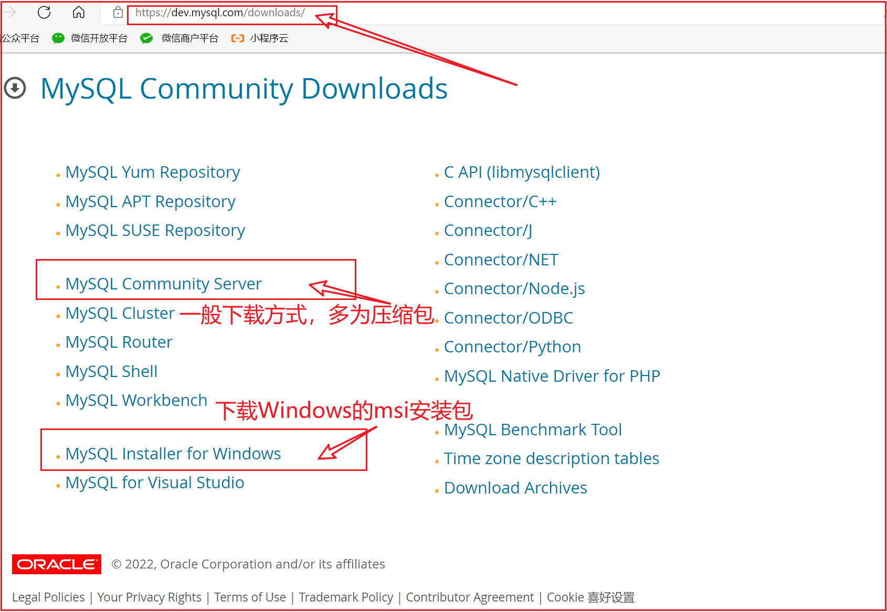

---

order: 10
title:  MySQL基础

---


## MySQL的安装和配置

MySQL是一个C/S架构的软件，我们安装的MySQL 是服务端。MySQL 的客户端有很多，有自带的，有第三方的。

- 命令行客户端
- 图形化界面的客户端
  - navicat
  - sql yog
  - dbeaver
  - workbench
  - …

<br/>

MySQL5.7文档：https://dev.mysql.com/doc/refman/5.7/en/ 

MySQL8.0文档：https://dev.mysql.com/doc/refman/8.0/en/ 


### Windows平台

下载MySQL：https://dev.mysql.com/downloads/mysql/




::: info Windows平台下的安装步骤

将压缩包解压到需要安装的目录，然后执行以下步骤：

1. 新建配置文件 my.ini ，存放的路径为MySQL的根目录，文件内容如下：
  ```bash
    [client]
    port=3306

    [mysql]
    default-character-set=utf8

    [mysqld]
    character-set-server=utf8
    default-storage-engine=INNODB
    explicit_defaults_for_timestamp=true
    basedir = D:\Develop\Database\mysql-5.7.37
    datadir = D:\Develop\Database\mysql-5.7.37\data
  ```

2. 配置环境变量 （先检查有无正确的环境变量，若没有则需要设置）

	打开MySQL的bin目录，复制此路径，添加到环境变量


3. 初始化MySQL（生成data目录）命令行执行如下命令：(以下命名全部在以管理员模式打开的)
```bash
mysqld --initialize-insecure
```
	
	
4. 注册MySQL服务
```bash
mysqld -install
```
	
5. 启动MySQL服务
```bash
net start mysql
```

6. 修改默认账户密码
```bash
mysqladmin -u root password 123456
```

7. 登录使用 
```bash	
mysql -uroot -p
```

8. 卸载MySQL：
```bash
net stop mysql

mysqld -remove mysql
```	
最后删除MySQL目录及相关的环境变量即可
:::


安装MySQL：参照blog https://blog.csdn.net/drizzletowne/article/details/120896774


### Linux手动安装

下为Linux通用版本下载选项（Windows类似）：


::: info Linux平台手动安装MySql

目标：将 `mysql5.7` 安装到  `/usr/local/mysql` (不建议安装到其他位置，可能会导致socket连接失败)

准备：在`/usr/local/` 目录下创建 `mysql` 和 `software` 目录
	

1. 下载 mysql的压缩包 (或上传自己已下载的压缩包到指定目录即可)
```bash
cd /usr/local/software
wget http://dev.MySQL.com/get/Downloads/MySQL-5.7/mysql-5.7.37-Linux-glibc2.12-x86_64.tar.gz
```

2、解压并复制到 mysql目录
```bash
tar -xvf mysql-5.7.37-Linux-glibc2.12-x86_64.tar.gz

mv ./mysql-5.7.37-linux-glibc2.12-x86_64/* /usr/local/mysql/
```


3、安装依赖、创建mysql用户组及其用户
```bash
yum install libaio   （Ubuntu使用：sudo apt-get install libaio1）

groupadd mysql
useradd -r -g mysql -s /bin/false mysql
```


4、创建相关目录、设置权限、初始化mysql 
```bash
cd /usr/local/mysql/

mkdir mysql-files
chown mysql:mysql mysql-files
chmod 750 mysql-files

bin/mysqld --initialize --user=mysql  # 记住末尾自动生成的root密码 如：lZw.qSdCS7pV
bin/mysql_ssl_rsa_setup
bin/mysqld_safe --user=mysql &
```

5. 配置环境变量
```bash
vim /etc/profile.d/mysql.sh  # 在里面加入: 
export PATH=$PATH:/usr/local/mysql/bin

source  /etc/profile  # 使用source命令使修改立刻生效：  
```

6. 将mysql添加到启动项
```bash
cp support-files/mysql.server /etc/init.d/mysql.server

chkconfig --add mysql.server  （ 或 systemctl enable mysql.server）
```

7. 使用 （首次使用需要先修改密码）
```bash
mysql -uroot -p

mysql> alter user user() identified by "123456";
```

8. 启动、关闭和重启
```bash
/etc/init.d/mysql.server start
/etc/init.d/mysql.server stop
/etc/init.d/mysql.server restart
```

9. 其他常用命令
```bash
>mysql status;                            # 查看mysql基本信息
>mysql SHOW VARIABLES LIKE 'character%';  # 查看数据库字符集相关设置信息
```
:::

**Linux下的安装参考**：https://dev.mysql.com/doc/refman/5.7/en/binary-installation.html


简单配置mysql:

```bash
vi /etc/my.cnf   # 添加如下信息：

[client]
port=3306

[mysql]
default-character-set=utf8

[mysqld]
character-set-server=utf8
default-storage-engine=INNODB
```

【注意】关于Linux下没有my.cnf的情形：从5.7.18开始官方不再二进制包中提供my-default.cnf文件。


<br/>


<span style="font:normal bold 22px arial,sans-serif;color:blue">Navicat无法连接Mysql时：</span> 

```shell

1. 打开数据库：use mysql。检索 user 和 host 字段
mysql> use mysql;
mysql> select user, host from user; 

2. 如果没有 user=root ，host = % 的用户，则执行下面语句：
mysql> update user set host='%' where user='root';

3. 给 root 授权（所有权限）, 并让赋予的权限立即生效
mysql> GRANT ALL PRIVILEGES ON *.* TO 'root'@'%' IDENTIFIED BY '123456' WITH GRANT OPTION;
mysql> flush   privileges;

```


### Linux平台-RPM

卸载MySQL：

```shell
1 删除Mysql

   yum remove  mysql mysql-server mysql-libs mysql-server;

   find / -name mysql 将找到的相关东西delete掉(rm -rf /var/lib/mysql)；

   rpm -qa|grep mysql(查询出来的东东yum remove掉)

   rm /etc/my.cnf

 
查看是否还有mysql软件：如果存在的话，继续删除即可。
rpm -qa|grep mysql


a）查看系统中是否以rpm包安装的mysql：

rpm -qa | grep -i mysql


b)卸载mysql

rpm -e MySQL-server-5.6.17-1.el6.i686
rpm -e MySQL-client-5.6.17-1.el6.i686


c)删除mysql服务

chkconfig --list | grep -i mysql
chkconfig --del mysql


d)删除分散mysql文件夹

whereis mysql 或者 find / -name mysql

清空相关mysql的所有目录以及文件
rm -rf /usr/lib/mysql
rm -rf /usr/share/mysql
rm -rf /usr/my.cnf


通过以上几步，mysql应该已经完全卸载干净了.
```


<br/>


### MySql配置文件

查看mysql默认读取`my.cnf`的目录

```bash
mysql --help|grep 'my.cnf'      
```
如果没有设置使用指定目录的`my.cnf`，mysql启动时会读取安装目录根目录及默认目录下的`my.cnf`文件


```shell
# my.cnf

[client]
#########################################################################
#                                                                       #
#                         MySQL客户端配置                               #
#                                                                       #
#########################################################################
port = 3306 
# MySQL客户端默认端口号 (如果客户端链接数据库时，没有指定端口号，则默认为3306)

socket = /data/mysql/my3306/mysql.sock
# 用于本地连接的Unix套接字文件存放路径

default-character-set = utf8mb4
# MySQL客户端默认字符集

[mysql]
#########################################################################
#                                                                       #
#                         MySQL命令行配置                               #
#                                                                       #
#########################################################################
auto-rehash
# 开启tab补齐功能

socket = /data/mysql/my3306/mysql.sock
# 用于本地连接的Unix套接字文件存放路径

default-character-set = utf8mb4
# MySQL客户端默认字符集

max_allowed_packet = 256M
# 指定在网络传输中一次消息传输量的最大值。系统默认值 为1MB，最大值是1GB，必须设置1024的倍数。

[mysqld]
#########################################################################
#                                                                       #
#                         MySQL服务端配置                               #
#                                                                       #
#########################################################################

########################################
#                                      #
#               General                #
#                                      #
########################################
port = 3306
# MySQL服务端默认监听的TCP/IP端口

socket = /data/mysql/my3306/mysql.sock
# 用于本地连接的Unix套接字文件存放路径

pid_file = /data/mysql/my3306/mysql.pid
# 进程ID文件存放路径

basedir = /app/mysql
# MySQL软件安装路径

datadir = /data/mysql/my3306
# MySQL数据文件存放路径

tmpdir = /data/mysql/my3306
# MySQL临时文件存放路径

character_set_server = utf8mb4
# MySQL服务端字符集

collation_server = utf8mb4_general_ci
# MySQL服务端校对规则

default-storage-engine = InnoDB
# 设置默认存储引擎为InnoDB

autocommit = OFF
# 默认为ON，设置为OFF，关闭事务自动提交

transaction_isolation = READ-COMMITTED
# MySQL支持4种事务隔离级别，他们分别是：
# READ-UNCOMMITTED, READ-COMMITTED, REPEATABLE-READ, SERIALIZABLE.
# 如没有指定，MySQL默认采用的是REPEATABLE-READ，ORACLE默认的是READ-COMMITTED

event_scheduler = ON 
# 开启事件调度器event_scheduler

#explicit_defaults_for_timestamp = ON
# 控制TIMESTAMP数据类型的特性，默认OFF，设置为ON，update 时timestamp列关闭自动更新。（将来会被废弃）

lower_case_table_names = 1
# 库名、表名是否区分大小写。默认为0，设置1，不区分大小写，创建的表、数据库都以小写形式存放磁盘。

########################################
#                                      #
#       Network & Connection           #
#                                      #
########################################
max_connections = 1000
# MySQL允许的最大并发连接数，默认值151，如果经常出现Too Many Connections的错误提示，则需要增大此值。

max_user_connections = 1000
# 每个数据库用户的最大连接，（同一个账号能够同时连接到mysql服务的最大连接数），默认为0，表示不限制。

back_log = 500
# MySQL监听TCP端口时设置的积压请求栈大小，默认50+(max_connections/5)，最大不超过900

max_connect_errors = 10000
# 每个主机的连接请求异常中断的最大次数。对于同一主机，如果有超出该参数值个数的中断错误连接，则该主机将被禁止连接。如需对该主机进行解禁，执行：FLUSH HOST。

interactive_timeout = 28800
# 服务器关闭交互式连接前等待活动的秒数。交互式客户端定义为在mysql_real_connect()中使用CLIENT_INTERACTIVE选项的客户端。默认值：28800秒（8小时）

wait_timeout = 28800
# 服务器关闭非交互连接之前等待活动的秒数。默认值：28800秒（8小时）
# 指定一个请求的最大连接时间，当MySQL连接闲置超过一定时间后将会被强行关闭。对于4GB左右内存的服务器来说，可以将其设置为5~10。
# 如果经常出现Too Many Connections的错误提示，或者show processlist命令发现有大量sleep进程，则需要同时减小interactive_timeout和wait_timeout值。

connect_timeout = 28800
# 在获取连接时，等待握手的超时秒数，只在登录时生效。主要是为了防止网络不佳时应用重连导致连接数涨太快，一般默认即可。

open_files_limit = 5000
# mysqld能打开文件的最大个数，默认最小1024，如果出现too mant open files之类的就需要增大该值。

max_allowed_packet = 256M
# 指定在网络传输中一次消息传输量的最大值。系统默认值 为1MB，最大值是1GB，必须设置1024的倍数。

########################################
#                                      #
#          Thread & Buffer             #
#                                      #
########################################
sort_buffer_size = 2M
# 排序缓冲区大小，connection级参数，默认大小为2MB。如果想要增加ORDER BY的速度，首先看是否可以让MySQL使用索引，其次可以尝试增大该值。

read_buffer_size = 160M
# 顺序读缓冲区大小，connection级参数，该参数对应的分配内存是每连接独享。对表进行顺序扫描的请求将分配一个读入缓冲区。

read_rnd_buffer_size = 160M
# 随机读缓冲区大小，connection级参数，该参数对应的分配内存是每连接独享。默认值256KB，最大值4GB。当按任意顺序读取行时，将分配一个随机读缓存区。

join_buffer_size = 320M
# 联合查询缓冲区大小，connection级参数，该参数对应的分配内存是每连接独享。

bulk_insert_buffer_size = 64M   
# 批量插入数据缓存大小，可以有效提高插入效率，默认为8M

thread_cache_size = 8
# 服务器线程缓冲池中存放的最大连接线程数。默认值是8，断开连接时如果缓存中还有空间，客户端的线程将被放到缓存中，当线程重新被请求，将先从缓存中读取。
# 根据物理内存设置规则如下：1G  —> 8，2G  —> 16，3G  —> 32，大于3G  —> 64

thread_stack = 256K
# 每个连接被创建时,mysql分配给它的内存。默认192KB，已满足大部分场景，除非必要否则不要动它，可设置范围128KB~4GB。

query_cache_type = 0
# 关闭查询缓存

query_cache_size = 0
# 查询缓存大小，在高并发，写入量大的系统，建议把该功能禁掉。

query_cache_limit = 4M    
# 指定单个查询能够使用的缓冲区大小，缺省为1M

tmp_table_size = 1024M
# MySQL的heap（堆积）表缓冲大小，也即内存临时表，默认大小是 32M。如果超过该值，则会将临时表写入磁盘。在频繁做很多高级 GROUP BY 查询的DW环境，增大该值。
# 实际起限制作用的是tmp_table_size和max_heap_table_size的最小值。

max_heap_table_size = 1024M
# 用户可以创建的内存表(memory table)的大小，这个值用来计算内存表的最大行数值。

table_definition_cache = 400
# 表定义缓存区，缓存frm文件。表定义(global)是全局的，可以被所有连接有效的共享。

table_open_cache = 1000
# 所有SQL线程可以打开表缓存的数量，缓存ibd/MYI/MYD文件。 打开的表(session级别)是每个线程，每个表使用。

table_open_cache_instances = 4
# 对table cache 能拆成的分区数，用于减少锁竞争，最大值64.

########################################
#                                      #
#               Safety                 #
#                                      #
########################################
#sql_mode = NO_ENGINE_SUBSTITUTION,STRICT_TRANS_TABLES,NO_AUTO_CREATE_USER,NO_AUTO_VALUE_ON_ZERO,ONLY_FULL_GROUP_BY
sql_mode = NO_ENGINE_SUBSTITUTION,STRICT_TRANS_TABLES,NO_ZERO_DATE,NO_ZERO_IN_DATE,ERROR_FOR_DIVISION_BY_ZERO,NO_AUTO_CREATE_USER
# MySQL支持的SQL语法模式，与其他异构数据库之间进行数据迁移时，SQL Mode组合模式会有帮助。

local_infile = OFF
# 禁用LOAD DATA LOCAL命令

plugin-load = validate_password.so
# 加密认证插件，强制mysql设置复杂密码

skip-external-locking
#skip-locking 
# 避免MySQL的外部锁定，减少出错几率，增强稳定性。

skip-name-resolve 
# 禁止MySQL对外部连接进行DNS解析，消除MySQL进行DNS解析。如果开启该选项，所有远程主机连接授权都要使用IP地址方式，否则MySQL将无法正常处理连接请求！

#skip-networking 
# 不允许CP/IP连接，只能通过命名管道（Named Pipes）、共享内存（Shared Memory）或Unix套接字（Socket）文件连接。
# 如果Web服务器以远程连接方式访问MySQL数据库服务器，则不要开启该选项，否则无法正常连接！
# 适合应用和数据库共用一台服务器的情况，其他客户端无法通过网络远程访问数据库

########################################
#                                      #
#                 Logs                 #
#                                      #
########################################
###################   General Log  ######################
general_log = OFF
# 关闭通用查询日志

general_log_file = /data/mysql/my3306/general.log
# 通用查询日志存放路径

###################     Slow Log   ######################
slow_query_log = ON
# 开启慢查询日志

slow_query_log_file = /data/mysql/my3306/slow.log
# 慢查询日志存放路径

long_query_time = 10
# 超过10秒的查询，记录到慢查询日志，默认值10

log_queries_not_using_indexes = ON
# 没有使用索引的查询，记录到慢查询日志，可能引起慢查询日志快速增长

log_slow_admin_statements = ON
# 执行缓慢的管理语句，记录到慢查询日志
# 例如 ALTER TABLE, ANALYZE TABLE, CHECK TABLE, CREATE INDEX, DROP INDEX, OPTIMIZE TABLE, and REPAIR TABLE.

###################     Error Log   ####################
log_error = /data/mysql/my3306/error.log
# 错误日志存放路径

log_error_verbosity = 2
# 全局动态变量，默认3，范围：1～3
# 表示错误日志记录的信息，1：只记录error信息；2：记录error和warnings信息；3：记录error、warnings和普通的notes信息

########################################
#                                      #
#           Replication                #
#                                      #
########################################

###################     Bin Log    ######################
server_id = 6
# 数据库服务器ID

log_bin = /data/mysql/my3306/binlog
# 二进制日志存放路径

log_bin_index = /data/mysql/my3306/binlog.index
# 同binlog，定义binlog的位置和名称

binlog_format = row
# binlog格式，复制有3种模式STATEMENT，ROW，MIXED

expire_logs_days = 10
# 只保留最近10天的binlog日志

max_binlog_size = 50M
# 每个binlog日志文件的最大容量

binlog_cache_size = 2M
# 每个session分配的binlog缓存大小
# 事务提交前产生的日志，记录到Cache中；事务提交后，则把日志持久化到磁盘

log_slave_updates = ON
# 开启log_slave_updates，从库的更新操作记录进binlog日志

sync_binlog = 1
# sync_binlog=0（默认），事务提交后MySQL不刷新binlog_cache到磁盘，而让Filesystem自行决定，或者cache满了才同步。
# sync_binlog=n，每进行n次事务提交之后，MySQL将binlog_cache中的数据强制写入磁盘。

binlog_rows_query_log_events = ON
# 将row模式下的sql语句，记录到binlog日志，默认是0(off)

###################     Relay Log  ######################
relay_log = /data/mysql/my3306/relaylog
# 中继日志存放路径

relay_log_index = /data/mysql/my3306/relaylog.index
# 同relay_log，定义relay_log的位置和名称

#binlog_checksum = CRC32
# Session-Thread把Event写到Binlog时，生成checksum。默认为（NONE），兼容旧版本mysql。

master_verify_checksum = ON
# Dump-Thread读Binlog中的Event时，验证checksum

slave_sql_verify_checksum = ON
# 从库的I/O-Thread把Event写入Relaylog时，生成checksum；从库的SQL-Thread从Relaylog读Event时，验证checksum

master_info_repository = TABLE
relay_log_info_repository = TABLE
# 将master.info和relay.info保存在表中，默认是Myisam引擎，官方建议改为Innodb引擎，防止表损坏后自行修复。 

relay_log_purge = ON 
relay_log_recovery = ON
# 启用relaylog的自动修复功能，避免由于网络之类的外因造成日志损坏，主从停止。

skip_slave_start = OFF
# 重启数据库，复制进程默认不启动

slave_net_timeout = 5
# 当master和slave之间的网络中断，slave的I/O-Thread等待5秒，重连master

sync_master_info = 10000
# slave更新mysql.slave_master_info表的时间间隔

sync_relay_log = 10000
sync_relay_log_info = 10000
# slave更新mysql.slave_relay_log_info表的时间间隔

gtid_mode = ON
enforce_gtid_consistency = ON
# GTID即全局事务ID（global transaction identifier），GTID由UUID+TID组成的。
# UUID是一个MySQL实例的唯一标识，TID代表了该实例上已经提交的事务数量，并且随着事务提交单调递增。
# GTID能够保证每个MySQL实例事务的执行（不会重复执行同一个事务，并且会补全没有执行的事务）。下面是一个GTID的具体形式：
# 4e659069-3cd8-11e5-9a49-001c4270714e:1-77

auto_increment_offset  = 1
# 双主复制中，2台服务器的自增长字段初值分别配置为1和2，取值范围是1 .. 65535

auto_increment_increment = 2
# 双主复制中，2台服务器的自增长字段的每次递增值都配置为2，其默认值是1，取值范围是1 .. 65535

########################################
#                                      #
#                InnoDB                #
#                                      #
########################################

innodb_data_home_dir = /data/mysql/my3306
# innodb表的数据文件目录

innodb_file_per_table = ON
# 使用独立表空间管理

innodb_data_file_path = ibdata1:1G:autoextend
# InnoDB共享表空间磁盘文件，存放数据字典、和在线重做日志

innodb_log_group_home_dir = /data/mysql/my3306
# 在事务被提交并写入到表空间磁盘文件上之前，事务数据存储在InnoDB的redo日志文件里。这些日志位于innodb_log_group_home_dir变量定义的目录中

innodb_buffer_pool_size = 2G
# InnoDB用于缓存数据、索引、锁、插入缓冲、数据字典的缓冲池。该值越大，缓存命中率越高，但是过大会导致页交换。

innodb_buffer_pool_instances = 8
# 开启8个内存缓冲池，把需要缓冲的数据hash到不同的缓冲池中，这样可以并行的内存读写，降低并发导致的内部缓存访问冲突。
# InnoDB缓存系统会把参数innodb_buffer_pool_size指定大小的缓存，平分为innodb_buffer_pool_instances个buffer_pool

#innodb_additional_mem_pool_size = 16M
# InnoDB存储数据字典、内部数据结构的缓冲池大小，类似于Oracle的library cache

innodb_log_file_size = 256M
# InnoDB redo log大小，对应于ib_logfile0文件。
# ib_logfile* 是Innodb多版本缓冲的一个保证，该日志记录redo、undo信息，即commit之前的数据，用于rollback操作。
# 官方文档的建议设置是innodb_log_file_size = innodb_buffer_pool_size/innodb_log_files_in_group

innodb_log_buffer_size = 64M
# redo日志所用的内存缓冲区大小

innodb_log_files_in_group = 4
# redo日志文件数，默认值为2，日志是以顺序的方式写入。

innodb_max_dirty_pages_pct = 90
# 缓存池中脏页的最大比例，默认值是75%，如果脏页的数量达到或超过该值，InnoDB的后台线程将开始缓存刷新。
# “缓存刷新”是指InnoDB在找不到干净的可用缓存页或检查点被触发等情况下，InnoDB的后台线程就开始把“脏的缓存页”回写到磁盘文件中。

innodb_flush_log_at_trx_commit = 1
#设置为0 ，每秒 write cache & flush disk
#设置为1 ，每次commit都 write cache & flush disk
#设置为2 ，每次commit都 write cache，然后根据innodb_flush_log_at_timeout（默认为1s）时间 flush disk

innodb_lock_wait_timeout = 10
# InnoDB 有其内置的死锁检测机制，能导致未完成的事务回滚。但是，如果结合InnoDB使用MyISAM的lock tables语句或第三方事务引擎,则InnoDB无法识别死锁。
# 为消除这种可能性，可以将innodb_lock_wait_timeout设置为一个整数值，指示MySQL在允许其他事务修改那些最终受事务回滚的数据之前要等待多长时间(秒数)。

innodb_sync_spin_loops = 40
# 自旋锁的轮转数，可以通过show engine innodb status来查看。
# 如果看到大量的自旋等待和自旋轮转，则它浪费了很多cpu资源。浪费cpu时间和无谓的上下文切换之间可以通过该值来平衡。

innodb_support_xa = ON
# 第一，支持多实例分布式事务（外部xa事务），这个一般在分布式数据库环境中用得较多。
# 第二，支持内部xa事务，即支持binlog与innodb redo log之间数据一致性。

#innodb_file_format = barracuda
# InnoDB文件格式，Antelope是innodb-base的文件格式，Barracude是innodb-plugin后引入的文件格式，同时Barracude也支持Antelope文件格式。

innodb_flush_method = O_DIRECT
# 设置innodb数据文件及redo log的打开、刷写模式，fdatasync(默认)，O_DSYNC，O_DIRECT
# 默认是fdatasync，调用fsync()去刷数据文件与redo log的buffer
# 设置为为O_DSYNC时，innodb会使用O_SYNC方式打开和刷写redo log,使用fsync()刷写数据文件
# 设置为O_DIRECT时，innodb使用O_DIRECT打开数据文件，使用fsync()刷写数据文件跟redo log

innodb_strict_mode = ON
# 开启InnoDB严格检查模式，在某些情况下返回errors而不是warnings，默认值是OFF

innodb_checksum_algorithm = strict_crc32
# checksum函数的算法，默认为crc32。可以设置的值有:innodb、crc32、none、strict_innodb、strict_crc32、strict_none

innodb_status_file = 1
# 启用InnoDB的status file，便于管理员查看以及监控

innodb_open_files = 3000
# 限制Innodb能打开的表的数据，默认为300，数据库里的表特别多的情况，可以适当增大为1000。  

innodb_thread_concurrency = 8
# 同时在Innodb内核中处理的线程数量。服务器有几个CPU就设置为几，建议默认值。

innodb_thread_sleep_delay = 500

#innodb_file_io_threads = 16
# 文件读写I/O数，这个参数只在Windows上起作用。在LINUX上只会等于４，默认即可。

innodb_read_io_threads = 16
# 设置read thread(读线程个数，默认是4个)

innodb_write_io_threads = 16
# 设置write thread(写线程个数，默认是4个)

innodb_io_capacity = 2000
# 磁盘io的吞吐量，默认值是200.对于刷新到磁盘页的数量，会按照inodb_io_capacity的百分比来进行控制。

log_bin_trust_function_creators = 1                   
# 开启log-bin后可以随意创建function，存在潜在的数据安全问题。

innodb_purge_threads = 1
# 使用独立线程进行purge操作。
# 每次DML操作都会生成Undo页，系统需要定期对这些undo页进行清理，这称为purge操作。

innodb_purge_batch_size = 32
# 在进行full purge时，回收Undo页的个数，默认是20，可以适当加大。

innodb_old_blocks_pct = 75
# LRU算法，默认值是37，插入到LRU列表端的37%，差不多3/8的位置。
# innodb把midpoint之后的列表称为old列表，之前的列表称为new列表，可以理解为new列表中的页都是最为活跃的热点数据。

innodb_change_buffering = all
# 用来开启各种Buffer的选项。该参数可选的值为：inserts、deletes、purges、changes、all、none。
# changes表示启用inserts和deletes，all表示启用所有，none表示都不启用。该参数默认值为all。

[mysqldump]                        
max_allowed_packet = 256M

quick
# mysqldump导出大表时很有用，强制从服务器查询取得记录直接输出，而不是取得所有记录后将它们缓存到内存中。

[mysqlhotcopy]
interactive-timeout

[mysqld_safe]
#ledir = /app/mysql/bin
# 包含mysqld程序的软件安装路径，用该选项来显式表示服务器位置。
```


## DCL用户权限管理

DCL（Data Control Language），   数据控制语言，用来定义**访问权限和安全级别** ，下为MySql常用的一些用户管理命令：

### 创建/删除用户

```SQL
-- 创建用户
create user 用户名@指定ip identified by 密码;
# 例：（ % 表示任意IP均可登陆）
create user test123@localhost IDENTIFIED by '123123';
create user test456@10.4.10.18 IDENTIFIED by '123123';
create user test789@'%' IDENTIFIED by '123123';

-- 删除用户
drop user 用户名@IP;
-- 例：
drop user test123@localhost;
```


### 用户权限设置

```sql
-- 用户授权：(给指定用户授予指定指定数据库指定权限)
grant 权限1,权限2,........ on 数据库名.*  to  用户名@IP; 
-- 例：
grant select,insert,update,delete,create on student.* to 'user1'@'127.0.0.1';
grant all on *.* to 'user2'@'127.0.0.1';

-- 用户权限查询：
show grants for 用户名@IP;
-- 例：
show grants for 'root'@'%';

-- 撤销用户权限：
revoke 权限1,权限2,........,权限n on 数据库名.* from 用户名@IP;
-- 例：
REVOKE SELECT ON *.* FROM 'root'@'%';
```


## MySql常用数据类型

| 常用数据类型 | 大小（bytes） | 说明                                                         |
| :----------: | :-----------: | ------------------------------------------------------------ |
|     int      |       4       | 整型 （-2 147 483 648，2 147 483 647）±21亿                  |
|    double    |       8       | 浮点型，例如double(5,2)表示最多5位，其中必须有2位小数，即最大值为 999.99 |
|     char     |     0-255     | 固定长度字符串类型； `char(10)   'aaa' ` 占10个字符的位置    |
|   varchar    |    0-65535    | 可变长度字符串类型； `varchar(10)  'aaa'`占3字符             |
|     text     |    0-65535    | 字符串类型，比如小说信息                                     |
|     blob     |    0-65535    | 字节类型，保存文件信息(视频，音频，图片)                     |
|     date     |       3       | 日期类型，格式为：yyyy-MM-dd                                 |
|     time     |       3       | 时间类型，格式为：hh:mm:ss                                   |
|  timestamp   |       4       | 时间戳类型 yyyy-MM-dd hh:mm:ss 会自动赋值                    |
|   datetime   |       8       | 日期时间类型 yyyy-MM-dd hh:mm:ss                             |

<br/>

MySQL支持的数据类型非常多，选择正确的数据类型对于获得高性能至关重要。

不管存储哪种类型的数据，下面几个简单的原则都有助于做出更好的选择。

```sql
1. 更小的通常更好。
一般情况下，应该尽量使用可以正确存储数据的最小数据类型. 
更小的数据类型通常更快，因为它们占用更少的磁盘、内存和CPU缓存，并且处理时需要的CPU周期也更少。
(如果无法确定哪个数据类型是最好的，就选择你认为不会超过范围的最小类型。)

2. 简单就好
简单数据类型的操作通常需要更少的CPU周期。
例如，整型比字符操作代价更低，因为字符集和校对规则（排序规则）使字符比较比整型比较更复杂。
这里有两个例子：
一个是应该使用MySQL内建的类型而不是字符串来存储日期和时间，
另外一个是应该用整型存储IP地址

3. 尽量避免NULL
很多表都包含可为NULL （空值）的列，即使应用程序并不需要保存NULL 也是如此，这是因为可为NULL 是列的默认属性 。
通常情况下最好指定列为 NOT NULL ，除非真的需要存储NULL 值。
通常把可为NULL 的列改为NOT NULL 带来的性能提升比较小，所以（调优时）没有必要首先在现有schema中查找并修改掉这种情
况，除非确定这会导致问题。但是，如果计划在列上建索引，就应该尽量避免设计成可为NULL的列。

```

<br/>


```shell
DATETIME 和TIMESAMP 列都可以存储相同类型的数据：时间和日期，精确到秒。
然而TIMESTAMP 只使用DATETIME 一半的存储空间，并且会根据时区变化，具有特殊的自动更新能力。
另一方面，TIMESTAMP 允许的时间范围要小得多，有时候它的特殊能力会成为障碍。

MySQL为了兼容性支持很多别名，例如INTEGER、BOOL ，以及NUMERIC 。
它们都只是别名。这些别名可能令人不解，但不会影响性能。
如果建表时采用数据类型的别名，然后用SHOW CREATE TABLE 检查，会发现MySQL报告的是基本类型，而不是别名。
```

<br/>

### 1) 数字类型

有两种类型的数字：整数（whole number）和实数（real number）

<br/>


**整数类型**：TINYINT，SMALLINT，MEDIUMINT，INT，BIGINT 。分别使用 8，16，24，32，64位存储空间

```sql
整数类型有可选的UNSIGNED 属性，表示不允许负值，这大致可以使正数的上限提高一倍。
例如 TINYINT UNSIGNED 可以存储的范围是0～255，而 TINYINT 的存储范围是 −128～127。

有符号和无符号类型使用相同的存储空间，并具有相同的性能，因此可以根据实际情况选择合适的类型

你的选择可以决定MySQL是怎么在内存和磁盘中保存数据的。
然而，整数计算一般使用64位的BIGINT 整数，即使在32位环境也是如此（一些聚合函数是例外，它们使用 DECIMAL 或 DOUBLE 进行计算）


MySQL可以为整数类型指定宽度，例如INT（11） ，对大多数应用这是没有意义的：
它不会限制值的合法范围，只是规定了MySQL的一些交互工具（例如MySQL命令行客户端）用来显示字符的个数。
对于存储和计算来说，INT（1） 和INT（20） 是相同的。
```

<br/>


**实数类型**：实数是带有小数部分的数字。

然而，它们不只是为了存储小数部分；也可以使用DECIMAL 存储比BIGINT 还大的整数。MySQL既支持精确类型，也支持不精确类型。

```sql
FLOAT 和 DOUBLE 类型支持使用标准的浮点运算进行近似计算。
-- 如果需要知道浮点运算是怎么计算的，则需要研究所使用的平台的浮点数的具体实现。

DECIMAL 类型用于存储精确的小数。在MySQL 5.0和更高版本，DECIMAL 类型支持精确计算。
-- MySQL 4.1以及更早版本则使用浮点运算来实现DECIAML 的计算，这样做会因为精度损失导致一些奇怪的结果。
-- 在这些版本的MySQL中，DECIMAL 只是一个“存储类型”。

因为CPU不支持对DECIMAL 的直接计算，所以在MySQL 5.0以及更高版本中，MySQL服务器自身实现了DECIMAL 的高精度计算。
相对而言，CPU直接支持原生浮点计算，所以浮点运算明显更快。
```

<br/>

```sql

有多种方法可以指定浮点列所需要的精度，这会使得MySQL悄悄选择不同的数据类型，或者在存储时对值进行取舍。
这些精度定义是非标准的，所以我们建议只指定数据类型，不指定精度。

浮点类型在存储同样范围的值时，通常比DECIMAL 使用更少的空间。
FLOAT 使用4个字节存储。DOUBLE 占用8个字节，相比FLOAT有更高的精度和更大的范围。和整数类型一样，能选择的只是存储类型；


MySQL使用 DOUBLE 作为内部浮点计算的类型。
因为需要额外的空间和计算开销，所以应该尽量只在对小数进行精确计算时才使用 DECIMAL -- 例如存储财务数据。

但在数据量比较大的时候，可以考虑使用 BIGINT 代替 DECIMAL ，将需要存储的货币单位根据小数的位数乘以相应的倍数即可。
-- 假设要存储财务数据精确到万分之一分，则可以把所有金额乘以一百万，然后将结果存储在 BIGINT 里，
-- 这样可以同时避免 浮点存储计算不精确 和 DECIMAL 精确计算代价高 的问题。

```


<br/>

### 2) 字符串类型

VARCHAR  和 CHAR 是两种最主要的字符串类型。

不幸的是，很难精确地解释这些值是怎么存储在磁盘和内存中的，因为这跟存储引擎的具体实现有关。

<br/>

先看看 InnoDB 或者MyISAM 通常 怎么存储 VARCHAR 和 CHAR 值在磁盘上 ：

```sql
VARCHAR 类型用于存储可变长字符串，是最常见的字符串数据类型。
它比定长类型更节省空间，因为它仅使用必要的空间（例如，越短的字符串使用越少的空间）。
-- 有一种情况例外，如果MySQL表使用ROW_FORMAT=FIXED 创建的话，每一行都会使用定长存储，这会很浪费空间。

VARCHAR 需要使用1或2个额外字节记录字符串的长度：
-- 如果列的最大长度小于或等于255字节，则只使用1个字节表示，否则使用2个字节。
-- 假设采用latin1字符集，一个VARCHAR（10） 的列需要11个字节的存储空间。
-- VARCHAR（1000） 的列则需要1002个字节，因为需要2个字节存储长度信息。


VARCHAR 节省了存储空间，所以对性能也有帮助。
但是，由于行是变长的，在UPDATE 时可能使行变得比原来更长，这就导致需要做额外的工作。
如果一个行占用的空间增长，并且在页内没有更多的空间可以存储，在这种情况下，不同的存储引擎的处理方式是不一样的。
例如，MyISAM会将行拆成不同的片段存储，InnoDB则需要分裂页来使行可以放进页内。其他一些存储引擎也许从不在原数据位置更新数据


下面这些情况下使用 VARCHAR 是合适的：
1. 字符串列的最大长度比平均长度大很多；
2. 列的更新很少，所以碎片不是问题；
3. 使用了像 UTF-8 这样复杂的字符集，每个字符都使用不同的字节数进行存储。

```


<br/>


```SQL
CHAR 类型是定长的：MySQL总是根据定义的字符串长度分配足够的空间。当存储CHAR 值时，MySQL会删除所有的末尾空格

CHAR 适合存储很短的字符串，或者所有值都接近同一个长度。例如，
-- 1. CHAR 非常适合存储密码的MD5 值，因为这是一个定长的值。
-- 2. 对于经常变更的数据，CHAR 也比VARCHAR 更好，因为定长的CHAR 类型不容易产生碎片。
-- 3. 对于非常短的列，CHAR 比VARCHAR 在存储空间上也更有效率。
--    例如用CHAR（1） 来存储只有Y和N的值，如果采用单字节字符集只需要一个字节，
--    但是VARCHAR（1） 却需要两个字节，因为还有一个记录长度的额外字节。
```


<br/>

### 3) enum&set


<br/>


### 4) 时间和日期


<br/>


## 数据库备份与恢复

- 备份

  ```shell
  -- 直接在cmd命令下（配置环境变量，如果没有配置，那么就是在MySQL的bin目录下）
  mysqldump -uroot -p dbName>path\dbName.sql
  ```

- 恢复

  ```shell
  -- 连接上MySQL服务器
  mysql -uroot -p
  
  -- 选中数据库
  use dbName;
  
  -- 恢复数据
  source path\dbName.sql;
  ```


<br/>


## 四 数据库设计

### 1. 数据完整性

数据完整性是数据库制定的了一些规范，是为了防止用户错误的输入（防止数据库出现错误的数据）

- **数据库的完整性**：保证存放到数据库中的数据是有效的,

  => 在创建表时给表中添加约束

  <br/>

- **实体完整性**：标识每一行数据不重复

  实体完整性指的是数据库表中存在记录应该不重复出现，是唯一的。

  实体：即表中的一行(一条记录)代表一个实体（entity）

  约束类型：*主键约束（primary key）*、 *唯一约束 (unique)* 、 *自动增长列 (auto_increment)* 

  <br/>

- **域完整性**：限制此单元格的数据正确

  域完整性是指数据库表中的每一个字段都应该有自己的约束。这种约束大多数是数据类型，这句话的意思是表中的每一列都应该有自己的数据类型，还有一些关键字也可以约束。

  域完整性约束：数据类型 、非空约束（not null）、 默认值约束(default）

  <br/>

- **引用完整性（参照完整性）**：指外键

  外键约束：FOREIGN KEY

<br/>


常见约束：

| 约束            | 说明                               |
| --------------- | ---------------------------------- |
| null / not null | 字段是否可以为空                   |
| default         | 如果一个字段没有值，则使用默认值   |
| auto_increment  | 字段值从1开始，每次递增1，不会重复 |
| primary key     | 定义列为主键                       |
| unique          | 唯一键：不能重复，但可以为空       |
| comment         | 注释信息                           |

<br/>

语法示例：

**主键约束（primary key）**：

```SQL
# 1. 在 CREATE TABLE 语句中，通过 PRIMARY KEY 关键字来指定主键
<字段名> <数据类型> PRIMARY KEY [默认值]

# 2. 或者是在定义完所有字段之后指定主键：
[CONSTRAINT <约束名>] PRIMARY KEY [字段名]

# 3. 在创建表时设置联合主键（所谓的联合主键，就是这个主键是由一张表中多个字段组成的）
PRIMARY KEY [字段1，字段2，…,字段n]

# 4. 在修改表时添加主键约束
ALTER TABLE <数据表名> ADD PRIMARY KEY(<字段名>);

# 删除主键约束
ALTER TABLE <数据表名> DROP PRIMARY KEY;
```

<br/>


**唯一约束 (unique)**：

```SQL
# 1. 在创建表时设置唯一约束
<字段名> <数据类型> UNIQUE

# 2. 在修改表时添加唯一约束
ALTER TABLE <数据表名> ADD CONSTRAINT <唯一约束名> UNIQUE(<列名>);

# 删除唯一约束
ALTER TABLE <表名> DROP INDEX <唯一约束名>;
```

<br/>


**自动增长列 (auto_increment)**：

```SQL
# 1. 给字段添加 AUTO_INCREMENT 属性来实现主键自增长
字段名 数据类型 AUTO_INCREMENT

# 2. 指定自增字段初始值
CREATE TABLE tb_student2 (
    id INT NOT NULL AUTO_INCREMENT,
    name VARCHAR(20) NOT NULL,
    PRIMARY KEY(ID)
)AUTO_INCREMENT=100;
```

- 默认情况下，AUTO_INCREMENT 的初始值是 1，每新增一条记录，字段值自动加 1。
- 一个表中只能有一个字段使用 AUTO_INCREMENT 约束，且该字段必须有唯一索引，以避免序号重复（即为主键或主键的一部分）
- AUTO_INCREMENT 约束的字段必须具备 NOT NULL 属性。
- AUTO_INCREMENT 约束的字段只能是整数类型（TINYINT、SMALLINT、INT、BIGINT 等）。
- AUTO_INCREMENT 约束字段的最大值受该字段的数据类型约束，如果达到上限，AUTO_INCREMENT 就会失效。

<br/>


**外键约束（foreign key）**: 

```SQL
[CONSTRAINT <外键名>] FOREIGN KEY 字段名 [，字段名2，…] REFERENCES <主表名> 主键列1 [，主键列2，…]
#例：
constraint fk_score_sid foreign key(sid) references student(id) );

# 删除外键约束
ALTER TABLE <表名> DROP FOREIGN KEY <外键约束名>;
```

使用外键会影响效率：

在插入子行的数据的时候，会去父表中查询。在删除父表中的数据的时候，会去子表中查询数据是否被使用。

在工作中，一般很少使用外键。外键虽然可以保证我们数据的正确性，但是会比较大程度上的影响效率。


<br/>


###  2. 三大范式

- 第一范式：指每一列保持 <span style='color:red;background:yellow;font-size:文字大小;font-family:字体;'>**原子性**</span>（每一列都是不可分割的基本数据，同一列中不能有多个值）每一个属性不可再分

  ```sql
  /* 所谓第一范式（1NF)是指在关系模型中，对域添加的一个规范要求，所有的域都应该是原子性的，
  	即数据库表的每一列都是不可分割的原子数据项，而不能是集合，数组，记录等非原子数据项。
  	即当实体中的某个属性有多个值时，必须将其拆分为不同的属性。
  	
  	在符合第一范式（1NF)表中的每个域值只能是实体的一个属性或一个属性的一部分。
  	简而言之，第一范式就是无重复的域。
  	
  	需要注意的是，在任何一个关系型数据库中，第一范式（1NF）是对关系模式的设计基本要求，一般设计时都必须满足第一范式(1NF)。
  	不过有些关系模型中突破了1NF的限制，这种称为非1NF的关系模型。
  	换句话说，是否必须满足1NF的最低要求，主要依赖于所使用的关系模型。
  	不满足1NF的数据库就不是关系数据库。满足1NF的表必须要有主键且每个属性不可再分
  
  ```

  <br/>

- 第二范式：确保数据库表中的每一列都和主键相关，而不能只与主键的某一部分相关（主要针对联合主键而言）

  即指记录的**唯一性**。要求数据库表中的每个实例或行必须可以被唯一地区分。

  ```sql
  /*第二范式（2NF）要求数据库表中的每个实例或行必须可以被唯一地区分。
   为实现区分通常需要为表加上 一个列，以存储各个实例的唯一标识。这个唯一属性列被称为主关键字或主键、主码。 
  ```

  <br/>

- 第三范式：属性不依赖于其它非主属性 [ 消除传递依赖 ]。即指**字段不要冗余**。

  ```
  设R是一个满足第一范式条件的关系模式，X是R的任意属性集，如果X非传递依赖于R的任意一个候选关键字，称R满足第三范式，简记为3NF. 
  
  满足 第三范式（3NF）必须先满足第二范式（2NF）。
  
  第三范式（3NF）要求一个数据库表中不包含已在其它表中已包含的非主关键字信息。 
  ```

<br/>

注：关系实质上是一张二维表，其中每一行是一个元组，每一列是一个属性 

第二范式（2NF）和第三范式（3NF）的概念很容易混淆，区分它们的关键点在于，

2NF：非主键列是否完全依赖于主键，还是依赖于主键的一部分；

3NF：非主键列是直接依赖于主键，还是直接依赖于非主键列。

<br/>

在实际的工作中，要不要去冗余字段呢？

> 适当的字段冗余可以帮助我们提高查询的效率，但是会影响到增删改的效率。
>
> 那么我们冗余字段需要看具体的业务场景，假如在这个业务场景中，
>
> <span style='color:red;background:yellow;font-size:文字大小;font-family:字体;'>**查询的需求远大于增删改的需求，我们可以考虑适当的去冗余数据**</span>；
>
> 假如增删改的需求比查询的需求比重要高，那么这个时候就不应该冗余数据。
>
> 
>
> 冗余字段的设计：反范式化设计。


<br/>


### 3. 多表设计


<br/>


## 五 事务Transaction

**事务（Transaction）**：是由一系列对数据库中数据进⾏访问（查询）与更新（增删改）的操作所组成的⼀个程序执行逻辑单元

这些操作，要么都成功，要么都不成功。


```SQL
-- 事务相关命令：
begin;                -- 开始，还可以使用下列语法：
start transaction; 
commit;               -- 提交：使得当前的修改确认
rollback;             -- 回滚：使得当前的修改被放弃
```

<br/>


### 1. 事务的ACID特性

- **原子性（Atomicity）**：事务必须是⼀个原子的操作序列单元

  事务中包含的各项操作在⼀次执⾏过程中，只允许出现两种状态之一：（1）全部执行成功 （2）全部执行失败 

  事务开始后所有操作，要么全部做完，要么全部不做，不可能停滞在中间环节。

  事务执⾏过程中出错， 会回滚到事务开始前的状态，所有的操作就像没有发⽣一样。

  也就是说事务是⼀个不可分割的整体，就像化学中学过的原子，是物质构成的基本单位。

  <br/>

  

- **⼀致性（Consistency）** ：一个事务在执⾏之前和执行之后，数据库都必须处于⼀致性状态。

   即事务必须是数据库从一个一致性状态到另外一个一致性状态。

   比如：如果从A账户转账到B账户，不可能因为A账户扣了钱，⽽B账户没有加钱（两个账号的总金额要保持一致状态）

   <br/>

   

- **隔离性（Isolation）** ：在并发环境中，并发的事务是互相隔离的。

  也就是说，不同的事务并发操作相同的数据时，每个事务都有各自完整的数据空间。 

  ⼀个事务内部的操作及使用的数据对其它并发事务是隔离的，并发执行的各个事务是不能互相干扰的。 

  在事务中，有隔离级别的定义，不同的隔离级别有不同的影响的程度。

  <br/>

  

- **持久性（Durability）**：事务⼀旦提交后，数据库中的数据必须被永久的保存下来。

  即使服务器系统崩溃或服 务器宕机等故障。只要数据库重新启动，那么一定能够将其恢复到事务成功结束后的状态


<br/>


### 2. 事务的并发问题

-- 详情：[MySQL事务并发问题](https://blog.csdn.net/drizzletowne/article/details/120928779?app_version=4.17.0&code=app_1562916241&uLinkId=usr1mkqgl919blen)

- **脏读（Dirty Read）**：一个事务读取到了另外一个事务还没提交的数据。

  事务A读取了事务B更新但未提交的数据（脏数据） 

  *脏数据*：是指事务对缓冲池中行记录的修改，并且还没有被提交（commit）

  脏读发生的条件是需要事务的隔离级别为 `READ UNCOMMITTED`

  <br/>

  

- **不可重复读（Nonrepeatable Read）**：在同一个事务内，针对同一个数据，前后读取的数据不一样

  可能原因：在同一个事务内，读取到了别的事务修改的数据。如：事务 A 多次读取同一数据，事务 B 在事务A 多次读取的 过程中，对数据做了更新并提交，导致事务A多次读取同一数据时，结果不一致。 

  

  *不可重复读和脏读的区别* 是：脏读是读到未提交的数据，而不可重复读读到的却是已经提交的数据

  有时候，不可重复读的问题是可以接受的，因为其读到的是已经提交的数据，本身并不会带来很大的问题

  <br/>

  

- **幻读（Phantom Read）**：在一个事务内，读取数据记录条数前后不一致 ，

  可能原因：在一个事务内，读取到了别的事务插入（删除）的数据
  
  即在重复查询的过程中，数据发⽣了量的变化（行数多了或少了）如：
  
  1. 事务 A 里有一个条件查询的语句 `select * from student where age > 10`，假设查到了 10 行数据；
  2. 然后事务 B 往里面加入了一批数据 （或者删除了一些数据）
  3. 事务 A 再查的用条件查询语句查询的时候，发现查到了15条 （如果B执行了删除，那么将会少于10条数据）

<br/>


### 3. 事务的隔离级别

❑ Read Uncommitted（读未提交）：最低的隔离级别，也是唯一能读到脏数据的隔离级别

❑ Read Committed（读已提交）：只能读取已经提交的数据、解决了脏读问题，但是还是解决不了可重复读问题

❑ Repeatable Read（可重复读）：保证在事务处理理过程中，多次读取同一个数据时，该数据的值是一致的

❑ Serializable（顺序读 / 可串行化 / 序列化）：最严格的事务隔离级别、事务只能一个接一个地处理，不能并发

<br/>

> <span style='color:red;background:yellow;font-size:文字大小;font-family:字体;'>**read uncommitted 有脏读、不可重复读、虚幻读的问题**</span> 、read uncommitted 是最不安全的隔离级别。
>
> <span style='color:red;background:yellow;font-size:文字大小;font-family:字体;'>**read committed 隔离级别没有 脏读的问题，但是有不可重复读和虚幻读的问题。**</span> 
>
> <span style='color:red;background:yellow;font-size:文字大小;font-family:字体;'>**repeatable read 没有脏读的问题，没有不可重复读的问题，也没有虚幻读的问题。这个隔离级别也是MySQL默认的隔离级别。**</span>
>
> >说明：只有在MySQL中，repeatable read 这种隔离级别没有虚幻读的问题。因为MySQL的存储引擎InnoDB通过MVCC（多版本并发控制） 解决了可重复读隔离级别下虚幻读的问题。
>
> <span style='color:red;background:yellow;font-size:文字大小;font-family:字体;'>**串行化这种隔离级别没有 脏读、不可重复读、虚幻读的问题。但是有效率的问题。**</span> 
>
> 串行化这种隔离级别指的是，数据库在这种隔离级别下，会一个事务、一个事务的先后执行，会严格保证事务的先后顺序，不存在多个事务同时执行情况，这种隔离级别没有事务的隔离问题，当然也没有上面的安全性问题。

<br/>


不同事务隔离级别下的不同的问题总结：

| 隔离级别 \ 并发问题 | 脏读 | 不可重复读 |      虚幻读      |
| ------------------- | :--: | :--------: | :--------------: |
| read uncommitted    |  √   |     √      |        √         |
| read committed      |  X   |     √      |        √         |
| repeatable read     |  X   |     X      | X(在MySQL下没有) |
| serializable        |  X   |     X      |        X         |


<br/>

`InnoDB` offers all four transaction isolation levels described by the SQL:1992 standard: 

[`READ UNCOMMITTED`](https://dev.mysql.com/doc/refman/5.7/en/innodb-transaction-isolation-levels.html#isolevel_read-uncommitted), [`READ COMMITTED`](https://dev.mysql.com/doc/refman/5.7/en/innodb-transaction-isolation-levels.html#isolevel_read-committed), [`REPEATABLE READ`](https://dev.mysql.com/doc/refman/5.7/en/innodb-transaction-isolation-levels.html#isolevel_repeatable-read), and [`SERIALIZABLE`](https://dev.mysql.com/doc/refman/5.7/en/innodb-transaction-isolation-levels.html#isolevel_serializable). 

The default isolation level for `InnoDB` is [`REPEATABLE READ`](https://dev.mysql.com/doc/refman/5.7/en/innodb-transaction-isolation-levels.html#isolevel_repeatable-read).

InnoDB存储引擎默认支持的隔离级别是 `REPEATABLE READ`，但是与标准SQL不同的是，InnoDB存储引擎在`REPEATABLE READ`事务隔离级别下，使用 `Next-Key Lock ` 锁的算法，因此避免了幻读的产生

MySQL数据库中的InnoDB和Falcon存储引擎通过MVCC（Multi-Version Concurrent Control，多版本并发控制）机制解决了可重复读隔离级别下虚幻读的问题。

需要注意的是，多版本只是解决不可重复读问题，而加上间隙锁（也就是它这里所谓的并发控制）才解决了幻读问题。


<br/>

