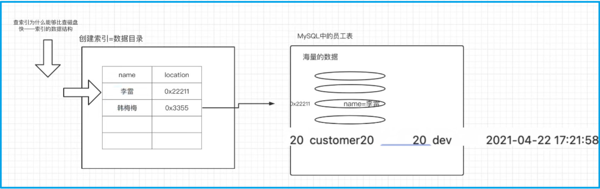

---

order: 15
title:  MySQL调优

---


## 一 MySQL索引

索引是一种可以高效获取数据的数据结构、索引可以提高查询的速度。

默认使用主键列作为索引（若不设置主键、mysql会自动设置一个隐藏列作为索引）


[CodingLabs - MySQL索引背后的数据结构及算法原理](http://blog.codinglabs.org/articles/theory-of-mysql-index.html) 


<br/>


### 1. 为什么使用索引

在海量数据中进行查询某条记录的情景中，如何提升查询性能跟要查询的数据字段是否有索引有关系

- 没有使用索引的时候，数据的查询需要进行多次IO读写（全表扫描的过程），性能较差 

- 如果字段加了索引（相当于加了个目录），那么查询的性能就非常快!



<br/>


### 2. 索引的存储位置

数据和索引的存储位置：

对于mac系统默认在 `/usr/local/mysql` 文件夹中，对于win系统默认在：`c:/programdata/mysql` (隐藏文件夹). 

不在默认位置的情况下，一般是安装时初始化MySQL自定义了数据文件的存放位置，比如修改为安装目录的 data 目录下

<br/>

存储文件的详细说明：

- InnoDB存储引擎的表∶将索引和数据存放在同一个文件里。` *.ibd` 
- MyISAM存储引擎的表:索引和数据分开两个文件来存储。索引: ` *.MYI` ;  数据: `.MYD`  


```shell
【注意】
使用InnoDB存储引擎的创建的表会生成两个文件：
	- 一个 `.frm` 结尾的表结构定义文件，
	- 一个存放数据和索引的 `.ibd` 文件 

而使用MyISAM存储引擎的创建的表会生成三个文件：
	- 一个 `.frm` 结尾的表结构定义文件，
	- 一个存放数据的 `.myd` 文件
	- 一个存放索引的 `.myi` 文件

```


<br/>


### 3. 索引的分类和创建

- 主键索引:主键自带索引效果，也就意味着通过主键来查询表中的记录，性能是非常好的

  <br/>

- 普通索引:为普通列创建的索引。创建索引的命令∶

  ```sql
  create index 索引名称 on 表名(列名) 
  create index idx_name on employees(name);
  ```

  <br/>

- 唯一索引∶就像是唯一列，列中的数据是唯一的。比普通索引的性能要好

  ```sql
  create unique index 索引名称 on 表名(列名)
  create unique index idx_unique_name on employees(name);
  ```

  <br/>

- 联合索引(组合索引)∶一次性为表中的多个字段一起创建索引。注意:一个联合索引建议不要超过5个列

  ```sql
  create index 索引名称 on 表(列1,列2,列3, ...)
  create index idx_name_age_position on employees(name, age, position);
  ```

  <br/>

- 全文索引：进行查询的时候，数据源可能来自于不同的字段或者不同的表。MyISAM存储引擎支持全文索引

  ```shell
  注意：
  
  在实际生产环境中，并不会使用MySQL提供的MyISAM存储引擎的全文索引功能来是实现全文查找。
  
  而是会使用第三方的搜索引擎中间件比如 `ElasticSearch`  (推荐) 、`Solr` 等。
  ```


<br/>

创建索引的三种方式：

```sql
-- 第一种方式：在执行create table时创建索引 
create table user_index(
    id int auto_increment primary key,
    first_name varchar(16),
    last_name varchar(16),
    id_card varchar(18),
    information text(225),

    key name(first_name,last_name),     -- 联合索引 （索引名为第一列的列名）
    unique key(id_card),                -- 唯一索引 （只有一列时索引名与列名一致）
    fulltext key(information)           -- 全文索引
    
    -- 还可以用如下方式：
    index index_first_name(first_name) using btree 
);

-- 第二种方式：使用Alter table命令去增加索引
alter table table_name add index  index_name(column_list);


-- 第三种方式：使用create index命令来创建
create index index_name on table_name(column_list);
 

-- 删除索引的方式：根据索引名来删除普通索引、唯一索引、全文索引。
alter table 表名  drop key 索引名


-- 查看表的全部索引
show index from 表名;

```


<br/>

### 4. 最左前缀原则

mysql的引擎在查询时为了更好的利用索引，再查询过程中会动态调整查询字段顺序以便利用索引


<br/>


## 二 索引数据结构

使用索引查找数据性能很快，避免了全表扫描的多次磁盘IO读写。

但是使用索引实际上也需要在索引中查找数据，而且数据数量级是一样的，那么为什么索引就更快呢? 

这就要探究索引使用的数据结构了

<br/>

而我们去考察索引应该采用哪种数据结构，那么主要是考察两个方面

1. 这种数据结构能不能帮助我们提高查询单个值的效率
2. 这种数据结构能不能帮助我们提高查询范围值的效率

<br/>


### 1. 数组和链表


<br/>


## 2. hash表


<br/>


### 3. 二叉树


- 可以适当的帮助我们提高查询单个值的效率
- 可以适当的帮助我们提高查询范围值的效率


二叉树（包括AVL树、红黑树）对于提升查询效率的帮助是十分有限的。为什么呢？

因为这些树只有两个“叉”，当数据变多的时候，树的层高会急剧上升，这就会导致搜索的困难增加，效率会明显降低。


<br/>


### 4. B树和B+树


<br/>


<br/>


## 三 B+树的索引

在数据库中，B+树的高度一般都在2～4层，这也就是说查找某一键值的行记录时最多只需要2到4次IO

<br/>

数据库中的B+树索引可以分为聚集索引（clustered inex）和 非聚集索引（secondary index，辅助索引），

但是不管是聚集还是辅助的索引，其内部都是B+树的，即高度平衡的，叶子节点存放着所有的数据。

聚集索引与辅助索引不同的是，叶子节点存放的是否是一整行的信息。

<br/>


## 1. 聚集索引

聚集索引（clustered index）就是按照每张表的主键构造一棵B+树，同时叶子节点中存放的即为整张表的行记录数据，也将聚集索引的叶子节点称为数据页。

```sql
数据页上存放的是完整的每行的记录，而在非数据页的索引页中，存放的仅仅是键值及指向数据页的偏移量，而不是一个完整的行记录
```

聚集索引的这个特性决定了索引组织表中数据也是索引的一部分。同B+树数据结构一样，每个数据页都通过一个双向链表来进行链接。

<br/>

由于实际的数据页只能按照一棵B+树进行排序，因此每张表只能拥有一个聚集索引。

在多数情况下，查询优化器倾向于采用聚集索引。因为聚集索引能够在B+树索引的叶子节点上直接找到数据。

此外，由于定义了数据的逻辑顺序，聚集索引能够特别快地访问针对范围值的查询。

<br/>

许多数据库的文档会这样告诉读者：聚集索引按照顺序物理地存储数据。

但是试想一下，如果聚集索引必须按照特定顺序存放物理记录，则维护成本显得非常之高。

所以，聚集索引的存储并不是物理上连续的，而是逻辑上连续的。这其中有两点：

一是前面说过的页通过双向链表链接，页按照主键的顺序排序；

另一点是每个页中的记录也是通过双向链表进行维护的，物理存储上可以同样不按照主键存储。

聚集索引的另一个好处是，它对于主键的排序查找和范围查找速度非常快。叶子节点的数据就是用户所要查询的数据。


### 2. 非聚集索引

辅助索引（Secondary Index），也称非聚集索引（non-clustered index），其叶子节点并不包含行记录的全部数据。

叶子节点除了包含键值以外，每个叶子节点中的索引行中还包含了一个书签（bookmark）


<br/>


### 3. InnoDB索引


<br/>


<br/>


### 4. MyISAM索引


<br/>

## 四 索引常见问题  

### 1. 数据结构

索引采用的是什么数据结构？为什么采用这种数据结构 

```sql
B+树（hash表）。

B+树对比B树的好处（优化）

- B+树在叶子节点之间维护了一个指针，指向下一个叶子节点
- 非叶子节点在叶子节点冗余
- 非叶子节点只存储key，不存储data

```

<br/>


### 2. 自增主键

数据库为什么定义主键，并且在MySQL中使用推荐使用主键自增的策略？ 

```sql
为什么要自定义主键：

因为假如不自定义主键，那么在InnoDB中，也会维护一个隐藏的列来当做主键，这样就丢失了主键索引树的性能。


为什么要使用主键自增的策略呢？

因为在插入的过程中，需要经过 `分类、提取` (树的旋转) 等步骤，如果使用主键自增的策略，那么永远只会影响到索引树右边的结构，这样对整个B+树的结构影响是有限的，可以提高插入的效率

```

<br/>


### 3. InnoDB和MyISAM

InnoDB和MyISAM有什么区别？什么情况下使用MyISAM？ 

```SQL
1. InnoDB 支持事务，MyISAM不支持事务，对于 InnoDB，每条SQL语句都自动封装成事务，自动提交，影响速度 

2. InnoDB 支持外键，MyISAM不支持外键 

3. InnoDB 的主键索引是聚集索引，数据文件和索引存储在一起。MyISAM则全是非聚集索引，索引和数据文件是分离的
   InnoDB 的存储文件是 frm 和 ibd，而MyISAM是 frm、myd、myi 三个文件。

4. InnoDB 不保存表的行数，`查询某张表的行数`时会全表扫描。MyISAM会保存整个表的行数，执行速度很快 

5. InnoDB 支持表锁和行锁（默认），而 MyISAM支持表锁。 
   行锁是指：锁的对象是一行数据、 表锁是指：锁的对象是一整张表
   行锁的效率比表锁的效率要高。锁的粒度越细，锁的效率越高。

6. InnoDB 表必须要有一个主键（如果用户不设置，那么引擎会自行设定一列[隐藏列]当做主键），MyISAM 则可以没有 


如何选择存储引擎？ 

是否需要事务？如果不需要（如历史记录数据），则可以使用MyISAM 

绝大多数操作是否是查询？如果是，可以选择MyISAM，有读也有写，则选择 InnoDB

```

<br/>


### 4. 什么是回表？

什么是回表？如何避免回表？ 

```sql

查询多次索引树（非聚集索引），并且最后需要返回到主键索引树查询的情况，叫做回表。
一般而言根据非聚集索引查询数据时，都会再次到主键索引树查询一次（除非查询结果只包含索引列和主键）

如何避免回表呢？

- 应该尽量避免写 `select *` 
- 在适当的列建立索引

- 可以考虑使用联合索引
  联合索引：针对多列值来构建B+树。（若查询的所有列是一个联合索引，则使用非聚集索引一次就可以查询到数据）
  也可以称这种方式为：覆盖索引 （即将被查询的字段建立到联合索引中）
  
```


<br/>


### 5. 索引越多越好？

索引性能这么好，是不是一个表建立的索引越多越好？

```sql
不是。一个表中的索引建立多了会影响增删改的性能。

在企业中，对于单表来说，建立几个索引是合适的呢？不同的企业可能有不同的规范，一般默认不超过五个。即默认声明的索引列不超过五列。

```


```sql

1. innodb 默认页大小


2. 非聚集索引中、非唯一列的 key 只包含当前列信息吗？ 
根据 `show index from table_name;` 的查询结果来看确实如此，那这个索引列有多个重复值时，是如何存储的呢？
我原本的猜测是叶子结点存储了多个相关的主键信息

但有的书中有这样的描述：
    对于二级非唯一索引而言，因为只有索引列本身再加上主键列才能保证索引记录是唯一的，
    所以这二者合起来才能构成我们所说的“键”，而“值”就为空了，
    也就是说，二级非唯一索引中，在记录构成方面，非叶子节点只是比叶子节点多了一个PageNo指针信息。
    
也就是说 主键 + 这个索引列 一起构成了 索引树中的 key ？....


3. innodb中为什么要采用 聚集索引 ，这样导致回表时的性能消耗（虽然能通过联合索引避免回表、但这样做本身也需要权衡相关查询语句的使用频率和索引带来影响）和MyISAM中（单独存储数据）必然进行一次IO的消耗相比，差距大吗？

有相关解释是说MyISAM中的这种方式必然会进行一次IO, 是这样吗？

复杂点的情形下，当非聚集索引命中多条记录时：
	Innodb：可能导致回表，会根据主键进行多次聚集索引查询
	MyISAM: 多次的随机IO?

innodb这样的策略是在 `可能导致回表` 和 `必然进行IO 之中的选择吗？

```


<br/>


# 五 数据库查询优化

- 对查询进行优化，要尽量避免全表扫描，首先应考虑在 where 及 order by 涉及的列上建立索引 

- 应避免在 where 子句中对字段进行 null 值判断，否则将导致引擎放弃使用索引而进行全表扫 描，

  如： select id from t where num is null 最好不要给数据库留NULL，尽可能的使用 NOT NULL填充数据库

  备注、描述、评论之类的可以设置为 NULL，其他的，最好不要使用NULL。 

- 应避免在 where 子句中使用 != 或 <> 操作符，否则引擎将放弃使用索引而进行全表扫描。 -

- 应避免在 where 子句中使用or来连接条件，如果一个字段有索引,一个字段没有索引，将导致引擎放弃使用索引而进行全表扫描

  ```SQL
  # 如：
  select id from t where num=10 or Name = 'admin'
  # 可以这样查询：
  select id from t where num = 10
  union all
  select id from t where Name = 'admin'
  ```

- in 和 not in 也要慎用，否则会导致全表扫描，如： 

  ```sql
  select id from t where num in(1,2,3) 
  ```

  对于连续的数值，能用 between 就不要用 in 了： 

  ```sql
  select id from t where num between 1 and 3 
  ```

  很多时候用 exists 代替 in 是一个好的选择
