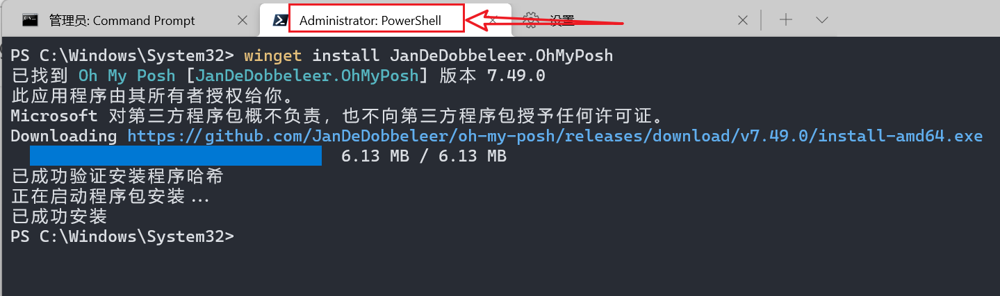
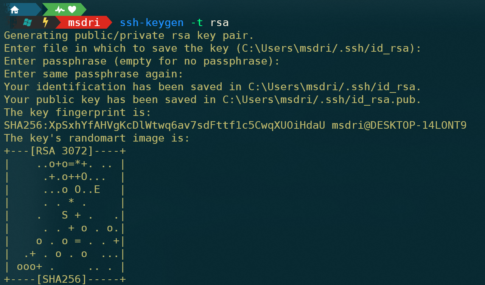
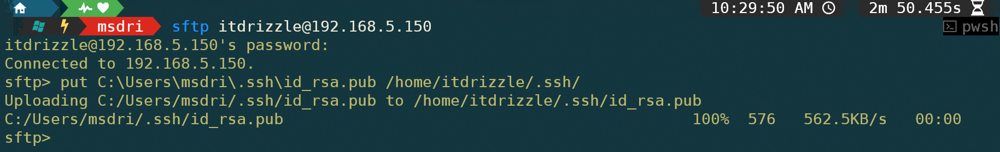

---

order: -1
title:  Windows命令和工具
shortTitle: Windows命令
icon: windows

---


## 一 CMD命令

###  1. 目录和文件

```bash

cd directory            # 切换目录

d:                      # 切换到 d 盘

```


code 


explore


<br/>

### 2. 进程和服务

```bash

netstat -ano | findstr 8102  # 查找指定端口号的进程信息（进程ID）

taskkill /pid 45768 /f       # 强杀 指定id（45768）的进程

```


<br/>


## 二 Windows Terminal

Windows 终端概述 ：https://docs.microsoft.com/zh-cn/windows/terminal/


```shell

schemes 数组是用来定义配色方案的。

name ：        这个配色方案的 ID 。
background ：  背景颜色。
foreground ：  输出显示字体颜色，ssh 输入命令颜色。
black ：       箭头左边三角，git 目录的 .git 目录下提示箭头背景提示文字。
red ：         ssh 后 vim 打开文本文件已输入行普通字符显示文字。
green ：       git 目录的 .git 目录下提示箭头背景提示。
yellow ：      git 目录的分支箭头背景提示。
blue ：        目录箭头本体。
purple ：      ssh 后 vim 等工具打开文件后的 { 和 }等符号本体，git 更新完后显示的分支箭头背景提示。
cyan ：        引号及内部字符。
white ：       未知。
brightBlack ： cd 等 命令后面的 .. 和 * 等特殊符号，以及命令参数字符颜色。
brightRed ：   系统提示字符颜色：错误的命令，git status 显示。
brightGreen ： ssh 用户权限显示。
brightYellow ：输入的命令字符。
brightBlue ：  ssh 文件夹等高亮显示，ssh 目录，vim 打开文本文件未输入行 ~ 字符显示。
brightPurple ：未知。
brightCyan ：  ssh vim 等工具打开文件后的 { 和 } 等符号背景。
brightWhite ： 目录箭头左边和中间的提示文字。

"cursorColor": 光标颜色

```

<br/>

### 1. Oh-My-Posh

官方文档和介绍：https://www.powershellgallery.com/packages/oh-my-posh

在Windows terminal中安装Oh-My-Posh：https://ohmyposh.dev/docs/installation/windows

<br>

**第一步：安装 oh-my-posh** ：

以管理员方式打开 PowerShell  （注意网络不好可能会安装失败）

```shell
winget install JanDeDobbeleer.OhMyPosh -s winget
```



<br/>


**第二步：安装和设置字体**：https://ohmyposh.dev/docs/installation/fonts

上述地址中介绍了 oh-my-posh 提供了在 powershell中选择安装字体的方式，如下：
```bash
oh-my-posh font install
```
但是效果还不稳定，会出现字体安装不全的情形。所以字体安装还是以自行下载安装为主：

下载地址：https://www.nerdfonts.com/ ，建议安装 [Nerd Font](https://www.nerdfonts.com/font-downloads)

推荐使用 **DejaVuSansMono Nerd Font** 或者 **Cousine Nerd Font**，这两款字体比较全，适配也还不错。

下载后解压安装字体即可

**设置字体**：（修改JSON或在terminal界面中直接设置）

用管理员身份打开Powershell(Windows Terminal)，在设置界面中打开 `settings.json` ，

在 `"defaults"：{}`的括号里面写Font.face的内容：

```json
    "profiles":
    {
        "defaults": 
        {
            "font": 
            {
                "face": "MesloLGM NF"
            }
        },
    }
```

<br/>

**第三步：oh-my-posh相关配置** ：

安装成功后进行初始化设置, 若想要配置永久生效，需要修改对应的配置文件：
```shell
code $profile   
```
该命令会使用VScode打开文件，将下面的初始化命令加入其中即可 （配置后每次打开Powershell都会执行脚本文件中的命令）

```shell
oh-my-posh init pwsh --config "$env:POSH_THEMES_PATH\kali.omp.json" | Invoke-Expression
```

然后输入下面的命令，来让配置生效：
```shell
. $PROFILE
```

上面过程中kali是主题的一种，如果要其他主题的话，那么在命令行里面输入：

```bash
Get-PoshThemes
```

选一个喜欢的，比如喜欢jandedobbeleer这个主题，按上面的步骤把$PROFILE里面的`"kali.omp.json"`改成`"jandedobbeleer.omp.json"`就行了。
在这个过程中很可能会出现一些图标不显示，显示一半，或者各种方框乱码，一般都是字体的问题，安装字体, 多重启windows Terminal几次即可。

<br>

设置命令行自动补全和提示：
```shell
Set-PSReadlineKeyHandler -Key Tab -Function MenuComplete
```

<br/>

### 2. 毛玻璃特效

下载字体：https://github.com/microsoft/cascadia-code/releases

解压后安装所有 ttf 字体 （为所有用户安装）

修改 JSON 文件：

```JSON
{
    "commandline": "gsudo.exe powershell.exe -nologo",
    // "commandline": "powershell.exe",
    "guid": "{61c54bbd-c2c6-5271-96e7-009a87ff44bf}",
    "hidden": false,
    "name": "Windows PowerShell",
    // 添加如下内容
    "acrylicOpacity": 0.7,
    "colorScheme" : "Frost",
    "cursorColor" : "#000000",
    "fontFace" : "Cascadia Code PL",
    "useAcrylic": true
}
```

详细内容参照官网：[Windows 终端中的毛玻璃主题](https://learn.microsoft.com/zh-cn/windows/terminal/custom-terminal-gallery/frosted-glass-theme) 

<br>

### 3. 安装gsudo

gsudo：管理员打开工具

GitHub：https://github.com/gerardog/gsudo

<br/>

```shell
# 安装方式：

1. Github下载msi格式，安装即可，或下载zip格式，解压配置环境变量即可

https://github.com/gerardog/gsudo/releases/tag/v1.2.0


2. 通过 PowerShell 命令安装

winget install gsudo

```

Windows terminal默认是非管理员打开的，安装 gsudo 后 在powershell 或cmd设置项下将命令行改为

```shell
gsudo.exe powershell.exe -nologo  #或

gsudo.exe cmd.exe 
```

`-nologo`  参数作用是去掉启动时前面那一串版权声明等信息, 可以不加

如果不想要默认管理员打开, 上面命令行处可以不改, 在需要管理员权限的命令前加上sudo再运行就可以, 跟Linux一样


<br/>


### 4. 添加GitBash

从设置  `打开JSON文件` ，在 ` "profiles" --> "defaults"  -->  "list"` 中添加新的配置：

```JSON
"profiles": 
{
    "defaults": {},
    "list": 
    [
        {
            "guid": "{b453ae62-4e3d-5e58-b989-0a998ec441b7}",
            "hidden": false,
            "name": "Git Bash",
            "commandline": "gsudo \"C:\\Program Files\\Git\\bin\\bash.exe\"",
            "colorScheme":"One Half Dark",
            "icon": "C:\\Program Files\\Git\\mingw64\\share\\git\\git-for-windows.ico"
        }

    ]
}
```

注意： commandline 中 需要的是git安装目录下的  bin 下的 bash.exe，而不是 Git-Bash.exe

<br/>

### 5. SSH免密自动登陆

**第一步 在本地生成SSH密钥对**：

powershell中输入以下命令，根据提示设置密钥保存路径、密钥密码（默认为空），建议按默认设置，一直按回车成功生成密钥文件，生成的密钥文件共有两个，ssh_key对应私钥可存储在本地，ssh_key.pub对应公钥需要放在到远程服务器

```bash
ssh-keygen -t rsa
```


**第二步 在远程主机安装公钥**：

将上面生成的公钥文件上传至远程主机即可（注意需要远程主机存在相应的目录及权限）：

```bash
sftp root@192.168.10.11             # 回车输入密码

# put 本地公钥文件 远程主机目录(默认以家目录开头)
sftp> put C:\Users\Administrator/.ssh/id_rsa.pub .ssh/  

# 上传完成后使用 exit 退出
sftp> exit
```
比如这里就需要在远程主机的家目录 先创建 `.ssh` 目录才能上传 ：`mkdir -m 700 ~/.ssh `



**连接到远程主机，修改密钥及所在文件夹权限**
```bash
chmod -R 700 ~/.ssh        #如此文件夹已存在，也要确保权限为700

cd .ssh
chmod 600 id_rsa.pub       #cd 密钥.pub所在目录，然后设置其权限

sudo mv ~/.ssh/id_rsa.pub ~/.ssh/authorized_key_from_mywindows
```

**第三步 在远程主机打开密钥登陆功能** (编辑sshd配置文件)
```bash
sudo vim /etc/ssh/sshd_config

RSAAuthentication yes
PubkeyAuthentication yes
AuthorizedKeysFile .ssh/authorized_key_from_mywindows
PermitRootLogin yes
PasswordAuthentication no #此行会关闭密码登录功能，请确认密钥登陆功能设置好后再添加
```
以上内容在配置文件里都有对应行，但被注释了起来，可通过删除注释符号设置，也可直接追加到文件末尾，配置完成后重启sshd：

```bash
systemctl restart sshd
```

**第四步 设置WindowsTerminal的SSH快捷方式**

在WindowsTerminal配置文件里增加内容，复制完之后更改配置如下，主要必须更改如下参数，其余按需修改
```bash
ssh -i  C:\Users\Administrator/.ssh/id_rsa root@192.168.10.11
```

重启窗口打开即可使用（无需输入密码）

<br>

## 三 PowerShell

GitHub：https://github.com/PowerShell/PowerShell/releases/

也可以直接去官网下载： 

https://docs.microsoft.com/zh-cn/powershell/scripting/install/installing-powershell-on-windows

<br>


### 1. SSH

使用SSH连接到远程服务器，前提是服务器已安装并启用SSH服务

```shell

# 命令格式：ssh username@hostip 如：

ssh root@192.168.5.150          # 输入密码即可

```

<br/>

###  2. new-guid


